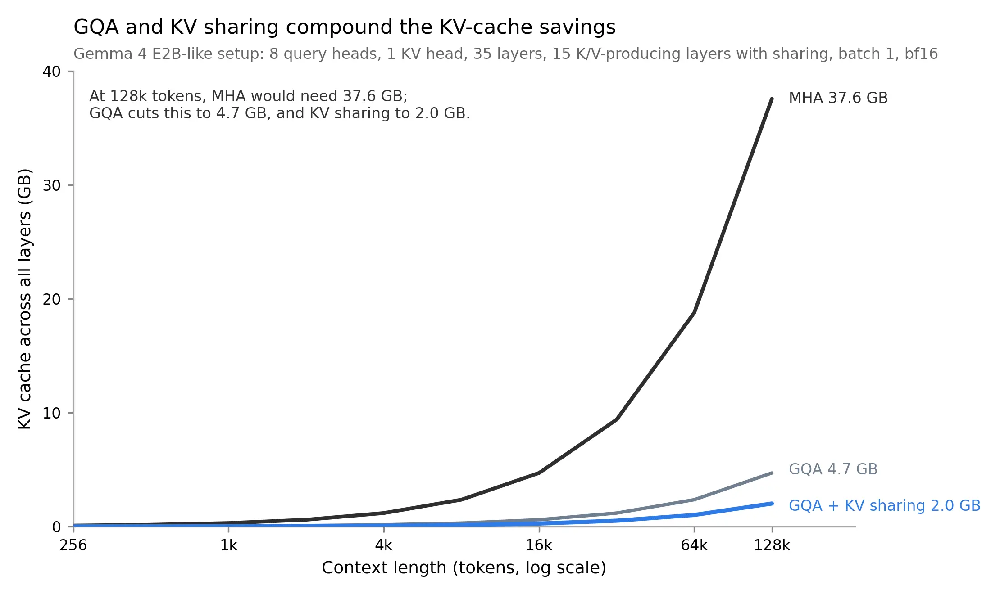
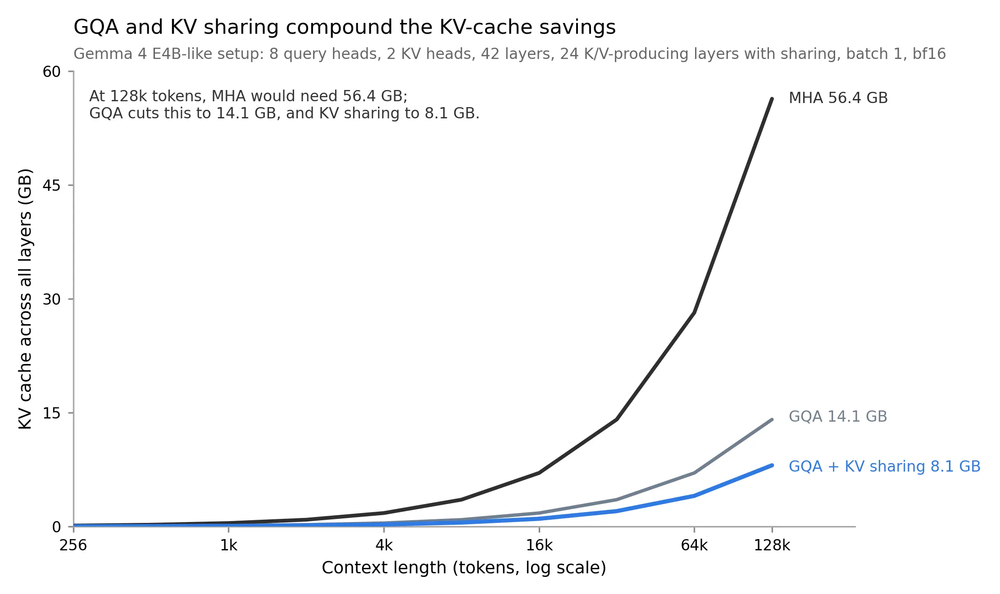

# 跨层 KV 共享

本附加材料展示了将跨层 KV 共享与 KV 缓存结合使用时所带来的内存节省。

&nbsp;
## 简介

在 [../04_gqa](../04_gqa) 中，我们讨论了分组查询注意力（GQA），其中多个查询头共享相同的键和值头。跨层 KV 共享则是将一个相关的想法应用到了 transformer 的各个层之间。

后面的层不再在每一层都重新计算键和值投影，而是重复使用来自较早层的 K/V 张量。它们仍然会计算各自的查询，因此每一层依然可以形成自己的注意力模式。这种做法带来的主要内存节省，来自于缓存中需要存储的 K/V 张量数量减少了。

这个想法也被称为跨层注意力（cross-layer attention），在 Brandon 等人的论文 [Reducing Transformer Key-Value Cache Size with Cross-Layer Attention](https://arxiv.org/abs/2405.12981) 中有所描述。Gemma 4 的 E2B 和 E4B 模型使用了一种相关的共享 KV 缓存方案，这也使得本节内容成为对本章中 GQA、MLA 和 SWA 示例的一个有益补充。

&nbsp;


&nbsp;

在 [Gemma 4](../../ch05/17_gemma4) 中，KV 共享与 GQA 或 MQA 以及滑动窗口注意力结合使用。而对于此文件夹中简化版的 GPT 示例，我们只实现了跨层 KV 共享这一部分，以便让代码专注于其核心机制。

这里使用的简化规则如下：

1. 较早的层计算并缓存各自的 K/V 张量。
2. 较后的层重复使用某个较早的“生产”层最近的 K/V 张量。
3. 所有层仍然计算各自的查询投影。

这减少了随上下文长度增长的 K/V 缓存数量。其代价是模型容量有所下降，因为部分层不再拥有各自独立的 K/V 投影。

&nbsp;
## KV 共享的内存节省

常规的 KV 缓存内存计算方式如下：

bytes = batch_size x seqlen x head_dim x n_kv_heads x n_layers x 2 (K,V) x bytes_per_elem

使用跨层 KV 共享时，我们用生成 K/V 的层数来替换 `n_layers`：

bytes = batch_size x seqlen x head_dim x n_kv_heads x n_kv_producing_layers x 2 (K,V) x bytes_per_elem

你可以使用此文件夹中的 [memory_estimator_kv_sharing.py](memory_estimator_kv_sharing.py) 脚本，将这个公式应用于不同的模型配置：

```bash
# Gemma 4 E2B-like setup
uv run memory_estimator_kv_sharing.py \
  --context_length 131072 \
  --emb_dim 2048 \
  --n_heads 8 \
  --n_layers 35 \
  --n_kv_groups 8 \
  --n_kv_producing_layers 15 \
  --batch_size 1 \
  --dtype bf16

# Gemma 4 E4B-like setup
# uv run memory_estimator_kv_sharing.py \
#   --context_length 131072 \
#   --emb_dim 2560 \
#   --n_heads 8 \
#   --n_layers 42 \
#   --n_kv_groups 4 \
#   --n_kv_producing_layers 24 \
#   --batch_size 1 \
#   --dtype bf16

==== Config ====
context_length         : 131072
emb_dim                : 2048
n_heads                : 8
n_layers               : 35
n_kv_groups            : 8
n_kv_producing_layers  : 15
batch_size             : 1
dtype                  : bf16 (2 Bytes/elem)
head_dim               : 256
GQA n_kv_heads         : 1

==== KV-cache totals across all layers ====
MHA total KV cache        : 37.58 GB
GQA total KV cache        : 4.70 GB
MHA + KV sharing          : 16.11 GB
GQA + KV sharing          : 2.01 GB
Ratio (MHA / GQA+sharing) : 18.67x
Savings vs MHA            : 94.64%
```

这是一个类似 Gemma 4 E2B 的配置。这 35 层中包含 15 个生成 K/V 的层，其余层则重复使用较早层的 K/V 张量。对于类似 E4B 的配置，对应的数字则是共 42 层，其中 24 层生成 K/V。

下面展示了类似 E2B 和 E4B 配置下的节省效果。为简单起见，这些图中并未包含来自滑动窗口注意力的额外节省。

&nbsp;



&nbsp;



&nbsp;

你可以通过以下命令重现类似的图：

```bash
uv run plot_memory_estimates_kv_sharing.py --preset gemma4_e2b
uv run plot_memory_estimates_kv_sharing.py --preset gemma4_e4b
```

&nbsp;
## KV 共享代码示例

此文件夹中的 [gpt_with_kv_mha.py](gpt_with_kv_mha.py) 和 [gpt_with_kv_sharing.py](gpt_with_kv_sharing.py) 脚本提供了动手示例，用于比较常规 MHA 与跨层 KV 共享变体。

查看实现细节最简单的方法，是检查 [gpt_with_kv_mha.py](gpt_with_kv_mha.py) 和 [gpt_with_kv_sharing.py](gpt_with_kv_sharing.py) 之间的文件差异。代码注释特意保持相似，以便差异对比能够凸显出与 KV 共享相关的改动。

请注意，该模型未经训练，因此会生成无意义的文本。不过，你可以将其作为第 5-7 章中标准 GPT 模型的直接替代品，并对其进行训练。

此外，此实现使用了[另一个附加章节](../03_kv-cache)中介绍的 KV 缓存，因此内存节省效果更加明显。

```bash
uv run gpt_with_kv_mha.py \
--max_new_tokens 32768 \
--n_heads 24 \
--n_layers 12 \
--emb_dim 768
```

```bash
uv run gpt_with_kv_sharing.py \
--max_new_tokens 32768 \
--n_heads 24 \
--n_layers 12 \
--emb_dim 768 \
--n_kv_producing_layers 6
```

在这个简化的 GPT 设置中，整个模型依然包含相同的前馈层和输出头。主要的内存差异在于，有多少个注意力层会在缓存中存储 K/V 张量。
