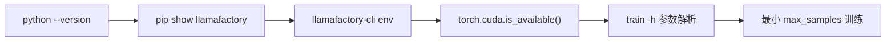

# 00 — 环境搭建指南

> 源码基线：LLaMA Factory `0.9.6.dev0`。版本定义在 `src/llamafactory/extras/env.py`，构建元数据来自仓库根目录 `pyproject.toml`。

## 1. 先区分两类要求

### 1.1 仓库硬约束

- Python：`>=3.11.0`（`pyproject.toml` 的 `requires-python`）。
- 构建后端：Hatchling。
- 基础安装会同时安装训练、Web UI 和 API 依赖；仓库没有把它们拆成 extras。
- 两个控制台入口均指向 `llamafactory.cli:main`：`llamafactory-cli`、`lmf`。

核心版本边界如下，安装时不要只看下限：

| 包 | `pyproject.toml` 约束 |
|---|---|
| `torch` / `torchvision` / `torchaudio` | `>=2.4.0` / `>=0.19.0` / `>=2.4.0` |
| `transformers` | `>=4.55.0,<=5.6.0,!=4.57.0` |
| `datasets` | `>=2.16.0,<=4.0.0` |
| `accelerate` | `>=1.3.0,<=1.11.0` |
| `peft` | `>=0.18.0,<=0.18.1` |
| `trl` | `>=0.18.0,<=0.24.0` |
| `torchdata` | `>=0.10.0,<=0.11.0` |
| `gradio` | `>=4.38.0,<=5.50.0` |
| `tyro` | `<0.9.0` |
| `av` | `>=10.0.0,<=16.0.0` |

### 1.2 机器相关建议（不是仓库硬约束）

- Linux、NVIDIA GPU、CUDA 版本、驱动版本、内存和磁盘容量取决于模型、训练方法及硬件。
- Ubuntu 22.04、CUDA 12.4、Python 3.11、PyTorch 2.6.0 是 README 所述官方 Docker 镜像构建环境，不等于唯一支持组合。
- 不要固定照抄某个 CUDA wheel URL；先按 `nvidia-smi`、驱动能力和 PyTorch 官方安装选择器决定。
- Python 安装来源（系统包、`uv`、Conda、pyenv）是机器策略。仓库只要求正式版 Python `>=3.11.0`。

## 2. 推荐：在源码目录创建隔离环境

以下命令针对本机仓库：

```bash
cd /home/cp/work2/largeModels/02-训练/LLaMA-Factory
python3.11 -m venv .venv
source .venv/bin/activate
python -m pip install -U pip
python -m pip install -e .
python -m pip install -r requirements/metrics.txt
```

README 的源码安装也是 `pip install -e .`；`metrics.txt` 用于生成式评测指标。也可使用 `uv`：

```bash
cd /home/cp/work2/largeModels/02-训练/LLaMA-Factory
uv run llamafactory-cli version
```

`uv run` 会按项目元数据创建/使用隔离环境。团队应固定一种环境管理方式，不要同时向同一个环境执行 Conda、pip 和 uv 的解析操作。

## 3. GPU 与 PyTorch

先验证当前 PyTorch，而不是先假定 CUDA wheel：

```bash
python - <<'PY'
import torch
print("torch:", torch.__version__)
print("cuda available:", torch.cuda.is_available())
print("cuda runtime:", torch.version.cuda)
print("devices:", torch.cuda.device_count())
PY
```

若 `cuda available` 为 `False`，核对驱动、容器 GPU 映射和 PyTorch wheel。CPU 可以验证导入和参数解析，但不适合把“大模型训练可用”作为安装验收标准。

## 4. 按功能安装可选依赖

仓库当前 `requirements/` 中的常用分组：

```bash
# 4/8 bit bitsandbytes QLoRA
python -m pip install -r requirements/bitsandbytes.txt

# DeepSpeed
python -m pip install -r requirements/deepspeed.txt

# 推理后端
python -m pip install -r requirements/vllm.txt
python -m pip install -r requirements/sglang.txt

# 其他按需能力
python -m pip install -r requirements/swanlab.txt
python -m pip install -r requirements/liger-kernel.txt
python -m pip install -r requirements/metrics.txt
```

此外还有 `aqlm.txt`、`apollo.txt`、`badam.txt`、`eetq.txt`、`fp8*.txt`、`galore.txt`、`gptq.txt`、`hqq.txt`、`ktransformers.txt`、`npu.txt` 等。仅在配置启用对应能力时安装；`hparams/parser.py::_check_extra_dependencies()` 会对已启用功能做运行时检查。

## 5. 安装验收

```bash
llamafactory-cli version
llamafactory-cli env
llamafactory-cli help
```

期望版本为 `0.9.6.dev0`。`env` 会打印 Python、PyTorch、Transformers、Datasets、Accelerate、PEFT，以及可选的 TRL、DeepSpeed、bitsandbytes、vLLM；在仓库根目录执行时还会显示默认 `data` 目录已检测。

最小参数链路验证：

```bash
llamafactory-cli train -h
```

不要把真正下载并训练 4B 模型作为“安装最小测试”。

## 6. 准确的仓库示例

```bash
# 默认 v0：LoRA SFT
llamafactory-cli train examples/train_lora/qwen3_lora_sft.yaml

# 默认 v0：bnb QLoRA（该示例面向 NPU）
llamafactory-cli train examples/train_qlora/qwen3_lora_sft_bnb_npu.yaml

# 推理与导出
llamafactory-cli chat examples/inference/qwen3_lora_sft.yaml
llamafactory-cli export examples/merge_lora/qwen3_lora_sft.yaml

# 实验 v1；配置结构与 v0 不同
USE_V1=1 llamafactory-cli sft examples/v1/train_lora/train_lora_sft.yaml
```

`examples/train_qlora/qwen3_lora_sft.yaml` 在当前源码中不存在，不能引用。v0 配置的量化方法值是 `quantization_method: bnb`，不是 `bitsandbytes`。

## 7. 服务与下载环境变量

```bash
# Hub 选择（二选一或按团队网络策略）
export HF_ENDPOINT=https://hf-mirror.com
export USE_MODELSCOPE_HUB=1

# Web UI
export GRADIO_SERVER_NAME=0.0.0.0
export GRADIO_SHARE=0
llamafactory-cli webui

# API
export API_HOST=0.0.0.0
export API_PORT=8000
export API_KEY=change-me
llamafactory-cli api examples/inference/qwen3_lora_sft.yaml
```

源码默认 Web 监听地址是 `0.0.0.0`（`GRADIO_IPV6=1` 时为 `[::]`）；端口没有由 LLaMA Factory 设置，Gradio 使用自身默认/环境配置。API 默认 `0.0.0.0:8000`。监听所有网卡涉及访问控制和防火墙，属于部署策略。

## 8. Docker

```bash
cd /home/cp/work2/largeModels/02-训练/LLaMA-Factory/docker/docker-cuda
docker compose up -d
```

或使用 README 的最小官方镜像命令：

```bash
docker run -it --rm --gpus=all --ipc=host hiyouga/llamafactory:latest
```

端口映射、模型缓存挂载、数据目录挂载应由部署者显式补充；不要把容器内 checkpoint 留在临时可写层。

## 9. 常见陷阱

- **依赖边界被升级器破坏**：不要无约束 `pip install -U transformers peft trl`；重新核对 `pyproject.toml`。
- **目录不对**：默认 `dataset_dir` 是相对路径 `data`，请在仓库根目录运行或显式配置绝对路径。
- **QLoRA 值写错**：`quantization_method` 的枚举值是 `bnb`；`quantization_bit` 才是 `4` 或 `8`。
- **DeepSpeed 未分布式启动**：解析器会要求 `FORCE_TORCHRUN=1`。
- **多卡自动 torchrun**：默认 v0 在设备数大于 1、未启用 Ray/KTransformers 时自动重启；调试器可能看到父子两次进程。
- **Ray 没有开启**：只有 `USE_RAY=1` 才进入 Ray 分支，单写 `ray_num_workers` 不会开启。
- **混用 v0/v1 YAML**：`USE_V1=1` 改变整个 launcher 和配置 dataclass，不只是开启一个优化选项。

## 10. 环境问题定位顺序



先证明解释器和依赖正确，再检查硬件，再进入数据/模型问题。报告问题时附上 `llamafactory-cli env`、实际命令、YAML、GPU/驱动信息和完整首个异常。
