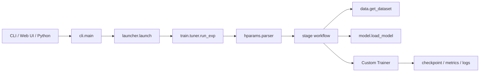
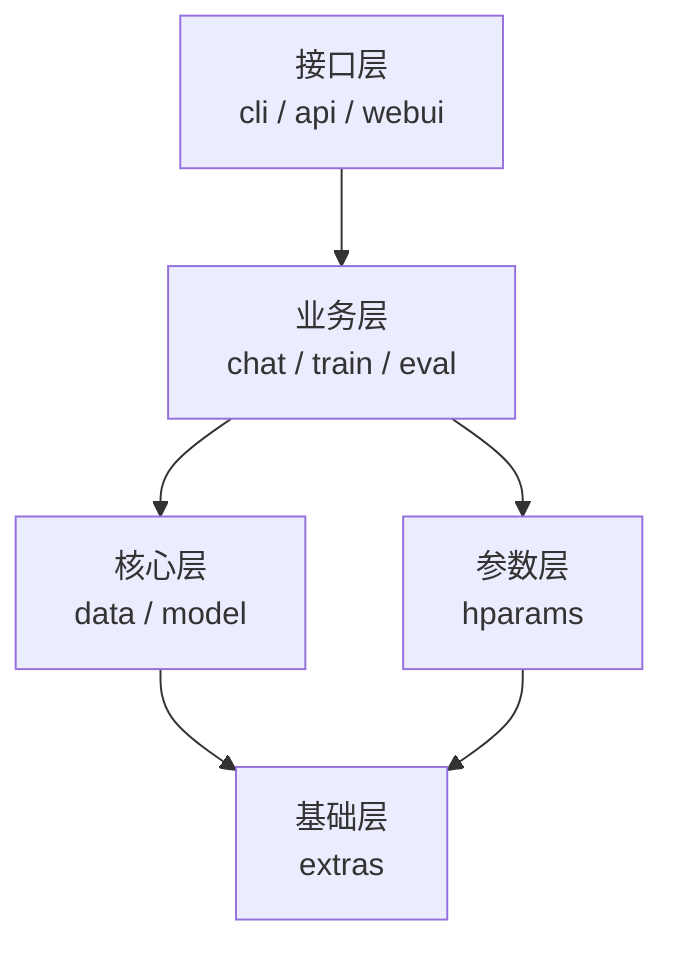
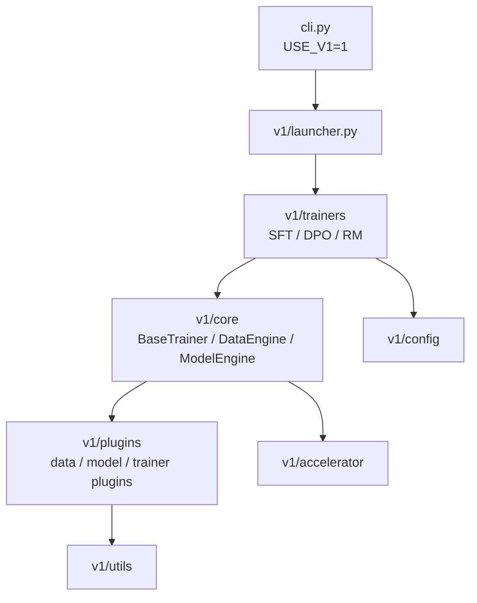

# 01 — LLaMA Factory 项目概览

> 分析基线：源码版本 `0.9.6.dev0`。本文描述仓库当前实现，不把 README 的能力宣传当作调用链事实。

## 1. 项目定位

LLaMA Factory 是训练、偏好对齐、推理、OpenAI 风格 API、Web UI 和模型导出的统一入口。包名为 `llamafactory`，源码采用 `src/` 布局，控制台命令由 `pyproject.toml` 注册：

```text
llamafactory-cli ─┐
                  ├─> llamafactory.cli:main
lmf ──────────────┘
```

当前仓库同时保留两套架构：

| 架构 | 启用方式 | 状态与入口 | 配置风格 |
|---|---|---|---|
| v0 | 默认 | 稳定主路径，`src/llamafactory/launcher.py` | 扁平 YAML/JSON → HF `HfArgumentParser` dataclass |
| v1 | `USE_V1=1` | 实验路径，`src/llamafactory/v1/launcher.py` | 独立的 `v1/config/`，含嵌套插件配置 |

`USE_V1` 在 `src/llamafactory/cli.py` 中先于业务模块导入判断。因此 v1 不是 v0 训练器上的一个局部开关，而是 CLI、配置、训练器、数据和模型核心的整体切换。

## 2. 仓库结构

```text
LLaMA-Factory/
├── pyproject.toml                 # Python/依赖边界、脚本入口、构建配置
├── src/
│   ├── train.py                  # v0 训练薄入口
│   ├── api.py                    # v0 API 薄入口
│   ├── webui.py                  # v0 Web UI 薄入口
│   └── llamafactory/
│       ├── cli.py                # v0/v1 总开关
│       ├── launcher.py           # v0 命令分发、torchrun
│       ├── hparams/              # v0 配置 dataclass、解析与校验
│       ├── data/                 # v0 数据注册、转换、模板、tokenize、collator
│       ├── model/                # v0 tokenizer/model 加载、补丁、adapter、量化
│       ├── train/                # v0 各 stage workflow/trainer
│       ├── chat/                 # HF/vLLM/SGLang 推理门面
│       ├── api/                  # FastAPI OpenAI 风格服务
│       ├── webui/                # Gradio LLaMA Board
│       ├── eval/                 # 旧评测模块；CLI eval 已标记未来弃用
│       ├── extras/               # 枚举、环境、日志、依赖探测、通用工具
│       └── v1/                   # 实验架构
├── examples/                     # v0 与 examples/v1 配置
├── data/                         # demo 数据及 dataset_info.json
├── requirements/                 # 功能型可选依赖
├── docker/                       # CUDA/ROCm/NPU compose
├── tests/                        # v0 测试
└── tests_v1/                     # v1 测试
```

## 3. 默认 v0 的主调用链



训练路由由 `FinetuningArguments.stage` 决定，合法值是：

- `pt`：继续预训练；
- `sft`：监督微调；
- `rm`：奖励模型；
- `ppo`：PPO；
- `dpo`：成对偏好优化入口；
- `kto`：KTO。

需要特别区分：ORPO、SimPO、IPO、hinge、`kto_pair` 不是额外 stage。它们是 `stage: dpo` 下 `pref_loss` 的选择；`pref_loss` 精确取值为 `sigmoid|hinge|ipo|kto_pair|orpo|simpo`。

## 4. v0 模块边界



| 关注点 | 首要源码 |
|---|---|
| 命令启动与多卡重启 | `src/llamafactory/launcher.py` |
| 参数输入、校验、派生值 | `src/llamafactory/hparams/parser.py` |
| 训练 stage 路由 | `src/llamafactory/train/tuner.py` |
| 数据总入口 | `src/llamafactory/data/loader.py` |
| 模板注册 | `src/llamafactory/data/template.py` 的 `TEMPLATES` / `register_template()` |
| 模型与 tokenizer 加载 | `src/llamafactory/model/loader.py` |
| LoRA/OFT/full/freeze | `src/llamafactory/model/adapter.py` |
| 量化分支 | `src/llamafactory/model/model_utils/quantization.py` |
| 模型兼容修补 | `src/llamafactory/model/patcher.py` |
| 推理门面 | `src/llamafactory/chat/chat_model.py` |

## 5. 实验 v1 的主结构



v1 当前 launcher 的训练命令为 `train`/`sft`、`dpo`、`rm`，另有 `chat` 与 `merge`。v0 的 `api`、`webui`、`export` 命令不能机械地套到 v1；v1 中 `env` 和 `version` 仍直接抛出 `NotImplementedError`。示例应从 `examples/v1/` 选取，例如：

```bash
USE_V1=1 llamafactory-cli sft examples/v1/train_lora/train_lora_sft.yaml
USE_V1=1 llamafactory-cli dpo examples/v1/train_lora/train_lora_dpo.yaml
```

## 6. 技术与依赖边界

- Python 硬约束：`>=3.11.0`。
- 训练核心：PyTorch、Transformers、Datasets、Accelerate、PEFT、TRL、torchdata。
- 配置：v0 使用 OmegaConf 加载文件/覆盖，再交给 `HfArgumentParser`；v1 使用自己的 `arg_parser.py` 和 dataclass。
- 服务：FastAPI、Uvicorn、SSE-Starlette。
- UI：Gradio。
- 构建：Hatchling；wheel 只打包 `src/llamafactory`。

完整精确版本边界见 `00-环境搭建指南.md` 或直接读 `pyproject.toml`，尤其注意 `transformers!=4.57.0` 和各上限。

## 7. 扩展点

| 目标 | v0 扩展位置 |
|---|---|
| 新对话模板 | `src/llamafactory/data/template.py::register_template()` |
| 新数据格式/字段映射 | `src/llamafactory/data/converter.py`、`src/llamafactory/data/parser.py`、`data/dataset_info.json` |
| 新 stage 数据处理 | `src/llamafactory/data/processor/` 与 `src/llamafactory/data/loader.py` 分发 |
| 新训练流程 | `src/llamafactory/train/<stage>/workflow.py`，并在 `src/llamafactory/train/tuner.py` 路由 |
| 新模型补丁 | `src/llamafactory/model/patcher.py` / `src/llamafactory/model/model_utils/` |
| 新在线量化方法 | `src/llamafactory/extras/constants.py::QuantizationMethod` 与 `src/llamafactory/model/model_utils/quantization.py` |
| 新推理后端 | `src/llamafactory/chat/` 引擎与 `EngineName`、`ChatModel` 分发 |
| 新 UI 字段 | `src/llamafactory/webui/components/`、`manager.py`、`runner.py` |

v1 对应扩展点优先放在 `v1/plugins/`，不要在未确认接口兼容时复用 v0 dataclass。

## 8. 常见认知陷阱

- “支持某算法”不表示它一定是 `stage`；ORPO/SimPO 属于 DPO `pref_loss`。
- `quantization_method` 的 bitsandbytes 值是 `bnb`，枚举还包含 GPTQ/AWQ 等预量化方法，但当前在线量化实现主要分支要结合 `quantization.py` 判断。
- Web UI 最终仍生成参数并启动 CLI 子进程，不是独立训练实现。
- `src/train.py` 不含 launcher 的自动 torchrun 逻辑；多卡通常应从 `llamafactory-cli train` 进入。
- v0 和 v1 同名概念不保证字段、默认值或 YAML 结构一致。

## 9. 推荐源码阅读顺序

1. `pyproject.toml`、`src/llamafactory/extras/env.py`：版本和依赖边界。
2. `src/llamafactory/cli.py`、`launcher.py`：架构开关和进程模型。
3. `src/llamafactory/hparams/parser.py` 与五类训练 dataclass：输入契约。
4. `src/llamafactory/train/tuner.py`：Ray、callback、stage 和特殊后端路由。
5. 选一个 stage，如 `src/llamafactory/train/sft/workflow.py`。
6. 反向深入 `src/llamafactory/data/loader.py`、`src/llamafactory/model/loader.py`、`src/llamafactory/model/adapter.py`。
7. 再读 `src/llamafactory/chat/`、`src/llamafactory/api/`、`src/llamafactory/webui/`。
8. 最后对照 `src/llamafactory/v1/launcher.py → v1/trainers → v1/core → v1/plugins`，避免混淆两套实现。
