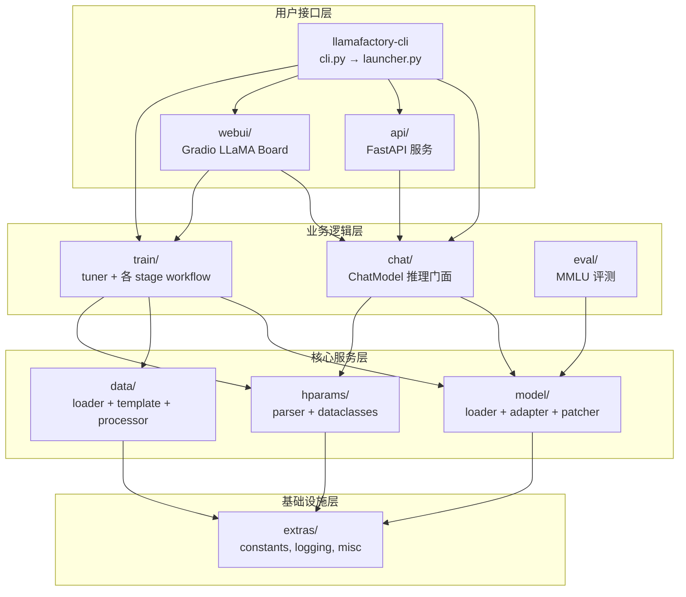

# 02 — 架构设计

## 模块分层

LLaMA Factory v0 采用清晰的分层架构，上层依赖下层，核心数据流为：**配置 → 数据 → 模型 → 训练/推理**。



## 模块职责

### `hparams/` — 参数体系

所有训练/推理参数通过 YAML 或 CLI 传入，由 `parser.py` 解析为类型安全的 dataclass：

| Dataclass | 文件 | 职责 |
|-----------|------|------|
| `ModelArguments` | `model_args.py` | 模型路径、量化、适配器、推理后端 |
| `DataArguments` | `data_args.py` | 数据集、模板、截断长度、预处理 |
| `TrainingArguments` | `training_args.py` | 扩展 HF TrainingArguments + Ray |
| `FinetuningArguments` | `finetuning_args.py` | stage、微调类型、LoRA、DPO loss |
| `GeneratingArguments` | `generating_args.py` | 生成参数（温度、top_p 等） |
| `EvaluationArguments` | `evaluation_args.py` | 评测设置 |

### `data/` — 数据处理

| 组件 | 文件 | 职责 |
|------|------|------|
| 数据集加载 | `loader.py` | `get_dataset()` 统一入口 |
| 提示模板 | `template.py` | `TEMPLATES` 字典，模型族 → 对话格式 |
| 数据集注册 | `parser.py` | 解析 `dataset_info.json` |
| 格式转换 | `converter.py` | 原始数据 → 标准 schema |
| 多模态 | `mm_plugin.py` | 图像/视频/音频处理 |
| 批处理 | `collator.py` | stage 专用 collator |
| 处理器 | `processor/` | 各 stage 的 tokenize 逻辑 |

### `model/` — 模型管理

| 组件 | 文件 | 职责 |
|------|------|------|
| 加载入口 | `loader.py` | `load_tokenizer()`、`load_model()` |
| 适配器 | `adapter.py` | LoRA/OFT/full/freeze 初始化 |
| 补丁 | `patcher.py` | 模型兼容性修复 |
| 工具 | `model_utils/` | 量化、注意力、RoPE、视觉、MoE 等 |

### `train/` — 训练流水线

| 组件 | 路径 | 职责 |
|------|------|------|
| 编排器 | `tuner.py` | `run_exp()`、`export_model()` |
| SFT | `sft/` | 监督微调 workflow + trainer |
| DPO | `dpo/` | 偏好对齐 |
| PPO | `ppo/` | 强化学习 |
| RM | `rm/` | 奖励模型 |
| PT | `pt/` | 继续预训练 |
| KTO | `kto/` | Kahneman-Tversky 优化 |
| 回调 | `callbacks.py` | 日志、PiSSA、SwanLab、Profiler |
| 分布式 | `hyper_parallel/`、`mca/` | FSDP2、Megatron-core |

### `chat/` — 推理引擎

`ChatModel` 是统一门面，根据 `infer_backend` 选择后端：

| 后端 | 文件 | 特点 |
|------|------|------|
| HuggingFace | `hf_engine.py` | 默认，兼容性好 |
| vLLM | `vllm_engine.py` | 高吞吐推理 |
| SGLang | `sglang_engine.py` | 结构化生成 |

### `api/` — HTTP 服务

OpenAI 兼容 REST API，基于 FastAPI：

- `GET /v1/models` — 模型列表
- `POST /v1/chat/completions` — 对话（流式/非流式）
- `POST /v1/score/evaluation` — 奖励模型打分

### `webui/` — 可视化界面

Gradio 构建的 LLaMA Board，四个 Tab：

| Tab | 组件 | 功能 |
|-----|------|------|
| Train | `components/train.py` | 配置并启动训练 |
| Evaluate & Predict | `components/eval.py` | 评测与预测 |
| Chat | `components/chatbot.py` | 对话测试 |
| Export | `components/export.py` | LoRA 合并导出 |

`Runner` 将 UI 配置写入 YAML，以子进程方式调用 `llamafactory-cli train`。

## 训练端到端数据流

```
YAML 配置
    │
    ▼
read_args() ──→ OmegaConf 合并 CLI 覆盖
    │
    ▼
get_train_args() ──→ 5 个 dataclass + 校验
    │
    ├──→ get_template_and_fix_tokenizer()
    ├──→ get_dataset(stage=...)
    └──→ load_model() + init_adapter()
    │
    ▼
run_{stage}() ──→ CustomTrainer.train()
    │
    ▼
save_model / metrics / state / plot_loss
```

## v1 实验架构

设置 `USE_V1=1` 时，`cli.py` 切换到 `v1/launcher.py`，采用插件化设计：

```
v1/
├── trainers/          # SFT、DPO、RM Trainer
├── core/              # DataEngine、ModelLoader
├── plugins/
│   ├── model_plugins/ # PEFT、量化、Kernel、模板
│   ├── trainer_plugins/ # 优化器、LR、FSDP2、DeepSpeed
│   └── data_plugins/  # 数据转换
├── config/            # 新配置系统
└── accelerator/       # 加速器抽象
```

v1 面向 FSDP2、插件扩展和新模型接入，尚未完全替代 v0。

## 扩展新模型的标准步骤

1. 在 `data/template.py` 的 `TEMPLATES` 中添加提示模板
2. 在 `model/patcher.py` 中添加必要的兼容性补丁
3. 如需多模态，在 `data/mm_plugin.py` 中扩展
4. 在 `examples/` 中添加示例 YAML 配置
