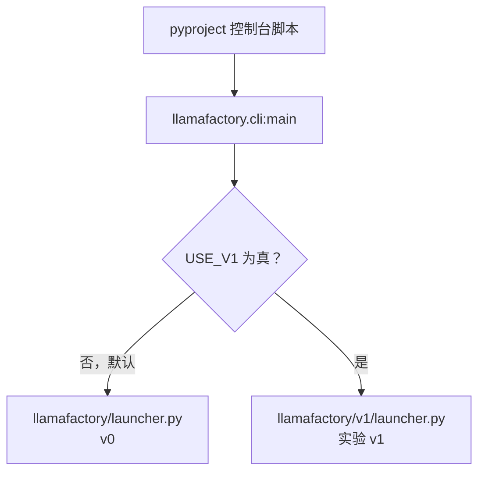
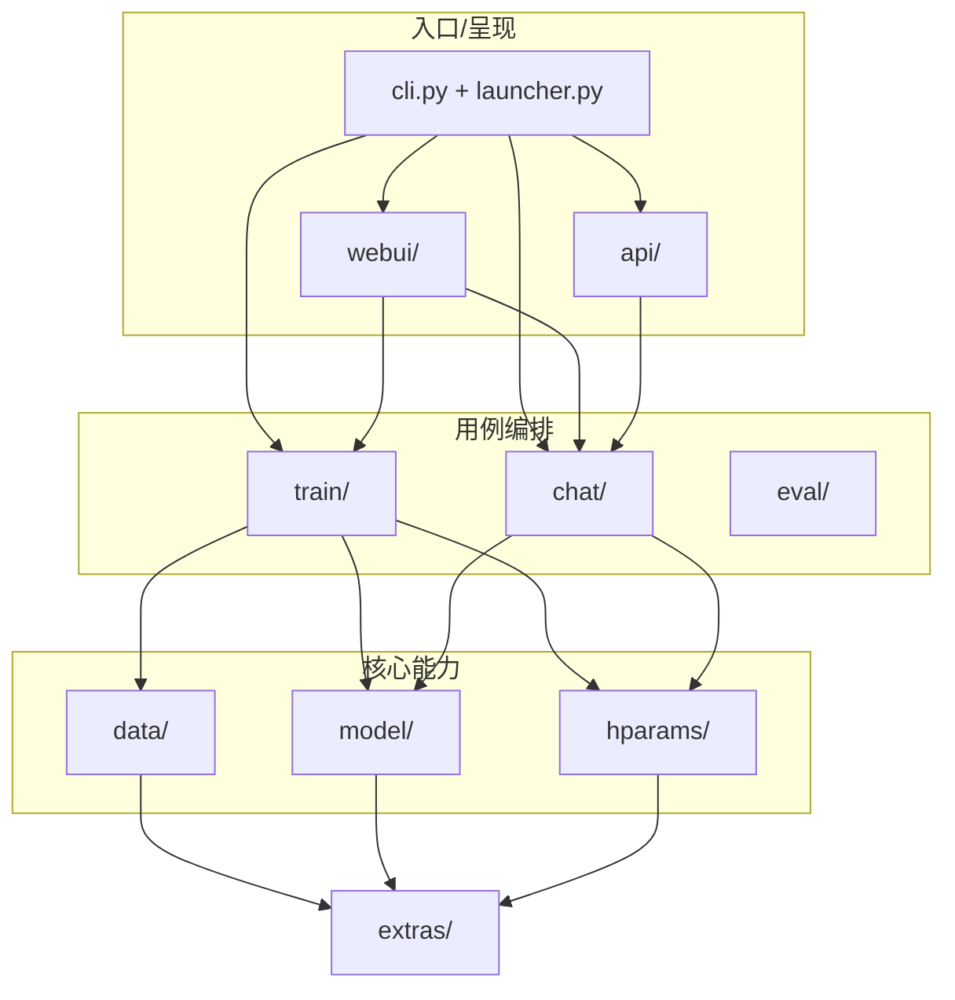
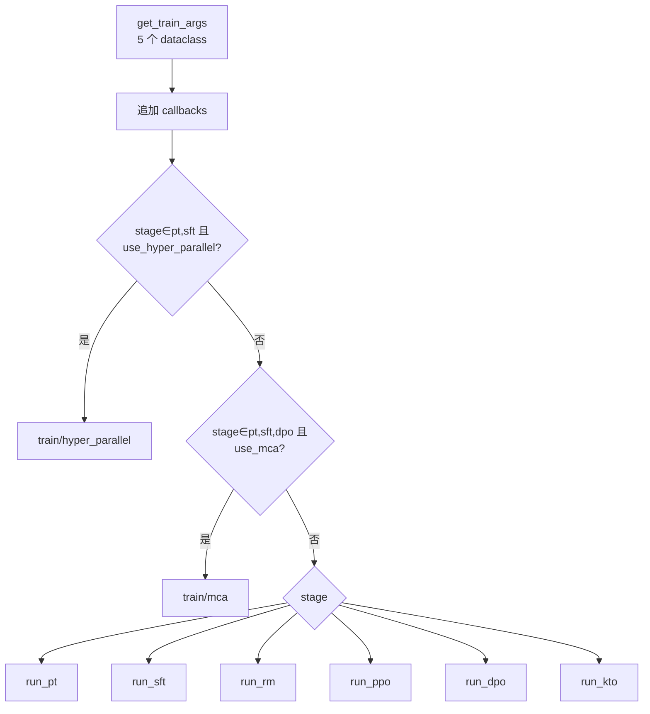
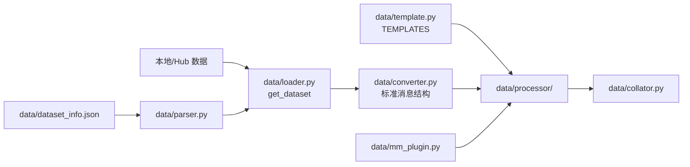

# 02 — 架构设计

> 基线：LLaMA Factory `0.9.6.dev0`。默认讨论 v0；所有 v1 内容均显式标记。

## 1. 总体设计：两套并行架构



`is_env_enabled()` 解析环境变量，不是简单判断变量是否存在。因为 `cli.py` 在分支后才导入对应 launcher，两套体系可以维护各自的依赖层次；代价是配置文件和命令不能互换。

## 2. v0 分层与依赖方向



这不是严格的“六边形架构”：训练 workflow 会直接组合 tokenizer、template、dataset、model 和 Trainer。但入口、参数解析、核心加载器和 stage workflow 的边界清楚，扩展通常只需改一条纵向链路。

## 3. 训练进程与调用链

### 3.1 从命令到训练器

```text
llamafactory-cli train <config>
└─ cli.main()
   └─ launcher.launch()
      ├─ [多设备且非 Ray/KT，或 FORCE_TORCHRUN=1]
      │  └─ subprocess: torchrun ... src/llamafactory/launcher.py <config>
      │     └─ launcher.py __main__ → run_exp()
      └─ [单进程]
         └─ train.tuner.run_exp()
            ├─ read_args()
            ├─ get_ray_args()
            ├─ USE_RAY=1 → _ray_training_function()
            └─ 否则 → _training_function()
```

`launcher.py` 被 torchrun 直接执行时，文件底部不是再次调用 `launch()`，而是绝对导入并调用 `run_exp()`。这避免无限重启。

### 3.2 `_training_function()` 的路由优先级



普通 stage 路由前还会按配置追加 `LogCallback`、PiSSA 转换、SwanLab、EarlyStopping、Torch Profiler、模块 profiler 和最后的 `ReporterCallback`。

### 3.3 SFT workflow 的典型骨架

各 stage 细节不同，但共同形态是：

```text
参数 dataclass
  → load_tokenizer()
  → get_template_and_fix_tokenizer()
  → get_dataset(stage, template, ...)
  → load_model()
      → patch_config / patch_model
      → init_adapter (LoRA/OFT/freeze/full)
  → stage 专用 data collator
  → stage 专用 Trainer
  → train/evaluate/predict
  → save_model + save_metrics + save_state
```

## 4. 配置子系统

`src/llamafactory/hparams/parser.py` 定义三个 parser 组合：

- 训练：`ModelArguments + DataArguments + TrainingArguments + FinetuningArguments + GeneratingArguments`；
- 推理：去掉 `TrainingArguments`；
- 旧评测：使用 `EvaluationArguments`，无 `GeneratingArguments`。

YAML/YML/JSON 先由 OmegaConf 加载并合并 CLI dotlist，之后 `HfArgumentParser.parse_dict()` 创建 dataclass；纯 CLI 走 `parse_args_into_dataclasses()`。解析后还会：

1. 校验 stage、微调方式、量化、分布式和后端组合；
2. 补充派生值，例如 `compute_dtype`、`device_map`、`model_max_length`；
3. 修改部分 HF 参数，例如 `remove_unused_columns=False`；
4. 探测 checkpoint 并可能自动恢复。

## 5. 数据子系统



处理器按任务数据形态分为 `pretrain.py`、`supervised.py`、`pairwise.py`、`feedback.py`、`unsupervised.py`。`stage` 决定选择何种处理逻辑；`pref_loss` 不负责数据路由。

对应源码均位于 `src/llamafactory/data/`。扩展点：

- 新数据源元数据：`data/dataset_info.json`；
- 新 schema：`src/llamafactory/data/converter.py`；
- 新模板：`src/llamafactory/data/template.py::register_template()`；
- 新多模态处理：`src/llamafactory/data/mm_plugin.py`；
- 新 stage 数据语义：`src/llamafactory/data/processor/` 和 `src/llamafactory/data/loader.py`。

## 6. 模型子系统

```text
model/loader.py
├─ load_tokenizer()
│  └─ tokenizer / processor
└─ load_model()
   ├─ patch_config()
   ├─ transformers AutoModel*.from_pretrained()
   ├─ patch_model()
   └─ init_adapter()
      ├─ full
      ├─ freeze
      ├─ lora
      └─ oft
```

`src/llamafactory/model/model_utils/` 承载 attention、RoPE、量化、MoE、视觉、embedding、checkpointing、Unsloth、Liger 等横切兼容逻辑。在线量化由 `QuantizationMethod` 控制；bitsandbytes 的实际值是 `bnb`。GPTQ/AWQ/AQLM 等名称也在枚举中，但“枚举存在”不等同于每种方法都支持相同的在线训练路径。

## 7. 推理、API 与 Web UI

`src/llamafactory/chat/chat_model.py::ChatModel` 是推理门面，`infer_backend` 精确值为 `huggingface`（默认）、`vllm`、`sglang`。训练解析器明确拒绝非 HF 后端；vLLM/SGLang 只用于 API、CLI 和 Web 推理。

API 调用链：

```text
launcher(api) → api.app.run_api()
→ ChatModel() → create_app(chat_model) → uvicorn.run()
```

主要路由为 `/v1/models`、`/v1/chat/completions`、`/v1/score/evaluation`。

Web UI 调用链：

```text
launcher(webui) → webui.interface.run_web_ui()
→ create_ui() → Engine / Manager / Runner
→ Runner 组装配置并启动训练子进程
```

因此修改训练行为应优先改训练/参数核心，而不是只改 UI。

## 8. Ray、torchrun 与特殊后端

- v0 多 GPU 默认由 launcher 自动 torchrun。
- `USE_RAY=1` 会让 launcher 避开 torchrun，之后 `tuner.run_exp()` 创建 Ray workers；只设置 `ray_num_workers` 不够。
- `USE_KT=1` 同样阻止 launcher 自动 torchrun。
- `USE_MCA=1` 会先设置 `FORCE_TORCHRUN=1`，再在解析和 tuner 中切换 MCA 参数/工作流。
- `use_hyper_parallel` 是 YAML 字段，并要求安装 `hyper_parallel`；只支持 `pt`、`sft`。

## 9. v1 实验架构

v1 将可变能力进一步插件化：

```text
v1/launcher.py
→ v1/trainers/{sft,dpo,rm}_trainer.py
→ v1/core/{base_trainer,data_engine,model_engine}.py
→ v1/plugins/
   ├─ data_plugins/
   ├─ model_plugins/       # PEFT、量化、模板、kernel、并行
   └─ trainer_plugins/     # batching、optimizer、scheduler、FSDP2、DeepSpeed
→ v1/accelerator/
```

示例 `examples/v1/train_lora/train_lora_sft.yaml` 使用 `model`、`peft_config`、`kernel_config`、`dist_config` 等字段，与 v0 的 `model_name_or_path`、`finetuning_type` 扁平结构不同。

## 10. 设计陷阱与调试线索

- 直接运行 `src/train.py` 绕过 v0 launcher 的自动 torchrun。
- `USE_V1=1` 时仍照搬 v0 子命令/配置，会进入错误的 parser 或显示 unknown command。
- DPO 家族算法应查看 `pref_loss`；不要为 ORPO/SimPO 寻找不存在的 `train/orpo/`、`train/simpo/`。
- 量化模型与 adapter 合并、词表扩展、PiSSA、DeepSpeed 有显式互斥校验，先读 `src/llamafactory/hparams/parser.py` 再定位底层异常。
- 数据默认目录是相对当前工作目录的 `data`。
- Web UI 的值经过 `runner.py` 再进入 CLI；排查“UI 值未生效”应比较生成配置与 parser 字段。

## 11. 源码阅读顺序

1. `src/llamafactory/cli.py`、v0/v1 两个 `launcher.py`；
2. `src/llamafactory/hparams/parser.py`、各 `*_args.py`；
3. `src/llamafactory/train/tuner.py`；
4. `src/llamafactory/train/sft/workflow.py` 与 `trainer.py`；
5. `src/llamafactory/data/loader.py → processor/supervised.py → collator.py`；
6. `src/llamafactory/model/loader.py → patcher.py → adapter.py → model_utils/quantization.py`；
7. `src/llamafactory/chat/chat_model.py → api/app.py` 或 `webui/runner.py`；
8. 最后按同一顺序阅读 `src/llamafactory/v1/config → trainers → core → plugins`。
