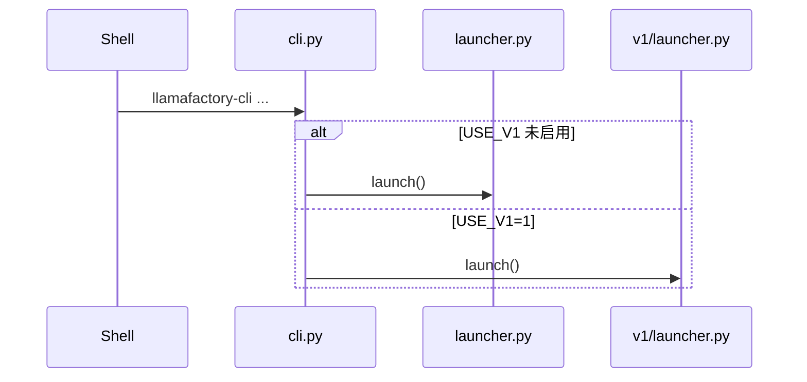
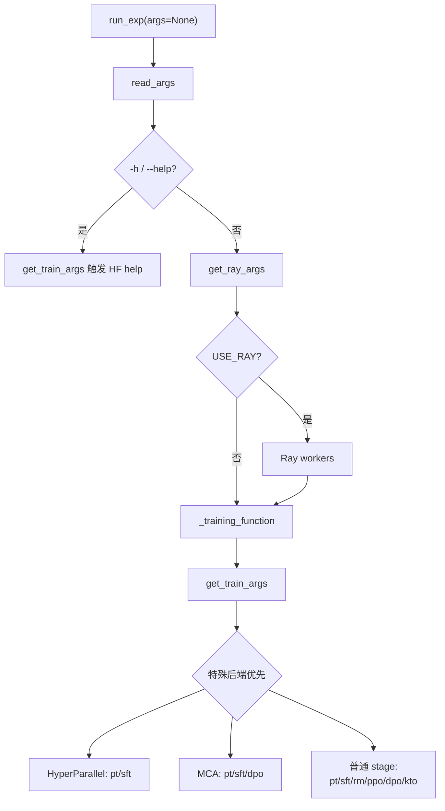

# 03 — CLI 与入口

> 源码基线：`0.9.6.dev0`。本篇重点解释参数如何在进程重启后仍正确到达训练器。

## 1. 可执行入口

`pyproject.toml` 注册：

```toml
[project.scripts]
llamafactory-cli = "llamafactory.cli:main"
lmf = "llamafactory.cli:main"
```

两者完全等价。`cli.main()` 只做一件关键事情：按 `USE_V1` 选择 launcher。



## 2. 默认 v0 命令表

| 命令 | 分发目标 | 备注 |
|---|---|---|
| `train` | `train.tuner.run_exp()` | 唯一会被 v0 launcher 自动 torchrun 的命令 |
| `export` | `train.tuner.export_model()` | 合并/导出；要求 `export_dir` |
| `api` | `api.app.run_api()` | OpenAI 风格 API |
| `chat` | `chat.chat_model.run_chat()` | 终端交互 |
| `webui` | `webui.interface.run_web_ui()` | 完整 LLaMA Board |
| `webchat` | `webui.interface.run_web_demo()` | 仅聊天界面 |
| `env` | `extras.env.print_env()` | 环境与 Git commit |
| `version` | launcher 内打印 | 当前为 `0.9.6.dev0` |
| `help` | launcher 内打印 | usage |
| `eval` | 直接抛 `NotImplementedError` | 源码注明未来弃用 |

未知命令只打印错误和 usage，不会自动猜测。

准确示例：

```bash
llamafactory-cli train examples/train_lora/qwen3_lora_sft.yaml
llamafactory-cli chat examples/inference/qwen3_lora_sft.yaml
llamafactory-cli api examples/inference/qwen3_lora_sft.yaml
llamafactory-cli export examples/merge_lora/qwen3_lora_sft.yaml
llamafactory-cli webui
```

## 3. v0 参数栈的变化

假设输入：

```bash
llamafactory-cli train config.yaml learning_rate=1e-5
```

进入 `launch()` 时：

```text
初始 sys.argv:
[llamafactory-cli, train, config.yaml, learning_rate=1e-5]

command = sys.argv.pop(1) 后:
[llamafactory-cli, config.yaml, learning_rate=1e-5]
```

单进程时直接 `run_exp()`；它的 `read_args()` 看到 `sys.argv[1]` 是 YAML，加载文件并用后面的 OmegaConf dotlist 覆盖。

## 4. v0 自动 torchrun

触发条件精确为：

```text
command == "train"
且
(
  FORCE_TORCHRUN 为真
  或
  (设备数 > 1 且未 USE_RAY 且未 USE_KT)
)
```

`USE_MCA=1` 会先令 `FORCE_TORCHRUN=1`。普通模式生成的命令等价于：

```bash
torchrun \
  --nnodes "$NNODES" \
  --node_rank "$NODE_RANK" \
  --nproc_per_node "$NPROC_PER_NODE" \
  --master_addr "$MASTER_ADDR" \
  --master_port "$MASTER_PORT" \
  src/llamafactory/launcher.py \
  config.yaml learning_rate=1e-5
```

被 torchrun 执行的是 `launcher.py` 文件。该文件的 `if __name__ == "__main__"` 直接调用 `run_exp()`，不会再次分发或再次 torchrun。

默认环境值：

| 变量 | 默认 |
|---|---|
| `NNODES` | `"1"` |
| `NODE_RANK` | `"0"` |
| `NPROC_PER_NODE` | `get_device_count()` |
| `MASTER_ADDR` | `"127.0.0.1"` |
| `MASTER_PORT` | `find_available_port()` |
| `MAX_RESTARTS` | `"0"` |

`OPTIM_TORCH` 默认按 `"1"` 启用，为子进程设置 `PYTORCH_CUDA_ALLOC_CONF=expandable_segments:True` 和 `TORCH_NCCL_AVOID_RECORD_STREAMS=1`。

### 4.1 弹性 rendezvous

设置 `RDZV_ID` 后改走 c10d rendezvous；若同时设置 `MIN_NNODES`、`MAX_NNODES`，`--nnodes` 变为 `MIN_NNODES:MAX_NNODES`。

```bash
RDZV_ID=job-42 MIN_NNODES=1 MAX_NNODES=2 \
MASTER_ADDR=10.0.0.1 MASTER_PORT=29400 NPROC_PER_NODE=8 \
llamafactory-cli train config.yaml
```

### 4.2 固定多节点

```bash
# node 0
NNODES=2 NODE_RANK=0 MASTER_ADDR=10.0.0.1 MASTER_PORT=29500 NPROC_PER_NODE=8 \
llamafactory-cli train config.yaml

# node 1
NNODES=2 NODE_RANK=1 MASTER_ADDR=10.0.0.1 MASTER_PORT=29500 NPROC_PER_NODE=8 \
llamafactory-cli train config.yaml
```

## 5. Ray 不是 torchrun 的别名

Ray 需要显式设置 `USE_RAY=1`：

```bash
USE_RAY=1 llamafactory-cli train examples/train_lora/qwen3_lora_sft_ray.yaml
```

调用链：

```text
launcher: use_ray() 为真 → 不自动 torchrun
run_exp()
├─ read_args()
├─ get_ray_args()
└─ ray_args.use_ray
   └─ _ray_training_function()
      ├─ ray.init()
      ├─ 检查集群设备数
      ├─ placement group
      ├─ 每 worker 设置 rank/world size/master
      └─ Worker._training_function() → 通用 stage 路由
```

`RayArguments` 字段为 `ray_num_workers=1`、`ray_init_kwargs=None`、`master_addr=None`、`master_port=None`；`use_ray` 是从环境变量派生的非配置字段。只在 YAML 写 `ray_num_workers: 4` 不会启用 Ray。

## 6. `run_exp()` 内部路由



## 7. v1 CLI 的差异

`USE_V1=1` 时命令分发发生根本变化：

| v1 命令 | 目标 |
|---|---|
| `train` / `sft` | `v1.trainers.sft_trainer.run_sft()` |
| `dpo` | `v1.trainers.dpo_trainer.run_dpo()` |
| `rm` | `v1.trainers.rm_trainer.run_rm()` |
| `chat` | `v1.samplers.cli_sampler.run_chat()` |
| `merge` | `v1.plugins.model_plugins.peft.merge_and_export_model()` |
| `help` | usage |
| `env` / `version` | 当前未实现，抛 `NotImplementedError` |

v1 自动 torchrun 的训练命令集合为 `("train", "sft", "dpo", "rm")`，重启时会把 command 显式放回脚本参数：

```text
torchrun ... v1/launcher.py <command> <其余参数>
```

随后 `v1/launcher.py:main()` 再取出并移除 command，交给对应 trainer。这与 v0 “torchrun 后直接 `run_exp`”不同。

正确示例：

```bash
USE_V1=1 llamafactory-cli sft examples/v1/train_lora/train_lora_sft.yaml
USE_V1=1 llamafactory-cli dpo examples/v1/train_lora/train_lora_dpo.yaml
USE_V1=1 llamafactory-cli merge examples/v1/train_lora/export_lora.yaml
```

## 8. Python 薄入口

| 文件 | 行为 | 与 CLI 的关键差别 |
|---|---|---|
| `src/train.py` | `run_exp()` | 不经过 launcher 自动 torchrun |
| `src/api.py` | `ChatModel → create_app → uvicorn` | 与 v0 `api` 业务链相同 |
| `src/webui.py` | `create_ui().launch()` | 与 v0 `webui` 业务链相同 |

多卡训练优先使用 `llamafactory-cli train`。`src/train.py` 主要是薄封装和 TPU/XLA `_mp_fn` 入口。

## 9. 扩展新命令

v0 最小修改面：

1. 在 `src/llamafactory/launcher.py::USAGE` 加说明；
2. 在 `launch()` 增加 `elif command == ...`，保持惰性导入；
3. 若需要 torchrun，扩展触发条件并明确重启后的 argv 契约；
4. 为 `-h`、单进程、多进程分别测试。

若 v1 也要支持，必须单独修改 `v1/launcher.py`；两个 launcher 不共享命令注册表。

## 10. 常见陷阱

- `llamafactory-cli eval` 目前不可用，尽管源码仍有 `eval/`。
- DeepSpeed 配置在非分布式模式会被 parser 拒绝，单卡也常需 `FORCE_TORCHRUN=1`。
- shell 中把 `USE_V1=0` 当“已启用”取决于 `is_env_enabled()`，不要自行按变量存在性推断。
- launcher 用 `.split()` 构造 v0 torchrun 参数；带空格的 CLI 值不如写入 YAML 稳妥。
- `MASTER_PORT` 未指定时每个节点各自寻找空闲端口可能不一致；多节点应显式统一。
- v0 的 `export` 在 v1 叫 `merge`，配置结构也不同。

## 11. 阅读顺序

1. `pyproject.toml` 的 `[project.scripts]`；
2. `src/llamafactory/cli.py`；
3. `src/llamafactory/launcher.py`；
4. `src/llamafactory/train/tuner.py`；
5. `src/llamafactory/hparams/parser.py`；
6. `src/llamafactory/v1/launcher.py`；
7. 最后对比 `src/train.py`、`src/api.py`、`src/webui.py`。
