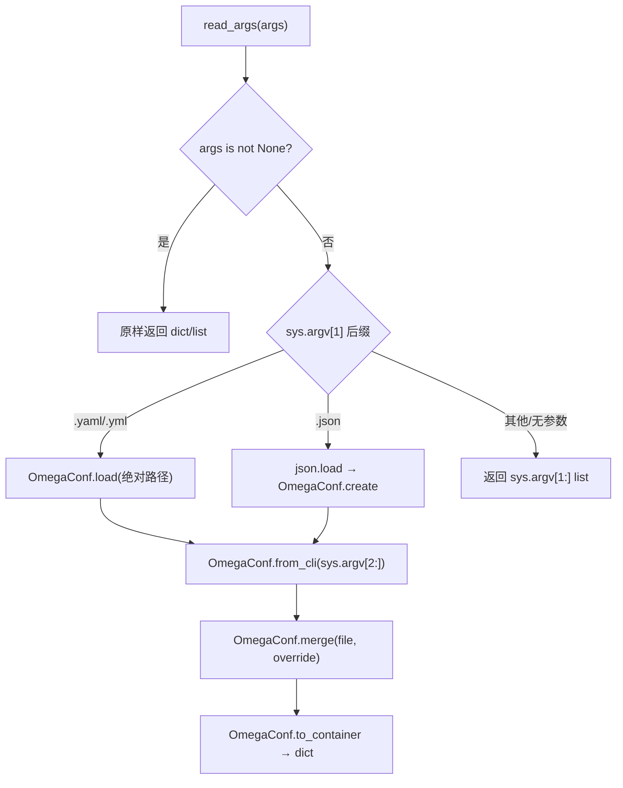

# 04 — 配置系统

> 源码基线：LLaMA Factory `0.9.6.dev0`。默认 v0 与实验 v1 使用不同配置系统，本篇先完整解释 v0。

## 1. v0 支持的输入形态

### 1.1 YAML/YML + OmegaConf 覆盖（推荐）

```bash
llamafactory-cli train \
  examples/train_lora/qwen3_lora_sft.yaml \
  learning_rate=1e-5 logging_steps=1
```

### 1.2 JSON + OmegaConf 覆盖

JSON 文件由标准库 `json.load()` 读成对象，再经 `OmegaConf.create()`；覆盖语法相同。

### 1.3 纯 CLI

```bash
llamafactory-cli train \
  --model_name_or_path Qwen/Qwen3-4B-Instruct-2507 \
  --stage sft \
  --do_train \
  --finetuning_type lora \
  --dataset identity \
  --template qwen3_nothink \
  --output_dir saves/test
```

纯 CLI 交给 HF `HfArgumentParser`，不是 OmegaConf dotlist。不要混写 `--learning_rate` 和 YAML 后的 `learning_rate=...`。

代码也可直接向 `run_exp(args=dict_or_list)` 传参；此时 `read_args()` 原样返回传入对象，不再读 `sys.argv`。

## 2. `read_args()` 的精确合并规则



后合并的 CLI dotlist 胜出。它可以覆盖嵌套键，但 v0 的训练 dataclass 主要是扁平字段：

```bash
llamafactory-cli train config.yaml learning_rate=2e-5 bf16=false
```

陷阱：

- 覆盖项没有前导 `--`；
- OmegaConf 会推断布尔、数字、null、列表等类型；
- 未知键默认由 `HfArgumentParser.parse_dict()` 报错；
- `ALLOW_EXTRA_ARGS=1` 才允许额外键，通常不应在生产配置中开启。

## 3. 从字典到 dataclass

训练 parser 的类顺序固定为：

```text
ModelArguments
DataArguments
TrainingArguments
FinetuningArguments
GeneratingArguments
```

```text
read_args
→ HfArgumentParser(_TRAIN_ARGS)
→ parse_dict / parse_args_into_dataclasses
→ __post_init__
→ get_train_args 中的跨对象校验与派生
→ 返回 5 元组
```

推理返回四元组：

```text
ModelArguments, DataArguments, FinetuningArguments, GeneratingArguments
```

旧评测返回：

```text
ModelArguments, DataArguments, EvaluationArguments, FinetuningArguments
```

## 4. 五类训练参数

### 4.1 `ModelArguments`

文件：`src/llamafactory/hparams/model_args.py`。

它通过多重 dataclass 继承组合模型基础参数、在线量化、图像/视频/音频处理、导出、vLLM、SGLang 和 KTransformers 字段。

关键字段及当前默认：

| 字段 | 默认/取值 |
|---|---|
| `model_name_or_path` | `None`，但 `__post_init__` 要求必须提供 |
| `use_fast_tokenizer` | `true` |
| `trust_remote_code` | `false` |
| `flash_attn` | `auto`；可用 `disabled/sdpa/fa2/fa3` |
| `infer_backend` | `huggingface`；另有 `vllm/sglang` |
| `quantization_method` | **`bnb`** |
| `quantization_bit` | `null` |
| `quantization_type` | `nf4` |
| `double_quantization` | `true` |
| `export_device` | `cpu` |
| `vllm_maxlen` / `sglang_maxlen` | `4096` |

`QuantizationMethod` 枚举值为 `bnb,gptq,awq,aqlm,quanto,eetq,hqq,mxfp4,fp8`。配置 bitsandbytes 必须写：

```yaml
quantization_bit: 4
quantization_method: bnb
```

不能写 `bitsandbytes`。当前准确示例是 `examples/train_qlora/qwen3_lora_sft_bnb_npu.yaml`。

### 4.2 `DataArguments`

文件：`src/llamafactory/hparams/data_args.py`。

| 字段 | 默认 | 语义 |
|---|---:|---|
| `dataset_dir` | `data` | 数据注册表及本地数据目录 |
| `cutoff_len` | `2048` | tokenize 截断长度 |
| `streaming` | `false` | 流式数据 |
| `buffer_size` | `16384` | 流式随机缓冲 |
| `mix_strategy` | `concat` | 也支持三种 interleave |
| `val_size` | `0.0` | 比例或样本数 |
| `packing` | `null` | PT 时后处理自动启用 |
| `neat_packing` | `false` | 开启时强制 packing |
| `enable_thinking` | `true` | 推理模型思考模式 |

逗号字符串 `dataset`/`eval_dataset` 会转成列表。`eval_dataset` 与正数 `val_size` 互斥；streaming 与 `max_samples` 互斥；`neat_packing` 仅允许 SFT，并会令 `cutoff_len` 内部减 1。

### 4.3 `TrainingArguments`

文件：`src/llamafactory/hparams/training_args.py`。

继承关系：

```text
TrainingArguments
├─ ProfilerArguments
├─ Fp8Arguments
├─ RayArguments
└─ transformers.Seq2SeqTrainingArguments
   （USE_MCA=1 时换成 MCA 对应基类）
```

因此 `learning_rate`、batch size、epoch、scheduler、DeepSpeed、FSDP、日志等大多数训练字段来自 Transformers；仓库增加 Ray、profiler 和 FP8 字段。`overwrite_output_dir` 在本项目中保留但标记 deprecated。

Ray 字段默认是 `ray_num_workers=1`、`ray_init_kwargs=null`、`master_addr=null`、`master_port=null`。是否启用由环境变量 `USE_RAY` 派生。

### 4.4 `FinetuningArguments`

文件：`src/llamafactory/hparams/finetuning_args.py`。

最重要的两个维度不能混淆：

```text
stage（训练工作流）
├─ pt
├─ sft
├─ rm
├─ ppo
├─ dpo
└─ kto

pref_loss（仅 DPO 工作流中的损失变体）
├─ sigmoid（默认）
├─ hinge
├─ ipo
├─ kto_pair
├─ orpo
└─ simpo
```

所以 ORPO/SimPO 配置写法是：

```yaml
stage: dpo
pref_loss: orpo   # 或 simpo
```

不是 `stage: orpo`。`finetuning_type` 精确值为 `lora|oft|freeze|full`，默认 `lora`。LoRA 默认 `lora_rank: 8`、`lora_target: all`，`lora_alpha` 为空时在 `__post_init__` 中派生为 `lora_rank * 2`。

`use_ref_model` 也是派生值：仅 `stage == dpo` 且 `pref_loss` 不是 `orpo/simpo` 时为真。

### 4.5 `GeneratingArguments`

文件：`src/llamafactory/hparams/generating_args.py`。

当前默认包括 `do_sample=true`、`temperature=0.95`、`top_p=0.7`、`top_k=50`、`num_beams=1`、`max_new_tokens=1024`、`repetition_penalty=1.0`。若 `max_new_tokens > 0`，转换字典时会移除 `max_length`。

## 5. `get_train_args()` 不只是解析

它还执行重要约束和派生：

- 非 SFT 禁止 `predict_with_generate`、`neat_packing`、`train_on_prompt`、`mask_history`；
- `rm/ppo` 禁止 `load_best_model_at_end`；
- PPO 必须训练且必须提供 reward model；
- 量化训练仅兼容 LoRA/OFT；
- DeepSpeed 必须处于分布式模式，否则提示 `FORCE_TORCHRUN=1`；
- streaming 必须设置 `max_steps`；
- 训练必须有 `dataset`；评估必须有 `eval_dataset` 或 `val_size`；
- 训练只允许 HF 推理后端；
- 根据 `bf16/fp16` 派生 `model_args.compute_dtype`；
- 设置当前设备、`model_max_length=cutoff_len`、block diagonal attention；
- 默认 PT 开启 packing；
- 检测 `output_dir` 的最后 checkpoint 并可能自动续训。

因此“YAML 能成功反序列化”不代表配置可运行。

## 6. 当前 SFT 示例逐项对照

准确来源：`examples/train_lora/qwen3_lora_sft.yaml`。

```yaml
### model
model_name_or_path: Qwen/Qwen3-4B-Instruct-2507
trust_remote_code: true

### method
stage: sft
do_train: true
finetuning_type: lora
lora_rank: 8
lora_target: all

### dataset
dataset: identity,alpaca_en_demo
template: qwen3_nothink
cutoff_len: 2048
max_samples: 1000
preprocessing_num_workers: 16
dataloader_num_workers: 4

### output
output_dir: saves/qwen3-4b/lora/sft
logging_steps: 10
save_steps: 500
plot_loss: true
overwrite_output_dir: true
save_only_model: false
report_to: none

### train
per_device_train_batch_size: 1
gradient_accumulation_steps: 8
learning_rate: 1.0e-4
num_train_epochs: 3.0
lr_scheduler_type: cosine
warmup_ratio: 0.1
bf16: true
ddp_timeout: 180000000
resume_from_checkpoint: null
```

## 7. 数据集注册配置

`dataset` 中的名字由 `dataset_dir/dataset_info.json` 解析。默认 `dataset_dir: data`，因此通常应在仓库根目录运行。

常见注册字段：

- `file_name`：本地文件；
- `formatting`：`alpaca` 或 `sharegpt`；
- `columns`：原字段到标准字段映射；
- `tags`：ShareGPT role/content 标签；
- `hf_hub_url`、`ms_hub_url`、`om_hub_url`：Hub 数据源。

数据注册和训练 YAML 是两个层次：前者说明“数据在哪里、字段叫什么”，后者说明“本次使用哪些数据、如何 tokenize”。

## 8. DeepSpeed、FSDP 与示例路径

```yaml
deepspeed: examples/deepspeed/ds_z3_config.json
```

当前 DeepSpeed 目录包含 `ds_z0_config.json`、`ds_z2_config.json`、`ds_z2_offload_config.json`、`ds_z2_autotp_config.json`、`ds_z3_config.json`、`ds_z3_offload_config.json`、`ds_z3_fp8_config.json`。

Accelerate/FSDP 示例包括：

```text
examples/accelerate/fsdp_config.yaml
examples/accelerate/fsdp_config_offload.yaml
examples/accelerate/fsdp_config_multiple_nodes.yaml
examples/accelerate/fsdp2_config.yaml
examples/accelerate/fsdp2_config_qwen35.yaml
examples/accelerate/fsdp2_config_qwen35_moe.yaml
```

这些配置是否由 `accelerate launch`、launcher 或特殊 workflow 消费，应按对应训练示例核对，不能仅因文件存在就混入任意 YAML。

## 9. v1 配置不是 v0 的新版字段集

`examples/v1/train_lora/train_lora_sft.yaml` 以如下结构开头：

```yaml
model: Qwen/Qwen3-4B
model_class: llm
template: qwen3_nothink
peft_config:
  name: lora
  r: 16
  lora_alpha: 32
dist_config:
  name: fsdp2
train_dataset: data/v1_sft_demo.yaml
micro_batch_size: 1
```

它由 `src/llamafactory/v1/config/` 解析。不要把 v0 的 `model_name_or_path`、`finetuning_type`、`dataset` 与 v1 的 `model`、`peft_config`、`train_dataset` 混合。

## 10. 配置扩展点

1. v0 新参数：加到职责对应的 dataclass，并设置准确类型、默认值和 metadata。
2. 跨参数约束：放入 dataclass `__post_init__` 或 `hparams/parser.py` 的跨对象校验。
3. 派生字段：声明 `init=False`，避免用户配置内部状态。
4. UI 暴露：同步 `webui/components/`、`manager.py`、`runner.py`。
5. 示例：放入准确的 `examples/<场景>/`，并用 CLI 真正解析。
6. v1 参数：只改 `v1/config/` 及相应插件/训练器，不复用 v0 parser 假定。

## 11. 常见陷阱与阅读顺序

陷阱：

- `quantization_method: bitsandbytes` 错，应为 `bnb`。
- `stage: orpo` / `stage: simpo` 错，应为 `stage: dpo` + `pref_loss`。
- YAML 后覆盖写成 `--learning_rate` 错，应为 `learning_rate=...`。
- Ray YAML 没有 `USE_RAY=1` 时仍走非 Ray 分支。
- 未设置 `overwrite_output_dir` 时可能自动从最后 checkpoint 恢复，这不是“配置没生效”。
- 配置 vLLM/SGLang 后尝试训练会被拒绝。

推荐阅读：

1. `hparams/parser.py::read_args/_parse_args/get_train_args`；
2. `model_args.py`、`data_args.py`；
3. `training_args.py`、`finetuning_args.py`、`generating_args.py`；
4. `extras/constants.py` 的字符串枚举；
5. 一个真实 `examples/train_*/*.yaml`；
6. `data/dataset_info.json`；
7. 最后对比 `v1/config/arg_parser.py` 和 `examples/v1/`。
