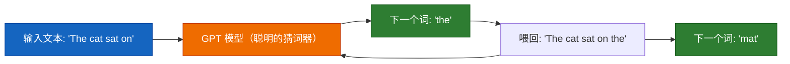
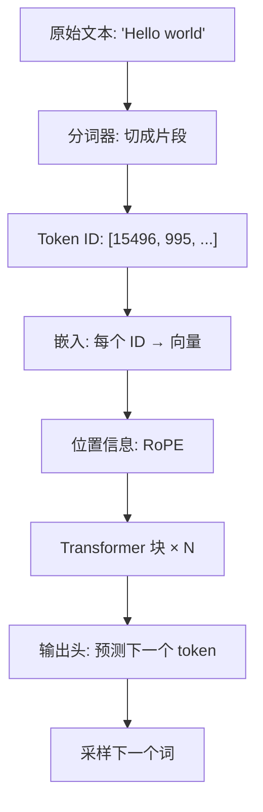

# 第 0 章 — GPT 到底是什么？

> *「若能向五岁孩子讲清楚，才算真正理解。」*

---

## 给五岁孩子的类比

想象有个朋友读完了**图书馆里所有的书**。你开口说：

> *「The cat sat on the...」（猫坐在……）*

这位朋友凭读过的书**猜**下一个词：**「mat」**（垫子）。

GPT 就是这样：**读大量文本、学会猜下一个词的机器。**

| 概念 | 类比 |
|---|---|
| **GPT** | 非常聪明的「猜下一个词」选手 |
| **训练** | 读数百万本书以学习规律 |
| **文本生成** | 永远玩「帮我补全句子」 |
| **参数** | 它记住的所有模式的「记忆」 |
| **注意力** | 知道哪些词最重要 |

## 全局图景：流水线概览

## 本教程基于哪些模型？

**简短回答：这是现代仅解码器（decoder-only）Transformer（LLaMA 风格），融合了 2023–2025 年公开文档中最好的技术。**

## 你将构建什么

读完本指南，你将从零实现：

| 组件 | 作用 | 章节 |
|---|---|---|
| **分词器** | 文本 ↔ 数字（BPE，与 GPT-4 相同算法） | [2](02_tokenization.md) |
| **嵌入** | 给每个 token 一个 768 维「语义向量」 | [3](03_embeddings.md) |
| **RoPE** | 用旋转让模型感知词序 | [4](04_positional_encoding.md) |
| **注意力** | 让词「互相看、互相交流」 | [5](05_attention.md) |
| **Transformer 块** | 完整思考单元：注意力 + 前馈 + 残差 | [6](06_transformer_block.md) |
| **GPT 模型** | 完整 151M 参数语言模型（含 SwiGLU） | [7](07_gpt_model.md) |
| **训练流水线** | 数据加载、AdamW、余弦调度、混合精度 | [8](08_training.md) |
| **推理引擎** | 带 temperature、top-k、top-p、KV cache 的文本生成 | [9](09_inference.md) |
| **完整脚本** | 一个文件完成训练与生成，从头到尾可运行 | [10](10_full_script.md) |

**适合谁？** 会基础 Python 即可，无需 ML/AI 经验。每个概念先类比，再数学，再带注释的代码。

**需要什么？** Python 3.10+ 的电脑。有 GPU 更好，非必须——我们提供可在 CPU 上跑的小配置。

## 基于哪些模型？（技术细节）

| 技术 | 来源模型 | 公开确认？ |
|---|---|---|
| 仅解码器 Transformer | GPT-2 (2019)、GPT-3 (2020) | 是 |
| Pre-Norm 残差 | GPT-3 (2020) | 是 |
| BPE 分词器 | GPT-2/3/4 | 是 |
| AdamW 优化器 | GPT-3 (2020) | 是 |
| 余弦 LR + warmup | GPT-3 (2020) | 是 |
| 权重绑定 | GPT-2/3 | 是 |
| **RoPE**（位置编码） | **LLaMA、Mistral、Qwen** | 是 — 非 GPT-3/4 |
| **RMSNorm**（归一化） | **LLaMA、Mistral、Gemma** | 是 — 非 GPT-3/4 |
| **SwiGLU**（激活） | **PaLM、LLaMA、Gemini** | 是 — 非 GPT-3 |
| 混合精度 (bfloat16) | 所有现代模型 | 是 |

**GPT-4 和 Claude 呢？** 架构**专有且未公开**。已知 GPT-4 是 Transformer，但不知道用哪种位置编码、归一化或激活。Claude 架构完全保密。

**本指南教什么：** 最先进的**公开文档**架构——也就是 **LLaMA 3、Mistral、Qwen 2.5、Gemma** 所用的那一套。这是最佳开源模型背后的架构，代表我们确有文档确认的最先进水平。

**什么让模型「世界级」？**

1. **规模** — 数十亿参数、数万亿 token 训练
2. **架构** — 现代 Transformer（我们的重点）
3. **数据质量** — 干净、多样、过滤良好的文本
4. **训练技巧** — 混合精度、梯度裁剪、LR 调度

> 我们将用与最佳开源模型**相同的公开技术**构建一个小型版本。

---

**下一章：** [第 1 章 — 环境与工具](01_setup.md)
