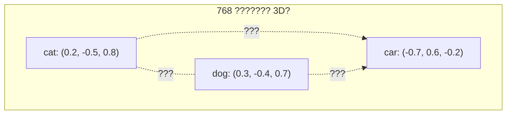

# ? 3 ? ? ?????????

## 5 ?????????

??????????**? 768 ??????????**??

- **?Cat?** ??? 3 ????? 15 ???????
- **?Dog?** ??????????????????
- **?Car?** ??????????????

????????????**??**??????????????????**???????????**



## ????King - Man + Woman = Queen???

?????????????

```python
# ????????????
# embedding("king") - embedding("man") + embedding("woman")
# ? embedding("queen")
```

**??????** ?King?????????????
- ?????queen??prince??throne????
- ?????man??he??boy????

???man???????????woman???????????????? + ?????? = ?queen??

?????????????????**????**????????????????????????????????????

## ??????**??**???

???????????????????????????????

### ? 1 ???????

?????????????????????
```
Token 9246 ("cat"): [0.002, -0.013, 0.007, ..., -0.009]   ?768 ?????
Token 6734 ("sat"): [0.015, 0.001, -0.011, ..., 0.004]   ?768 ?????
```

????cat???dog?**???**?cat???the???????????

### ? 2 ??????

????????`"The cat sat on the mat"` ??????????

????mat???????dog????**loss** ????????????
- ??cat???????????????mat??
- ??mat???????????the???????

### ? 3 ??????????

```python
# ?? ? ???????????????

# ?cat???????
cat_embedding = [0.002, -0.013, 0.007, ..., -0.009]

# ?? "The ___ sat on the mat"???cat?????
# ?????? 5 ??? 0.0003?? 42 ??? 0.0001???
cat_embedding = [0.002, -0.012, 0.008, ..., -0.010]  # ????

# ??????????????
# - ?cat????dog??pet??feline?
# - ?cat????car??democracy??photosynthesis?
```

### ? 4 ?????? ? ?????

???? token ?????768 ?????????????

```
?? 1 (0-63)?   ??/?? ? ?? vs ???
?? 2 (64-127)? ?? ? ? vs ?
?? 3 (128-191)??? ? ?? vs ??
?? 4 (192-255)????? ? ?? vs ??
...
```

??????????????????????????????????????????????????????????

## ???????

GPT-2 ? GPT-3 ?????? `sqrt(d_model)`????????**?**??????????????????sin/cos ??????? -1 ? 1 ?????????????????

???? RoPE?RoPE ??**?**???????**??** query ? key ????????????????????????????????? LLaMA ?????????????????????????????????

```python
embeddings = self.embed(x)           # ??????? ~N(0, 0.02)
# ?? RoPE ????? ?? LLaMA ? Mistral ??????
```

## ?????????

| ?? | ???? | ???? |
|---|---|---|
| ????? | 1000 ?+ token | 100 ? token |
| ???? | 768+?GPT-2?? 12288?GPT-3? | 64 ??? |
| ???? | 5 ????? | 5 ?????? 50 ?????? |
| ???? | loss ??? | ???? |
| ????? | ??????????? | ???? |

## ???? ? ????

```python
import torch
import torch.nn as nn


class Embedding(nn.Module):
    """
    ????? token ID ???????????
    ????????????? ID ? [9246, 6734] ????????
         ??????????

         ???????????
         ? 9246 ? -> 768 ? float ?????cat???????
         ? 6734 ? -> 768 ? float ?????sat???????

         ??????????????????
         ????? token ? 768 ???????
    """

    def __init__(self, vocab_size: int, d_model: int):
        """
        ??????????????????

        ???
            vocab_size: ????? token?GPT-2 ? 50,257?
            d_model:    ??????????

        ????????
            GPT-2 small:  vocab=50257, d_model=768   ? ?? 50257 ? 768
            GPT-2 medium: vocab=50257, d_model=1024  ? ?? 50257 ? 1024
            GPT-3 small:  vocab=50257, d_model=4096  ? ?? 50257 ? 4096
            GPT-3 large:  vocab=50257, d_model=12288 ? ?? 50257 ? 12288

        ?????????????????????????
             ??? d_model = ??????????
             ?????????????
        """
        super().__init__()

        # ??????????? ? [vocab_size, d_model] ??
        # ????nn.Embedding ????????? token ID ????
        #      ??????????????????
        #      ???? nn.Linear ??????
        #
        #      ?? nn.Embedding ?????
        #      def forward(self, x):
        #          return self.weight[x]  # ??????
        self.embed = nn.Embedding(vocab_size, d_model)

    def forward(self, x: torch.Tensor) -> torch.Tensor:
        """
        ?????????? token ID ????

        ?????  [batch_size, seq_len]    ? ??????? token ID
        ????? [batch_size, seq_len, d_model] ? ?????????

        ?????
            ???  [[464, 3797]]              # ["The", "cat"]
            ?? 1??? 464 ? ? ?The?? [768 floats]
                    ?? 3797 ? ? ?cat?? [768 floats]
            ?? 2???????? RoPE ??????
            ??? [[[v0..v767], [v0..v767]]] # 2 ? 768 ???

        ????????
            batch_size = ????????????
            seq_len    = ????? token???????
            d_model    = ?? token ???????????
        """
        # ??????????
        # ?????? token ID ??????? O(1)
        #      ?????? 5 ?+ ??????
        embeddings = self.embed(x)  # [batch, seq_len, d_model]

        # ???????????????
        # ???????? RoPE ??????RoPE ????????
        #      ???????LLaMA ? Mistral ????????
        return embeddings
```

## ????

??????????

1. **??** ??cat?? token 9246??cat????????
   **??** ????? 9246 ?????????????????cat?????? 768 ????

2. **??** ?????????? token ID?9246?6734 ???
   **??** ?? 9246 ? 6734 ???????????? 9246 > 6734???????????????cat??9246???dog??ID ?????????????

3. **??** ???????????
   **??** ????.?????????????????.????????????????????

---

**????** [? 2 ? ? ??](02_tokenization.md)
**????** [? 4 ? ? ????](04_positional_encoding.md)
