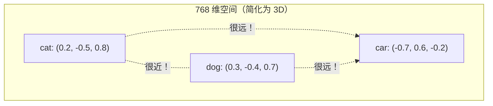

# 第 3 章 — 嵌入：赋予数字意义

## 5 岁小孩也能懂的类比

想象每个词都住在一栋**有 768 层（维度）的巨型公寓楼**里。

- **「Cat」** 住在第 3 层东侧、第 15 层北侧，等等。
- **「Dog」** 住在附近——楼层相近，因为它们都是动物。
- **「Car」** 住得很远——完全不同的楼层。

每个词在这栋楼里都有一个**坐标**。意思相近的词，坐标也相近。这就是嵌入：**词在意义空间里的坐标。**



## 著名的「King - Man + Woman = Queen」类比

这是嵌入能力最著名的例子：

```python
# 在训练良好的嵌入空间中：
# embedding("king") - embedding("man") + embedding("woman")
# ≈ embedding("queen")
```

**为什么能成立？** 「King」在意义空间里有两个成分：
- 王室（与「queen」「prince」「throne」共享）
- 男性（与「man」「he」「boy」共享）

减去「man」就去掉了男性成分。加上「woman」就加入了女性成分。结果：一个表示「王室 + 女性」的向量 = 「queen」。

这不是人为写死的——它从训练的数学中**自然涌现**。模型学到：在保持语义的同时改变性别，会在嵌入空间里产生一个一致的「方向」。

## 嵌入是如何**学**出来的

这是最重要的问题：「如果嵌入一开始是随机的，它们怎么变得有意义？」

### 第 1 步：随机初始化

创建模型时，嵌入矩阵的每一行都是随机噪声：
```
Token 9246 ("cat"): [0.002, -0.013, 0.007, ..., -0.009]   （768 个随机数）
Token 6734 ("sat"): [0.015, 0.001, -0.011, ..., 0.004]   （768 个随机数）
```

此时，「cat」和「dog」**并不比**「cat」和「the」更接近。模型一无所知。

### 第 2 步：训练信号

训练时，模型看到 `"The cat sat on the mat"`，并尝试预测下一个词。

如果它把「mat」猜成「dog」，**loss** 就会很高。反向传播会发出信号：
- 「cat 的嵌入应该更新，以便更好地预测 mat」
- 「mat 的嵌入应该更接近跟在 the 后面出现的东西」

### 第 3 步：梯度下降更新嵌入

```python
# 简化版 — 一次训练步中某个嵌入会发生什么：

# token "cat" 的当前嵌入：
cat_embedding = [0.002, -0.013, 0.007, ..., -0.009]

# 在看到 "The ___ sat on the mat"（填入 "cat"）之后：
# 梯度说：「第 5 维上移 0.0003，第 42 维下移 0.0001……」
cat_embedding = [0.002, -0.012, 0.008, ..., -0.010]  # 微小更新

# 经过数百万个样本后，模式会浮现：
# - "cat" 靠近 "dog"、"pet"、"feline"
# - "cat" 远离 "car"、"democracy"、"photosynthesis"
```

### 第 4 步：训练之后 — 涌现的结构

在数十亿 token 上训练后，768 维空间会形成有意义的结构：

```
方向 1 (0-63)：   有生命性 — 有生命 vs 无生命
方向 2 (64-127)： 大小 — 大 vs 小
方向 3 (128-191)：情感 — 积极 vs 消极
方向 4 (192-255)：正式程度 — 正式 vs 随意
...
```

这些「方向」不是人指定的。它们从语言的 geometry 中涌现。模型发现把相关概念聚在一起很有用，因为它们出现在相似的上下文中。

## 为什么要乘以 sqrt(d_model)？

我们的嵌入代码会乘以 `sqrt(d_model)`。为什么？

```python
embeddings = self.embed(x)           # 初始化后数值约为 ~N(0, 0.02)
embeddings = embeddings * sqrt(768)  # 现在数值约为 ~N(0, 0.55)
```

**问题：** 嵌入之后，我们会把它与位置编码相加。位置编码的值（cos/sin）在 -1 到 1 之间。GPT 的嵌入初始化得很小（~N(0, 0.02)，数值大多在 -0.04 到 0.04 之间）。如果不缩放，嵌入值会比位置值小约 25 倍。位置信号会**淹没**词义。

**解决办法：** 把嵌入放大 `sqrt(d_model)` 倍，使其量级与位置编码相当。两种信号就都能贡献到表示里。

```python
# 不缩放：
embedding = [0.01, -0.02, 0.01]    # 很小
position  = [0.84, 0.54, -1.00]    # 大得多 — 位置占主导！

# 缩放后：
embedding = [0.28, -0.55, 0.28]    # 放大
position  = [0.84, 0.54, -1.00]    # 量级相近 — 两者都重要
```

## 什么决定嵌入质量？

| 因素 | 好的嵌入 | 差的嵌入 |
|---|---|---|
| 训练数据量 | 1000 亿+ token | 100 万 token |
| 嵌入维度 | 768+（GPT-2）到 12288（GPT-3） | 64 或更小 |
| 词表大小 | 5 万（平衡） | 5 千（太小）或 50 万（太稀疏） |
| 训练时长 | loss 已收敛 | 过早停止 |
| 数据多样性 | 书籍、网页、代码、对话 | 单一领域 |

## 嵌入代码 — 带注释

```python
import torch
import torch.nn as nn
import math


class Embedding(nn.Module):
    """
    做什么：把 token ID 转成稠密向量（嵌入）。
    为什么：神经网络无法对像 [9246, 6734] 这样的整数 ID 做有意义的计算，
         它需要连续数值组成的向量。

         可以把它想成一张巨大的查表：
         第 9246 行 -> 768 个 float（「cat」的「意义」）
         第 6734 行 -> 768 个 float（「sat」的「意义」）

         这张表是学出来的。一开始随机，反向传播会逐渐把
         相关的 token 在 768 维空间里拉得更近。
    """

    def __init__(self, vocab_size: int, d_model: int):
        """
        做什么：创建嵌入表（一个可学习的矩阵）。

        参数：
            vocab_size: 有多少个不同的 token（GPT-2 为 50,257）
            d_model:    每个嵌入向量的大小。

        不同规模模型的例子：
            GPT-2 small:  vocab=50257, d_model=768   → 表大小 50257 × 768
            GPT-2 medium: vocab=50257, d_model=1024  → 表大小 50257 × 1024
            GPT-3 small:  vocab=50257, d_model=4096  → 表大小 50257 × 4096
            GPT-3 large:  vocab=50257, d_model=12288 → 表大小 50257 × 12288

        为什么：嵌入维度决定每个词有多少「空间」来表达意义。
             更大的 d_model = 能捕捉更细粒度的语义，
             代价是更多参数和更慢的训练。
        """
        super().__init__()

        # 做什么：实际的嵌入权重 — 一个 [vocab_size, d_model] 矩阵
        # 为什么：nn.Embedding 是优化过的查表。传入 token ID 张量时，
        #      它会返回对应行。底层是标准权重矩阵，所以梯度
        #      可以像 nn.Linear 一样流过。
        #
        #      nn.Embedding 内部本质上就是：
        #      def forward(self, x):
        #          return self.weight[x]  # 索引权重矩阵
        self.embed = nn.Embedding(vocab_size, d_model)

        # 做什么：缓存 d_model，供缩放步骤使用
        self.d_model = d_model

    def forward(self, x: torch.Tensor) -> torch.Tensor:
        """
        做什么：为输入中的每个 token ID 查表得到嵌入。

        输入形状：  [batch_size, seq_len]    — 每个元素是一个 token ID
        输出形状： [batch_size, seq_len, d_model] — 每个元素是一个向量

        示例走读：
            输入：  [[464, 3797]]              # ["The", "cat"]
            第 1 步：查第 464 行 → "The" 的 [768 floats]
                    查第 3797 行 → "cat" 的 [768 floats]
            第 2 步：乘以 sqrt(768) ≈ 27.7
            输出： [[[v0..v767], [v0..v767]]] # 2 个 768 维向量

        各维度的含义：
            batch_size = 一次处理多少条序列（并行度）
            seq_len    = 每条序列有多少 token（上下文窗口）
            d_model    = 每个 token 的表示有多丰富（表达力）
        """
        # 做什么：索引嵌入矩阵
        # 为什么：对每个 token ID 返回对应行。这是 O(1)
        #      查表操作 — 即使词表有 5 万+ 也很快。
        embeddings = self.embed(x)  # [batch, seq_len, d_model]

        # 做什么：乘以 sqrt(d_model)
        # 为什么：见上文解释。不这样做，嵌入值会被位置编码
        #      的值压下去。sqrt(d_model) 把嵌入从 ~N(0, 0.02)
        #      缩放到 ~N(0, sqrt(d_model)*0.02)，
        #      使其与 [-1, 1] 范围内的位置值量级相当。
        return embeddings * math.sqrt(self.d_model)
```

## 快速自测

继续下一章前，检查一下理解：

1. **问：** 如果「cat」是 token 9246，「cat」的嵌入是什么？
   **答：** 就是嵌入矩阵第 9246 行的内容。一开始随机，训练后它是一个 768 维向量，捕捉「cat」的「意义」。

2. **问：** 为什么不能直接用原始 token ID（9246、6734 等）？
   **答：** 因为 9246 和 6734 只是任意数字。模型会认为 9246 > 6734（错误关系）。嵌入让模型学到「cat」（9246）与「dog」（ID 不相邻，但向量相近）相似。

3. **问：** 嵌入也会给标点符号编码意义吗？
   **答：** 会！「.」（句号）、「,」（逗号）、「?」都有嵌入。模型会学到「.」后面常跟大写词，「?」后面常跟回答，等等。

---

**上一章：** [第 2 章 — 分词](02_tokenization.md)
**下一章：** [第 4 章 — 位置编码](04_positional_encoding.md)
