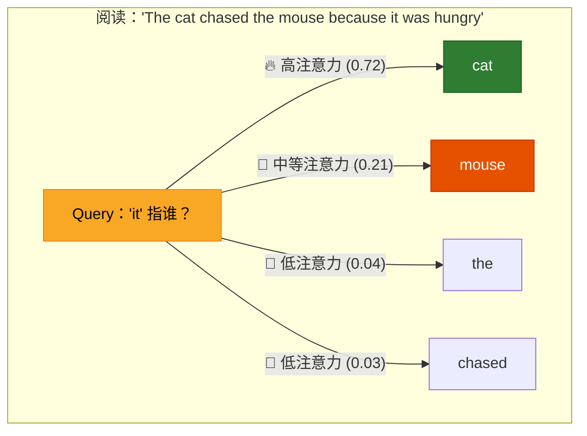
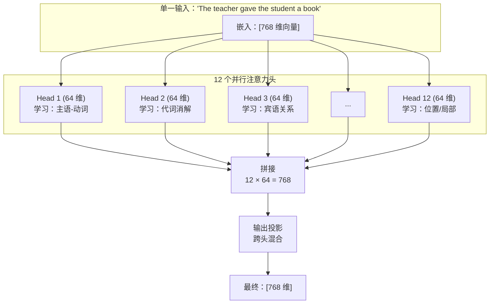
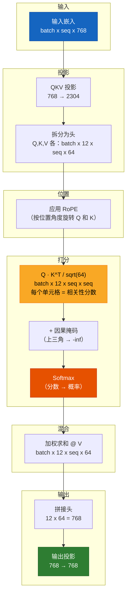

# 第 5 章 — 注意力：核心机制

> *注意力不只是 Transformer 的一部分。注意力就是 Transformer。*

## 给五岁孩子的类比

你走进一个拥挤的派对。你想弄清发生了什么。你不会**平等地听每个人说话**，而是**更关注**：

- 正在和你说话的人（高相关性）
- 大声喊叫的人（高重要性）
- 关于你最爱话题的对话（与你的兴趣高度匹配）

**注意力就是模型查看所有词并决定：「此刻我应该多关注这个词吗？」的能力。**



---

## 第一部分：自注意力 — 核心思想

### 它解决的问题

考虑这句话：**「The cat sat on the mat because it was warm.」**

**「it」** 指什么？猫？垫子？人类立刻知道「it」=「mat」（因为垫子可以「warm」，猫是恒温动物）。但计算机如何推断？

**注意力之前（RNN、LSTM）：** 词从左到右逐个处理。当模型读到「it」时，「mat」已在很远的过去 — 其信息已经衰减。

**有了注意力：** 模型可以同时回看所有先前的词并判断：「mat」与「it」最匹配，因为「warm」常与表面/物体相关。

### 自注意力计算什么

对序列中的每个词，自注意力会创建该词的**新表示**，它是序列中所有词的**加权混合**：

```
New("it") = 0.72 × cat + 0.21 × mouse + 0.04 × the + 0.03 × chased
```

权重 (0.72, 0.21, 0.04, 0.03) 就是**注意力分数** — 它们告诉我们每个词有多重要。

---

## 第二部分：数学 — 从词到注意力分数

### 逐步算例

我们用**真实（简化）数字**追踪注意力。为清晰起见，使用 `d_model=4`、`num_heads=2` 的小模型。

**输入：** 分词并嵌入后的句子 `"I love dogs"`：
```
Token 0 ("I"):    [0.5,  0.2, -0.3,  0.8]
Token 1 ("love"): [0.1, -0.5,  0.7, -0.2]
Token 2 ("dogs"): [0.9,  0.3, -0.1, -0.5]
```

### 步骤 1：从输入创建 Q、K、V

每个 token 的嵌入乘以三个权重矩阵，得到 Query、Key 和 Value 向量：

```
Q = x × W_q    (Query: "我在找什么？")
K = x × W_k    (Key:   "我能提供什么？")
V = x × W_v    (Value: "我的实际内容/信息")
```

这些权重矩阵 `W_q, W_k, W_v` 在**训练期间学习**。初始随机，逐渐学会将 token 投影到有用的 Q/K/V 空间。

在我们的小例子中，投影后（`head_dim=2`）：

```
Token │ Query (Q)    │ Key (K)      │ Value (V)
──────┼───────────────┼──────────────┼──────────────
 0:"I"   │ [ 0.8,  0.1] │ [ 0.6, -0.3] │ [ 0.4,  0.9]
 1:"love"│ [-0.2,  0.7] │ [ 0.1,  0.5] │ [-0.3,  0.2]
 2:"dogs"│ [ 0.5, -0.4] │ [-0.4,  0.8] │ [ 0.7, -0.1]
```

### 步骤 2：计算注意力分数

token `i`（query）与 token `j`（key）之间的注意力分数是**点积**：

```
score(i→j) = Q_i · K_j
```

这衡量 token `i` 的 query 与 token `j` 的 key 的匹配程度。点积越大 = 相关性越高。

**计算 token 2（"dogs"）对所有 token 的分数：**

```
score("dogs"→"I")    = Q₂ · K₀ = [0.5, -0.4] · [ 0.6, -0.3] = 0.30 + 0.12 = 0.42
score("dogs"→"love") = Q₂ · K₁ = [0.5, -0.4] · [ 0.1,  0.5] = 0.05 - 0.20 = -0.15
score("dogs"→"dogs") = Q₂ · K₂ = [0.5, -0.4] · [-0.4,  0.8] = -0.20 - 0.32 = -0.52
```

### 步骤 3：缩放分数

除以 `sqrt(head_dim)` = `sqrt(2)` ≈ 1.414：

```
为什么？若 d_k 很大，点积会变成很大的数。
大数 → softmax 变得非常「尖锐」（一个值接近 1.0，
其余接近 0.0）→ 梯度消失 → 模型停止学习。

缩放使方差保持为 1.0，与 d_k 无关。
```

```
缩放后分数: [0.42/1.414, -0.15/1.414, -0.52/1.414] = [0.297, -0.106, -0.368]
```

### 步骤 4：应用因果掩码（仅训练时）

训练时，位置 `i` 的 token 不能看到位置 `> i` 的 token。这意味着：

```
Token 0 ("I"):    只能看到位置 0
Token 1 ("love"): 只能看到位置 0, 1
Token 2 ("dogs"): 只能看到位置 0, 1, 2
```

未来位置设为 `-infinity`（softmax 后变为 0）。

### 步骤 5：Softmax → 注意力权重

将分数转换为和为 1 的概率：

```
softmax([0.297, -0.106, -0.368]) = [0.53, 0.35, 0.12]
```

**解读：** 处理 "dogs" 时，模型分配：
- 53% 注意力给 "I"
- 35% 注意力给 "love"
- 12% 注意力给 "dogs"（自身）

### 步骤 6：值的加权和

将每个 token 的 value 向量乘以其注意力权重并求和：

```
New("dogs") = 0.53 × V("I") + 0.35 × V("love") + 0.12 × V("dogs")

            = 0.53 × [ 0.4,  0.9] + 0.35 × [-0.3,  0.2] + 0.12 × [ 0.7, -0.1]
            = [0.212, 0.477]      + [-0.105, 0.070]      + [0.084, -0.012]
            = [0.191, 0.535]
```

**这个新向量 [0.191, 0.535] 就是 "dogs" 的「上下文感知」表示** — 它现在包含来自 "I" 和 "love" 的信息，按相关性加权。

### 完整注意力矩阵

对于 3 个 token 的序列，完整的注意力权重矩阵：

```
         │ "I"    "love"  "dogs"  ← (keys: "我能提供什么")
─────────┼──────────────────────
"I"      │ 1.00   0.00    0.00    ← "I" 只能看到自己（因果）
"love"   │ 0.45   0.55    0.00    ← "love" 看到 "I" 和自身
"dogs"   │ 0.53   0.35    0.12    ← "dogs" 看到全部三个
    ↑
(queries: "我在找什么")
```

这就是**因果注意力模式** — 下三角矩阵，每行和为 1.0。每个 token 从自身及之前所有 token 构建表示。

---

## 第三部分：多头注意力 — 为什么需要多个头？

### 单头的局限

单个注意力头将所有关系平均到一个表示中。但语言存在多种同时发生的关系：

```
"The teacher gave the student a book because she was proud of him."

Q: "she" 指谁？  → teacher（性一致）
Q: "him" 指谁？   → student（性一致）
Q: 谁给了什么？   → teacher → student → book（句法角色）
```

单头必须把三个答案压缩到一个向量 — 混乱、有损、混淆。

### 多头：分而治之

改为**并行运行多次**注意力，每次使用各自的 `W_q, W_k, W_v`：

```
Head 1 学习：主语-动词关系 → "teacher" ↔ "gave"
Head 2 学习：代词消解        → "she" ↔ "teacher"
Head 3 学习：宾语关系      → "student" ↔ "book"
Head 4 学习：形容词-名词模式   → "proud" ↔ "teacher"
...
Head 12：位置模式、标点等
```

每个头的维度为 `d_model / num_heads`。GPT-2 small：`768 / 12 = 64` 维每头。



### 头实际学到什么（来自研究）

分析训练好的 GPT-2 模型可看出头的专门化：

- **早期层 (1-3)：** 局部句法 — 相邻词、标点、基本语法
- **中间层 (4-8)：** 语义关系 — 主谓、宾语关系、实体追踪
- **后期层 (9-12)：** 高层模式 — 主题连贯、否定范围、指代消解

某些头高度专门化：
- 「重复 token 头」：复制前一个 token（对重复有用）
- 「抑制头」：主动抑制对某些 token 的注意力
- 「位置头」：纯按距离关注（相距 N 个位置的词）

---

## 第四部分：缩放因子 — 关键细节

### 为什么 `1/sqrt(d_k)`？

注意力公式为：

```
Attention(Q, K, V) = softmax(QK^T / √d_k) × V
```

但为什么要除以 `√d_k`？我们来推导：

**不缩放时：** `QK^T` 的每个元素是长度为 `d_k` 的两个向量的点积。若 Q 和 K 的每个元素均值为 0、方差为 1，则：

```
Var(点积) = d_k
```

因此 `d_k = 64` 时，点积方差为 64。标准差 = 8。典型点积约在 -24 到 +24。

**问题：** 数字这么大时，`softmax` 极其尖锐 — 一个值接近 1.0，其余接近 0.0。softmax 的梯度几乎处处为零，模型停止学习。

**缩放后：** 除以 `√64 = 8` 后方差变为 1.0。点积约在 -3 到 +3。softmax 产生更平滑的分布，梯度正常流动。

```
不缩放:  softmax([24, 8, -16]) = [0.99999988, 0.00000011, 0.00000000]  ← 无用！
缩放后:  softmax([3, 1, -2])   = [0.88, 0.12, 0.01]                    ← 有用！
```

---

## 第五部分：因果掩码 — 不能偷看未来

### 问题

训练时，我们给模型：**「The cat sat on the mat」**

模型在位置 3（`"on"`）的任务是预测 `"the"`。若位置 3 能 attend 到位置 5（`"mat"`），模型可以**作弊** — 在预测之前就看到了答案！

### 解决方案：下三角掩码

```
         │ pos0  pos1  pos2  pos3  pos4
─────────┼─────────────────────────────
pos0     │  ✓     ✗     ✗     ✗     ✗    "The" 只能看到自己
pos1     │  ✓     ✓     ✗     ✗     ✗    "cat" 看到 "The" 和自身
pos2     │  ✓     ✓     ✓     ✗     ✗    "sat" 看到前三个
pos3     │  ✓     ✓     ✓     ✓     ✗    "on"  看到前四个
pos4     │  ✓     ✓     ✓     ✓     ✓    "the" 看到全部五个
```

实现：将上三角设为 `-infinity` → softmax 后这些位置变为 0.0。

```python
# 掩码前：
attn_scores = [[0.3,  0.5,  0.2, -0.1, -0.4],  # row 0
               [0.1,  0.4, -0.3,  0.6, -0.2],  # row 1
               ...]

# 应用掩码（上三角 = -inf）：
attn_scores = [[0.3, -inf, -inf, -inf, -inf],  # row 0: 只能看到 pos 0
               [0.1,  0.4, -inf, -inf, -inf],  # row 1: 看到 0,1
               [0.5, -0.2,  0.3, -inf, -inf],  # row 2: 看到 0,1,2
               ...]

# softmax 后：
attn_weights = [[1.0,  0.0,  0.0,  0.0,  0.0],  # row 0: 全部权重在自身
                [0.43, 0.57, 0.0,  0.0,  0.0],  # row 1: 在 0,1 之间分配
                [0.42, 0.21, 0.37, 0.0,  0.0],  # row 2: 加权混合
                ...]
```

### 推理时

文本生成时，因果掩码**隐式保持** — 我们逐个生成 token，未来 token 尚不存在。当前 token 只能 attend 到已生成的 token。

---

## 第六部分：计算复杂度 — O(n²) 问题

### 为什么长上下文很难

注意力计算 `Q @ K^T`，产生 `[seq_len × seq_len]` 矩阵：

| 序列长度 | 注意力矩阵大小 | 内存 (float32) |
|---|---|---|
| 1,024 (GPT-2) | 1,024 × 1,024 | 4 MB |
| 2,048 (GPT-3) | 2,048 × 2,048 | 16 MB |
| 8,192 (LLaMA 2) | 8,192 × 8,192 | 256 MB |
| 32,768 (GPT-4 Turbo) | 32,768 × 32,768 | 4 GB |
| 128,000 (Claude 3) | 128K × 128K | 64 GB |
| 1,000,000 (Gemini) | 1M × 1M | 4 TB |

这种二次增长是 Transformer 模型的**根本瓶颈**。

### 解决方案

| 方法 | 工作原理 | 加速 |
|---|---|---|
| **Flash Attention** | 优化内存访问模式，融合 kernel | 2-4x |
| **Sparse Attention** | 只 attend √n 个 token（局部 + 全局） | 10-100x |
| **Sliding Window** | 只 attend 最近 W 个 token（Mistral） | 线性 O(n) |
| **Ring Attention** | 在 GPU 环上分割序列 | 随 GPU 扩展 |
| **Mamba/SSMs** | 用状态空间模型完全替代注意力 | 线性 O(n) |

大多数现代 LLM 使用 **Flash Attention**（Dao 等，2022），不改变数学 — 只是通过 kernel 融合和分块使计算和内存访问更高效。

---

## 第七部分：完整多头注意力代码

```python
import torch
import torch.nn as nn
import torch.nn.functional as F
import math


class MultiHeadAttention(nn.Module):
    """
    是什么：带 RoPE 和因果掩码的多头自注意力。

    为什么：没有注意力，Transformer 就毫无用处。这是让每个 token
         「查看」其他每个 token 并决定各自对理解当前上下文
         有多重要的机制。

         每个注意力头：
         1. 将输入投影到 Query、Key、Value 空间
         2. 计算 Q·K^T / sqrt(d_k) → 每个 query 与每个 key 的匹配程度
         3. 应用因果掩码 → 不能偷看未来 token
         4. Softmax → 将分数转为概率分布
         5. 值的加权和 → 构建上下文感知表示

         并行使用多个头，让每个头专门学习不同的语言模式。
    """

    def __init__(self, d_model: int, num_heads: int, dropout: float = 0.1):
        """
        参数：
            d_model:   总嵌入维度（如 GPT-2 small 为 768）
            num_heads: 并行注意力头数（如 12）
            dropout:   随机置零注意力权重的概率

        为什么：d_model 必须能被 num_heads 整除，因为每个头
             在 d_model/num_heads 维上操作（GPT-2 small 为 64）。
             这种先拆分再拼接的策略让各头专门化，
             同时保持与单个大头相同的总参数量。
        """
        super().__init__()

        # 是什么：验证头数能否整除模型维度
        assert d_model % num_heads == 0, (
            f"d_model ({d_model}) 必须能被 num_heads ({num_heads}) 整除。"
            f"这确保每个头具有相同的维度。"
        )

        self.d_model = d_model
        self.num_heads = num_heads
        self.head_dim = d_model // num_heads  # 768/12 = 64 维每头
                                               # 为什么：64 是「甜点」 —
                                               # 足够捕获语义，
                                               # 又小到计算高效

        # ===== QKV 投影 =====
        # 是什么：一个大线性层，同时将输入投影为 Q、K、V
        # 为什么：3 个独立 Linear(768→768) = 3 次矩阵乘法。
        #       一个合并 Linear(768→2304) = 1 次更大的矩阵乘法。
        #       在 GPU 上，1 次大操作比 3 次小操作快得多，
        #       因为并行性更好、kernel 启动更少。
        #       形状：[d_model, 3 * d_model] = [768, 2304]
        self.qkv_proj = nn.Linear(d_model, 3 * d_model, bias=False)

        # ===== 输出投影 =====
        # 是什么：将拼接后的头输出投影回 d_model
        # 为什么：拼接后：[batch, seq, d_model]，但每个头的输出
        #       是独立计算的。该线性层在各头之间混合信息，
        #       让它们互相通信。
        #       没有它，各头会孤立 — 像 12 个从不交流的专家。
        self.out_proj = nn.Linear(d_model, d_model, bias=False)

        # ===== RoPE（旋转位置嵌入）=====
        # 是什么：仅对 Q 和 K 应用基于旋转的位置编码
        # 为什么：RoPE 将位置编码进 Q 和 K 向量，使
        #       点积 Q·K 自然依赖相对位置。
        #       我们作用于 head_dim（而非 d_model），因为每个头
        #       需要在其子空间中有自己的位置信息。
        #       V 不用 RoPE，因为 value 承载内容而非
        #       位置 — 位置只与决定 attend 哪些 value 相关，
        #       而非 value 本身。
        self.rotary = RotaryPositionalEmbedding(self.head_dim)

        # ===== Dropout =====
        # 是什么：训练时随机置零注意力权重
        # 为什么：没有 dropout，模型可能过度自信 —
        #       一个 token 总是主导注意力，忽略其他
        #       可能有用的上下文。Dropout 迫使模型
        #       学习冗余的注意力模式（备用方案）。
        self.attn_dropout = nn.Dropout(dropout)   # 作用于注意力权重
        self.resid_dropout = nn.Dropout(dropout)  # 作用于最终输出

    def forward(self, x: torch.Tensor, mask: torch.Tensor = None) -> torch.Tensor:
        """
        是什么：计算多头自注意力。

        输入：  x    [batch, seq_len, d_model]  — token 嵌入
                mask [batch, 1, seq, seq]       — 因果掩码（1=可见，0=掩码）

        输出：      [batch, seq_len, d_model]  — 上下文感知表示

        前向传播有 8 个步骤，每一步都关键：
        """
        batch_size, seq_len, _ = x.shape

        # ===== 步骤 1：将输入投影为 Q、K、V — 一次完成 =====
        # 是什么：线性变换输入到 query、key、value 空间
        # 为什么：合并投影在 GPU 上比 3 个独立投影更快。
        #       之后：[batch, seq, 3*d_model]，最后一维
        #       先是 Q，再是 K，再是 V。
        qkv = self.qkv_proj(x)               # [batch, seq, 3 * d_model]

        # ===== 步骤 2：reshape 以暴露头维度 =====
        # 是什么：将 3*d_model 拆分为独立的 Q、K、V 和各头
        # 为什么：我们需要形状 [batch, num_heads, seq, head_dim] 以
        #       并行计算。reshape + permute 用两次高效操作完成，
        #       无需数据拷贝。
        #
        # 变换：[batch, seq, 3, heads, head_dim]
        # 然后 permute：[3, batch, heads, seq, head_dim]
        qkv = qkv.reshape(batch_size, seq_len, 3, self.num_heads, self.head_dim)
        qkv = qkv.permute(2, 0, 3, 1, 4)    # [3, batch, heads, seq, head_dim]

        # 是什么：解包三个投影
        q = qkv[0]  # Query:  [batch, heads, seq, head_dim] — "我在找什么"
        k = qkv[1]  # Key:    [batch, heads, seq, head_dim] — "我能匹配什么"
        v = qkv[2]  # Value:  [batch, heads, seq, head_dim] — "我的实际内容"

        # ===== 步骤 3：应用旋转位置嵌入 =====
        # 是什么：按位置相关角度旋转 Q 和 K
        # 为什么：旋转后，点积 q_i · k_j 依赖
        #       cos(i-j) 和 sin(i-j) — token i 与 j 的相对距离。
        #       这正是我们想要的：注意力应关心
        #       「这两个 token 相距多远？」而非
        #       「它们的绝对位置是什么？」
        q = self.rotary(q, seq_len)
        k = self.rotary(k, seq_len)

        # ===== 步骤 4：计算注意力分数 (Q · K^T) =====
        # 是什么：对每个 query token，计算与每个 key token 的点积
        # 为什么：点积衡量余弦相似度（若向量归一化）。
        #       点积越大 = query「想要」key「提供」的内容。
        #
        #       形状：[batch, heads, query_seq, key_seq]
        #       attn_scores[b, h, i, j] = token i 对 token j 的注意力
        #
        #       除以 sqrt(head_dim)：稳定训练的关键。
        #       没有它，点积方差随 d_k 增长，
        #       使 softmax 过于「尖锐」→ 梯度消失 → 模型失效。
        #       见上文第四部分的数学推导。
        attn_scores = (q @ k.transpose(-2, -1)) / math.sqrt(self.head_dim)

        # ===== 步骤 5：应用因果掩码 — 不能偷看未来 token =====
        # 是什么：将未来 token 的注意力分数设为 -infinity
        # 为什么：训练时，模型必须从 tokens[0..i] 预测 token[i+1]。
        #       若 token[i] 能看到 token[i+1]，就像
        #       在问题之前看到答案 — 作弊。
        #
        #       -infinity → e^(-inf) = 0.0（softmax 后）= 零注意力
        #
        #       掩码是下三角：
        #       Token 0 → 看到 [0]        （仅自身）
        #       Token 1 → 看到 [0, 1]     （自身 + 之前）
        #       Token 2 → 看到 [0, 1, 2]  （自身 + 所有之前）
        #       Token 3 → 看到 [0, 1, 2, 3]
        if mask is not None:
            attn_scores = attn_scores.masked_fill(mask == 0, float('-inf'))

        # ===== 步骤 6：Softmax — 分数变为注意力权重 =====
        # 是什么：将原始分数转为 key 上的概率分布
        # 为什么：softmax(scores)[j] = e^score[j] / sum(e^score[k] for k in all keys)
        #       这使所有权重：
        #       - 为正（e^x 恒 > 0）
        #       - 和为 1.0（合法概率分布）
        #       - 可微（可计算梯度）
        #
        #       softmax 在最后一维 (dim=-1) 上应用，
        #       即「key」维 — 每个 query 得到
        #       对所有可见 key 的分布。
        attn_weights = F.softmax(attn_scores, dim=-1)
        attn_weights = self.attn_dropout(attn_weights)

        # ===== 步骤 7：值的加权和 =====
        # 是什么：按注意力权重混合 value 向量
        # 为什么：注意力真正发生在这里。每个 query
        #       token 得到一个新向量，是所有可见 value 向量的加权混合。
        #
        #       对 token j 高注意力 → V_j 影响大
        #       对 token j 低注意力 → V_j 影响小
        #
        #       结果是「上下文感知」的 — 每个 token 现在「知道」
        #       序列中其他相关 token。
        #
        #       [batch, heads, seq, head_dim] @ [batch, heads, seq, head_dim]
        #       → [batch, heads, seq, head_dim]
        attn_output = attn_weights @ v

        # ===== 步骤 8：合并头并投影 =====
        # 是什么：将所有头输出合并为每个 token 的一个 d_model 向量
        # 为什么：当前：[batch, heads, seq, head_dim]
        #       需要：[batch, seq, d_model]
        #
        #       transpose 交换 heads 和 sequence：
        #       [batch, seq, heads, head_dim]
        #       reshape 展平 heads×head_dim：
        #       [batch, seq, d_model]
        #
        #       最终线性投影让信息在各头之间流动 —
        #       每个头的发现现在可以影响
        #       合并后的表示。
        attn_output = attn_output.transpose(1, 2).contiguous()
        attn_output = attn_output.reshape(batch_size, seq_len, self.d_model)

        output = self.out_proj(attn_output)   # 跨头混合
        output = self.resid_dropout(output)   # 正则化

        return output


def create_causal_mask(seq_len: int, device: torch.device) -> torch.Tensor:
    """
    是什么：创建因果（下三角）注意力掩码。
    为什么：训练时防止 token attend 到未来 token。

    seq_len=6 的可视化：
        [[✓, ✗, ✗, ✗, ✗, ✗],     Token 0（第一个词）
         [✓, ✓, ✗, ✗, ✗, ✗],     Token 1
         [✓, ✓, ✓, ✗, ✗, ✗],     Token 2
         [✓, ✓, ✓, ✓, ✗, ✗],     Token 3
         [✓, ✓, ✓, ✓, ✓, ✗],     Token 4
         [✓, ✓, ✓, ✓, ✓, ✓]]     Token 5（最后一个词 — 看到全部）

    ✓ = 位置可见 (1.0)
    ✗ = 位置被掩码 (0.0，在注意力中变为 -inf)

    reshape 为 [1, 1, seq_len, seq_len] 以便广播到：
    - batch 维（所有 batch 用同一掩码）
    - head 维（所有头用同一掩码 — 头不能看到未来）
    """
    mask = torch.tril(torch.ones(seq_len, seq_len, device=device))
    return mask.view(1, 1, seq_len, seq_len)
```

---

## 第八部分：模型实际「看到」什么

### 注意力热力图

对于句子 **「The cat sat on the mat because it was comfortable」**，训练好的模型的注意力可能如下：

```
         The  cat  sat  on  the  mat  because  it  was  comfortable
The      ████ ░░░░ ░░░░ ░░░░ ░░░░ ░░░░ ░░░░      ░░░░ ░░░░ ░░░░
cat      ████ ████ ░░░░ ░░░░ ░░░░ ░░░░ ░░░░      ░░░░ ░░░░ ░░░░
sat      ░░░░ ████ ████ ░░░░ ░░░░ ░░░░ ░░░░      ░░░░ ░░░░ ░░░░
on       ░░░░ ░░░░ ████ ████ ░░░░ ░░░░ ░░░░      ░░░░ ░░░░ ░░░░
the      ░░░░ ░░░░ ░░░░ ████ ████ ░░░░ ░░░░      ░░░░ ░░░░ ░░░░
mat      ░░░░ ░░░░ ░░░░ ░░░░ ████ ████ ░░░░      ░░░░ ░░░░ ░░░░
because  ░░░░ ░░░░ ░░░░ ░░░░ ░░░░ ████ ████      ░░░░ ░░░░ ░░░░
it       ░░░░ ░░░░ ░░░░ ░░░░ ░░░░ ████ ░░░░      ████ ░░░░ ░░░░
was      ░░░░ ░░░░ ░░░░ ░░░░ ░░░░ ░░░░ ████      ████ ████ ░░░░
comfort. ░░░░ ░░░░ ░░░░ ░░░░ ░░░░ ░░░░ ░░░░      ░░░░ ████ ████
                                         ↑
                        "it" 对 "mat" 强注意力
                        （消解代词指代）
```

注意两个模式：
1. **强对角线** — 每个词强烈 attend 自身（你始终需要自己的语义）
2. **代词消解** — "it" attend 到 "mat"（模型正确识别了指代对象）
3. **因果结构** — 仅左下三角，右上为零

---

## 第九部分：注意力变体（超出我们实现的部分）

| 变体 | 作用 | 使用者 |
|---|---|---|
| **Self-Attention** | Q、K、V 均来自同一输入（本代码） | 所有 GPT 模型 |
| **Cross-Attention** | Q 来自 decoder，K、V 来自 encoder | 原始 Transformer、T5 |
| **Grouped Query Attention** | KV 头少于 Q 头 | LLaMA 2 70B、Mistral |
| **Multi-Query Attention** | 单个 KV 头被所有 Q 头共享 | PaLM、Gemini |
| **Flash Attention** | 融合 CUDA kernel 实现 O(n²) 加速 | 大多数生产 LLM |
| **Sliding Window** | 只 attend 最近 W 个 token | Mistral 7B |
| **Sparse Attention** | 局部 + 跨步模式组合 | Longformer、BigBird |

---

## 注意力流程图



---

## 总结：注意力检查清单

对位置 `i` 的每个 token，注意力：

- [x] 创建 **Query**（「我在找什么？」）
- [x] 为每个 token 创建 **Key**（「我能提供什么？」）
- [x] 为每个 token 创建 **Value**（「我的实际内容」）
- [x] 对所有可见 token j ≤ i 计算 **Q_i · K_j**
- [x] 按 **1/√d_k** 缩放（防止梯度消失）
- [x] 掩码未来 token（j > i → -inf）
- [x] 应用 **softmax**（转为概率分布）
- [x] 计算 **值的加权和**（上下文感知表示）
- [x] **并行**对多个头执行（不同语言模式）
- [x] 拼接并将头投影回 **d_model**
- [x] 添加 **dropout** 做正则化
- [x] 通过**残差连接**返回输出（由 TransformerBlock 处理）

---

**上一章：** [第 4 章 — 位置编码](04_positional_encoding.md)
**下一章：** [第 6 章 — Transformer 块](06_transformer_block.md)
