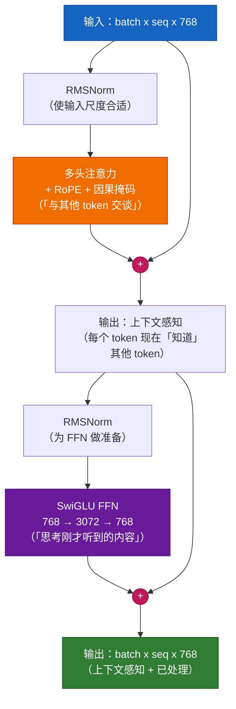

# 第 6 章 — Transformer 块

## 给五岁孩子的类比

Transformer 块就像一块**三明治**：

```
RMSNorm         （准备输入 — 使其「干净」且尺度合适）
  Attention     （肉 — 「和所有其他词交谈并收集上下文」）
  + Residual    （跳跃连接 — 「也保留原始含义」）
RMSNorm         （再次准备）
  SwiGLU FFN    （奶酪 — 「独自思考刚才听到的内容」）
  + Residual    （跳跃连接 — 「保留已有内容，加上新见解」）
```

每个现代 LLM 会堆叠 12–96 层这样的三明治。

## 两个子层，详解

### 子层 1：注意力 — 「和所有人交谈」

```
输入:  "The cat sat on the mat"
                            ^
对于 token "mat"：查看 "The"、"cat"、"sat"、"on"、"the"、"mat"
                 决定："sat" 最相关（动词-主语）
                       "the" 次之（冠词-名词）
                 将它们的含义混合成新的 "mat" 表示
```

### 子层 2：前馈网络 — 「独自思考」

```
注意力之后：每个 token 都有上下文感知的表示
现在 FFN：用相同权重独立处理每个 token
         （像小组讨论后独自复习笔记）

为什么需要？注意力在 token 之间混合信息。
            FFN 在每个 token 内部处理信息。
            两者对深度理解都必不可少。
```

### 为什么注意力不能包办一切？

常见问题：若注意力能看所有 token，为什么还需要 FFN？

**答案：** 注意力是**线性**操作（值的加权和）。FFN 是**非线性**的（有激活函数）。没有 FFN，堆叠更多注意力层只是更多线性组合 — 不比单层注意力更强。FFN 的非线性（SiLU 激活）赋予 Transformer 通用函数逼近能力。

```
Attention:  output = Σ(attention_weights × values)    ← 线性组合
FFN:        output = W3(SiLU(W1 × x) × (W2 × x))     ← 非线性变换
```

## 残差连接 — 「梯度高速公路」

### 它做什么

```
无残差:  output = SubLayer(input)
有残差:  output = input + SubLayer(Norm(input))
```

### 为什么关键：梯度消失问题

在 12 层网络且无残差时，第 1 层的梯度信号为：

```
gradient_at_layer_1 = gradient_at_layer_12 × (weight_12 × weight_11 × ... × weight_2)
```

若每个权重为 0.5（初始训练合理），则：
```
gradient_at_layer_1 = gradient_at_layer_12 × 0.5^11
                    = gradient_at_layer_12 × 0.0005  ← 几乎为零！
```

这意味着早期层几乎得不到学习信号 — 保持随机，模型永远学不好。

**有残差时：**

```
有残差:  output = input + SubLayer(input)
```

梯度现在有两条路径：
1. 经过子层：`∂(SubLayer) / ∂(input)` — 可能很小
2. 经过跳跃：`∂(input) / ∂(input) = 1.0` — 始终恰好为 1.0！

总梯度为 `1.0 + small_number` — 永不消失。

**类比：** 想象从 12 楼到 1 楼。无残差时，必须走 11 段楼梯（每段 = 权重乘法）。有残差时，有一根消防滑杆（跳跃连接）直通到底 — 梯度瞬间流动，与子层做什么无关。

## Pre-Norm vs Post-Norm：关键设计选择

| 方面 | Post-Norm（原始论文） | Pre-Norm（现代） |
|---|---|---|
| 公式 | `Norm(x + SubLayer(x))` | `x + SubLayer(Norm(x))` |
| 训练稳定性 | 早期不稳定，需小心 LR | 从第 1 步就稳定 |
| 梯度流 | 相加后归一化 | 残差路径未归一化 |
| 使用者 | 原始 Transformer (2017) | GPT-3、LLaMA、PaLM、所有现代模型 |
| 深层网络 | > 12 层失败 | 100+ 层可行 |

**Pre-Norm 更好的原因：** 残差路径（`+ x`）保持未归一化，梯度流干净。Post-Norm 归一化输出，在深层网络中可能压缩梯度。

## 现代改进

| 组件 | 旧方式 | 现代方式 | 为何更好 |
|---|---|---|---|
| 归一化 | LayerNorm | **RMSNorm** | 快 15%，同样有效，无需中心化 |
| 激活 | ReLU/GELU | **SwiGLU** | 门控机制学习保留/丢弃哪些信息 |
| 归一化位置 | Post-Norm | **Pre-Norm** | 任意深度稳定训练 |

## RMSNorm — 深入解释

### LayerNorm vs RMSNorm

```
LayerNorm(x) = ((x - mean(x)) / std(x)) * γ + β
               ^^^^^^^^^^^^^^^^^^^^^^^^^^    ^^^^
               中心化并缩放             可学习平移和缩放

RMSNorm(x)  = (x / rms(x)) * γ
               ^^^^^^^^^^^^    ^^
               仅缩放          仅可学习缩放（无平移，不除以 std）
```

RMSNorm 去掉：
1. **减均值**（中心化）— 发现不必要，增加计算
2. **偏置参数 β** — 发现不必要，残差连接已处理
3. **标准差** — 改用 RMS（平方均值的平方根，计算更简单）

结果：数学更简单，约快 15%，实践中性能相同。

### 为什么要归一化？

不归一化时，注意力和 FFN 的输出可能无界增长。12 层之后，值可能是原来的 100 倍或 0.01 倍 — 导致数值不稳定。归一化使每层输出保持一致的尺度。

## RMSNorm 代码

```python
import torch
import torch.nn as nn


class RMSNorm(nn.Module):
    """
    是什么：均方根层归一化（Root Mean Square Layer Normalization）。
    为什么：归一化每个 token 的表示，使其幅度约为 1.0。
         防止值在深层网络中放大/缩小。

         用于：LLaMA 1/2/3、Mistral、Gemma、Qwen
    """

    def __init__(self, d_model: int, eps: float = 1e-6):
        super().__init__()
        # 是什么：每个维度的可学习缩放
        # 为什么：强制 RMS=1 后，模型可以学习放大
        #      重要维度、抑制不重要维度。
        #      初始为 1.0（起初不改变）。
        self.weight = nn.Parameter(torch.ones(d_model))
        self.eps = eps  # 为什么：防止除以零

    def forward(self, x: torch.Tensor) -> torch.Tensor:
        # 是什么：计算 1/sqrt(mean(x²))
        # 为什么：rsqrt 即 1/sqrt — 作为单个 CUDA kernel
        #      计算以提速。均值在最后一维 (d_model) 上。
        #      keepdim=True 保留维度以便广播。
        rms = torch.rsqrt(x.pow(2).mean(-1, keepdim=True) + self.eps)

        # 是什么：归一化后乘以可学习缩放
        return x * rms * self.weight
```

## SwiGLU 代码

```python
import torch
import torch.nn as nn
import torch.nn.functional as F


class SwiGLU(nn.Module):
    """
    是什么：SwiGLU — Swish 激活的门控版本。
    为什么：「门」（乘法右侧）学习选择性
         通过或阻断信息 — 像水龙头。

         标准 FFN:  output = W2(ReLU(W1(x)))
         SwiGLU FFN: output = W3(SiLU(W1(x)) * (W2(x)))
                                   ^^^^^^^^      ^^^^^^
                                   值            门

         门乘以值：若 gate ≈ 0，阻断信息。
                   若 gate ≈ 1，通过信息。
                   若 gate ≈ 0.5，部分通过。

         这种门控机制使 SwiGLU 优于
         ReLU 和 GELU — 模型学习在何处应用非线性。

         论文："GLU Variants Improve Transformer" (Shazeer, 2020)
         用于：LLaMA 1/2/3、PaLM、Gemini
    """

    def __init__(self, d_model: int, expansion_factor: int = 4):
        super().__init__()

        # 是什么：隐藏维是输入/输出的 4 倍 — 「扩展」瓶颈
        # 为什么：扩展→处理→收缩比同尺寸更有表达力。
        #      784 → 3072 → 784 让 FFN 学习约 4 倍更复杂的模式。
        hidden_dim = expansion_factor * d_model

        self.w1 = nn.Linear(d_model, hidden_dim, bias=False)   # 投影到值
        self.w2 = nn.Linear(d_model, hidden_dim, bias=False)   # 投影到门
        self.w3 = nn.Linear(hidden_dim, d_model, bias=False)   # 投影回去

    def forward(self, x: torch.Tensor) -> torch.Tensor:
        # 是什么：SiLU(w1(x)) 是值，w2(x) 是门
        # 为什么：SiLU（也称 Swish）= x * sigmoid(x)
        #      它平滑（不像 ReLU 在 0 处有尖角），
        #      训练时梯度流动更好。
        #      门与值逐元素相乘，选择性传递信息。
        return self.w3(F.silu(self.w1(x)) * self.w2(x))
```

## 完整 Transformer 块代码

```python
import torch
import torch.nn as nn


class TransformerBlock(nn.Module):
    """
    是什么：一个完整的 Transformer 层（注意力 + FFN，带残差）。
    为什么：堆叠 N 个以构建深度语言模型。

         架构（Pre-Norm）：
         ┌─────────────────────────────────────┐
         │ x = x + Attention(RMSNorm(x), mask) │  ← 在 token 之间混合信息
         │ x = x + SwiGLU(RMSNorm(x))          │  ← 在 token 内部处理信息
         └─────────────────────────────────────┘

         每个子层：先归一化（pre-norm），再计算，
         然后加回原始输入（残差连接）。

         无残差：深层网络无法训练（梯度消失）
         无 pre-norm：大深度时训练不稳定
         无 FFN：每个 token 无非线性处理
         无注意力：token 之间无信息混合
    """

    def __init__(self, d_model: int, num_heads: int, dropout: float = 0.1):
        super().__init__()

        # 是什么：第一次归一化 — 注意力之前
        # 为什么：Pre-norm：干净、尺度合适的输入 → 稳定的注意力计算
        self.norm1 = RMSNorm(d_model)

        # 是什么：带 RoPE 和因果掩码的多头自注意力
        # 为什么：让 token 彼此「交谈」的核心机制
        self.attention = MultiHeadAttention(d_model, num_heads, dropout)

        # 是什么：第二次归一化 — FFN 之前
        # 为什么：FFN 期望归一化输入，各层行为一致
        self.norm2 = RMSNorm(d_model)

        # 是什么：SwiGLU 前馈网络
        # 为什么：每个 token 的非线性处理。没有它，堆叠更多
        #      注意力层不会比单层更强。
        self.ffn = SwiGLU(d_model)

    def forward(self, x: torch.Tensor, mask: torch.Tensor = None) -> torch.Tensor:
        """
        前向传播：norm → 子层 → 加残差。
        执行两次：一次注意力，一次 FFN。
        """

        # ===== 子层 1：带残差的自注意力 =====
        # 是什么：x = x + Attention(Norm(x))
        # 为什么：模型学习对 x 做多少改变（增量），
        #      而非完全替换 x。这更容易学习。
        #      若注意力无法改进，可以输出接近零。
        x = x + self.attention(self.norm1(x), mask)

        # ===== 子层 2：带残差的前馈 =====
        # 是什么：x = x + FFN(Norm(x))
        # 为什么：同样的残差模式。通过注意力混合信息后，
        #      每个 token 通过 FFN「独自思考」。
        #      注意力 = 小组讨论。FFN = 私下反思。
        x = x + self.ffn(self.norm2(x))

        return x
```

## 架构图



---

**上一章：** [第 5 章 — 注意力](05_attention.md)
**下一章：** [第 7 章 — 完整 GPT](07_gpt_model.md)
