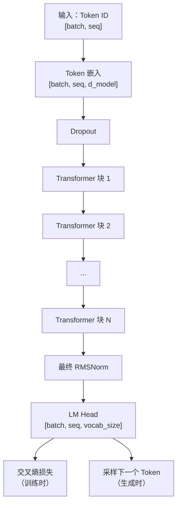

# 第 7 章 — 完整 GPT 模型

## 我们在构建什么

经过 6 章组件，现在将它们组装成**完整的语言模型**。这与 LLaMA 3、Mistral、Qwen 2.5 本质上是同一架构 — 缩小以适配你的 GPU。



## 配置 — 模型的「配方」

```python
from dataclasses import dataclass


@dataclass
class GPTConfig:
    """
    是什么：所有超参数集中在一处。
    为什么：改模型规模只需一行。不用在代码里到处找。
    """
    # ===== 架构 =====
    vocab_size: int = 50257        # 是什么：GPT-2 词表 50,257 个唯一 token
    d_model: int = 768             # 是什么：每个 token 变成 768 维向量
                                   # 为什么：更大 = 更细粒度语义，更多计算
    num_heads: int = 12            # 是什么：12 个注意力头（12 × 64 = 768）
    num_layers: int = 12           # 是什么：堆叠 12 个 transformer 块
                                   # 为什么：更深 = 更好推理，更难训练
    max_seq_len: int = 1024        # 是什么：模型一次最多处理的 token 数

    # ===== 正则化（防止过拟合）=====
    dropout: float = 0.1           # 是什么：训练时随机禁用 10% 神经元
    embd_dropout: float = 0.1      # 是什么：嵌入查表后立即应用的 dropout

    # ===== 训练 =====
    learning_rate: float = 3e-4    # 是什么：权重更新的步长
    weight_decay: float = 0.1      # 是什么：惩罚大权重（L2 正则化）
    warmup_steps: int = 2000       # 是什么：前 2000 步逐渐增大 LR
    max_steps: int = 100000        # 是什么：总训练迭代次数
    batch_size: int = 8            # 是什么：每个 GPU 步处理的序列数
    grad_accum_steps: int = 4      # 是什么：梯度累积步数（有效 batch = 8×4 = 32）
    betas: tuple = (0.9, 0.95)    # 是什么：AdamW 动量系数
    eps: float = 1e-8              # 是什么：防止除以零的小常数

    def __post_init__(self):
        """验证配置一致性。"""
        assert self.d_model % self.num_heads == 0, (
            f"d_model ({self.d_model}) 必须能被 "
            f"num_heads ({self.num_heads}) 整除"
        )
```

## 完整 GPT 模型

```python
import torch
import torch.nn as nn
import torch.nn.functional as F


class GPT(nn.Module):
    """
    是什么：完整的仅解码器 Transformer 语言模型。
    为什么：这个类把我们构建的一切合在一起：
         嵌入 → N× transformer 块 → 输出投影。

         「仅解码器」意味着从左到右生成文本
         （因果/自回归），没有会看完整序列的 encoder。

         与以下同属一个架构家族：
         GPT-2（12 层，768 维）、GPT-3（96 层，12288 维）、
         LLaMA 3（32–80 层）、Mistral（32 层）
    """

    def __init__(self, config: GPTConfig):
        super().__init__()
        self.config = config

        # ===== 1. TOKEN 嵌入 =====
        # 是什么：查表：token ID → 稠密向量
        # 为什么：将整数（ID）转为神经网络可处理的
        #      连续向量。
        #      形状：[50257, 768] — 词表每个 token 一行
        self.token_embedding = nn.Embedding(config.vocab_size, config.d_model)

        # 是什么：作用于嵌入的 dropout
        # 为什么：早期 dropout 防止模型在训练时
        #      过拟合到特定嵌入值
        self.embd_dropout = nn.Dropout(config.embd_dropout)

        # ===== 2. TRANSFORMER 块 =====
        # 是什么：N 个相同 transformer 层的堆叠
        # 为什么：nn.ModuleList 注册每个块，PyTorch 才会
        #      跟踪其参数用于训练。普通 Python list
        #      不会被跟踪！
        #
        #      每块：RMSNorm → Attention(+残差) → RMSNorm → FFN(+残差)
        self.layers = nn.ModuleList([
            TransformerBlock(
                d_model=config.d_model,
                num_heads=config.num_heads,
                dropout=config.dropout
            )
            for _ in range(config.num_layers)
        ])

        # ===== 3. 最终归一化 =====
        # 是什么：输出头之前的最后一次 RMSNorm
        # 为什么：最后一个 transformer 块的输出是原始的（未归一化）。
        #      投影到词表前先归一化，LM head 得到
        #      干净、尺度合适的输入。
        self.final_norm = RMSNorm(config.d_model)

        # ===== 4. LM HEAD（输出投影）=====
        # 是什么：线性投影：d_model → vocab_size
        # 为什么：将每个 token 的 768 维「理解」
        #      转为 50257 维分数向量 — 每个可能的下一个 token 一个分数。
        #
        #      logits[b, t, v] = 「batch b 中位置 t 之后
        #                         token v 的分数」
        self.lm_head = nn.Linear(config.d_model, config.vocab_size, bias=False)

        # ===== 5. 权重绑定 =====
        # 是什么：嵌入与 LM head 共享权重矩阵
        # 为什么：嵌入映射 token → 向量。LM head 映射
        #      向量 → token。这是互逆操作！
        #
        #      共享权重有三点好处：
        #      1. 参数效率：节省 50257×768 = 3860 万参数
        #         （GPT-2 small 总量的约 30%！）
        #      2. 更好正则化：共享矩阵从两个方向
        #         得到梯度信号，改善 token 表示质量
        #      3. 理论优雅：输入与输出 token
        #         在同一语义空间
        #
        #      做法：让 self.lm_head.weight 指向
        #      与 self.token_embedding.weight 相同的张量，
        #      PyTorch 对两者使用同一块内存。
        self.token_embedding.weight = self.lm_head.weight

        # ===== 6. 权重初始化 =====
        # 是什么：用 Normal(0, 0.02) 初始化所有权重
        # 为什么：从正确分布起步至关重要。
        #      太小 → 梯度消失，永远学不动。
        #      太大 → 激活饱和，梯度爆炸。
        #      0.02 标准差使值大多在 [-0.04, 0.04]，
        #      这是 Transformer 的甜点。
        self.apply(self._init_weights)
        print(f"GPT 已初始化，参数量 {self.get_num_params():,}")

    def _init_weights(self, module: nn.Module):
        """按 GPT-2 方案初始化权重。"""
        if isinstance(module, nn.Linear):
            torch.nn.init.normal_(module.weight, mean=0.0, std=0.02)
            if module.bias is not None:
                torch.nn.init.zeros_(module.bias)
        elif isinstance(module, nn.Embedding):
            torch.nn.init.normal_(module.weight, mean=0.0, std=0.02)

    def get_num_params(self) -> int:
        """统计可训练参数总数（权重 + 偏置）。"""
        return sum(p.numel() for p in self.parameters())

    def forward(
        self,
        input_ids: torch.Tensor,
        targets: torch.Tensor = None
    ) -> tuple:
        """
        是什么：将一批 token 序列通过 GPT 模型。

        参数：
            input_ids: [batch_size, seq_len] — 每条序列的 token ID
            targets:   [batch_size, seq_len] — 相同 token，用于计算 loss
                       （模型从 input_ids[t] 预测 input_ids[t+1]）

        返回：
            logits: [batch, seq_len, vocab_size] — 原始预测分数
            loss:   标量 — 交叉熵（未提供 targets 时为 None）

        错位一位技巧：
            输入:  [The,  cat,  sat,  on,   the,  mat]
                     ↓     ↓     ↓     ↓     ↓     ↓
            目标:  [cat,  sat,  on,   the,  mat,  ?]
            预测:  P(cat|The) P(sat|The,cat) ... P(mat|The,cat,sat,on,the)

            我们切片 logits[:, :-1]（去掉最后一个）和 targets[:, 1:]（去掉第一个）
            使预测与「下一个词」对齐。
        """
        batch_size, seq_len = input_ids.shape

        # ===== 1. 嵌入 TOKEN =====
        # 输入:  [batch, seq] token ID
        # 输出: [batch, seq, d_model] 连续向量
        x = self.token_embedding(input_ids)
        x = self.embd_dropout(x)

        # ===== 2. 创建因果掩码 =====
        # 是什么：下三角掩码：token i 只能看到 token 0..i
        # 为什么：没有它，模型预测下一个词时会「作弊」
        #      偷看未来 token。
        mask = create_causal_mask(seq_len, input_ids.device)

        # ===== 3. TRANSFORMER 层 =====
        # 是什么：依次通过所有 N 个 transformer 块
        # 为什么：每层细化表示。早期层
        #      捕获句法。后期层捕获语义。
        for layer in self.layers:
            x = layer(x, mask)

        # ===== 4. 最终归一化 =====
        x = self.final_norm(x)

        # ===== 5. 投影到词表 =====
        # 是什么：从 d_model 维「理解」转为 vocab_size 维分数
        # 为什么：每个位置得到每个可能的下一个 token 的分数。
        #
        # 例：logits[0, 3, 2603] = 9.2 表示：
        #   「batch 0、位置 3、token 2603（'mat'）的分数为 9.2」
        #   分数越高 = 模型认为该 token 越可能。
        logits = self.lm_head(x)  # [batch, seq_len, vocab_size]

        # ===== 6. 计算 LOSS（仅训练）=====
        loss = None
        if targets is not None:
            # 是什么：用错位一位对齐预测与目标
            #
            # logits[:, :-1, :]:  位置 0..seq-2 的预测
            # targets[:, 1:]:      位置 1..seq-1 的真实 token
            #
            #          位置:  0      1      2      3
            #          输入:     The    cat    sat    on
            #          目标:    cat    sat    on     the
            #          Logits:   P(cat) P(sat) P(on)  P(the)
            #                                        ^
            #                                   我们去掉这个
            #                                   （没有对应目标）
            logits_flat = logits[:, :-1, :].contiguous().view(
                -1, self.config.vocab_size
            )  # [batch*(seq-1), vocab_size]
            targets_flat = targets[:, 1:].contiguous().view(
                -1
            )  # [batch*(seq-1)]

            # 是什么：交叉熵损失
            # 为什么：对每个预测，-log(P(正确_token))。
            #      在 batch 内所有预测上取平均。
            #      loss 越低 = 对正确答案越自信。
            loss = F.cross_entropy(logits_flat, targets_flat)

        return logits, loss

    @torch.no_grad()
    def generate(
        self,
        input_ids: torch.Tensor,
        max_new_tokens: int,
        temperature: float = 1.0,
        top_k: int = None,
        top_p: float = None,
    ) -> torch.Tensor:
        """
        是什么：逐 token 生成新文本（自回归）。
        为什么：推理时，我们生成一个 token，追加它，
             再生成下一个。每个 token 依赖之前
             已生成的所有 token。

        @torch.no_grad()：为什么这个装饰器关键：
            训练时 PyTorch 构建计算图
            跟踪每个操作 — 这支持反向传播
            但消耗内存。
            推理时不需要梯度。@torch.no_grad()
            关闭计算图，节省约 50% GPU 内存
            并使生成约快 2 倍。

        采样参数：
            temperature: 控制随机性。
                         < 1.0 = 聚焦/更确定
                         = 1.0 = 自然分布
                         > 1.0 = 更有创意/更随机

            top_k: 只从最可能的 K 个 token 中采样。
                   例如 top_k=50 表示「只考虑前 50 个 token」

            top_p: 核采样（Nucleus sampling）。保留累积概率 ≥ top_p 的
                   最小 token 集合。
                   例如 top_p=0.9 表示「保留 token 直到
                   覆盖 90% 概率质量」
        """
        # 是什么：切换到评估模式
        # 为什么：关闭 dropout。训练时 dropout 随机
        #      关闭神经元做正则化。生成时
        #      我们希望所有神经元活跃以得到一致输出。
        self.eval()

        for _ in range(max_new_tokens):
            # ===== 过长则裁剪 =====
            # 是什么：若序列超过 max_seq_len，只保留
            #       最近的 token
            # 为什么：模型有固定的最大上下文窗口。
            if input_ids.shape[1] > self.config.max_seq_len:
                input_ids = input_ids[:, -self.config.max_seq_len:]

            # ===== 前向传播 =====
            # 是什么：得到下一个 token 的预测
            # 为什么：logits[:, -1, :] 只取最后一个位置。
            #      我们只关心「接下来是什么」，不关心
            #      已生成位置的历史预测。
            logits, _ = self.forward(input_ids)
            logits = logits[:, -1, :]  # [batch, vocab_size]

            # ===== 应用 TEMPERATURE =====
            logits = logits / temperature

            # ===== TOP-K 过滤 =====
            # 是什么：只保留 K 个最可能的 token，其余掩码
            if top_k is not None:
                v, _ = torch.topk(logits, min(top_k, logits.size(-1)))
                logits[logits < v[:, -1:]] = float('-inf')

            # ===== TOP-P（核）过滤 =====
            # 是什么：保留累积概率 > top_p 的最小 token 集合
            if top_p is not None:
                sorted_logits, sorted_indices = torch.sort(
                    logits, descending=True
                )
                cumulative_probs = torch.cumsum(
                    F.softmax(sorted_logits, dim=-1), dim=-1
                )
                # 累积概率超过 top_p 后移除 token
                sorted_indices_to_remove = cumulative_probs > top_p
                # 右移：始终保留第一个 token
                sorted_indices_to_remove[:, 1:] = (
                    sorted_indices_to_remove[:, :-1].clone()
                )
                sorted_indices_to_remove[:, 0] = False
                # scatter 回原始顺序
                indices_to_remove = sorted_indices_to_remove.scatter(
                    1, sorted_indices, sorted_indices_to_remove
                )
                logits[indices_to_remove] = float('-inf')

            # ===== 采样下一个 TOKEN =====
            # 是什么：logits → 概率 → 选一个 token
            probs = F.softmax(logits, dim=-1)
            next_token = torch.multinomial(probs, num_samples=1)

            # ===== 追加到序列 =====
            input_ids = torch.cat([input_ids, next_token], dim=1)

        return input_ids
```

## nn.Parameter vs register_buffer vs 普通属性

这是常见困惑。权威指南如下：

| 类型 | 创建方式 | 优化器跟踪？ | 保存在 state_dict？ | .to(device) 移动？ |
|---|---|---|---|---|
| `nn.Parameter` | `nn.Parameter(tensor)` | 是 | 是 | 是 |
| `register_buffer` | `self.register_buffer("name", t)` | 否 | 是 | 是 |
| 普通属性 | `self.x = tensor` | 否 | 否 | 否 |

我们的模型使用：
- **nn.Parameter**：所有权重（nn.Linear、nn.Embedding 自动创建）
- **register_buffer**：RoPE 的 cos/sin 缓存（不学习，但需移到 GPU）
- **普通**：config 对象（不是张量，不需要 GPU）

## Logits 实际长什么样

```python
# 前向传播后，logits 形状 [batch=1, seq=6, vocab=50257]：
logits[0, 5, :]  # 位置 5 的预测（预测 token 6）
# = 50257 个数字的数组，例如：
# [0.1, -0.3, 0.7, ..., 9.2, ..., -2.1]
#  ^^^^  ^^^^  ^^^^       ^^^^       ^^^^
#  "the" "a"   "an"       "mat"      "xyzzy"

# softmax 后：概率和为 1.0
probs = softmax(logits[0, 5, :])
# [0.0001, 0.0001, 0.0003, ..., 0.45, ..., 0.0000]
#                              ^^^^
#                          "mat" 有 45% 概率

# 位置 5 的模型 top 预测：
top5_indices = torch.topk(logits[0, 5, :], 5).indices
# → [2603, 4521, 1234, 8901, 345]  (token ID)
# → ["mat", "rug", "floor", "table", "chair"]
```

---

**上一章：** [第 6 章 — Transformer 块](06_transformer_block.md)
**下一章：** [第 8 章 — 训练流程](08_training.md)
