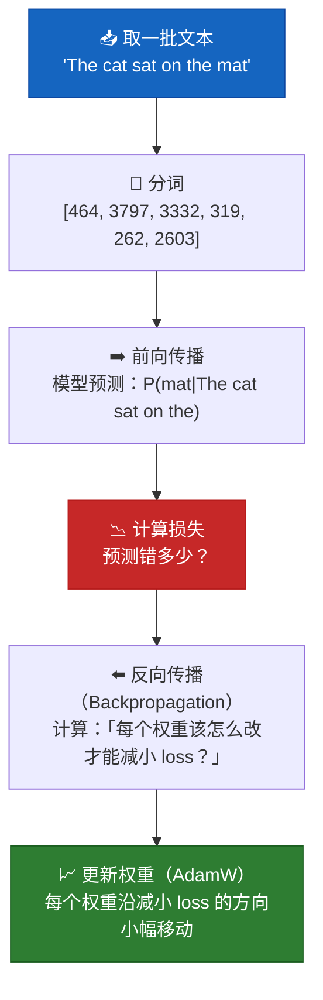

# 第 8 章 — 训练流程

## 「训练」到底是什么？

训练语言模型就像教小孩阅读：

1. 给他看一句话：「The cat sat on the ___」
2. 让他猜缺的那个词
3. 猜对了 → 很好，不用改
4. 猜错了 → 纠正，他稍微调整理解
5. 用数百万句话重复数百万次

数学上，这就是**梯度下降**：模型做预测，衡量错多少（loss），然后微调 1.24 亿个参数，下次少错一点。

## 训练循环 — 可视化



## 交叉熵损失 — 数学

### Loss 实际衡量什么

给定模型对下一个词的预测：

```
真实下一个词: "mat" (token ID 2603)

模型预测概率:
  "mat":   0.45  ← 模型认为 "mat" 有 45% 概率
  "rug":   0.30  ← "rug" 30%
  "floor": 0.15  ← 15%
  "table": 0.07  ← 7%
  "dog":   0.03  ← 随机词 3%
```

该预测的**交叉熵损失**：
```
loss = -log(P("mat")) = -log(0.45) = 0.799
```

若模型更自信：
```
P("mat") = 0.95  →  loss = -log(0.95) = 0.051  ← 好得多！
```

若模型错且自信：
```
P("mat") = 0.01  →  loss = -log(0.01) = 4.605  ← 很差！
```

### 完整交叉熵公式

单次预测，真实类 `y`、预测概率 `p`：
```
Loss = -log(p_y)
```

一批 `N` 个预测：
```
Loss = -(1/N) Σ log(p_y_true)
```

这正是 `F.cross_entropy(logits, targets)` 所计算的。它：
1. 对 logits 做 softmax 转为概率
2. 取正确类概率的负对数
3. 在 batch 内所有 token 上取平均

### 为什么用 -log？为什么不用错误率？

| 方法 | 公式 | 梯度信号 |
|---|---|---|
| 错误率 | 错为 1，对为 0 | 梯度为零 — 无法优化 |
| -log(p) | -log(0.45) = 0.80 | 平滑梯度 — 易于优化 |
| -(1-p) | -(1-0.45) = -0.55 | 对「错且自信」的信号较弱 |

`-log(p)` 有特殊性质：错得越狠，梯度越强。若 `p=0.01`，梯度是 `p=0.99` 时的 100 倍。模型从最大错误学得最快。

## 反向传播 — 通俗解释

「模型是一个带 1.24 亿个旋钮的大函数。我们要找每个旋钮该往哪个方向拧，才能让 loss 变小。」

### 链式法则类比

想象你在烘焙，蛋糕太甜。你要减糖。但你不知道减 1 克糖对甜度影响多少，也不知道减 1 单位甜度对「蛋糕质量分」影响多少。

```
∂(quality)     ∂(quality)     ∂(sweetness)
──────────  =  ──────────  ×  ───────────
  ∂(sugar)      ∂(sweetness)    ∂(sugar)
  
  「糖对质量        「甜度对质量      「糖对甜度
   影响多少？」      影响多少？」      影响多少？」
```

反向传播在整个模型上**从 loss 往回**应用链式法则 — 经过每一层，回到嵌入 — 计算每个参数对误差的贡献。

### 不用微积分：直观理解

```python
# 想象这在训练循环里：
loss = F.cross_entropy(predictions, targets)  # 「我们错多少？」
loss.backward()                                 # 「弄清为什么错」

# backward() 之后，每个参数都有 .grad 属性：
print(model.token_embedding.weight.grad[9246, 42])
# → 0.000342  「若把 embedding cat[42] 增加 0.001，
#              loss 会减少 0.000342」
```

## 带 AdamW 的梯度下降

### 简单梯度下降

```
weight = weight - learning_rate × gradient
```

就像：「若梯度说『往左』，就小幅往左走。」

### AdamW — 三项改进

1. **动量 (β₁ = 0.9)：** 记住**方向**。像球滚下山 — 越滚越快。平滑噪声梯度。

2. **自适应学习率 (β₂ = 0.95)：** 每个参数按自身变动幅度得到独立学习率。很少变的参数步子大；来回跳的参数步子小。

3. **解耦权重衰减：** 直接把权重往零缩（防止过大）。与 vanilla Adam 不同，与梯度缩放分离。

```
AdamW 更新步：
  momentum       = β₁ × old_momentum + (1-β₁) × gradient
  velocity       = β₂ × old_velocity + (1-β₂) × gradient²
  corrected_m    = momentum / (1 - β₁^t)     (偏差校正)
  corrected_v    = velocity / (1 - β₂^t)     (偏差校正)
  weight         = weight (1 - lr × weight_decay)  (解耦！)
  weight         = weight - lr × corrected_m / (√corrected_v + ε)
```

## 混合精度训练

### Float32 vs BFloat16 vs Float16

| 格式 | 位数 | 指数 | 尾数 | 范围 | 精度 |
|---|---|---|---|---|---|
| Float32 | 32 | 8 | 23 | ±3.4 × 10³⁸ | 7 位有效数字 |
| Float16 | 16 | 5 | 10 | ±65,504 | 3 位有效数字 |
| **BFloat16** | 16 | 8 | 7 | ±3.4 × 10³⁸ | 2 位有效数字 |

**为什么用 BFloat16：** 与 float32 相同范围（不易溢出！），但内存减半、矩阵乘约快 2 倍。精度低于 float16，但神经网络对舍入不敏感 — 对 rounding 鲁棒。

**我们的做法：** 前向用 bfloat16（快），主权重保持 float32（更新准确）。

```python
# autocast 上下文：在安全处自动用 bfloat16
with torch.cuda.amp.autocast(enabled=use_amp):
    _, loss = model(input_ids, targets=target_ids)

# scaler 处理 float16 的 loss 缩放，现代 GPU 上 bfloat16 不需要，
# 但为兼容性保留
scaler.scale(loss).backward()
scaler.step(optimizer)
```

## 梯度累积

**问题：** 你想要有效 batch size 32，但 GPU 只能装 batch size 4。

**解决：** 跑 4 次 batch=4 的前向，累积梯度（求和），再做**一次**优化步。数学上等价于 batch=32。

```python
# 而不是：
for batch_32 in data:  # GPU 内存装不下！
    loss = model(batch_32)
    loss.backward()
    optimizer.step()

# 我们这样做：
for i in range(4):
    loss = model(batch_4)           # batch_4 能装进内存
    (loss / 4).backward()           # 缩放：每批贡献 1/4
                                    # 梯度在 .grad 属性中累积
optimizer.step()                    # 4 个小 batch 一次更新
optimizer.zero_grad()              # 下一累积周期清零
```

## 过拟合 — 模型「死记硬背」

**表现：** 训练 loss 持续下降，但生成文本变差 — 重复、胡言乱语、或逐字复制训练数据。

**原因：** 模型记住训练数据，而非学习通用语言模式。

**如何预防：**
| 技巧 | 如何帮助 |
|---|---|
| **Dropout (0.1)** | 训练时随机禁用 10% 神经元 — 迫使冗余 |
| **Weight decay (0.1)** | 保持权重小 — 大权重 → 死记硬背 |
| **大而多样的数据集** | 数据越多 → 越难全记住 |
| **早停** | 验证 loss 不再改善时停止训练 |
| **梯度裁剪** | 防止少数样本主导权重更新 |

## 完整训练代码

### 数据集

```python
import torch
from torch.utils.data import Dataset


class TextDataset(Dataset):
    """
    是什么：通过切分训练块准备文本数据。
    为什么：模型学习预测下一个 token。每个块
         提供下一 token 预测的 input-target 对。

         每个样本：所有位置 t 的 input[t] 与 target[t+1]。
         这叫「teacher forcing」— 训练时每个位置都展示
         正确答案。
    """

    def __init__(self, texts: list[str], tokenizer, max_seq_len: int = 1024):
        self.tokenizer = tokenizer
        self.max_seq_len = max_seq_len

        # ===== 用 EOS 分隔符拼接所有文本 =====
        # 为什么：EOS 防止模型学习无关文档之间的
        #      虚假连接。
        all_tokens = []
        for text in texts:
            tokens = tokenizer.encode(text)
            all_tokens.extend(tokens)
            all_tokens.append(tokenizer.eos_token_id)  # 文档边界标记

        self.tokens = torch.tensor(all_tokens, dtype=torch.long)
        print(f"数据集中 token 总数: {len(self.tokens):,}")

    def __len__(self) -> int:
        """块数量。每块使用 max_seq_len+1 个 token。"""
        return (len(self.tokens) - 1) // self.max_seq_len

    def __getitem__(self, idx: int) -> tuple:
        """
        返回一块的 (input_ids, target_ids)。
        目标错位 1 位：

        tokens:    [The,  cat,  sat,  on,   the,  mat,  EOS,  The,  dog,  ...]
        idx=0:     [The,  cat,  sat,  on,   the]     ← input_ids
                   [cat,  sat,  on,   the,  mat]     ← target_ids（错位）
        """
        start = idx * self.max_seq_len
        end = start + self.max_seq_len
        input_ids = self.tokens[start:end]
        target_ids = self.tokens[start + 1 : end + 1]
        return input_ids, target_ids
```

### 数据加载

```python
from datasets import load_dataset


def load_training_data(max_samples: int = None):
    """下载 WikiText-103 — 干净的 Wikipedia 文本。"""
    print("正在加载数据集: wikitext-103-raw-v1...")
    dataset = load_dataset("wikitext", "wikitext-103-raw-v1", split="train")
    texts = [item["text"] for item in dataset if item["text"].strip()]
    if max_samples:
        texts = texts[:max_samples]
    print(f"已加载 {len(texts):,} 篇文档")
    return texts
```

### 学习率调度器

```python
import math


class CosineWarmupScheduler:
    """
    是什么：三阶段学习率调度。
    为什么：Warmup 防止早期不稳定。余弦衰减提供
         平滑收敛。最小下限防止学习率为零。

    阶段 1 (Warmup)：    LR: 0 → max_lr  （warmup_steps 内线性上升）
    阶段 2 (Decay)：     LR: max_lr → min_lr（余弦曲线）
    阶段 3 (Minimum)：   LR: min_lr（恒定）
    """
    def __init__(self, optimizer, warmup_steps, max_steps, max_lr=3e-4, min_lr=1e-5):
        self.optimizer = optimizer
        self.warmup_steps = warmup_steps
        self.max_steps = max_steps
        self.max_lr = max_lr
        self.min_lr = min_lr
        self.current_step = 0

    def get_lr(self) -> float:
        step = self.current_step
        if step < self.warmup_steps:
            return self.max_lr * step / self.warmup_steps
        if step < self.max_steps:
            progress = (step - self.warmup_steps) / (self.max_steps - self.warmup_steps)
            cosine_decay = 0.5 * (1.0 + math.cos(math.pi * progress))
            return self.min_lr + (self.max_lr - self.min_lr) * cosine_decay
        return self.min_lr

    def step(self):
        lr = self.get_lr()
        for param_group in self.optimizer.param_groups:
            param_group["lr"] = lr
        self.current_step += 1

    def state_dict(self):
        return {"current_step": self.current_step}

    def load_state_dict(self, state_dict):
        self.current_step = state_dict["current_step"]
```

### 优化器

```python
def create_optimizer(model, config):
    """
    是什么：AdamW，两组参数（有/无 weight decay）。
    为什么：Norm 层和 bias 不应做 weight decay —
         会把它们推向零，破坏归一化。

    组 1 (weight_decay > 0)：Linear 权重、嵌入
    组 2 (weight_decay = 0)：Bias、RMSNorm、LayerNorm
    """
    decay_params = []
    no_decay_params = []

    for name, param in model.named_parameters():
        if not param.requires_grad:
            continue
        if param.dim() <= 1 or "norm" in name.lower() or "bias" in name:
            no_decay_params.append(param)
        else:
            decay_params.append(param)

    return torch.optim.AdamW(
        [
            {"params": decay_params, "weight_decay": config.weight_decay},
            {"params": no_decay_params, "weight_decay": 0.0},
        ],
        lr=config.learning_rate,
        betas=config.betas,
        eps=config.eps,
    )
```

### 训练循环

```python
import torch
import time
import os


def train(model, train_dataset, config, device, save_dir="checkpoints"):
    """
    是什么：主训练循环。
    为什么：迭代：前向 → 反向 → 更新，定期日志与保存。
    """
    os.makedirs(save_dir, exist_ok=True)
    model = model.to(device)
    model.train()

    dataloader = torch.utils.data.DataLoader(
        train_dataset, batch_size=config.batch_size,
        shuffle=True, drop_last=True, num_workers=4, pin_memory=True,
    )

    optimizer = create_optimizer(model, config)
    scheduler = CosineWarmupScheduler(
        optimizer, warmup_steps=config.warmup_steps,
        max_steps=config.max_steps, max_lr=config.learning_rate,
    )

    use_amp = device.type == "cuda"
    scaler = torch.cuda.amp.GradScaler(enabled=use_amp) if use_amp else None

    step = 0
    total_loss = 0.0
    loss_history = []
    best_loss = float("inf")
    start_time = time.time()

    print(f"\n{'='*60}")
    print(f"开始训练！参数量: {model.get_num_params():,} | 设备: {device}")
    print(f"有效 batch: {config.batch_size * config.grad_accum_steps}")
    print(f"{'='*60}\n")

    while step < config.max_steps:
        for batch_idx, (input_ids, target_ids) in enumerate(dataloader):
            if step >= config.max_steps:
                break

            input_ids = input_ids.to(device, non_blocking=True)
            target_ids = target_ids.to(device, non_blocking=True)

            # ===== 前向：预测下一 token，衡量误差 =====
            with torch.cuda.amp.autocast(enabled=use_amp):
                _, loss = model(input_ids, targets=target_ids)
            loss = loss / config.grad_accum_steps

            # ===== 反向：计算如何改进 =====
            if use_amp and scaler is not None:
                scaler.scale(loss).backward()
            else:
                loss.backward()

            total_loss += loss.item() * config.grad_accum_steps

            # ===== 更新：每 grad_accum_steps 步优化一次 =====
            if (batch_idx + 1) % config.grad_accum_steps == 0:
                if use_amp and scaler is not None:
                    scaler.unscale_(optimizer)
                torch.nn.utils.clip_grad_norm_(model.parameters(), max_norm=1.0)

                if use_amp and scaler is not None:
                    scaler.step(optimizer); scaler.update()
                else:
                    optimizer.step()

                optimizer.zero_grad()
                scheduler.step()
                step += 1

                # 每 100 步日志
                if step % 100 == 0 or step == 1:
                    avg_loss = total_loss / (100 if step > 0 else 1)
                    elapsed = time.time() - start_time
                    tps = (step * config.batch_size * config.grad_accum_steps
                           * config.max_seq_len) / elapsed
                    print(f"Step {step:>6,}/{config.max_steps:,} | "
                          f"Loss: {avg_loss:.4f} | LR: {scheduler.get_lr():.2e} | "
                          f"Token/秒: {tps:,.0f}")
                    loss_history.append((step, avg_loss))
                    total_loss = 0.0

                # 每 5000 步保存 checkpoint
                if step % 5000 == 0:
                    checkpoint = {
                        "step": step, "model_state_dict": model.state_dict(),
                        "optimizer_state_dict": optimizer.state_dict(),
                        "scheduler_state_dict": scheduler.state_dict(),
                        "loss": avg_loss, "config": config,
                    }
                    torch.save(checkpoint, f"{save_dir}/checkpoint_step_{step}.pt")
                    print(f"   已在第 {step} 步保存 checkpoint")
                    if avg_loss < best_loss:
                        best_loss = avg_loss
                        torch.save(checkpoint, f"{save_dir}/best_model.pt")

    total_time = time.time() - start_time
    print(f"\n{'='*60}")
    print(f"完成！耗时 {total_time/60:.1f} 分钟 | 最佳 loss: {best_loss:.4f}")
    print(f"{'='*60}\n")
    return loss_history


def plot_loss(loss_history, save_path="loss_curve.png"):
    """
    是什么：可视化训练进度。
    为什么：Loss 曲线可诊断问题：
         ↘ 稳定下降：训练正常
         → 平线：停滞（提高 LR、检查数据）
         ↗ 上升：过拟合（更多 dropout、weight decay）
         ⚡ 尖峰：不稳定（降低 LR、延长 warmup）
    """
    import matplotlib.pyplot as plt
    steps, losses = zip(*loss_history)
    plt.figure(figsize=(10, 5))
    plt.plot(steps, losses)
    plt.xlabel("训练步数"); plt.ylabel("损失")
    plt.title("GPT 训练损失")
    plt.grid(True, alpha=0.3)
    plt.tight_layout(); plt.savefig(save_path, dpi=150); plt.close()
    print(f"损失曲线已保存至 {save_path}")
```

---

**上一章：** [第 7 章 — GPT 模型](07_gpt_model.md)
**下一章：** [第 9 章 — 推理](09_inference.md)
