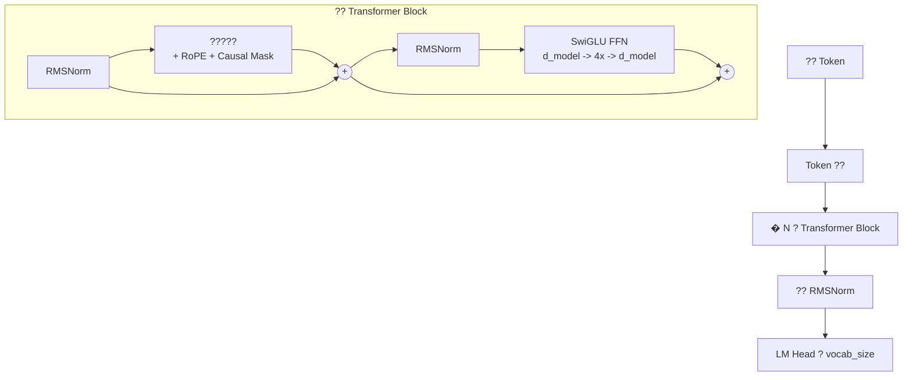

# ? 11 ? ? ???????

## ?????



## ????

| ?? | ??? | ???? | ???? |
|---|---|---|---|
| **Position Encoding** | Learned?GPT-2?? Sinusoidal | **RoPE**?LLaMA, Mistral? | ????????? |
| **Normalization** | LayerNorm | **RMSNorm**?LLaMA? | ?? 15%????? |
| **Activation** | ReLU ? GELU | **SwiGLU**?PaLM, LLaMA? | ??????? |
| **Norm Position** | Post-Norm?????? | **Pre-Norm**?GPT-3, LLaMA? | ?????? |
| **Optimizer** | SGD ? Adam | **AdamW**??? decay? | ???? |
| **LR Schedule** | ??? step | **Cosine with warmup** | ????? |
| **Precision** | Float32 | **bfloat16 mixed** | ? 2�????? |
| **Gradient Clipping** | ?????? | **Max norm 1.0** | ?????? |
| **Weight Init** | Xavier uniform | **Normal(0, 0.02)** | GPT ???? |
| **Weight Tying** | Embedding ????? | **????** | ????????? |
| **Training Objective** | Masked LM?BERT? | **Next-token prediction** | ?????? |

## ?????

??? 151M ???LLaMA ?? + SwiGLU??

```
Token ??:  vocab_size x d_model = 50,257 x 768 = 38,597,376

?? Transformer Block?? 12 ??:
  Attention QKV:   3 x 768 x 768 = 1,769,472
  Attention Out:   768 x 768     =   589,824
  SwiGLU w1:       768 x 3072    = 2,359,296
  SwiGLU w2:       768 x 3072    = 2,359,296
  SwiGLU w3:       3072 x 768    = 2,359,296
  RMSNorm x2:      768 + 768     =     1,536
  ? block ??:                  = 9,438,720

12 ? block:  12 x 9,438,720     = 113,264,640

?? RMSNorm:                 =       768
LM Head: ? embedding ??      =         0 (weight tying!)

??: 38,597,376 + 113,264,640 + 768 = 151,862,784 ??

????? GPT-2?? SwiGLU??? GELU FFN?
?? ~124M ???SwiGLU ? 2 ? FFN ??????? 3 ? gated ???
???? 28M ???
```

## ????????

?????????????????????????? **LLaMA ?? decoder-only Transformer**?

- ?? **BPE tokenizer**?? GPT-2/3/4 ?????
- ???????? **Transformer**?
  - ????? + **RoPE** ?????LLaMA, Mistral, Qwen?
  - **RMSNorm** ????LLaMA, Mistral, Gemma?
  - **SwiGLU** ???PaLM, LLaMA, Gemini?
  - **Pre-Norm** ?????GPT-3????????
  - Embedding ?????? **Weight tying**?GPT-2/3?
  - ???????? **Causal masking**??? GPT ?????
- ?? **???????**?
  - AdamW + ?? weight decay
  - ? warmup ? Cosine LR schedule
  - ?????Gradient accumulation?
  - ?????bfloat16?
  - ?????Gradient clipping?
  - ??????Checkpointing?
- ?? **????**????
  - Temperature scaling
  - Top-K ? Top-P ??

## ???

| ?? | ??? | ?????? |
|---|---|---|
| ???? | ?????d_model | ???????? |
| ???? | ?? WikiText + BookCorpus | ??????? |
| Flash Attention | ??? flash_attn | ? 2-5�?????? |
| Grouped Query Attention | ?? KV heads | ???? |
| LoRA fine-tuning | ???? adapter | ?????????? |
| KV Cache | ?? key-value ? | ??? 100� |
| Mixture of Experts | ? token ??? expert | GPT-4 ?????? |

## ?????

| ?? | GPT-2 (2019) | GPT-3 (2020) | LLaMA (2023) | LLaMA 3 / Mistral / Qwen 2.5 (2024-25) | GPT-4 / Claude |
|---|---|---|---|---|---|
| Decoder-only | ? | ? | ? | ? | ?? |
| Learned Position | ? | ? | ? | ? | ?? |
| **RoPE** | ? | ? | ? | ? | ?? |
| LayerNorm | ? | ? | ? | ? | ?? |
| **RMSNorm** | ? | ? | ? | ? | ?? |
| GELU | ? | ? | ? | ? | ?? |
| **SwiGLU** | ? | ? | ? | ? | ?? |
| Pre-Norm | ? | ? | ? | ? | ?? |
| Weight Tying | ? | ?? | ? | ? | ?? |
| AdamW | ? | ? | ? | ? | ?? |

> **???** ??????? **LLaMA 3 / Mistral / Qwen 2.5 ??** ? ??**?????**???????GPT-4 ? Claude ????????????????????????????????????? Transformer ??????????????????????? LLM ????????

---

**????** [? 10 ? ? ????](10_full_script.md)
**?????** [? 0 ? ? ??](00_overview.md)
