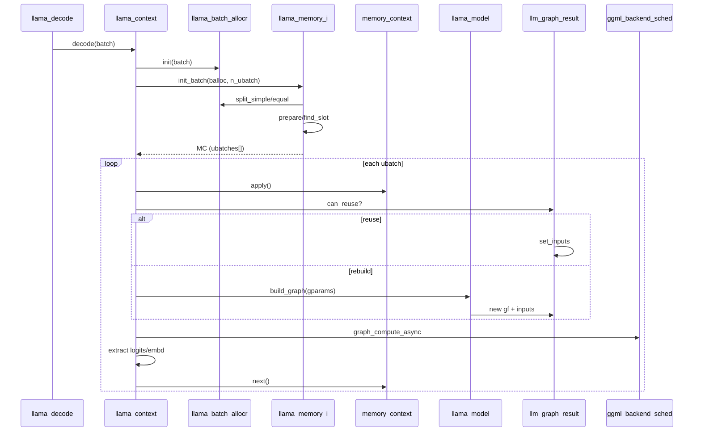

# 15 - Decode 流程与 Graph 复用机制

## 1. 概述

本文档深入分析 `llama_context::decode()` 的完整执行路径，以及计算图复用（graph reuse）机制。涉及文件：

| 文件 | 行数 | 职责 |
|------|------|------|
| `llama-context.cpp` | 4,140 | decode 主循环、process_ubatch |
| `llama-graph.cpp` | 3,169 | 图构建、input 填充 |
| `llama-graph.h` | 1,155 | 图输入/参数/结果类定义 |
| `llama-model.cpp` | 2,713 | build_graph 入口 |

---

## 2. Decode 完整流程

### 2.1 入口：`llama_decode()` -> `llama_context::decode()`

C API `llama_decode(ctx, batch)` 最终调用 `llama_context::decode(batch_inp)`（L1680）。

### 2.2 流程图

```
llama_decode(ctx, batch)
  |
  v
llama_context::decode(batch_inp)                          // L1680
  |
  +-- [无 memory] -> encode() 回退                        // L1685-1688
  +-- balloc->init(batch, vocab, memory, ...)            // L1731
  +-- sched_reserve()                                     // L1761
  +-- memory_update(false)  // pending shift/copy          // L1766
  +-- memory->init_batch(*balloc, n_ubatch, ...)           // L1771
  |     +-- 失败 -> memory_update(true) 重试              // L1788-1795
  |     +-- 仍失败 -> return 1 (KV 满)
  +-- output_reserve(n_outputs_all)                        // L1814
  |
  +-- do { ... } while (mctx->next())                     // L1822+
  |     +-- process_ubatch(ubatch, gtype, mctx, status)    // L1843
  |     +-- 提取 logits / embd / embd_nextn / sampling
  |     +-- mctx->next() -> 下一个 ubatch
  |
  +-- 设置 output_ids 映射
  +-- output_reorder()
```

### 2.3 返回值语义

| 返回值 | 含义 | 是否致命 |
|--------|------|----------|
| `0` | 成功 | - |
| `1` | KV 槽位不足，无法容纳 batch | 否，可清理后重试 |
| `-1` | 输入参数错误 | 是 |
| `-2` | 内部错误（graph 分配/计算失败等） | 是 |
| `2` | 用户 abort（eval callback） | - |

### 2.4 Batch 初始化（L1731）

`balloc->init()` 执行：

- 验证 token ID、seq_id 合法性
- 自动补全缺失的 `seq_id`（默认 seq 0）
- 自动补全缺失的 `pos`（从 `memory->seq_pos_max(s)+1` 递增）
- 自动补全缺失的 `logits`（默认仅最后一个 token 输出）
- 构建 `seq_set_map` 供后续拆分使用

### 2.5 Memory 分配与重试（L1770-1810）

```cpp
while (true) {
    mctx = memory->init_batch(*balloc, cparams.n_ubatch, output_all);
    switch (mctx->get_status()) {
        case LLAMA_MEMORY_STATUS_SUCCESS: break;
        case LLAMA_MEMORY_STATUS_FAILED_PREPARE:
            if (!did_optimize) {
                did_optimize = true;
                if (memory_update(true)) continue;  // defrag/shift 后重试
            }
            return 1;  // KV 满
        // ...
    }
    break;
}
```

KV cache 满时，先尝试 `memory_update(true)` 做 defrag/shift 优化，仍失败则返回 `1`。

---

## 3. process_ubatch：单步推理核心

`process_ubatch()`（L1304-1374）是每个 micro-batch 的执行单元：

```
process_ubatch(ubatch, gtype, mctx, ret)
  |
  +-- mctx->apply()                    // 将 slot 写入 KV cells
  +-- gparams = graph_params(...)      // 构建图参数
  |
  +-- if can_reuse(gparams):           // 图复用路径
  |     +-- [pipeline_parallel] sched_synchronize
  |     +-- 跳过建图
  |
  +-- else:                            // 重建图路径
  |     +-- res->reset()
  |     +-- sched_reset + set_eval_callback
  |     +-- gf = model.build_graph(gparams)
  |     +-- sched_alloc_graph(gf)
  |
  +-- res->set_inputs(&ubatch)         // 填充 input tensor 数据
  +-- graph_compute(gf, n_tokens>1)    // 异步执行
```

### 3.1 失败回滚（L1846-1866）

ubatch 计算失败时，调用 `memory->seq_rm(s, pos_min, -1)` 清除部分写入的 KV，保证 cache 一致性。

---

## 4. 计算图构建

### 4.1 build_graph 调用链

```
llama_model::build_graph(params)              // llama-model.cpp:2234
  |
  +-- build_arch_graph(params)                // 各 arch 的 graph 类
  |     +-- llm_graph_context 子类构造
  |     +-- build_inp_embd / build_inp_pos / build_attn_inp_kv ...
  |     +-- for il: layer forward (attn + ffn)
  |     +-- res->add_input(...)
  |
  +-- build_pooling()                         // embedding 池化
  +-- build_sampling()                        // backend 采样
  +-- build_dense_out()                       // 输出投影
  +-- res->set_outputs(params)
```

### 4.2 图类型 (`llm_graph_type`)

| 类型 | 用途 |
|------|------|
| `LLM_GRAPH_TYPE_DEFAULT` | 标准 decoder 前向 |
| `LLM_GRAPH_TYPE_ENCODER` | 编码器 (BERT/T5) |
| `LLM_GRAPH_TYPE_DECODER` | 带 cross-attention 的解码器 |
| `LLM_GRAPH_TYPE_DECODER_MTP` | 多 token 预测 (EAGLE3) |

---

## 5. Graph 复用机制

### 5.1 设计目标

decode 的每步通常只有 input tensor **数据**变化，**拓扑**不变。复用已构建的 `ggml_cgraph` 可跳过建图和 buffer 分配，显著降低 per-token 延迟。

### 5.2 核心类

#### `llm_graph_params`（llama-graph.h:588-701）

描述一次建图所需的全部参数：

- `ubatch` 副本（n_tokens, n_seqs, n_seq_tokens 等）
- `arch`, `gtype`, `cparams`
- `mctx`（memory context 指针）
- `loras`, `samplers`, `n_outputs`

**`allow_reuse(other)`**：比较 ubatch 形状、seq 集合、output 标志、sampler 指针、embeddings 模式等，全部匹配才允许复用。

#### `llm_graph_result`（llama-graph.h:703-772）

保存上次建图结果：

- `inputs[]` - 所有 input 对象
- `gf` - ggml 计算图
- `t_logits`, `t_embd` - 输出 tensor
- `params` - 上次建图参数

**`can_reuse(gparams)`**：
```cpp
return params.allow_reuse(gparams) && all(input->can_reuse(gparams));
```

#### `llm_graph_input_i`（基类）

| 方法 | 说明 |
|------|------|
| `set_input(ubatch*)` | 填充 host/device input 数据 |
| `can_reuse(params)` | 默认 `false`（未实现 = 不可复用） |

### 5.3 主要 Input 子类及其 can_reuse 条件

| 类 | can_reuse 条件 |
|----|----------------|
| `llm_graph_input_embd` | n_tokens 不变 |
| `llm_graph_input_pos` | n_tokens 不变 |
| `llm_graph_input_attn_kv` | n_tokens、n_kv、mask 维度匹配 |
| `llm_graph_input_attn_k` | V-less KV 变体 |
| `llm_graph_input_attn_k_dsa` | DeepSeek DSA 双 cache |
| `llm_graph_input_attn_kv_iswa` | 全量 + SWA 双 KV |
| `llm_graph_input_rs` | head/rs_z 匹配（循环模型） |
| `llm_graph_input_mem_hybrid*` | 委托子 input |
| `llm_graph_input_sampling` | per-seq sampler 不变 |

### 5.4 复用决策流程

```
process_ubatch()
  |
  +-- gparams = graph_params(res, ubatch, mctx, gtype)
  +-- if !graph_reuse_disable && res->can_reuse(gparams):
  |     +-- [pipeline_parallel] ggml_backend_sched_synchronize(sched)
  |     +-- n_reused++
  |     +-- 跳过 build_graph + sched_alloc_graph
  +-- else:
  |     +-- res->reset()
  |     +-- model.build_graph(gparams) -> 新建图
  |     +-- sched_alloc_graph(gf)
  |
  +-- res->set_inputs(&ubatch)    // 仅更新 input 数据
  +-- graph_compute(gf)
```

### 5.5 Pipeline Parallel 同步（L1321-1326）

多 GPU pipeline 并行时，上一次 `graph_compute_async` 可能仍在 GPU 上运行。复用前必须 `ggml_backend_sched_synchronize()`，否则 `set_inputs` 会覆盖 GPU 仍在读取的 input tensor。

### 5.6 图复用失效场景

以下情况会强制重建图：

| 场景 | 原因 |
|------|------|
| `LLAMA_GRAPH_REUSE_DISABLE=1` | 环境变量禁用 |
| ubatch 形状变化 | n_tokens / n_seqs 不同 |
| KV cache defrag/shift | `memory_update()` 后 `gf_res_prev->reset()` |
| LoRA 变更 | `sched_reserve()` 重预留 |
| Control Vector 变更 | 同上 |
| 新 input 类型未实现 can_reuse | 保守默认 false |

---

## 6. Attention 构建路径

`llm_graph_context::build_attn()` 有六套重载路径：

| 路径 | 适用场景 |
|------|----------|
| `build_attn` (no_cache) | 编码器，无 KV cache |
| `build_attn` (kv) | 标准 Transformer KV cache |
| `build_attn` (k) | V-less KV（PR #19067） |
| `build_attn` (k_dsa) | DeepSeek DSA 双 cache |
| `build_attn` (kv_iswa) | Interleaved SWA 双 cache |
| `build_attn` (cross) | Cross-attention（多模态） |

Flash Attention 影响：`v_trans = !flash_attn` 在 memory 创建时决定 V cache 布局。

### 6.1 KQ Mask 复用（can_reuse_kq_mask）

```cpp
// llama-graph.cpp:43
bool can_reuse_kq_mask(int64_t n_kv, const llama_ubatch & ubatch, int n_stream);
```

检查 mask 维度 `[n_kv, n_tokens/n_stream, 1, n_stream]`。`n_kv` 使用 `mctx->get_n_kv()` 启发式值（未填满 cache 时不 attend 全长）。

---

## 7. Backend 采样

当 `sampling.samplers` 非空时，图末尾追加 `build_sampling()` 节点，采样在 GPU/backend 上完成：

- `needs_raw_logits()` 决定是否拷贝原始 logits 到 host
- 采样结果通过 async copy 回 host
- 每个 seq 最多一个 output token（L1708-1728 校验）

---

## 8. Memory Update 与图失效

`memory_update()`（L762-816）处理 KV cache 维护：

```
memory_update(optimize)
  |
  +-- memory->init_update(lctx, optimize)
  +-- [若有 shift/defrag]
  |     +-- gf_res_prev->reset()     // 强制重建图
  |     +-- graph_reserve()          // 重算 worst-case buffer
  +-- 返回是否有更新
```

任何 KV 结构变化都会导致图拓扑改变，必须重建。

---

## 9. 性能计数

`llama_context` 维护以下 perf 计数器：

| 字段 | 说明 |
|------|------|
| `n_reused` | 图复用次数 |
| `t_compute_start_us` | 首次 compute 时间戳 |
| `n_queued_tokens` | 累计处理 token 数 |

可通过 `llama_perf_context()` API 查询。

---

## 10. 环境变量

| 变量 | 作用 |
|------|------|
| `LLAMA_GRAPH_REUSE_DISABLE` | 设为 1 禁用图复用 |
| `LLAMA_GRAPH_INPUT_DEBUG` | 打印 input 填充详情 |
| `LLAMA_GRAPH_RESULT_DEBUG` | 打印 graph result 状态 |

---

## 11. 端到端时序图



---

## 12. 扩展指南

| 需求 | 修改位置 |
|------|----------|
| 新 graph input 类型 | 继承 `llm_graph_input_i`，实现 `set_input` + `can_reuse` |
| 新 attention 变体 | `llama-graph.cpp` 添加 `build_attn_*` 重载 |
| 禁用特定场景复用 | 在 `can_reuse()` 返回 false |
| 调试建图 | 设置 `LLAMA_GRAPH_*_DEBUG=1` |

---

## 13. 相关文档

- [03-libllama核心库.md](./03-libllama核心库.md) - libllama 核心概览
- [16-KV-Cache与Memory系统.md](./16-KV-Cache与Memory系统.md) - KV cache 与 Memory 系统
- [17-Batch与Micro-batch.md](./17-Batch与Micro-batch.md) - Batch 拆分策略
- [04-模型架构层.md](./04-模型架构层.md) - 各架构 build_arch_graph 实现
