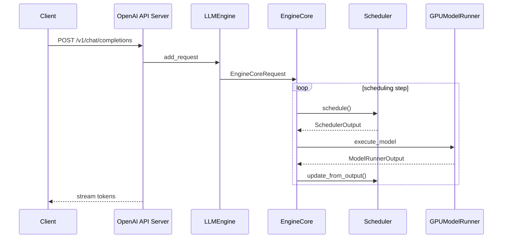

# 02 - 架构与推理数据流

## V1 端到端流程

## EngineCore（core.py）

初始化：Executor → profile KV blocks → Scheduler → KVCacheManager

每 step：`schedule()` → `execute_model()` → `update_from_output()`

## 请求状态

`waiting` → `running` → `finished`（或 preempted 后重排队）

## Prefill vs Decode

| 阶段 | 特点 |
|------|------|
| Prefill | 多 token，计算密集，可 chunked |
| Decode | 常 1 token/step，KV 带宽密集 |

Continuous batching 同一步可混合两阶段。

## 进程模型

`MultiprocExecutor`：主进程 EngineCore + 每 GPU 一 Worker，MessageQueue 传 SchedulerOutput。

## 对照 llama.cpp

| vLLM | llama.cpp |
|------|-----------|
| Scheduler | server queue |
| Block table | KV cache |
| GPUModelRunner | llama_decode |

## 关键文件

- `v1/engine/core.py`
- `v1/core/sched/scheduler.py`
- `v1/worker/gpu_model_runner.py`
- `entrypoints/openai/api_server.py`
