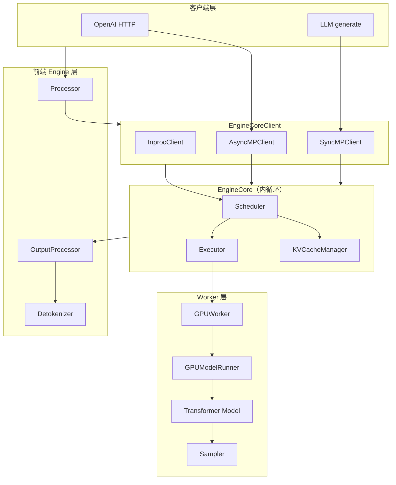
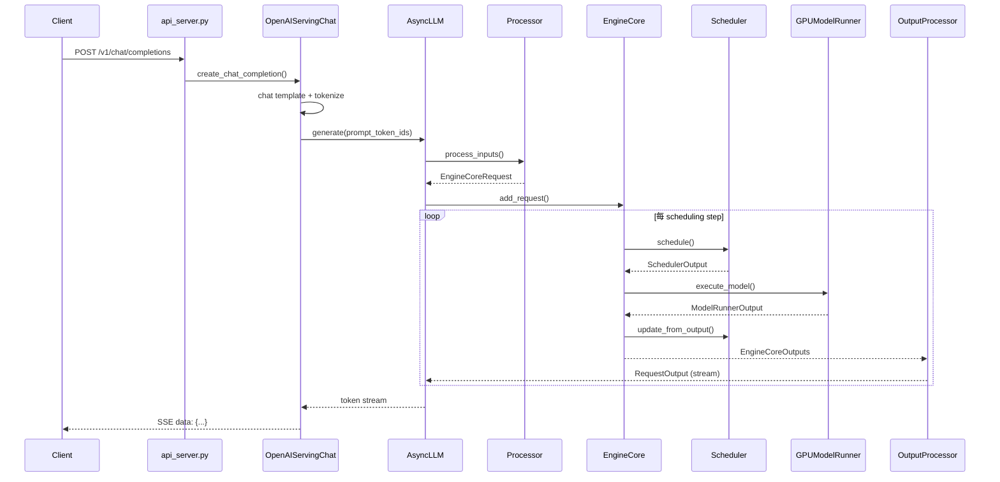

# 02 - 架构与推理数据流

## V1 组件全景



## 端到端时序（OpenAI Chat）



## EngineCore 内循环

文件：`vllm/v1/engine/core.py`

### 初始化（`_initialize_kv_caches`）

```
1. executor = Executor(vllm_config)
2. kv_cache_specs = executor.get_kv_cache_specs()
3. available_gpu_memory = executor.determine_available_memory()  # profile
4. kv_cache_configs = get_kv_cache_config(...)  # 每 worker 一份
5. unify_kv_cache_configs(kv_cache_configs)
6. executor.initialize_from_config(kv_cache_configs)  # 分配 KV tensor + warmup
7. scheduler = Scheduler(..., kv_cache_config=...)
```

注意：V1 初始化时 `num_cpu_blocks = 0`，**不分配 CPU swap 块**。

### 每 step（`step()`）

```python
scheduler_output = self.scheduler.schedule()
future = self.model_executor.execute_model(scheduler_output)
model_output = future.result()
engine_core_outputs = self.scheduler.update_from_output(model_output)
return engine_core_outputs
```

Pipeline Parallel 场景使用 `step_with_batch_queue()`：schedule 与 execute 流水线化，减少 bubble。

## 请求生命周期

### RequestStatus（`v1/request.py`）

| 状态 | 含义 |
|------|------|
| `WAITING` | 在 waiting 队列，等待 KV 槽位 |
| `WAITING_FOR_FSM` | 等待 structured output grammar 编译 |
| `RUNNING` | 已分配 KV，在 running 列表 |
| `PREEMPTED` | 被抢占，`num_computed_tokens=0`，需重算 |
| `FINISHED_*` | 正常结束 / 长度截断 / abort |

### 状态流转

```
add_request → WAITING
  → schedule() 成功 → RUNNING
  → 每 step update_from_output → 继续 RUNNING 或 FINISHED
  → KV 不足被抢占 → PREEMPTED → waiting 队首 → 重新 prefill
```

V1 抢占 **不做 CPU swap**：释放全部 KV block，`num_computed_tokens` 归零，恢复时完整重算 prefill（与 V0 的 `PreemptionMode.SWAP` 不同）。

## 统一 Token 调度模型（非 Prefill/Decode 两阶段）

V1 Scheduler **不区分** prefill phase 与 decode phase。每个 request 维护：

- `num_computed_tokens`：已写入 KV 的 token 数
- `num_tokens_with_spec`：`prompt + output + spec_draft` 总 token 数

每 step 调度目标：让 `num_computed_tokens` 追上 `num_tokens_with_spec`。

这一模型统一覆盖：

- 普通 prefill（一次算完 prompt）
- Chunked prefill（分多 step 追平）
- Prefix cache hit（跳过已有 block 的计算）
- Speculative decoding（含 draft token）
- Decode（每 step +1 token）

源码注释（`scheduler.py:122-132`）明确说明此设计。

## Processor / OutputProcessor 分工

| 模块 | 路径 | 输入 → 输出 |
|------|------|-------------|
| `Processor` | `v1/engine/processor.py` | 文本/mm → `EngineCoreRequest` |
| `OutputProcessor` | `v1/engine/output_processor.py` | `EngineCoreOutputs` → `RequestOutput` |
| `Detokenizer` | `v1/engine/detokenizer.py` | token id → 增量字符串 |
| `ParentRequest` | `v1/engine/parallel_sampling.py` | `n>1` 采样时 fan-out |

V1 **拒绝** 的部分输入（`processor.py`）：

- 自定义 `logits_processors`（用 structured output 替代）
- `best_of > 1`
- pooling/embedding 任务

## EngineCoreClient 与进程模型

| Client | 模式 | 用途 |
|--------|------|------|
| `InprocClient` | 同进程 | 调试；`VLLM_ENABLE_V1_MULTIPROCESSING=0` |
| `SyncMPClient` | ZMQ 子进程 | 同步 `LLM.generate()` |
| `AsyncMPClient` | ZMQ + asyncio | `AsyncLLM`、OpenAI server |
| `DPAsyncMPClient` | 多 EngineCore | Data Parallel |

工厂方法 `EngineCoreClient.make_client()`（`core_client.py:52-76`）根据 `multiprocess_mode` 与 `asyncio_mode` 选择。

IPC 序列化：`v1/serial_utils.py`（msgspec/msgpack）。

## GPUModelRunner 执行摘要

`execute_model()` 主路径（`gpu_model_runner.py`）：

```
1. _update_states(scheduler_output)   # 同步 persistent InputBatch
2. _execute_mm_encoder()              # 多模态 encoder（若有）
3. _prepare_inputs()                  # attention metadata、sampling metadata
4. set_forward_context(attn_metadata)
5. model(input_ids, positions)        # transformer forward
6. compute_logits()                   # 末 rank
7. apply_grammar_bitmask()            # structured output
8. sample() 或 rejection_sampler()    # spec decode
9. 返回 ModelRunnerOutput
```

**Persistent batch 优化**：`InputBatch` 跨 step 复用，仅应用 `SchedulerOutput` 中的 diff。未在本 step 调度的 request 从 batch 移除但保留在 `self.requests` 缓存中。

## V0 数据流对照

| 环节 | V0 | V1 |
|------|----|----|
| 调度单元 | `SequenceGroup` | `Request` |
| 调度输出 | `SequenceGroupMetadata` | `SchedulerOutput` |
| 内循环 | `LLMEngine.step()` | `EngineCore.step()` |
| Engine 隔离 | MQLLMEngineClient（ZMQ） | 始终 EngineCoreProc |
| Swap | `blocks_to_swap_in/out` | 无 |

## 与 llama.cpp 对照

| vLLM | llama.cpp |
|------|-----------|
| Scheduler + token budget | server queue + batch slots |
| BlockPool + BlockTable | `llama_kv_cache` cells |
| GPUModelRunner | `llama_decode` / graph |
| Prefix cache | prompt cache reuse |
| Continuous batching | `--cont-batching` |

详见 `llama.cppDoc/16-kv-cache-memory.md`、`17-batch-system.md`。

## 关键源码索引

| 主题 | 文件 |
|------|------|
| EngineCore step | `v1/engine/core.py` |
| Scheduler | `v1/core/sched/scheduler.py` |
| KV 管理 | `v1/core/kv_cache_manager.py` |
| ModelRunner | `v1/worker/gpu_model_runner.py` |
| InputBatch | `v1/worker/gpu_input_batch.py` |
| API 入口 | `entrypoints/openai/api_server.py` |
| 配置聚合 | `config.py` → `VllmConfig` |
