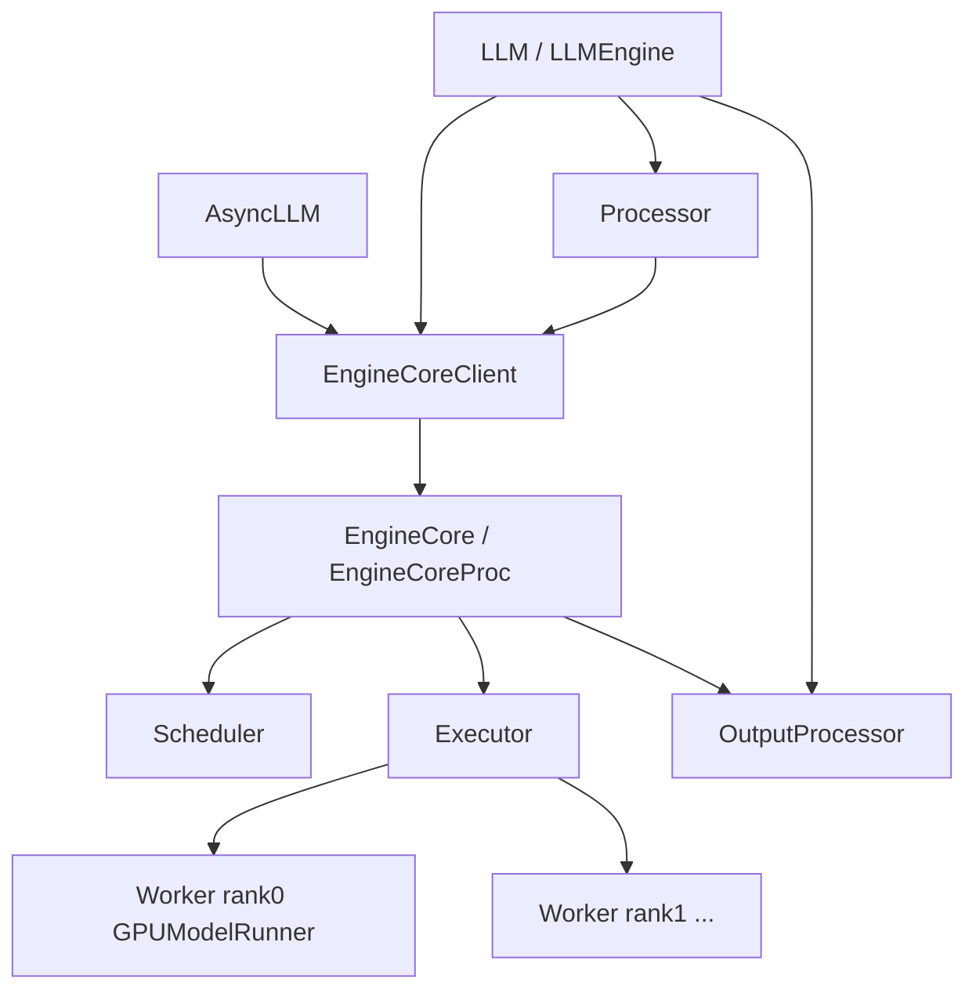

# 03 - V1 Engine 与 Executor

## 组件关系



## EngineCore

文件：`vllm/v1/engine/core.py`

V1 的 **内循环引擎**，不直接面对 HTTP/Python 用户 API。

### 核心方法

| 方法 | 作用 |
|------|------|
| `add_request()` | `EngineCoreRequest` → `Request.from_engine_core_request()` → Scheduler |
| `abort_request()` | 取消 request，释放 KV |
| `step()` | `schedule()` → `execute_model()` → `update_from_output()` |
| `step_with_batch_queue()` | PP 流水线 schedule/execute |
| `_initialize_kv_caches()` | profile 显存、分配 block、warmup |
| `reset_prefix_cache()` | 清空 prefix cache |
| `sleep()` / `wake_up()` | 显存 offload（power management） |
| `add_lora()` / `remove_lora()` | 动态 LoRA |

### 初始化 excerpt

```python
self.model_executor = executor_class(vllm_config)
num_gpu_blocks, num_cpu_blocks, kv_cache_config = \
    self._initialize_kv_caches(vllm_config)
# V1: num_cpu_blocks 恒为 0
self.scheduler = Scheduler(
    vllm_config.scheduler_config,
    kv_cache_config=kv_cache_config,
    ...
)
```

### EngineCoreProc

`EngineCoreProc`（`core.py:308+`）在 **独立子进程** 中运行 `EngineCore`：

- ZMQ socket 接收 `add_request`、`step` 等 RPC
- 适用于 `SyncMPClient` / `AsyncMPClient`
- 避免 Python GIL 与前端 HTTP 竞争

## LLMEngine / AsyncLLM

| 类 | 路径 | 场景 |
|----|------|------|
| `LLMEngine` | `v1/engine/llm_engine.py` | 同步 `LLM.generate()` |
| `AsyncLLM` | `v1/engine/async_llm.py` | 异步 generator、`vllm serve` |
| `EngineCoreClient` | `v1/engine/core_client.py` | IPC 抽象 |

### LLMEngine 同步 loop

```python
# 简化逻辑
def step(self):
    outputs = self.engine_core.get_output()  # 内部 step()
    return self.output_processor.process_outputs(outputs)
```

`add_request()` 流程：

1. `Processor.process_inputs()` → `EngineCoreRequest`
2. `OutputProcessor.add_request()` 注册 detokenize 状态
3. `EngineCoreClient.add_request()` → Scheduler waiting 队列

### AsyncLLM 异步 loop

- 启动时 `_run_output_handler()` 后台 task 持续 `get_output_async()`
- `generate()` 返回 async generator，从 `RequestOutputCollector` 队列取 token
- **始终** 使用 `AsyncMPClient`（子进程 EngineCore）

Data Parallel：`parallel_config.data_parallel_size > 1` 时使用 `DPAsyncMPClient`，多 EngineCore 实例。

### DP 同步

当某 DP rank 无 request 而其他 rank 有 workload 时，调用 `execute_dummy_batch()` 保持 collective 同步（`llm_engine.py`）。

## EngineCoreClient 详解

`EngineCoreClient.make_client()` 选择逻辑：

| multiprocess | asyncio | Client |
|:------------:|:-------:|--------|
| False | False | `InprocClient` |
| True | False | `SyncMPClient` |
| True | True | `AsyncMPClient` 或 `DPAsyncMPClient` |
| False | True | **NotImplementedError** |

环境变量：

- `VLLM_ENABLE_V1_MULTIPROCESSING=True`（默认）→ 同步 LLM 也走子进程
- 设为 `False` → `InprocClient`，便于 gdb 调试

### Client 能力（RPC 面）

除 `add_request` / `get_output` 外，Client 还代理：

- `reset_prefix_cache`、`sleep`、`wake_up`、`is_sleeping`
- `add_lora`、`remove_lora`、`list_loras`
- `abort_requests`、`profile`、`execute_dummy_batch`

## Processor / OutputProcessor

### Processor（`processor.py`）

职责：将用户输入规范化为 `EngineCoreRequest`：

- Tokenization（`TokenizerGroup`）
- 多模态 placeholder 解析
- `SamplingParams` 校验
- LoRA request id 绑定
- Structured output grammar 预处理

V1 限制：

```python
# processor.py 中拒绝
if sampling_params.logits_processors:  # 不支持自定义 logits processor
if sampling_params.best_of > 1:       # 不支持 best_of
if runner_type != "generate":          # 不支持 embedding/pooling
```

### OutputProcessor（`output_processor.py`）

- 维护每个 request 的 detokenizer 状态
- 将 `EngineCoreOutputs` 转为 `RequestOutput`（含 delta text、finish_reason）
- Logprobs 格式化（`logprobs.py`）
- Chunk 输出：`VLLM_V1_OUTPUT_PROC_CHUNK_SIZE`（默认 128）

### 多模态输入缓存

`MirroredProcessingCache`（`mm_input_cache.py`）：前端 Processor 与 Worker 共享 mm hash，避免重复传输大 tensor。

## Executor 抽象

`v1/executor/abstract.py`：

| 方法 | 作用 |
|------|------|
| `execute_model(scheduler_output)` | 广播到 workers，返回 `Future[ModelRunnerOutput]` |
| `get_kv_cache_specs()` | 各层 KV 规格（FullAttention / SlidingWindow） |
| `determine_available_memory()` | profile 后可用于 KV 的显存 |
| `initialize_from_config(kv_cache_configs)` | 分配 physical KV tensors |
| `collective_rpc()` | 对所有 worker 调用同名方法 |

### MultiprocExecutor

`v1/executor/multiproc_executor.py` — **单机多 GPU TP** 默认实现：

```
主进程 Executor
  ├─ rpc_broadcast_mq  → Worker 0 (GPU 0)
  ├─ rpc_broadcast_mq  → Worker 1 (GPU 1)
  └─ ...
```

- 每 rank 一个子进程 + `WorkerWrapperBase`
- `world_size == tensor_parallel_size`（单机 TP）
- SchedulerOutput 通过 MessageQueue 广播

### RayDistributedExecutor

`v1/executor/ray_distributed_executor.py`：

- 跨节点 Ray actor 托管 Worker
- **V1 Pipeline Parallel 必须 Ray**（oracle 检查）
- NCCL 跨机通信

## ModelRunnerOutput

`v1/outputs.py`：

```python
@dataclass
class ModelRunnerOutput:
    req_ids: list[str]
    req_id_to_index: dict[str, int]
    sampled_token_ids: list[list[int]]      # 每 request 采样 token
    logprobs: Optional[list[Optional[LogprobsLists]]]
    prompt_logprobs_dict: dict[str, ...]
    # spec decode 相关字段
```

Scheduler `update_from_output()` 根据采样结果更新 `num_computed_tokens`、检测 stop、释放 finished request 的 KV。

## Structured Output

`v1/structured_output/` — 约束解码（JSON schema / regex / choice）：

| Backend | 文件 | 说明 |
|---------|------|------|
| xgrammar | `backend_xgrammar.py` | 默认/auto |
| guidance | `backend_guidance.py` | 可选 |

流程：

1. Processor 编译 grammar → FSM
2. Scheduler 在 `SchedulerOutput` 中带 `grammar_bitmask`
3. GPUModelRunner `apply_grammar_bitmask()` 在 sample 前 mask logits
4. 与 V0 `guided_decoding` logits processor **不同**

## Speculative Decoding（Engine 侧）

`v1/spec_decode/`：

| 组件 | 文件 |
|------|------|
| `NgramProposer` | `ngram_proposer.py` |
| `EagleProposer` | `eagle.py` |
| `SpecDecodeMetadata` | `metadata.py` |
| `RejectionSampler` | `v1/sample/rejection_sampler.py` |

Scheduler 在 `scheduled_spec_decode_tokens` 中传递 draft token；ModelRunner 用 rejection sampling 验证。

## 与 V0 Engine 对比

| | V0 `engine/llm_engine.py` | V1 `v1/engine/` |
|---|---------------------------|-----------------|
| 代码量 | ~2170 行，历史包袱 | 精简 step 循环 |
| 调度输出 | `SequenceGroupMetadata` | `SchedulerOutput` |
| 输出处理 | 内嵌 detokenize | 独立 OutputProcessor |
| StatLogger | 可插拔 | V1 拒绝自定义 StatLogger |
| MQ 前端 | `MQLLMEngineClient` | 统一 EngineCoreProc |
| Swap | 支持 CPU swap | 不支持 |

## 调试建议

```bash
# 详细日志
VLLM_LOGGING_LEVEL=DEBUG vllm serve ...

# 同进程调试（无子进程）
VLLM_ENABLE_V1_MULTIPROCESSING=0 python -c "
from vllm import LLM
llm = LLM(model='...', enforce_eager=True)
"

# 统计
# log_stats=True → v1/metrics/stats.py、Prometheus
```

单卡简化：`tensor_parallel_size=1`，减少 Multiproc 开销。

## 关键源码行号

| 主题 | 位置 |
|------|------|
| EngineCore.step | `v1/engine/core.py:196-211` |
| KV 初始化 | `v1/engine/core.py:124-165` |
| make_client | `v1/engine/core_client.py:52-76` |
| LLMEngine | `v1/engine/llm_engine.py:38+` |
| AsyncLLM | `v1/engine/async_llm.py:44+` |
