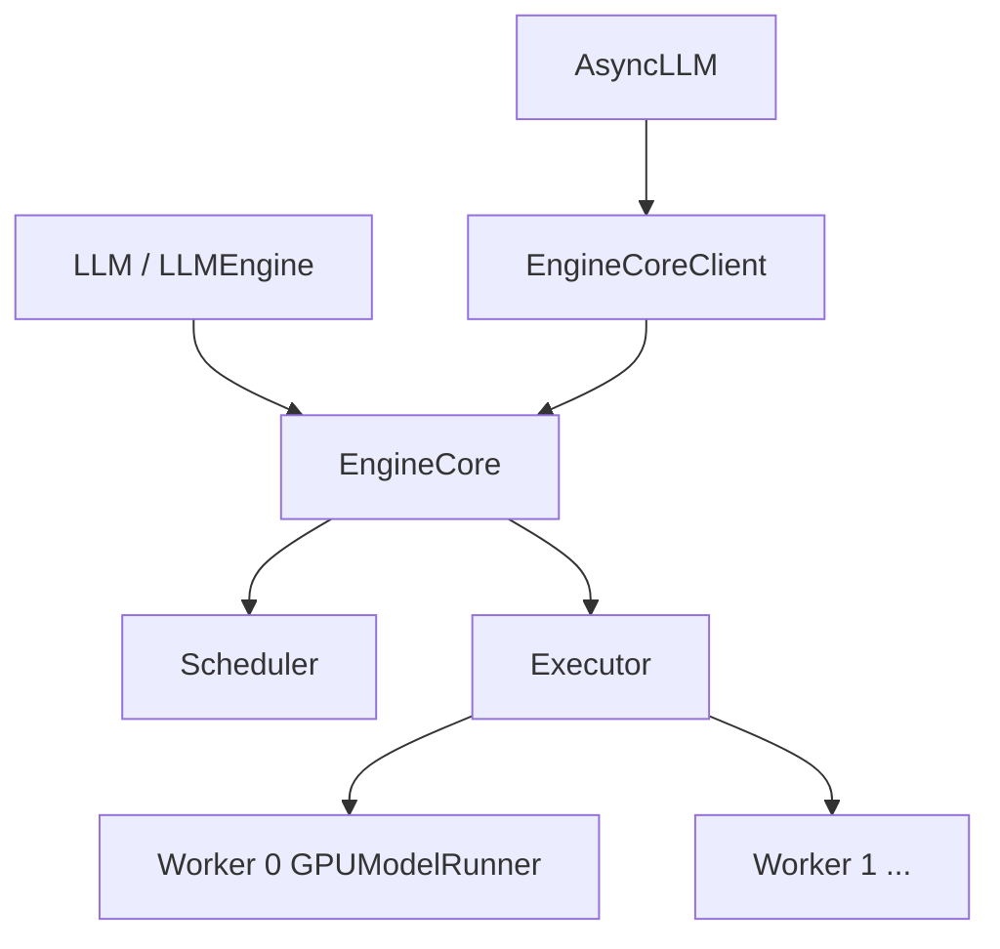

# 03 - V1 Engine 与 Executor

## 组件关系



## EngineCore

文件：`vllm/v1/engine/core.py`

**职责**：V1 的「内循环引擎」，不直接面对用户 API。

| 方法 | 作用 |
|------|------|
| `add_request()` | 接收 `EngineCoreRequest`，转 `Request` 入 Scheduler |
| `step()` | schedule + execute + update |
| `_initialize_kv_caches()` | profile 显存，分配 block 数，warmup |

初始化 excerpt：

```python
self.model_executor = executor_class(vllm_config)
num_gpu_blocks, _, kv_cache_config = self._initialize_kv_caches(vllm_config)
self.scheduler = Scheduler(..., kv_cache_config=kv_cache_config)
```

## LLMEngine / AsyncLLM

| 类 | 路径 | 场景 |
|----|------|------|
| `LLMEngine` | `v1/engine/llm_engine.py` | 同步 Python API |
| `AsyncLLM` | `v1/engine/async_llm.py` | 异步、OpenAI server |
| `EngineCoreClient` | `v1/engine/core_client.py` | 子进程/ZMQ 桥接 |

`from vllm import LLM` 封装高层接口，内部走 V1 engine（需 `VLLM_USE_V1=1`）。

## Processor / OutputProcessor

| 模块 | 职责 |
|------|------|
| `processor.py` | 原始输入 → tokenization → `EngineCoreRequest` |
| `output_processor.py` | `EngineCoreOutputs` → 文本 / logprobs |
| `detokenizer.py` | token id → 字符串（增量） |

## Executor 抽象

`v1/executor/abstract.py` 定义：

- `execute_model(scheduler_output)` → `Future[ModelRunnerOutput]`
- `get_kv_cache_specs()`、`determine_available_memory()`
- `initialize_from_config(kv_cache_configs)`

### MultiprocExecutor

`v1/executor/multiproc_executor.py` — **单机多 GPU TP** 默认实现：

- 每 rank 一个子进程 + `WorkerWrapperBase`
- `rpc_broadcast_mq` 广播 scheduler 输出
- `world_size == tensor_parallel_size`（V1 暂不支持 PP）

### RayDistributedExecutor

`v1/executor/ray_distributed_executor.py` — 多节点 Ray 集群。

## ModelRunnerOutput

`v1/outputs.py`：

- 采样 token ids
- logprobs（可选）
- spec decode 元数据
- 供 Scheduler `update_from_output` 更新 request 状态

## Structured Output

`v1/structured_output/` — JSON schema / regex 约束解码：

- `backend_xgrammar.py`
- `backend_guidance.py`
- 与 Scheduler 协作 mask logits

## 与 V0 Engine 对比

| | V0 `engine/llm_engine.py` | V1 `v1/engine/` |
|---|---------------------------|-----------------|
| 调度输出 | SequenceGroupMetadata | `SchedulerOutput` |
| IPC | 多种 backend | ZMQ + msgspec 为主 |
| 代码结构 | 历史包袱 | 精简 step 循环 |

迁移阅读：先 V1 `EngineCore.step`，再对照 V0 `LLMEngine.step`（若维护 legacy）。

## 调试建议

- 日志级别：`VLLM_LOGGING_LEVEL=DEBUG`
- 统计：`v1/metrics/stats.py`、`log_stats=True`
- 单卡：`tensor_parallel_size=1` 简化进程模型
