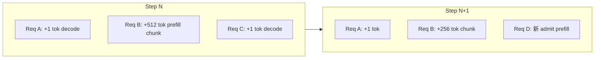

# 04 - Scheduler 与 Continuous Batching

源码：`vllm/v1/core/sched/scheduler.py`（~780 行）

接口定义：`vllm/v1/core/sched/interface.py` → `SchedulerInterface`

## 职责

**Continuous Batching 的调度核心**。每个 scheduling step 决定：

1. 哪些 request 从 `waiting` 进入 `running`
2. 每个 request 本 step 计算 **多少 token**（统一 token 追赶模型）
3. 总 token 数 ≤ `max_num_batched_tokens`
4. 并发 request 数 ≤ `max_num_seqs`
5. KV block 是否足够（不足则抢占）
6. Encoder budget（多模态）
7. Spec decode draft token 调度
8. Structured output grammar bitmask 索引

## 统一 Token 调度模型（核心）

V1 **不区分** prefill phase 与 decode phase：

```python
# scheduler.py:122-132
# Each request just has num_computed_tokens and num_tokens_with_spec.
# At each step, the scheduler tries to assign tokens so that
# num_computed_tokens catches up num_tokens_with_spec.
```

| 变量 | 含义 |
|------|------|
| `num_computed_tokens` | 已写入 KV cache 的 token 数 |
| `num_tokens_with_spec` | prompt + output + spec_draft 总数 |
| 本 step 分配量 | `num_new_tokens = num_tokens_with_spec - num_computed_tokens`（受 budget 限制） |

此模型统一覆盖 chunked prefill、prefix cache、spec decode、普通 decode。

## 核心数据结构

```python
class Scheduler:
    self.max_num_running_reqs = scheduler_config.max_num_seqs
    self.max_num_scheduled_tokens = scheduler_config.max_num_batched_tokens
    self.kv_cache_manager = KVCacheManager(...)
    self.encoder_cache_manager = EncoderCacheManager(...)  # 多模态
    self.waiting: deque[Request] = deque()
    self.running: list[Request] = []
    self.scheduled_req_ids: set[str] = set()
    self.finished_req_ids: set[str] = set()
```

## schedule() 算法流程

```
1. token_budget = max_num_batched_tokens
2. 遍历 running 列表（FCFS 顺序）：
   a. num_new_tokens = num_tokens_with_spec - num_computed_tokens
   b. 若超过 long_prefill_token_threshold → 截断（chunked prefill）
   c. num_new_tokens = min(num_new_tokens, token_budget)
   d. 多模态：_try_schedule_encoder_inputs() 检查 encoder budget
   e. kv_cache_manager.allocate_slots() — 失败则抢占 loop
   f. 更新 block_ids、scheduled_spec_decode_tokens
3. 若 token_budget 仍有剩余 → 从 waiting 队首 admit 新 request
4. 构建 SchedulerOutput
```

### long_prefill_token_threshold

`SchedulerConfig.long_prefill_token_threshold`：单次 step 对长 prefill 的 token 上限。

- 防止一个长 prompt 占满整个 `max_num_batched_tokens`
- 与 chunked prefill 配合；V1 强制 `enable_chunked_prefill=True`

## 抢占（Preemption）— V1 特有行为

当 `allocate_slots()` 返回 `None`（KV block 不足）：

```python
# scheduler.py:201-217
preempted_req = self.running.pop()          # LIFO：末尾最低优先级
self.kv_cache_manager.free(preempted_req)
preempted_req.status = RequestStatus.PREEMPTED
preempted_req.num_computed_tokens = 0     # 全部重算
self.waiting.appendleft(preempted_req)
```

| | V0 | V1 |
|---|----|----|
| 模式 | `SWAP`（CPU）或 `RECOMPUTE` | **仅 RECOMPUTE** |
| CPU swap | `blocks_to_swap_in/out` | 不支持 |
| 恢复 | swap 回 GPU 或重算 | 完整 prefill 重算 |
| block table | 可能保留 | `resumed_from_preemption=True` 时替换 |

V1 EngineCore 初始化 `num_cpu_blocks=0`，`swap_space` 配置对 V1 基本无效。

## SchedulerOutput 字段详解

文件：`vllm/v1/core/sched/output.py`

| 字段 | 类型 | 用途 |
|------|------|------|
| `scheduled_new_reqs` | `list[NewRequestData]` | 首次调度：完整 token ids、block table、sampling params |
| `scheduled_cached_reqs` | `list[CachedRequestData]` | 已在跑 request 的 **增量 diff** |
| `num_scheduled_tokens` | `dict[str, int]` | 每 request 本 step token 数 |
| `scheduled_spec_decode_tokens` | `dict[str, list[int]]` | draft token |
| `scheduled_encoder_inputs` | `dict[str, list[int]]` | 多模态 encoder 输入索引 |
| `num_common_prefix_blocks` | `int` | cascade attention 公共前缀 block 数 |
| `finished_req_ids` | `set[str]` | Worker 清理 persistent batch |
| `grammar_bitmask` | `Optional[torch.Tensor]` | structured output logits mask |
| `structured_output_request_ids` | `dict[str, int]` | request → batch index 映射 |

Worker 侧 `GPUModelRunner._update_states()` 消费上述字段，更新 `InputBatch` 与 `BlockTable`。

## Continuous Batching 原理

传统 static batching：batch 内所有 sequence 必须等最长序列完成。

vLLM：**每 iteration 重新调度**：



完成的 request 立即退出 running，KV block 回收，空位给新 request → **高 GPU 利用率**。

## Chunked Prefill

长 prompt 拆成多 step，每 step 分配部分 token 直到 `num_computed_tokens == len(prompt)`。

V1 默认行为（`arg_utils._set_default_args_v1()`）：

```python
enable_chunked_prefill = True  # 强制，不可关
```

好处：

- decode request 不被长 prefill 饿死
- 更平滑的 latency 分布

## Encoder Cache（多模态）

`encoder_cache_manager.py`：

- 缓存 vision tower 输出，避免重复 compute 相同图片
- Scheduler 有独立 `encoder_budget = max_num_encoder_input_tokens`
- encoder budget 耗尽时 **放宽 FCFS**：跳过 blocked request，调度后续 request（`scheduler.py:186-190`）

## Speculative Decoding 调度

启用 `speculative_config` 时：

- `num_lookahead_tokens`：EAGLE 方法的 draft 深度
- Scheduler 在 `num_tokens_with_spec` 中包含 draft token
- `scheduled_spec_decode_tokens` 传给 ModelRunner
- 验证由 `RejectionSampler` 完成

V1 oracle 仅支持 **ngram**、**eagle** 方法（Medusa/MTP 等需 V0）。

## update_from_output()

`schedule()` 的逆过程：

```
输入 ModelRunnerOutput（sampled_token_ids、logprobs）
  → 更新 request.output_token_ids
  → num_computed_tokens += num_scheduled_tokens[req_id]
  → check_stop()：EOS、max_tokens、stop strings
  → finished → free KV、移出 running
  → spec decode：处理 accepted/rejected draft
  → 返回 EngineCoreOutputs
```

工具函数：`sched/utils.py` → `check_stop()`。

## 约束参数（SchedulerConfig）

| 参数 | 典型值 | 含义 |
|------|--------|------|
| `max_num_seqs` | 256（普通 GPU）/ 1024（H100） | 最大并发 sequence |
| `max_num_batched_tokens` | 2048 / 8192 / 16384 | 单 step token 上限 |
| `max_model_len` | 模型上下文上限 | 硬限制 |
| `long_prefill_token_threshold` | 0=禁用 | 长 prefill 单 step 上限 |
| `enable_chunked_prefill` | V1 恒 True | 分块 prefill |
| `scheduler_cls` | V1 Scheduler 路径 | V1 仅支持内置 Scheduler |

V1 **不支持** `--scheduling-policy` 自定义策略（oracle 会拒绝）。

### V1 硬件相关默认值（`_set_default_args_v1`）

| GPU | max_num_batched_tokens (serve) | max_num_seqs |
|-----|-------------------------------|--------------|
| H100/H200 | 8192 | 1024 |
| 其他 | 2048 | 256 |
| LLM class API | 16384 (H100) / 8192 (其他) | 同上 |

## 统计与指标

- `SchedulerStats` — 调度延迟、batch 大小
- `SpecDecodingStats` — acceptance rate
- `PrefixCacheStats` — prefix hit rate
- Prometheus：`v1/metrics/loggers.py`

## 与 llama.cpp batch 对照

| vLLM Scheduler | llama.cpp |
|----------------|-----------|
| `max_num_batched_tokens` | `--batch-size` / ubatches |
| 统一 token 追赶 | prefill + decode 混 batch |
| Chunked prefill | prompt 分块 |
| 抢占重算 | 无等价（内存预分配） |

见 `llama.cppDoc/17-Batch与Micro-batch.md`。

## 阅读建议

1. `scheduler.py` → `schedule()` 全文（核心算法）
2. `sched/output.py` → 数据结构
3. `gpu_model_runner.py` → `_update_states()` 如何消费 output
4. V0 对照：`core/scheduler.py` → `PreemptionMode`、`blocks_to_swap_out`

## 关键源码行号

| 主题 | 位置 |
|------|------|
| 统一 token 模型注释 | `scheduler.py:122-132` |
| 抢占逻辑 | `scheduler.py:201-217` |
| Encoder FCFS 放宽 | `scheduler.py:186-190` |
| SchedulerOutput | `sched/output.py:82-123` |
