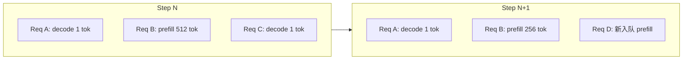

# 04 - Scheduler 与 Continuous Batching

源码：`vllm/v1/core/sched/scheduler.py`

## 职责

**Continuous Batching 的大脑**：每个 scheduling step 决定：

- 哪些 request 从 `waiting` 进入 `running`
- 每个 request 本 step 计算 **多少 token**（prefill chunk 或 decode 1）
- 总 token 数不超过 `max_num_batched_tokens`
- 并发 request 数不超过 `max_num_seqs`

## 核心数据结构

```python
class Scheduler:
    self.max_num_running_reqs = scheduler_config.max_num_seqs
    self.max_num_scheduled_tokens = scheduler_config.max_num_batched_tokens
    self.kv_cache_manager = KVCacheManager(...)
    self.waiting: deque[Request] = deque()
    self.running: list[Request] = []
    self.scheduled_req_ids: set[str] = set()
    self.finished_req_ids: set[str] = set()
```

## schedule() 输出

`SchedulerOutput`（`sched/output.py`）包含：

| 字段类型 | 内容 |
|----------|------|
| `NewRequestData` | 新 request 的 block table、token ids |
| `CachedRequestData` | 已在跑 request 的增量 token |
| 元信息 | 本 step 总 token 数、spec decode 等 |

Worker 侧 `GPUModelRunner` 消费 `SchedulerOutput` 构建 `InputBatch`。

## Continuous Batching 原理

传统 static batching：必须等 batch 内最长 sequence 完成。

vLLM：**每 iteration 重新调度**：



完成的 request 立即退出 batch，空位给新 request → **高 GPU 利用率**。

## Chunked Prefill

长 prompt 拆成多 step prefill，避免单次 prefill 占满 `max_num_batched_tokens` 阻塞 decode。

配置：`scheduler_config.enable_chunked_prefill` 等（见 `SchedulerConfig`）。

## 抢占（Preemption）

KV block 不足时：

- 抢占低优先级 / 新 request
- 释放 block 或 swap 到 CPU（`swap_space`）
- request 回到 waiting

V1 `KVCacheManager` 与 Scheduler 协同决定可否 admit。

## Encoder Cache（多模态）

`encoder_cache_manager.py` — 视觉 encoder 输出缓存，避免重复 compute vision tower。

## Speculative Decoding 调度

`speculative_config` 启用时，Scheduler 协调：

- draft token 数量
- `SpecDecodeMetadata` 传给 ModelRunner
- `RejectionSampler` 验证

## 约束参数（SchedulerConfig）

| 参数 | 含义 |
|------|------|
| `max_num_seqs` | 最大并发 sequence |
| `max_num_batched_tokens` | 单 step 最大 token 总数 |
| `max_model_len` | 最大序列长度 |
| `policy` | FCFS / priority（若启用） |

## 统计

`SchedulerStats`、`SpecDecodingStats` — Prometheus / logging。

## 与 llama.cpp batch 对照

| vLLM Scheduler | llama.cpp |
|----------------|-----------|
| `max_num_batched_tokens` | batch alloc 上限 |
| Continuous 混 batch | continuous batching（server） |
| Chunked prefill | 类似 prompt 分块 |

见 `llama.cppDoc/17-batch-system.md`。

## 阅读建议

1. `scheduler.py` 的 `schedule()` 与 `update_from_output()`
2. `sched/output.py` 数据结构
3. `gpu_input_batch.py` 如何消费 output
