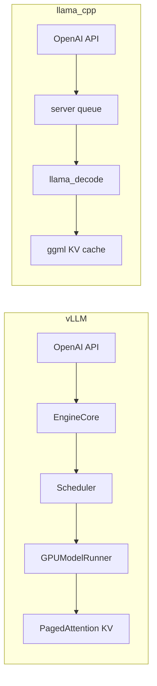

# 11 - 与 llama.cpp / kefu-kb 对照

## 推理双栈选型

| 维度 | vLLM | llama.cpp |
|------|------|-----------|
| 权重格式 | HuggingFace / Safetensors | GGUF |
| 核心优势 | 高并发 PagedAttention + Continuous Batching | 轻量依赖、多量化、CPU 友好 |
| 服务入口 | `vllm serve` | `llama-server` |
| 默认架构 | V1 EngineCore | ggml backend |
| Embedding | pooling 模型 + `/v1/embeddings`（V0） | `/v1/embeddings` |
| 量化 | AWQ/GPTQ/FP8 Marlin（HF） | Q4_K_M 等 GGUF quants |
| 典型场景 | 生产 GPU 集群 API | 本地/边缘/开发 |

## 概念映射

| vLLM 概念 | vLLM 文档 | llama.cpp 文档 |
|-----------|-----------|----------------|
| BlockPool / PagedAttention | [05-kv-cache](./05-KV-Cache与PagedAttention.md) | 16-kv-cache-memory |
| Continuous Batching / Scheduler | [04-scheduler](./04-Scheduler与Continuous-Batching.md) | 17-batch-system |
| GPUModelRunner / decode | [06-model-executor](./06-Model-Executor与GPUModelRunner.md) | graph/ggml compute |
| OpenAI API Server | [09-entrypoints](./09-Entrypoints与OpenAI-API.md) | 12-server |
| 采样 / logits | [13-sampling](./13-采样与结构化输出.md) | sampler chain |
| 量化 | [15-quantization](./15-量化方案目录.md) | GGUF quant types |

## 架构对照



| 环节 | vLLM | llama.cpp |
|------|------|-----------|
| 请求队列 | Scheduler waiting/running | server task queue |
| Batch 构建 | SchedulerOutput → InputBatch | ubatches |
| KV 管理 | BlockPool + BlockTable | kv cells / slots |
| 前缀复用 | Prefix caching（hash block） | cache reuse |
| 抢占 | V1 recompute | 无（预分配） |

## API 兼容性

两者均提供 OpenAI 兼容 HTTP API，LlamaIndex 等框架可无缝切换：

```python
from llama_index.llms.openai_like import OpenAILike

# vLLM
llm = OpenAILike(api_base="http://127.0.0.1:8000/v1", model="meta-llama/Llama-3.2-3B")

# llama-server
llm = OpenAILike(api_base="http://127.0.0.1:8080/v1", model="qwen2.5-7b")
```

主要差异：

| 端点 | vLLM | llama-server |
|------|------|--------------|
| `/v1/chat/completions` | ✓ | ✓ |
| `/v1/embeddings` | ✓（V0 pooling 模型） | ✓ |
| `/v1/load_lora_adapter` | ✓ | 视构建 |
| `/sleep` / `/wake_up` | ✓ | ✗ |

## kefu-kb 集成

当前 kefu-kb（`07-业务应用/kefu-kb/`）架构：

```
FastAPI
  → embedder: 本地 sentence-transformers（默认）
  → qdrant: 本地文件存储
  → chat: llama-server /v1/chat/completions
```

### 仅替换 Chat 后端为 vLLM

```yaml
# config.yaml
llama:
  base_url: http://127.0.0.1:8000/v1
  chat_model: meta-llama/Llama-3.2-3B
```

```bash
# 启动 vLLM（需 HF 权重，非 GGUF）
vllm serve meta-llama/Llama-3.2-3B --host 0.0.0.0 --port 8000
```

Embedding 仍用本地 sentence-transformers，**无需** vLLM embedding。

### 何时选 vLLM 做 kefu-kb chat

| 选 vLLM | 选 llama-server |
|---------|-----------------|
| 多用户并发客服 | 单机低并发 |
| 已有 HF 权重 | 只有 GGUF |
| GPU 资源充足 | 资源有限 / CPU |
| 需 prefix cache 加速固定 system prompt | 简单部署 |

## 权重路径

```
训练（LLaMA-Factory / Megatron）
  → HuggingFace safetensors
      → vLLM serve（直接加载）

  → GGUF convert
      → llama-server（llama.cpp）
```

vLLM **不加载 GGUF**（V1 明确不支持）；llama.cpp **不加载** HF 原始权重（需 convert）。

## Megatron 训练 → 部署

```
Megatron-LM 训练
  → Megatron Bridge 导出
  → HuggingFace checkpoint
  → vLLM serve（生产 GPU 推理）

或

  → GGUF 量化
  → llama-server（轻量部署）
```

## 性能维度对照

| 维度 | vLLM 优势 | llama.cpp 优势 |
|------|-----------|----------------|
| 高并发吞吐 | PagedAttention + continuous batch | 中等 |
| 首 token 延迟 | chunked prefill 可调 | 简单场景低 |
| 显存效率 | block 级按需分配 | 视 context 配置 |
| 依赖/install | 重（CUDA/PyTorch） | 轻 |
| 量化选择 | HF quant + Marlin | GGUF 生态 |

## 相关文档

- vLLM KV：[05-KV-Cache与PagedAttention.md](./05-KV-Cache与PagedAttention.md)
- vLLM API：[09-Entrypoints与OpenAI-API.md](./09-Entrypoints与OpenAI-API.md)
- kefu-kb 部署：`07-业务应用/README.md`
