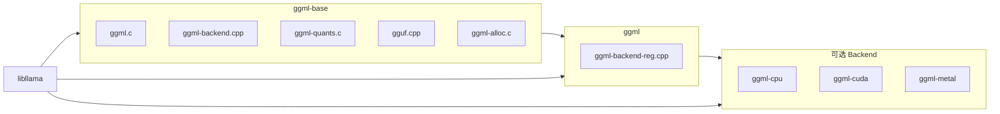

# 02 - 整体架构

## 1. 分层架构

```
+----------------------------------------------------------+
|                    应用层                                 |
|  llama.cpp | whisper.cpp | llama-quantize | examples/    |
+----------------------------------------------------------+
|                    Backend 调度层                         |
|  ggml_backend_sched | split_graph | copy | pipeline      |
+----------------------------------------------------------+
|                    Backend 抽象层                         |
|  ggml_backend | buffer_type | device | supports_op       |
+----------------------------------------------------------+
|                    计算图层                             |
|  ggml_cgraph | ggml_build_forward | gallocr 生命周期     |
+----------------------------------------------------------+
|                    算子/张量层                            |
|  ggml.c | ggml_op | ggml_tensor | Context bump alloc    |
+----------------------------------------------------------+
|                    量化 / 格式层                          |
|  ggml-quants.c | ggml-common.h | gguf.cpp               |
+----------------------------------------------------------+
|                    硬件 Backend 实现                      |
|  ggml-cpu | ggml-cuda | ggml-metal | ggml-vulkan | ...  |
+----------------------------------------------------------+
```

## 2. 推理数据流

```
ggml_init(params)                    # 创建 Context（预分配内存池）
    |
    v
ggml_new_tensor_* + ggml_mul_mat/... # 算子 API 建图（惰性，不计算）
    |
    v
ggml_build_forward_expand(gf, root) # 构建 ggml_cgraph
    |
    v
ggml_backend_sched_graph_compute()   # 多设备路径（llama.cpp 使用）
    |  或
ggml_graph_compute()                 # 纯 CPU 路径
    |
    v
ggml_backend_sched_split_graph()     # 切分图到各 Backend
    |
    v
各 Backend graph_compute             # CPU/CUDA/Metal kernel 执行
    |
    v
输出 tensor data（logits 等）
```

## 3. 核心对象关系

```
ggml_context                         # 内存池 + 对象链表
    |
    +-- ggml_tensor[]                # 张量元数据（ne, nb, op, src）
    +-- ggml_cgraph                  # 计算图（nodes, leafs）
    |
    v
ggml_backend_buffer                  # 实际数据存储（CPU RAM / GPU VRAM）
    |
    v
ggml_backend_sched                   # 多 Backend 调度器
    |
    +-- backends[]                   # 优先级列表
    +-- galloc                       # 图级分配器
    +-- splits[]                     # 图切分片段
    +-- hv_tensor_backend_ids        # 张量 -> Backend 映射
```

## 4. 张量五元组

每个 `ggml_tensor` 由以下要素完整描述：

| 字段 | 说明 |
|------|------|
| `ne[4]` | 各维度大小 |
| `nb[4]` | 各维度 stride（字节） |
| `type` | 数据类型（F32, Q4_K 等） |
| `op` + `src[]` | 产生此张量的算子及输入 |
| `buffer` + `data` | 存储位置 |

**关键**：`nb[]` 允许非连续张量（permute/view），所有 Backend 必须尊重 stride。

## 5. 三种执行路径

| 路径 | API | 场景 |
|------|-----|------|
| 纯 CPU | `ggml_graph_compute(ctx, cgraph, n_threads)` | 示例、调试 |
| 单 Backend | `ggml_backend_graph_compute(backend, cgraph)` | 单 GPU |
| 多 Backend 调度 | `ggml_backend_sched_graph_compute(sched, cgraph)` | llama.cpp 生产路径 |

## 6. 库拆分与链接



## 7. 与 llama.cpp 的调用对应

| llama.cpp 阶段 | ggml 组件 |
|----------------|-----------|
| 模型加载 | `gguf_init_from_file` + `ggml_backend_alloc_ctx_tensors` |
| 建图 | `ggml_mul_mat`, `ggml_rope`, `ggml_flash_attn_ext` 等 |
| 预留 buffer | `ggml_gallocr_reserve` + `ggml_backend_sched_reserve` |
| 推理 | `ggml_backend_sched_graph_compute_async` |
| 量化 | `quantize_row_*`, `ggml_quantize_chunk` |

## 8. 设计要点（非显而易见）

1. **算子 API 不计算**：`ggml_mul_mat()` 只分配元数据并连接 `src[]`，计算在 `graph_compute` 时发生
2. **Context 是 bump allocator**：`mem_size` 预分配，图/张量元数据在同一块内存，不可单独 free
3. **`op_params[64]`**：ROPE 类型、pool 参数等编码在 int32 数组中，非结构体
4. **`tensor->extra`**：Backend 私有扩展指针（CUDA tensor extras 等）
5. **Backend 优先级**：sched 中 index 越小优先级越高；CPU 通常为最低优先级兜底
