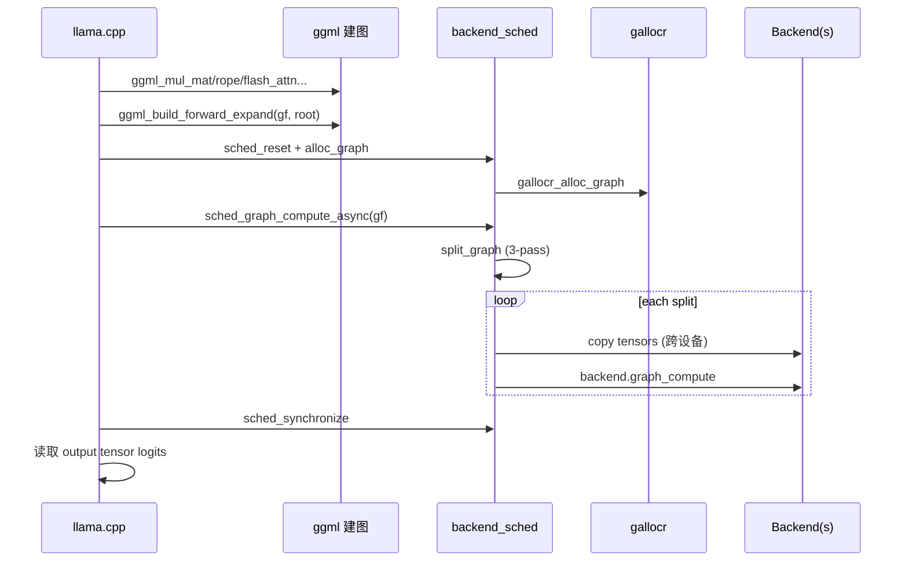
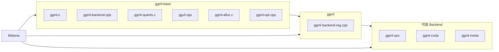

# 02 - 整体架构

## 1. 分层架构

```
+----------------------------------------------------------+
|                    应用层                                 |
|  llama.cpp | whisper.cpp | llama-quantize | examples/    |
+----------------------------------------------------------+
|                    Backend 调度层                         |
|  ggml_backend_sched | split_graph (3-pass) | pipeline     |
+----------------------------------------------------------+
|                    Backend 抽象层                         |
|  device | buffer_type | buffer | backend | reg           |
+----------------------------------------------------------+
|                    计算图层                             |
|  ggml_cgraph | build_forward | gallocr 生命周期           |
+----------------------------------------------------------+
|                    算子/张量层                            |
|  ggml.c | ggml_op | ggml_tensor | Context bump alloc      |
+----------------------------------------------------------+
|                    量化 / 格式层                          |
|  ggml-quants.c | ggml-common.h | gguf.cpp                 |
+----------------------------------------------------------+
|                    硬件 Backend 实现                      |
|  ggml-cpu | ggml-cuda | ggml-metal | ggml-vulkan | ...   |
+----------------------------------------------------------+
|                    训练层（可选）                         |
|  ggml-opt.cpp | backward | OPT_STEP_* | CROSS_ENTROPY    |
+----------------------------------------------------------+
```

## 2. 推理数据流（llama.cpp 生产路径）



简化步骤：

```
ggml_init(params)                         # Context bump 池
    ↓
ggml_new_tensor_* + ggml_mul_mat/...      # 惰性建图
    ↓
ggml_build_forward_expand(gf, root)     # 拓扑排序 + use_counts
    ↓
ggml_backend_sched_graph_compute_async()  # 多设备（llama 主路径）
    ├─ split_graph (3-pass Backend 分配)
    ├─ gallocr_alloc_graph (in-place 复用)
    └─ compute_splits (copy + graph_compute)
    ↓
输出 tensor data（logits）
```

纯 CPU 调试路径：`ggml_graph_compute(ctx, cgraph, n_threads)`。

## 3. 核心对象关系

```
ggml_context                          # bump 内存池 + 对象链表
    ├─ ggml_tensor[]                  # ne, nb, op, src, buffer, data
    └─ ggml_cgraph                    # nodes[], leafs[], use_counts[], uid

ggml_backend_buffer                   # 实际数据（CPU RAM / GPU VRAM）
    ↑ ggml_gallocr / tallocr 分配

ggml_backend_sched                    # 多 Backend 调度器
    ├─ backends[]                     # 优先级列表（index 小 = 高）
    ├─ galloc                           # 图级分配器
    ├─ hv_tensor_backend_ids            # 张量 → Backend 映射
    ├─ hv_tensor_copies                 # 跨设备 pipeline 副本
    └─ splits[]                         # 切分后的执行片段
```

## 4. 张量五元组

每个 `ggml_tensor` 由以下要素完整描述：

| 字段 | 说明 |
|------|------|
| `ne[4]` | 各维度大小 |
| `nb[4]` | 各维度 stride（**字节**） |
| `type` | F32、Q4_K 等 |
| `op` + `src[10]` | 产生此张量的算子及输入 |
| `buffer` + `data` | 存储位置 |

**关键**：`nb[]` 允许非连续张量（permute/view/transpose）；所有 Backend 必须尊重 stride。

## 5. 三种执行路径

| 路径 | API | 场景 |
|------|-----|------|
| 纯 CPU | `ggml_graph_compute(ctx, cgraph, n_threads)` | examples、调试 |
| 单 Backend | `ggml_backend_graph_compute(backend, cgraph)` | 单 GPU |
| 多 Backend 调度 | `ggml_backend_sched_graph_compute(_async)` | **llama.cpp 生产** |

## 6. Backend 五层接口

`ggml-backend-impl.h`（`GGML_BACKEND_API_VERSION=2`）：

```
ggml_backend_buffer_type_i   # 描述内存类型（对齐、host、alloc_size）
    ↓
ggml_backend_buffer_i        # alloc/free、init_tensor、cpy_tensor
    ↓
ggml_backend_i               # graph_compute、synchronize、async tensor ops
    ↓
ggml_backend_device_i        # supports_op、supports_buft、offload_op
    ↓
ggml_backend_reg_i           # 注册名、枚举 device、proc_address
```

Buffer 用途枚举：

| 值 | 调度影响 |
|----|----------|
| `GGML_BACKEND_BUFFER_USAGE_ANY` | 通用 |
| `GGML_BACKEND_BUFFER_USAGE_WEIGHTS` | 权重；调度器优先同 Backend 计算 |
| `GGML_BACKEND_BUFFER_USAGE_COMPUTE` | 中间激活；可在 GPU 分配 |

## 7. 调度器三 Pass 算法

`ggml_backend_sched_split_graph()`（`ggml-backend.cpp` L1014+）：

```
Pass 1: 已分配 buffer 的 leaf/node → 绑定 Backend
        权重在 GPU buffer → GPU Backend
        INPUT flag → 通常最后一个 Backend（CPU）

Pass 2: 相邻节点向高优先级 Backend 扩展
        CPU 为最低优先级，除非权重在 CPU

Pass 3: 未分配节点按 supports_op + buft 兼容填充
        不兼容 → 切分 split + 插入 copy 节点
```

Pipeline 并行：`n_copies` 默认 4（`GGML_SCHED_MAX_COPIES`），多 buffer 副本轮转。

## 8. 内存两套体系

| 体系 | 机制 | 用途 |
|------|------|------|
| Context 级 | bump allocator（`ggml_init`） | 张量/图 **元数据** |
| Backend 级 | gallocr + dyn_tallocr | 张量 **data** 生命周期、in-place |

权重加载：`ggml_backend_alloc_ctx_tensors_from_buft()` 一次性分配所有权重量。

中间激活：gallocr 拓扑序分配 + 节点完成后 free → 峰值内存远小于节点总和。

## 9. 量化推理主路径

```
GGUF 权重 (Q4_K 等)
    → [可选] repack buffer (GGML_CPU_REPACK)
    → ggml_mul_mat(qweight, q8_activations)
    → vec_dot_q4_K_q8_K (CPU SIMD / CUDA mmq / Metal shader)
    → F32 输出
```

激活值通常量化为 **Q8_0**，与量化权重做点积。

## 10. 库链接关系



## 11. 与 llama.cpp 调用对应

| llama.cpp 阶段 | ggml 组件 |
|----------------|-----------|
| 模型加载 | `gguf_init_from_file` + `ggml_backend_alloc_ctx_tensors_from_buft` |
| 建图 | `ggml_mul_mat`, `ggml_rope`, `ggml_flash_attn_ext` 等 |
| 预留 buffer | `ggml_gallocr_reserve` + `ggml_backend_sched_reserve` |
| 推理 | `ggml_backend_sched_graph_compute_async` |
| 量化工具 | `quantize_row_*`, `ggml_quantize_chunk` |

## 12. 设计要点（非显而易见）

1. **算子 API 不计算**：`ggml_mul_mat()` 只连接 `src[]`，计算在 `graph_compute` 时发生
2. **Context 不可单独 free tensor**：整块 `mem_buffer` 随 `ggml_free(ctx)` 释放
3. **`op_params[64]`**：ROPE mode、pool 参数等编码在 int32 数组，非结构体
4. **`tensor->extra`**：Backend 私有扩展（CUDA tensor extras 等）
5. **Backend 优先级**：sched 中 index 越小越高；CPU 最后注册作兜底
6. **`ggml_cgraph.use_counts`**：引用计数，gallocr 决定何时 free 中间张量
7. **`no_alloc=true`**：Context 只建元数据；llama 加载 GGUF 时使用
8. **Pipeline 复用图前必须 `sched_synchronize`**，否则 input 可能被覆盖

## 相关文档

- [03-张量模型与计算图.md](./03-张量模型与计算图.md) — 张量与图细节
- [04-Backend抽象与调度器.md](./04-Backend抽象与调度器.md) — 调度器完整 API
- [05-内存分配器.md](./05-内存分配器.md) — gallocr 生命周期
- [14-ggml-opt与线程系统.md](./14-ggml-opt与线程系统.md) — 训练与线程池
