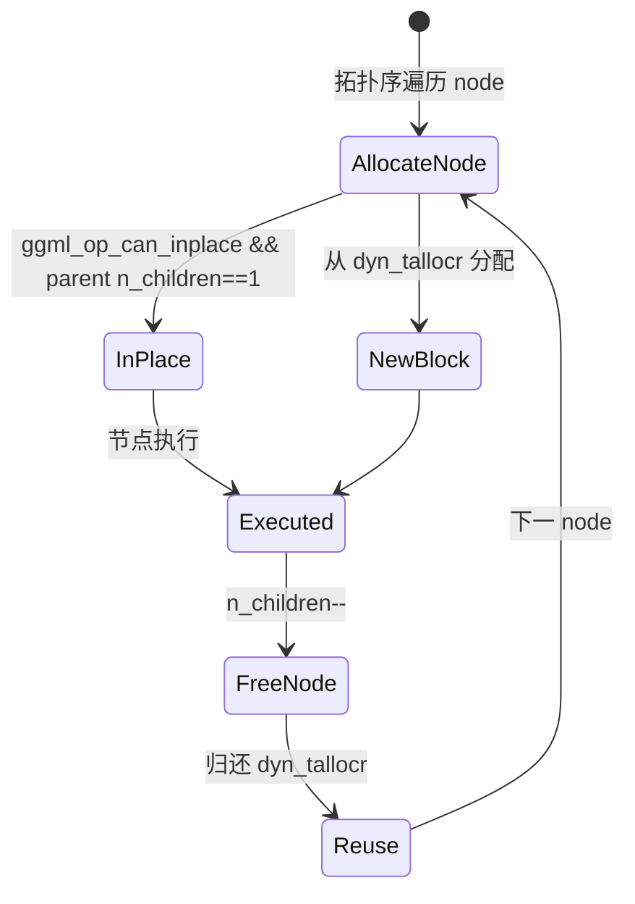

# 05 - 内存分配器

## 1. 两套内存体系

| 体系 | 文件 | 机制 | 存储内容 |
|------|------|------|----------|
| Context 级 | `ggml.c` | bump allocator | 张量/图 **元数据** |
| Backend 级 | `ggml-alloc.c` | gallocr + dyn_tallocr | 张量 **data** + in-place 复用 |

本文档聚焦 Backend 级图分配。

| 文件 | 行数 | 职责 |
|------|------|------|
| `include/ggml-alloc.h` | ~86 | 公共 API |
| `src/ggml-alloc.c` | ~1,248 | 三层分配器 |

## 2. 三层分配器

### 2.1 `ggml_tallocr` — 线性 Bump

```c
struct ggml_tallocr {
    ggml_backend_buffer_t buffer;
    size_t offset;
};
```

- `ggml_tallocr_alloc(talloc, tensor)`：顺序分配，**不可 free**
- 用途：单 buffer 内顺序加载权重

### 2.2 `ggml_dyn_tallocr` — Best-Fit 动态

| 特性 | 说明 |
|------|------|
| 算法 | best-fit 空闲块 + 合并 |
| `MAX_FREE_BLOCKS` | 256 |
| 支持 | allocate + free |
| 用途 | 图中间张量 in-place 复用 |

维护空闲块链表；节点计算完成后 `free_node` 归还块。

### 2.3 `ggml_vbuffer` — 多 Chunk

- 每个 dyn_tallocr 最多 `GGML_VBUFFER_MAX_CHUNKS=16` chunk
- `buffer_address { chunk, offset }` 跨 chunk 寻址

## 3. `struct ggml_gallocr`（实际结构 L481-495）

```c
struct ggml_gallocr {
    ggml_backend_buffer_type_t * bufts;      // [n_buffers]
    struct vbuffer ** buffers;               // [n_buffers]
    struct ggml_dyn_tallocr ** buf_tallocs;   // [n_buffers]
    int n_buffers;

    struct ggml_hash_set hash_set;
    struct hash_node * hash_values;          // [hash_set.size]

    struct node_alloc * node_allocs;           // [n_nodes]
    int n_nodes;

    struct leaf_alloc * leaf_allocs;           // [n_leafs]
    int n_leafs;
};
```

### `struct hash_node`（L458-464）

```c
struct hash_node {
    int n_children, n_views;    // 引用计数
    int buffer_id;
    struct buffer_address addr;
    bool allocated;
};
```

- `n_children`：有多少后续节点依赖此 tensor 输出
- `n_views`：view 数量
- 归零 → dyn_tallocr free

## 4. 分配流程（`ggml_gallocr_alloc_graph_impl` L717+）



步骤：

```
1. allocate_node(node)
   - view → 共享 parent addr + offset
   - in-place → 复用 parent buffer（条件见下）
   - 否则 → dyn_tallocr best-fit 分配
2. 记录 node_allocs (dst + src)
3. 节点"完成"后 free_node → n_children--
4. n_children==0 且非 OUTPUT → 归还内存
```

### In-Place 条件（L622-655）

- op 在 `ggml_op_can_inplace()` 列表
- parent `n_children == 1`
- 同 `buffer_id`
- parent 尺寸 ≥ node 尺寸

可 in-place 的 op：ADD, MUL, SCALE, SOFT_MAX, ROPE, RMS_NORM, UNARY, GLU 等。

### 永不覆盖

- `GGML_TENSOR_FLAG_OUTPUT`
- 外部已设置 `tensor->data` 或 `tensor->buffer`

## 5. 关键 API

| API | 说明 |
|-----|------|
| `ggml_gallocr_new_n(bufts, n_bufs)` | 多 buffer type |
| `ggml_gallocr_reserve(galloc, gf, node_ids, leaf_ids)` | worst-case 预分配 |
| `ggml_gallocr_alloc_graph(galloc, gf)` | 当前图分配 |
| `ggml_gallocr_free(galloc)` | 释放 |
| `ggml_gallocr_free_extra_space(galloc, node)` | in-place 尾部回收 |
| `ggml_backend_alloc_ctx_tensors_from_buft(ctx, buft)` | Context 内所有权重量一次性分配 |
| `ggml_backend_buffer_get_alloc_size(buft, tensor)` | 含 GPU padding 的对齐大小 |

## 6. 与调度器协作

```
ggml_backend_sched
  ├─ galloc (ggml_gallocr)
  │    ├─ bufts[] 对应各 Backend buffer type
  │    └─ per-split 独立 alloc_graph
  ├─ split_graph 后每个 split 单独分配
  └─ reserve(worst_case_graph) 避免运行时 realloc
```

llama.cpp：

```
初始化:
  graph_reserve(worst_case) → gallocr_reserve + sched_reserve

每次 decode:
  sched_alloc_graph(gf) → gallocr_alloc_graph
  失败 → 重新 graph_reserve
```

sched 可传入 per-node `node_buffer_ids` / `leaf_buffer_ids` 指定多 buffer 分配。

## 7. 张量 Flag 与分配

| Flag | 行为 |
|------|------|
| `INPUT` | 图开头非重叠地址 |
| `OUTPUT` | 永不 free，不被 in-place 覆盖 |
| 普通中间 | 引用计数归零即 free |

## 8. 峰值内存优化原理

示例：10 层 FFN 若每层中间张量 1GB，无复用时需 10GB；gallocr 层间复用可能只需 ~2GB 峰值（取决于图拓扑与 in-place）。

类似 **arena + free list**，但按计算图拓扑精确管理。

## 9. 非显而易见细节

1. **`ggml_backend_buffer_get_alloc_size`** 可能 > `ggml_nbytes`（GPU 对齐 padding）
2. **reserve vs alloc**：reserve 用最大 batch/n_tokens 的 worst-case 图
3. **权重**：`ggml_backend_alloc_ctx_tensors_from_buft` 不参与 gallocr 中间 free
4. **`GGML_SCHED_NO_REALLOC=1`**：调试 OOM / realloc 问题
5. **`use_counts`（cgraph）与 `n_children`（hash_node）**：共同决定生命周期

## 10. 调试建议

| 场景 | 方法 |
|------|------|
| OOM | 减小 batch；检查 reserve 是否足够 |
| 意外覆盖 | 检查 OUTPUT flag；sched_synchronize |
| realloc 频繁 | 固定 worst-case 图结构 |
| 多 GPU | 每 device 独立 buft + buffer_id |

## 相关文档

- [04-backend-scheduler.md](./04-backend-scheduler.md)
- [13-llama-cpp-integration.md](./13-llama-cpp-integration.md)
