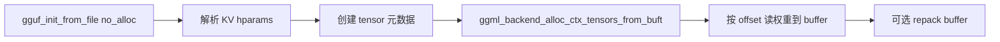

# 07 - GGUF 文件格式

## 1. 模块概述

| 文件 | 行数 | 职责 |
|------|------|------|
| `include/gguf.h` | ~210 | 公共 GGUF API |
| `src/gguf.cpp` | ~1,688 | 读写实现（C++） |

GGUF (GGML Unified Format) 是自描述模型容器，**llama.cpp 标准权重格式**。

常量（`gguf.h` L41-46）：

```c
#define GGUF_MAGIC   "GGUF"
#define GGUF_VERSION 3
#define GGUF_DEFAULT_ALIGNMENT 32
```

---

## 2. 文件布局

```
+-------------------+
| Header            |
|  magic: "GGUF"    |  4 bytes
|  version: uint32  |  当前 v3
|  n_tensors: u64   |
|  n_kv: u64        |
+-------------------+
| Metadata KV pairs |
|  for each:        |
|    key: string    |
|    type: gguf_type|
|    value          |
+-------------------+
| Tensor Info       |
|  for each:        |
|    name: string   |
|    n_dims: u32    |
|    dims: u64[]    |
|    type: ggml_type|
|    offset: u64    |
+-------------------+
| Tensor Data       |
|  raw bytes        |
|  (alignment pad)  |
+-------------------+
```

---

## 3. 核心结构（`gguf.cpp`）

### 3.1 `gguf_kv`

```c
struct gguf_kv {
    std::string key;
    enum gguf_type type;
    gguf_kv_data data;  // union
};
```

### 3.2 `gguf_tensor_info`

```c
struct gguf_tensor_info {
    struct ggml_tensor t;   // name, ne, type
    uint64_t offset;        // data blob 内字节偏移
};
```

### 3.3 `gguf_context`

| 字段 | 说明 |
|------|------|
| `version` | 文件版本 |
| `kv[]` | metadata |
| `info[]` | tensor 信息 |
| `alignment` | 数据对齐（默认 32） |
| `offset`, `size` | data 区 |
| `data` | 映射/加载的 blob 指针 |

### 3.4 `enum gguf_type`（13 种）

UINT8, INT8, UINT16, INT16, UINT32, INT32, FLOAT32, BOOL, STRING, ARRAY, UINT64, INT64, FLOAT64

ARRAY 可嵌套（如 tokenizer 词表数组）。

---

## 4. 加载 API（多入口）

| API | 行号(约) | 场景 |
|-----|----------|------|
| `gguf_init_from_file` | L979 | 文件路径 |
| `gguf_init_from_file_ptr` | L928 | FILE* |
| `gguf_init_from_buffer` | L966 | 内存 buffer |
| `gguf_init_from_callback` | L896 | **流式/自定义 IO** |
| `gguf_init_empty` | L421 | 创建空 context（写入用） |

`gguf_reader`（L230+）：统一 callback 读取，支持 `max_chunk_read` 分块。

版本检查（L506）：`version > GGUF_VERSION` 拒绝。

### 加载参数

```c
struct gguf_init_params {
    bool no_alloc;               // true: 只读 metadata
    struct ggml_context ** ctx;  // 输出 ggml context
};
```

**llama.cpp 使用 `no_alloc=true`**：

1. 解析 KV → hparams
2. 创建 ggml_tensor 元数据（`data=NULL`）
3. `ggml_backend_alloc_ctx_tensors_from_buft` → GPU/CPU buffer
4. 按 offset 读入权重

---

## 5. 写入 API

| API | 说明 |
|-----|------|
| `gguf_init_empty` | 空 context |
| `gguf_add_tensor` | 添加 tensor 元数据 |
| `gguf_set_val_*` | 设置 KV |
| `gguf_write_to_file` | 写出文件（L1609+ 写 magic） |

用于 `llama-quantize`、HF→GGUF 转换工具。

---

## 6. 常见 Metadata KV

| Key | 类型 | 说明 |
|-----|------|------|
| `general.architecture` | string | llama, qwen3, gemma3, ... |
| `general.name` | string | 模型名 |
| `general.file_type` | uint32 | `ggml_ftype` |
| `general.quantization_version` | uint32 | 对应 `GGML_QNT_VERSION` |
| `general.alignment` | uint32 | 覆盖默认 32 字节对齐 |
| `llama.context_length` | uint32 | 上下文长度 |
| `llama.embedding_length` | uint32 | hidden size |
| `llama.block_count` | uint32 | 层数 |
| `llama.attention.head_count` | uint32 | Q 头数 |
| `llama.attention.head_count_kv` | uint32 | KV 头数（GQA） |
| `tokenizer.ggml.model` | string | 分词器类型 |
| `tokenizer.ggml.tokens` | array | 词表 |
| `tokenizer.ggml.bos/eos_token_id` | uint32 | 特殊 token |
| `split.count` / `split.no` | uint16 | 分片信息 |

架构特定 KV 由 llama.cpp `llama-arch.cpp` 的 `LLM_KV_NAMES` 映射。

---

## 7. Tensor 命名规范

llama.cpp `LLM_TENSOR_INFOS` 映射：

| 模式 | 示例 | 层类型 |
|------|------|--------|
| Token embedding | `token_embd.weight` | INPUT |
| 层权重 | `blk.{i}.attn_q.weight` | REPEATING |
| FFN | `blk.{i}.ffn_gate.weight` | REPEATING |
| 输出 | `output_norm.weight` | OUTPUT |

MoE：`ffn_gate_exps.weight`、`ffn_gate_inp.weight` 等。

---

## 8. 分片（Multi-file GGUF）

```
model-00001-of-00004.gguf  (split.no=0, split.count=4)
model-00002-of-00004.gguf  (split.no=1)
...
```

`llama_model_loader` 合并所有分片 `weights_map`，统一加载。

---

## 9. 数据流（llama 加载）



---

## 10. 与旧格式对比

| 格式 | Magic | 说明 |
|------|-------|------|
| GGUF | `GGUF` | 当前标准 |
| GGML binary | `ggml` (0x67676d6c) | 已弃用 |

---

## 11. Python 工具

| 工具 | 路径 | 用途 |
|------|------|------|
| `gguf-py` | llama.cpp/gguf-py | Python 读写 |
| `convert_hf_to_gguf.py` | llama.cpp | HF → GGUF |

---

## 12. 非显而易见细节

1. **`no_alloc=true`**：tensor data 可 mmap 文件，延迟读
2. **`general.alignment`**：影响 offset 计算与 padding
3. **类型不匹配 abort**：`gguf_get_val_*` 类型错误直接终止
4. **无 ftype 时**：loader 统计 tensor 类型取众数推断
5. **callback 加载**：适合 RPC、加密存储、分块下载
6. **v3**：当前唯一支持版本

---

## 13. 读写示例

```c
// 读取
struct ggml_context * ctx = NULL;
struct gguf_init_params params = { .no_alloc = true, .ctx = &ctx };
struct gguf_context * meta = gguf_init_from_file("model.gguf", params);
const char * arch = gguf_get_val_str(meta, "general.architecture");
```

```python
# Python
import gguf
reader = gguf.GGUFReader("model.gguf")
print(reader.fields["general.architecture"].parts[0])
```

---

## 相关文档

- [06-量化系统.md](./06-量化系统.md)
- [13-与llama.cpp集成.md](./13-与llama.cpp集成.md)
- `03-推理部署/llama.cppDoc/14-模型加载器深度解析.md`
