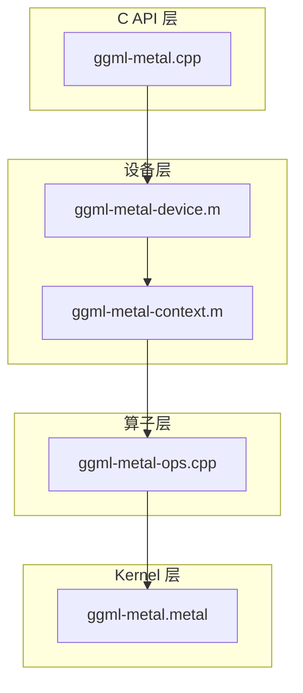

# 15 - Metal 与 Vulkan 深度解析

## 1. Metal Backend 分层架构



### 各层职责

| 层 | 文件 | 职责 |
|----|------|------|
| API | `ggml-metal.cpp` | `ggml_backend_metal_reg`、buffer type、graph_compute 入口 |
| Device | `ggml-metal-device.m` | MTLDevice、MTLBuffer、MTLCommandQueue |
| Context | `ggml-metal-context.m` | pipeline 缓存、encoder 管理 |
| Ops | `ggml-metal-ops.cpp` | 遍历 cgraph nodes → 选 pipeline → dispatch |
| Shader | `ggml-metal.metal` | 全部 MSL kernel（量化 matmul、FA、RoPE…） |
| Common | `ggml-metal-common.cpp` | 类型转换、shared 工具 |

### 关键接口

```c
bool ggml_metal_device_supports_op(ggml_metal_device_t dev, const struct ggml_tensor * op);
bool ggml_backend_metal_device_offload_op(ggml_backend_dev_t dev, const struct ggml_tensor * op);
```

`offload_op`：batch 小于阈值时不 offload 到 GPU（避免 launch 开销）。

### Buffer 类型

| 类型 | 用途 |
|------|------|
| Shared | CPU/GPU 共享（Apple Silicon 统一内存） |
| Private | 仅 GPU 访问 |
| Mapped | CPU 映射写入 + GPU 读取 |

权重通常 Shared；中间激活可能 Private。

### 构建选项

| 选项 | 说明 |
|------|------|
| `GGML_METAL=ON` | macOS 默认 |
| `GGML_METAL_EMBED_LIBRARY` | shader 嵌入二进制（免 runtime metallib） |
| `GGML_METAL_NDEBUG` | 禁用 Metal 调试 |

环境变量：`GGML_METAL_DEVICES` 模拟/选择多设备。

---

## 2. Vulkan Backend 架构

### 主控

`ggml-vulkan.cpp`（~18,696 行）：

- VkInstance/Device/Queue
- Buffer 分配与 staging
- Pipeline layout / descriptor set
- `ggml_backend_vulkan_graph_compute`：遍历 nodes dispatch

### Shader 组织

```
vulkan-shaders/
├── types.glsl              # 量化 block 类型定义（共享）
├── utils.glsl              # 工具函数
├── mul_mmq.comp            # 量化矩阵乘模板
├── mul_mat_vec_q4_k.comp   # 按类型分文件
├── flash_attn_cm2.comp     # Flash Attention 变体
├── dequant_q4_k.comp       # 反量化
├── rope_neox.comp          # RoPE 变体
└── vulkan-shaders-gen.cpp  # 编译器驱动
```

`.glsl`：类型与常量定义；`.comp`：compute shader 入口。

### Shader 生成矩阵

`vulkan-shaders-gen.cpp`：

```c
static const char * type_names[] = {
    "f32", "f16", "q4_0", "q4_1", "q4_k", "q5_k", "q6_k", "q8_0",
    "iq2_xxs", "iq3_s", ...   // 25 种
};
```

生成维度：

- 量化类型 × tile size × alignment × subgroup 模式
- MoE：`mul_mat_id*.comp`（DEFAULT/SUBGROUP 变体）
- Flash Attn：`flash_attn_cm1/cm2/mask_opt/split_k_reduce`

构建流程：

```
cmake configure (GGML_VULKAN=ON)
  → build vulkan-shaders-gen
  → 并行 glslc 编译 .comp
  → 生成 ggml-vulkan-shaders.hpp（SPIR-V 嵌入）
  → 链接 ggml-vulkan
```

`ASYNCIO_CONCURRENCY=64`：并行 shader 编译加速构建。

### 运行时选项

| 变量/选项 | 说明 |
|-----------|------|
| `GGML_DISABLE_VULKAN=1` | 运行时禁用 |
| `GGML_VULKAN_CHECK_RESULTS` | 与 CPU 结果对比（调试） |
| `GGML_VULKAN_RUN_TESTS` | 构建时跑 shader 测试 |
| `GGML_VULKAN_DEBUG` | 详细日志 |

---

## 3. WebGPU 平行体系（简述）

目录：`src/ggml-webgpu/`

- WGSL shader：`wgsl-shaders/*.wgsl`（100+ 文件）
- `embed_wgsl.py`：嵌入 shader 二进制
- 与 Vulkan 类似的算子覆盖（mul_mat、flash_attn、rope…）
- 目标：浏览器 / Dawn runtime

CMake：`GGML_WEBGPU=ON`

---

## 4. Metal vs Vulkan 对照

| 维度 | Metal | Vulkan |
|------|-------|--------|
| 平台 | Apple only | 跨平台 GPU |
| Shader | MSL（.metal） | GLSL→SPIR-V（.comp） |
| 编译 | metallib / embed | glslc + gen 矩阵 |
| 内存 | 统一内存优势 | 显式 staging |
| 默认 | macOS 自动 | 需 `-DGGML_VULKAN=ON` |
| 量化覆盖 | .metal 内 kernel | 132+ comp 变体 |

---

## 5. 调试建议

| 问题 | Metal | Vulkan |
|------|-------|--------|
| 算子不支持 | 查 supports_op 日志 | 查 supports_op + shader 是否存在 |
| 错误结果 | `GGML_METAL_DEBUG` | `GGML_VULKAN_CHECK_RESULTS` |
| 构建慢 | embed library | 减少并行度或 ccache |
| OOM | 减 batch / ctx | 同左 |

---

## 相关文档

- [09-GPU后端.md](./09-GPU后端.md)
- [10-其他后端.md](./10-其他后端.md)
- [06-量化系统.md](./06-量化系统.md)
