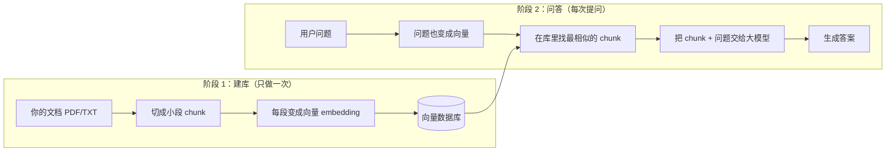

# 00 - 什么是 RAG？（5 分钟读懂）

## 一句话

**RAG = 先查资料，再让 AI 回答。**

就像开卷考试：题目来了，你先去书里找相关段落，再根据段落写答案——而不是凭记忆瞎编。

## 为什么需要 RAG？

| 问题 | 没有 RAG | 有 RAG |
|------|----------|--------|
| 公司退货政策 | 模型可能编造 | 从真实文档检索后回答 |
| 最新产品手册 | 训练数据过时 | 你上传的文档就是知识源 |
| 私有数据 | 不能发给 OpenAI 训练 | 只在你本地/向量库里 |

## RAG 两步走



### 阶段 1：建库（Ingestion / 索引）

1. **读文档**：把 `data/` 里的 txt、pdf 读进来
2. **切分**：长文切成 512 字左右的小块（chunk）
3. **向量化**：每块用 Embedding 模型变成一串数字（向量）
4. **存储**：向量存进「向量数据库」，原文也一起存

### 阶段 2：问答（Query）

1. **用户提问**：「7 天内能退货吗？」
2. **检索**：把问题也向量化，找最相似的几个 chunk
3. **生成**：把检索到的 chunk 和问题一起发给 LLM
4. **回答**：LLM 根据资料生成答案

## LlamaIndex 在这两步里干什么？

**LlamaIndex 就是帮你把上面这些步骤串起来的 Python 框架**，不用自己写切分、向量、检索、拼 Prompt。

| RAG 步骤 | 你听到的词 | LlamaIndex 里叫什么 |
|----------|-----------|---------------------|
| 读文档 | 加载 | `SimpleDirectoryReader` |
| 一份完整资料 | 文档 | `Document` |
| 切分后的小段 | chunk | `TextNode` |
| 建向量库 | 索引 | `VectorStoreIndex` |
| 向量数据库 | vector store | `SimpleVectorStore` / Qdrant 等 |
| 根据问题找资料 | 检索 | `Retriever` |
| 查完再生成答案 | RAG 查询 | `QueryEngine` |
| 大模型 | LLM | `Settings.llm` |
| 向量化模型 | Embedding | `Settings.embed_model` |

## 和 ChatGPT 直接问的区别

```
直接问 ChatGPT：
  你 → ChatGPT → 答案（可能胡编）

RAG + LlamaIndex：
  你 → 检索你的文档 → 把文档片段塞进 Prompt → LLM → 有依据的答案
```

## 本仓库里还能在哪看到 RAG？

| 项目 | 说明 |
|------|------|
| `07-业务应用/kefu-kb/` | 自研 FastAPI 客服知识库（简化版 RAG） |
| `05-RAG/llama_index/` | LlamaIndex 框架源码 |
| `03-推理部署/llama.cpp` | 本地大模型服务（llama-server） |

kefu-kb 和 LlamaIndex **做的是同一类事**，只是 kefu-kb 手写流程，LlamaIndex 用框架封装。

## 入门需要提前知道的事

1. **需要两个模型能力**：Embedding（向量化）+ LLM（生成答案），可以都是 llama-server，也可以 Embedding 用本地 sentence-transformers
2. **要先建库再问答**：第一次要跑「读文档 → 建索引」，之后才能 `query`
3. **不是魔法**：检索不到相关内容时，答案仍会不准——文档里得真有答案

## 下一步

→ [01-安装与环境.md](./01-安装与环境.md)：装 Python 包  
→ [02-五分钟第一个RAG.md](./02-五分钟第一个RAG.md)：跑通第一个完整例子

进阶源码分析见上级目录 [01-project-overview.md](../01-project-overview.md)。
