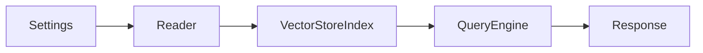

# 02 - 五分钟第一个 RAG

本篇目标：**复制粘贴就能跑**（本地 llama-server 版）。  
若你用 OpenAI，看文末「OpenAI 极简版」。

## 第 0 步：确认 llama-server 在跑

至少需要 **Embedding 服务**（建索引用）。Chat 可以后面再加。

```bash
# 示例：embedding 端口 8081（按你实际模型路径改）
# /path/to/llama-server -m bge-m3.gguf --embedding --port 8081 --host 0.0.0.0
curl http://127.0.0.1:8081/v1/models
```

能返回 JSON 即可。双端口部署见 [07-对接llama-server.md](./07-对接llama-server.md)。

## 第 1 步：完整脚本

保存为 `~/rag_demo/app.py`：

```python
#!/usr/bin/env python3
"""LlamaIndex 最小 RAG 示例 — 本地 llama-server"""

from llama_index.core import (
    Settings,
    VectorStoreIndex,
    SimpleDirectoryReader,
    PromptTemplate,
)
from llama_index.core.node_parser import SentenceSplitter
from llama_index.llms.openai_like import OpenAILike
from llama_index.embeddings.openai_like import OpenAILikeEmbedding

# ========== 1. 全局配置（必须写在建索引之前）==========
Settings.llm = OpenAILike(
    model="Qwen2.5-7B-Instruct",       # 与 llama-server --model 一致
    api_base="http://127.0.0.1:8080/v1",
    api_key="not-needed",
    is_chat_model=True,                 # llama-server 对话必须 True
    context_window=8192,
    temperature=0.1,
)
Settings.embed_model = OpenAILikeEmbedding(
    model_name="bge-m3",                # 注意是 model_name
    api_base="http://127.0.0.1:8081/v1",
    api_key="not-needed",
    embed_batch_size=8,
)
Settings.node_parser = SentenceSplitter(chunk_size=256, chunk_overlap=32)

# ========== 2. 读文档 ==========
documents = SimpleDirectoryReader(
    input_dir="./data",
    recursive=True,
).load_data(show_progress=True)
print(f"已加载 {len(documents)} 个文档")

# ========== 3. 建索引（切分 + 向量化 + 存库）==========
index = VectorStoreIndex.from_documents(documents, show_progress=True)

# ========== 4. 问答 ==========
qa_prompt = PromptTemplate(
    "你是客服助手。仅根据以下资料回答；资料中没有的内容请说「暂无相关信息」。\n\n"
    "【资料】\n{context_str}\n\n"
    "【问题】{query_str}\n\n"
    "【回答】"
)
query_engine = index.as_query_engine(
    similarity_top_k=3,
    text_qa_template=qa_prompt,
    response_mode="compact",
)

question = "定制类商品能退货吗？"
response = query_engine.query(question)

print("\n=== 问题 ===")
print(question)
print("\n=== 回答 ===")
print(response)
print("\n=== 引用来源（前 2 条）===")
for i, node in enumerate(response.source_nodes[:2], 1):
    print(f"[{i}] score={node.score:.3f}")
    print(node.node.get_content()[:200], "...\n")
```

## 第 2 步：运行

```bash
cd ~/rag_demo
source .venv/bin/activate   # 若用了虚拟环境
python app.py
```

### 期望输出

- 加载 1 个文档
- 建索引有进度条
- 回答类似：**定制类商品不支持退货**（来自你的 txt）
- `source_nodes` 里能看到「定制类商品不支持退货」那段原文

## 五步法对照（记住这个顺序）

| 步骤 | 代码 | 在干什么 |
|------|------|----------|
| ① 配置 | `Settings.llm` / `embed_model` | 告诉框架用哪个模型 |
| ② 加载 | `SimpleDirectoryReader(...).load_data()` | 读文件 → `Document` |
| ③ 索引 | `VectorStoreIndex.from_documents(docs)` | 切分 → 向量化 → 入库 |
| ④ 引擎 | `index.as_query_engine(...)` | 组装「检索 + 生成」 |
| ⑤ 提问 | `query_engine.query("...")` | 一次完整 RAG |



## 如果某一步失败了

| 失败位置 | 可能原因 | 去看 |
|----------|----------|------|
| import 报错 | 包没装全 | [01-安装与环境.md](./01-安装与环境.md) |
| embed 连接拒绝 | 8081 没起 llama-server | [07-对接llama-server.md](./07-对接llama-server.md) |
| OPENAI_API_KEY | 没配 Settings 就用默认 OpenAI | [04-Settings必知必会.md](./04-Settings必知必会.md) |
| 加载 0 个文档 | `data/` 空或路径错 | [05-读文档与切分.md](./05-读文档与切分.md) |
| 答案胡编 | 检索不到 chunk，调 `similarity_top_k` | [06-索引与查询.md](./06-索引与查询.md) |

完整排错：[08-常见报错与修复.md](./08-常见报错与修复.md)

## OpenAI 极简版（有 API Key 时）

```python
import os
os.environ["OPENAI_API_KEY"] = "sk-..."

from llama_index.core import VectorStoreIndex, SimpleDirectoryReader

docs = SimpleDirectoryReader("./data").load_data()
index = VectorStoreIndex.from_documents(docs)
engine = index.as_query_engine()
print(engine.query("定制类商品能退货吗？"))
```

无需手动 `Settings`——默认就用 OpenAI 的 LLM 和 Embedding（**会消耗 API 额度**）。

## 持久化（下次不用重建索引）

在脚本末尾加：

```python
index.storage_context.persist(persist_dir="./storage")
print("索引已保存到 ./storage")
```

下次启动改为：

```python
from llama_index.core import StorageContext, load_index_from_storage

storage_context = StorageContext.from_defaults(persist_dir="./storage")
index = load_index_from_storage(storage_context)
query_engine = index.as_query_engine()
```

详见 [06-索引与查询.md](./06-索引与查询.md)。

## 下一步

→ [03-核心概念对照表.md](./03-核心概念对照表.md)：理解 Document、Node、Index  
→ [04-Settings必知必会.md](./04-Settings必知必会.md)：为什么第 ① 步不能省
