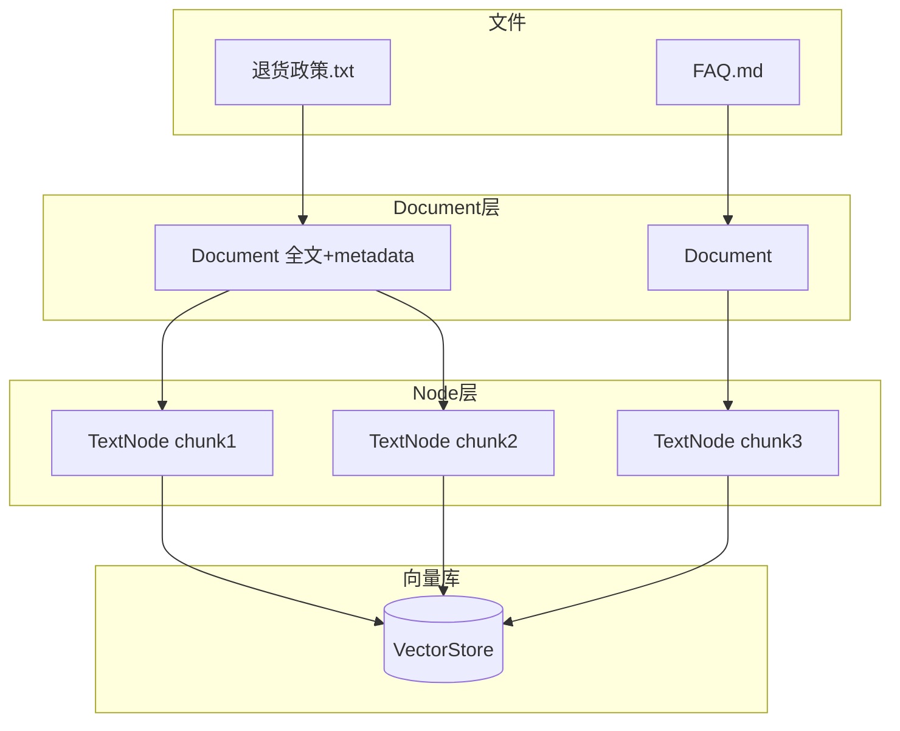

# 03 - 核心概念对照表（小白版）

## 一张图看懂数据怎么流动



**记住**：检索时找的是 **Node（chunk）**，不是整份 Document。

## 概念对照表

| 通俗说法 | LlamaIndex 类/对象 | 代码里常见操作 |
|----------|-------------------|--------------|
| 一整份文件内容 | `Document` | `reader.load_data()` 得到 |
| 文件路径、标题等 | `metadata` 字典 | `doc.metadata["file_name"]` |
| 切分后的一小段 | `TextNode`（属于 `BaseNode`） | 自动由 `SentenceSplitter` 生成 |
| 切分规则 | `SentenceSplitter` | `Settings.node_parser` |
| 把文字变成数字向量 | Embedding 模型 | `Settings.embed_model` |
| 存向量的地方 | `VectorStore` | 默认内存 `SimpleVectorStore` |
| 索引（整个知识库） | `VectorStoreIndex` | `from_documents()` / `from_vector_store()` |
| 用户的问题 | `str` 或 `QueryBundle` | `query_engine.query("...")` |
| 检索到的段落+相关度 | `NodeWithScore` | `response.source_nodes` |
| 检索器 | `Retriever` | `index.as_retriever()` |
| 检索+生成一体 | `QueryEngine` | `index.as_query_engine()` |
| 最终答案对象 | `Response` | `response.response` 才是字符串 |
| 大模型 | `LLM` | `Settings.llm` |
| 全局默认配置 | `Settings` | 单例，全进程共享 |

## Document vs Node（最重要）

| | Document | TextNode |
|---|----------|----------|
| 粒度 | 通常 = 一个文件或一条记录 | 几百字的一小块 |
| 谁创建 | Reader | NodeParser 切分 Document |
| 谁进向量库 | 不直接进 | **进** VectorStore |
| 类比 | 一整章 | 书里的一小节 |

**为什么要切分？**  
Embedding 和检索都有长度限制；小块更精准（问「退货」不会整本书都匹配）。

## Index / Retriever / QueryEngine 关系

```
VectorStoreIndex          ← 你建的「知识库」
    │
    ├─ as_retriever()     ← 只负责「找资料」
    │
    └─ as_query_engine()  ← 找资料 + 调 LLM 写答案
            │
            内部 = Retriever + ResponseSynthesizer + LLM
```

只想看检索结果、不生成答案：

```python
retriever = index.as_retriever(similarity_top_k=5)
nodes = retriever.retrieve("退货政策")
for n in nodes:
    print(n.score, n.node.get_content()[:100])
```

## Settings 管什么

| Settings 字段 | 默认值从哪来 | 影响哪一步 |
|---------------|-------------|-----------|
| `embed_model` | 未设 → 尝试 OpenAI | **建索引**时向量化 |
| `llm` | 未设 → 尝试 OpenAI | **查询**时生成答案 |
| `node_parser` | `SentenceSplitter` | **建索引**时切分 |
| `transformations` | 含 node_parser | IngestionPipeline 用 |

⚠️ **embed_model 必须在 `from_documents` 之前设好**，否则用旧索引的向量维度可能对不上。

## Response 对象别搞错

```python
response = query_engine.query("问题")

response          # Response 对象（打印不是纯 str）
response.response # str，最终答案文本 ✅
response.source_nodes  # 引用来源 List[NodeWithScore]
response.metadata      # 额外信息
```

## 从 `llama_index.core` 能直接 import 什么

```python
from llama_index.core import (
    Document,
    Settings,
    VectorStoreIndex,
    SimpleDirectoryReader,
    StorageContext,
    load_index_from_storage,
    QueryBundle,
    PromptTemplate,
    get_response_synthesizer,
)
```

**不在顶层、但常用**：

```python
from llama_index.core.schema import TextNode, NodeWithScore
from llama_index.core.node_parser import SentenceSplitter
from llama_index.core.ingestion import IngestionPipeline
```

## 入门阶段可以先不学的

| 模块 | 什么时候再学 |
|------|-------------|
| Agent / Workflow | 要做工具调用、多步任务时 |
| KnowledgeGraphIndex | 要做知识图谱时 |
| RouterQueryEngine | 多个知识库路由时 |
| 300+ integrations | 用到具体厂商时再装对应包 |

## 下一步

→ [04-Settings必知必会.md](./04-Settings必知必会.md)  
→ 源码级说明：[03-数据模型与节点体系.md](../03-数据模型与节点体系.md)
