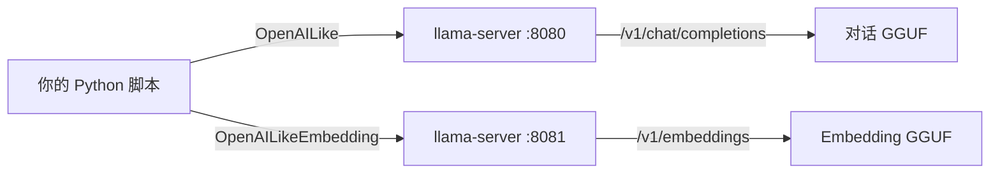

# 07 - 对接 llama-server（本地大模型）

## 架构图

LlamaIndex **不直接**加载 GGUF，而是通过 **OpenAI 兼容 HTTP API** 调用 llama-server：



与 `07-业务应用/kefu-kb` 相同思路：HTTP + `/v1` 前缀。

## 推荐：双端口部署

对话和 Embedding **可以用两个 llama-server 进程**（模型不同）：

```bash
# 终端 1：对话模型
/path/to/llama-server \
  -m /path/to/Qwen2.5-7B-Instruct-Q4_K_M.gguf \
  --host 0.0.0.0 --port 8080 \
  -c 8192

# 终端 2：Embedding 模型
/path/to/llama-server \
  -m /path/to/bge-m3-Q8_0.gguf \
  --embedding \
  --host 0.0.0.0 --port 8081 \
  -c 2048
```

验证：

```bash
curl http://127.0.0.1:8080/v1/models
curl http://127.0.0.1:8081/v1/models
curl http://127.0.0.1:8081/v1/embeddings \
  -H "Content-Type: application/json" \
  -d '{"model":"bge-m3","input":["测试"]}'
```

## Python 配置模板

```python
from llama_index.core import Settings
from llama_index.llms.openai_like import OpenAILike
from llama_index.embeddings.openai_like import OpenAILikeEmbedding
from llama_index.core.node_parser import SentenceSplitter

Settings.llm = OpenAILike(
    model="Qwen2.5-7B-Instruct",      # 与 server 暴露的 model id 一致
    api_base="http://127.0.0.1:8080/v1",
    api_key="not-needed",
    is_chat_model=True,
    context_window=8192,
    temperature=0.1,
    request_timeout=120.0,
)

Settings.embed_model = OpenAILikeEmbedding(
    model_name="bge-m3",
    api_base="http://127.0.0.1:8081/v1",
    api_key="not-needed",
    embed_batch_size=8,
)

Settings.node_parser = SentenceSplitter(chunk_size=256, chunk_overlap=32)
```

## 单端口：只用 chat 模型做 Embedding？

**不推荐**。多数 instruct 模型 embedding 质量差或未实现 `/v1/embeddings`。

kefu-kb 的做法更合理：

- **Embedding**：本地 `sentence-transformers` 或专用 embedding server
- **Chat**：llama-server

若坚持用 LlamaIndex + 单 server，需确认该 GGUF 支持 `--embedding` 且质量可接受。

## 与 kefu-kb 对照

| 能力 | kefu-kb | LlamaIndex |
|------|---------|------------|
| Embedding | `app/embedder.py`（local 或 HTTP） | `Settings.embed_model` |
| 向量库 | Qdrant local | `QdrantVectorStore` 或内存 |
| 检索 | `app/retriever.py` | `index.as_retriever()` |
| 生成 | HTTP chat | `Settings.llm` + QueryEngine |
| Web UI | FastAPI 自带 | 需自己写 FastAPI 或 CLI |

迁移 kefu-kb 到 LlamaIndex：保留 Qdrant collection，换 ingest/query 为 LlamaIndex API。

## 对接 vLLM（可选）

vLLM 也提供 OpenAI 兼容 API，配置相同，只改 `api_base`：

```python
Settings.llm = OpenAILike(
    model="meta-llama/Llama-3.2-3B",
    api_base="http://127.0.0.1:8000/v1",
    api_key="not-needed",
    is_chat_model=True,
)
```

详见 `03-推理部署/vllmDoc/11-llama-cpp-integration.md`。

## 单进程 llama-server 同时 chat + embed

若模型支持且显存够，可只起一个 server（以你本地实测为准）：

```bash
llama-server -m model.gguf --port 8080 --embedding
```

则 LLM 和 Embedding 都用 `api_base="http://127.0.0.1:8080/v1"`，但 `model` / `model_name` 仍要填对。

## 下一步

→ [08-常见报错与修复.md](./08-常见报错与修复.md)  
→ 进阶：[13-llama-cpp-integration.md](../13-llama-cpp-integration.md)
