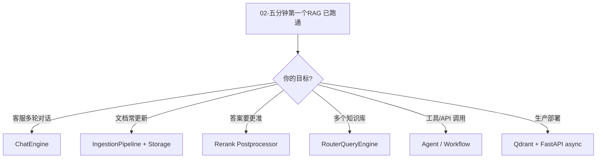

# 09 - 进阶可选模块（入门之后）

入门跑通 RAG 后，按需求选读下面模块。**不必一次全学**。

## 学习路线建议



## ChatEngine（多轮对话）

单轮 `query_engine.query()` 不带记忆；客服需要 **ChatEngine**：

```python
chat_engine = index.as_chat_engine(
    chat_mode="context",           # 或 condense_question
    similarity_top_k=5,
)

response = chat_engine.chat("退货要几天？")
response = chat_engine.chat("那定制商品呢？")  # 能理解上文
```

| chat_mode | 说明 |
|-----------|------|
| `context` | 每轮检索 + 带历史 |
| `condense_question` | 先把多轮问题合成一句再检索 |
| `simple` | 简单拼接历史 |

详见 [09-chat-engine.md](../09-chat-engine.md)。

## IngestionPipeline（生产摄取）

文档经常增删改时用 Pipeline，支持 **缓存、去重、并行**：

```python
from llama_index.core.ingestion import IngestionPipeline
from llama_index.core.node_parser import SentenceSplitter

pipeline = IngestionPipeline(
    transformations=[SentenceSplitter(chunk_size=256, chunk_overlap=32)],
    vector_store=vector_store,
)
pipeline.run(documents=new_docs, show_progress=True, num_workers=4)
```

详见 [05-ingestion-pipeline.md](../05-ingestion-pipeline.md)。

## Rerank（检索二次排序）

先多检索几个 chunk，再用 rerank 模型筛 top N，**提高答案准确度**：

```python
from llama_index.core.postprocessor import SimilarityPostprocessor

# 简单：按相似度阈值过滤
processor = SimilarityPostprocessor(similarity_cutoff=0.7)

engine = index.as_query_engine(
    similarity_top_k=10,
    node_postprocessors=[processor],
)
```

高级：CohereRerank、SentenceTransformerRerank（需装集成包）。  
kefu-kb 的 rerank 步骤等价于此层。

## RouterQueryEngine（多知识库）

FAQ 一个库、产品手册一个库：

```python
from llama_index.core.query_engine import RouterQueryEngine
from llama_index.core.tools import QueryEngineTool

tools = [
    QueryEngineTool.from_defaults(query_engine=faq_engine, description="常见问题"),
    QueryEngineTool.from_defaults(query_engine=policy_engine, description="售后政策"),
]
router = RouterQueryEngine.from_defaults(query_engine_tools=tools)
```

## Agent / Workflow（工具调用）

要让 LLM **查数据库、调 API、算计算器**，进入 Agent 领域：

- `llama_index.core.agent` — ReAct 等
- `llama_index.core.workflow` — 事件驱动流程

入门 **可先跳过**，见 [10-agent-workflow.md](../10-agent-workflow.md)。

## 持久化与 StorageContext

| 需求 | 文档 |
|------|------|
| persist 到本地目录 | [06-索引与查询](./06-索引与查询.md) |
| DocStore / IndexStore 细节 | [12-storage.md](../12-storage.md) |

## 集成插件（300+ 包）

按需安装，不必全装：

| 需求 | 包 |
|------|-----|
| Qdrant | `llama-index-vector-stores-qdrant` |
| Ollama | `llama-index-llms-ollama` |
| HuggingFace 本地模型 | `llama-index-llms-huggingface` 等 |
| Cohere Rerank | `llama-index-postprocessor-cohere-rerank` |

模式见 [11-integrations.md](../11-integrations.md)。

## 练习题

### 练习 1：换自己的 txt

把公司/课程 notes 放进 `data/`，改 3 个问题测试 `source_nodes`。

### 练习 2：persist

建索引后 `persist`，重启脚本只 `load_index_from_storage` 再 query。

### 练习 3：接 Qdrant

用本地 Qdrant path 模式建库，对比与 kefu-kb 的 `data/qdrant_storage`。

## 进入源码级文档

| 主题 | 文档 |
|------|------|
| 项目总览 | [01-project-overview.md](../01-project-overview.md) |
| 架构 | [02-architecture.md](../02-architecture.md) |
| 数据模型 | [03-data-model.md](../03-data-model.md) |
| API 速查 | [14-api-reference.md](../14-api-reference.md) |

## 与本仓库项目联动

| 项目 | 建议 |
|------|------|
| `kefu-kb` | 用 LlamaIndex 重写 ingest/query，保留 Web UI |
| `llama.cpp` | 继续作 LLM/Embedding 后端 |
| `LLaMA-Factory` | 训练 LoRA 后再转 GGUF 给 llama-server |
