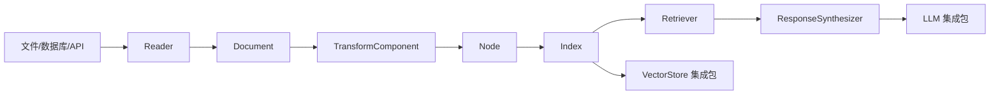

# 01 - LlamaIndex 0.14.23 项目总览

> 分析基线：本地源码 `llama_index`，根包与 `llama-index-core` 的版本均为 **0.14.23**。本文中的路径均相对该源码根目录。

## 1. 项目定位

LlamaIndex 不是单一“向量库客户端”，而是连接数据、索引、检索、LLM 与工作流的编排框架。核心包只定义稳定抽象和默认实现，厂商能力由独立集成包提供：



核心入口位于 `llama-index-core/llama_index/core/__init__.py`，常用的 `Document`、`VectorStoreIndex`、`Settings`、`StorageContext` 等由这里重导出。

## 2. Monorepo 与发行包

### 2.1 根元包不是“全部源码”

根 `pyproject.toml` 定义 PyPI 元包 `llama-index==0.14.23`。它只直接依赖：

- `llama-index-core>=0.14.23,<0.15.0`
- `llama-index-embeddings-openai>=0.6.0,<0.7`
- `llama-index-llms-openai>=0.7.0,<0.8`
- `nltk>=3.9.3`

因此 `pip install llama-index` 得到 core 和 OpenAI 默认集成，并不会安装 monorepo 中所有集成。生产项目通常显式安装所需包，例如 `llama-index-vector-stores-qdrant`。

### 2.2 目录与责任边界

```text
llama_index/
├── pyproject.toml                         # 元包 llama-index 0.14.23
├── _llama-index/llama_index/              # 元包 wheel 的轻量命名空间内容
├── llama-index-core/
│   ├── pyproject.toml                     # llama-index-core 0.14.23
│   └── llama_index/core/                  # 框架抽象与默认实现
├── llama-index-integrations/
│   ├── llms/                              # llama_index.llms.<vendor>
│   ├── embeddings/                        # llama_index.embeddings.<vendor>
│   ├── vector_stores/                     # llama_index.vector_stores.<vendor>
│   ├── readers/                           # llama_index.readers.<vendor>
│   └── ...
├── llama-index-utils/                     # 可独立发行的工具包
├── docs/                                  # 官方文档源文件
└── scripts/                               # 发布、检查与维护脚本
```

### 2.3 PEP 420 命名空间包

各发行包都向同一个顶层 `llama_index` 命名空间写入不同子目录。源码中没有统一的 `llama_index/__init__.py`，而是分别提供：

```text
llama-index-core/llama_index/core/
llama-index-integrations/llms/.../llama_index/llms/openai/
llama-index-integrations/vector_stores/.../llama_index/vector_stores/qdrant/
```

这利用 PEP 420 隐式命名空间包，使多个 wheel 可以共同组成：

```python
from llama_index.core import VectorStoreIndex
from llama_index.llms.openai import OpenAI
from llama_index.vector_stores.qdrant import QdrantVectorStore
```

集成包自己的 `pyproject.toml` 声明 core 的兼容区间。例如 OpenAI LLM 集成的 `import_path` 是 `llama_index.llms.openai`，并依赖 `llama-index-core>=0.14.5,<0.15`。

**陷阱：**

1. 不要在应用中创建普通的 `llama_index/__init__.py`，否则可能遮蔽 namespace 中其他发行包。
2. monorepo 中目录版本不保证都等于元包版本；应分别看各包 `pyproject.toml`。
3. 看到源码目录不代表当前 Python 环境已安装该集成包。

## 3. Core 分层地图

| 层 | 关键路径 | 主要类型/入口 |
|---|---|---|
| Schema | `llama-index-core/llama_index/core/schema.py` | `BaseNode`、`Node`、`Document`、`QueryBundle` |
| 配置 | `.../core/settings.py` | `_Settings`、模块级单例 `Settings` |
| 数据读取 | `.../core/readers/base.py`、`readers/file/` | `BaseReader`、`SimpleDirectoryReader` |
| 变换与切分 | `.../core/schema.py`、`node_parser/` | `TransformComponent`、`SentenceSplitter` |
| 摄取 | `.../core/ingestion/pipeline.py` | `IngestionPipeline.run/arun` |
| 索引 | `.../core/indices/base.py` | `BaseIndex.from_documents` |
| 向量索引 | `.../core/indices/vector_store/base.py` | `VectorStoreIndex` |
| 检索 | `.../core/base/base_retriever.py` | `BaseRetriever.retrieve/aretrieve` |
| 查询 | `.../core/base/base_query_engine.py` | `BaseQueryEngine.query/aquery` |
| 标准 RAG | `.../core/query_engine/retriever_query_engine.py` | `RetrieverQueryEngine` |
| 合成 | `.../core/response_synthesizers/` | `BaseSynthesizer`、`get_response_synthesizer` |
| 存储 | `.../core/storage/storage_context.py` | `StorageContext` |
| 可观测性 | `.../core/callbacks/`、`instrumentation/` | `CallbackManager`、dispatcher/span/event |
| Agent/工作流 | `.../core/agent/workflow/`、`workflow/` | `FunctionAgent`、`ReActAgent`、Workflow |

## 4. 关键设计

### 4.1 数据对象统一

0.14.23 的准确继承链是：

```text
BaseComponent
└── BaseNode (抽象)
    ├── Node (多模态资源容器)
    │   └── Document
    └── TextNode (兼容旧数据模型)
        ├── ImageNode
        └── IndexNode
```

即 **`Document(Node) -> Node(BaseNode)`**，不是 `Document` 直接继承 `BaseNode`，也不是继承 `TextNode`。`Node` 通过 `MediaResource` 持有文本、图像、音频和视频；详见 `03-数据模型与节点体系.md`。

### 4.2 组合式查询

标准查询引擎不是“索引自身生成答案”，而是组合：

```text
RetrieverQueryEngine
├── BaseRetriever
├── List[BaseNodePostprocessor]
└── BaseSynthesizer
    └── LLM
```

`BaseIndex.as_query_engine()` 先调用具体索引的 `as_retriever()`，再调用 `RetrieverQueryEngine.from_args()`。这使检索、重排、合成和模型都可独立替换。

### 4.3 默认值与局部覆盖

`Settings = _Settings()` 是进程内模块级单例，但属性按首次访问惰性初始化。构造组件时常见模式是：

```python
self._embed_model = resolve_embed_model(embed_model or Settings.embed_model)
llm = resolve_llm(llm) if llm else Settings.llm
```

因此显式参数是局部覆盖，未传时才读取全局默认。多租户服务应优先局部注入，不应在并发请求中反复修改 `Settings`。

### 4.4 同步/异步并非自动等价

框架通常提供成对 API：

- `BaseRetriever.retrieve()` / `aretrieve()`
- `BaseQueryEngine.query()` / `aquery()`
- `IngestionPipeline.run()` / `arun()`
- `BaseIndex.insert()` / `ainsert()`

但基类可能用同步方法兜底：`BaseRetriever._aretrieve()` 默认直接调用 `_retrieve()`；向量库 `aquery()` 的协议默认也可回落到同步 `query()`。只有具体集成真正实现异步 I/O 时，异步路径才不会阻塞事件循环。

## 5. 扩展点

| 目标 | 继承/实现 | 注册位置 |
|---|---|---|
| 新数据源 | `BaseReader` | 独立 `llama-index-readers-*` 包 |
| 新切分/清洗 | `TransformComponent.__call__/acall` | `Settings.transformations` 或 `IngestionPipeline` |
| 新嵌入 | `BaseEmbedding` | 索引 `embed_model=` 局部注入 |
| 新向量库 | `BasePydanticVectorStore` | `StorageContext.from_defaults(vector_store=...)` |
| 新检索策略 | `BaseRetriever._retrieve/_aretrieve` | `RetrieverQueryEngine` |
| 新重排器 | `BaseNodePostprocessor` | `node_postprocessors=` |
| 新合成策略 | `BaseSynthesizer` | `response_synthesizer=` |
| 新 LLM | `LLM` | `llm=` 或 `Settings.llm` |

## 6. 已废弃与兼容层

- `ServiceContext`、`ServiceContext.from_defaults()` 和 `set_global_service_context()` 在 0.14.23 中会直接抛 `ValueError`；应使用 `Settings` 或构造参数局部注入。
- `TextNode` 的类注释明确为 backward compatibility；新多模态模型以 `Node + MediaResource` 为主，但大量现有解析器/存储仍会产出和接受 `TextNode`，不能简单删除。
- `Document(text=...)`、`doc_id`、`extra_info` 仍为兼容入口；规范字段是 `text_resource`、`id_`、`metadata`。
- `BaseIndex.delete/update/refresh` 会记录 deprecated 警告；分别迁移到 `delete_ref_doc`、`update_ref_doc`、`refresh_ref_docs` 及其异步版本。
- `KnowledgeGraphIndex` 与 `KnowledgeGraphQueryEngine` 已显式 deprecated，属性图场景优先研究 `PropertyGraphIndex`。
- `ChatMode.REACT`、`ChatMode.OPENAI` 已删除并抛错；使用 `llama_index.core.agent.workflow` 中的 `ReActAgent` 或 `FunctionAgent`。

## 7. 推荐源码阅读顺序

1. `pyproject.toml` 与 `llama-index-core/pyproject.toml`：确认版本、元包和依赖边界。
2. `llama-index-core/llama_index/core/__init__.py`：认识公开 API。
3. `.../core/schema.py`：理解 `Document -> Node -> BaseNode` 和查询数据。
4. `.../core/settings.py`：理解惰性默认值与注入。
5. `.../core/indices/base.py`：跟踪 `from_documents()` 和 `as_query_engine()`。
6. `.../core/indices/vector_store/base.py`：跟踪嵌入、批写和存储分工。
7. `.../core/indices/vector_store/retrievers/retriever.py`：跟踪查询向量与节点回填。
8. `.../core/query_engine/retriever_query_engine.py`：跟踪检索、后处理、合成。
9. `.../core/ingestion/pipeline.py`：再看缓存、去重、并行与异步。
10. 最后按需要进入某个 `llama-index-integrations/*` 包，核对具体厂商实现。

