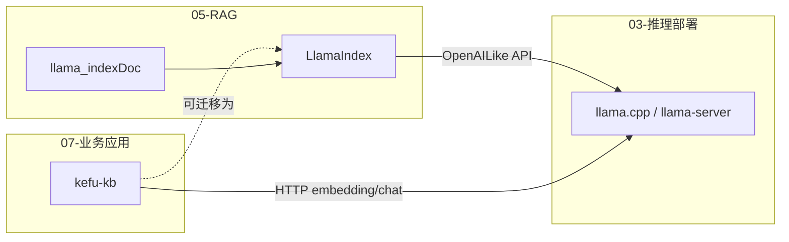

# 01 - 项目总览

## 定位

**LlamaIndex** 是 Python 生态中主流的 **RAG（检索增强生成）编排框架**，在 LLM 与私有数据之间提供统一抽象层：

- **数据连接**：Reader 加载 PDF、网页、数据库等
- **索引构建**：切分、嵌入、写入向量库 / 图库
- **检索编排**：多种 Retriever、后处理、重排序
- **生成合成**：QueryEngine / ChatEngine 调用 LLM 生成答案
- **Agent 扩展**：工具调用、Workflow 状态机

与 LangChain 类似但侧重 **索引与检索流水线**；大量能力通过独立 PyPI 包以插件形式扩展。

## Monorepo 结构

```
llama_index/
├── pyproject.toml                 # 元包 llama-index 0.14.23
├── llama-index-core/              # 核心：schema、index、query、agent
│   └── llama_index/core/          # 475+ Python 模块
├── llama-index-integrations/      # 按类别拆分的 300+ 集成包
│   ├── llms/                      # OpenAI、Ollama、OpenAILike、LlamaCPP…
│   ├── embeddings/
│   ├── vector_stores/             # Qdrant、Chroma、Milvus…
│   ├── readers/
│   ├── postprocessor/             # CohereRerank 等
│   ├── tools/
│   └── …
├── llama-index-utils/             # Azure、HuggingFace 等工具
├── docs/                          # 官方文档 Markdown
└── scripts/                       # 发布、健康检查脚本
```

## 命名空间约定

| 包类型 | import 路径 | 示例 |
|--------|-------------|------|
| 核心 | `llama_index.core.*` | `VectorStoreIndex`, `Settings` |
| LLM 集成 | `llama_index.llms.*` | `OpenAILike`, `Ollama` |
| Embedding | `llama_index.embeddings.*` | `OpenAILikeEmbedding` |
| VectorStore | `llama_index.vector_stores.*` | `QdrantVectorStore` |
| Reader | `llama_index.readers.*` | `SimpleDirectoryReader` |

核心包 **不绑定** 具体厂商；默认 `Settings.llm` / `Settings.embed_model` 在未配置时会尝试解析 `"default"`（通常需环境变量 `OPENAI_API_KEY`）。

## 核心模块一览

| 目录 | 职责 | 关键文件 |
|------|------|----------|
| `schema.py` | 数据模型 (~1493 行) | Document, TextNode, QueryBundle |
| `settings.py` | 全局单例配置 | LLM, embed_model, node_parser |
| `readers/` | 数据加载 | `base.py`, `file/` |
| `node_parser/` | 文本切分 | SentenceSplitter |
| `ingestion/` | 摄取流水线 | `pipeline.py` |
| `indices/` | 各类索引 | `vector_store/base.py` |
| `retrievers/` | 检索策略 | fusion, recursive, auto_merging |
| `query_engine/` | 查询引擎 | `retriever_query_engine.py` |
| `response_synthesizers/` | 答案合成 | compact, refine, tree_summarize |
| `chat_engine/` | 多轮对话 | context, condense_question |
| `agent/` | ReAct 等 Agent | `workflow/react_agent.py` |
| `workflow/` | 事件驱动工作流 | 基于 `workflows` 库 |
| `storage/` | 持久化 | StorageContext, docstore |
| `vector_stores/` | 向量存储抽象 | BasePydanticVectorStore |
| `postprocessor/` | 检索后处理 | rerank, similarity cutoff |
| `callbacks/` | 可观测性 | CallbackManager |
| `instrumentation/` | 链路追踪 | Dispatcher |

## 依赖关系（元包）

根 `pyproject.toml` 中 `llama-index` 默认依赖：

- `llama-index-core>=0.14.23,<0.15.0`
- `llama-index-embeddings-openai>=0.6.0,<0.7`
- `llama-index-llms-openai>=0.7.0,<0.8`
- `nltk>=3.9.3`

生产环境通常按需安装集成包，而非全量安装所有 integrations。

## 与本仓库其他模块的关系



- **kefu-kb**：自研 FastAPI RAG，直接调用 llama-server OpenAI 兼容 API
- **LlamaIndex**：可用 `OpenAILike` / `OpenAILikeEmbedding` 同样对接 llama-server
- **llama.cppDoc / ggmlDoc**：推理与量化底层，LlamaIndex 不直接依赖

## 代码规模（量级）

| 区域 | 规模 |
|------|------|
| 整个 monorepo | ~9000+ 文件 |
| `llama_index/core` | ~475 模块 |
| `llama-index-integrations` | 300+ 独立包 |
| `schema.py` | ~1493 行 |
| `ingestion/pipeline.py` | ~883 行 |

## 设计原则（从源码归纳）

1. **Pydantic 优先**：核心类型继承 `BaseModel`，支持 JSON 序列化与 `class_name` 标识
2. **组合优于继承**：QueryEngine = Retriever + Synthesizer + Postprocessors
3. **Settings 注入**：全局默认 LLM/Embedding，组件可局部 override
4. **插件化集成**：每个厂商一个 PyPI 包，继承 core 中的 Base 类
5. **同步/异步双路径**：Index、QueryEngine 均提供 `aquery` / async 变体
