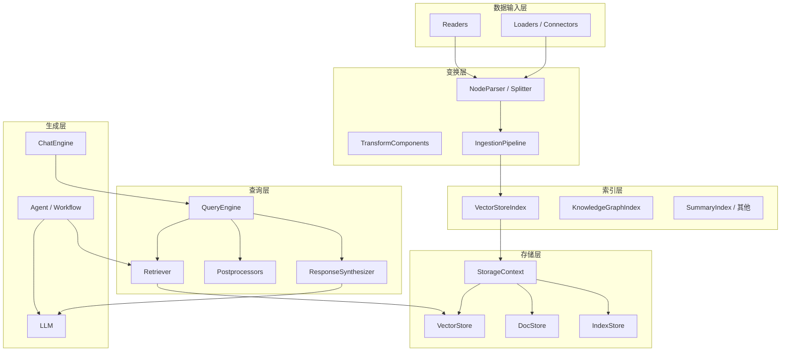
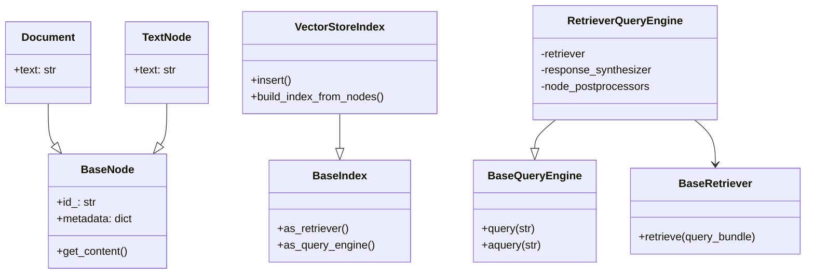

# 02 - 架构与 RAG 数据流

> **新手**：先看 [00-什么是RAG.md](./00-小白入门/00-什么是RAG.md) 的通俗版流程，再回来看本节 mermaid 图。

## 分层架构



## 标准 RAG 流水线

### 索引阶段（Ingestion）

```
原始数据 → Reader.load_data() → List[Document]
         → NodeParser.get_nodes_from_documents() → List[BaseNode]
         → EmbedModel.get_text_embedding_batch() → 向量
         → VectorStore.add() + DocStore.add_documents()
         → IndexStruct 写入 IndexStore
```

### 查询阶段（Query）

```
用户问题 → QueryBundle(query_str)
        → Retriever.retrieve() → List[NodeWithScore]
        → NodePostprocessor.postprocess_nodes()  # 可选 rerank / 过滤
        → ResponseSynthesizer.synthesize() → Response
        → LLM 生成最终文本
```

## 核心抽象关系



## 一条最小 RAG 调用链

```python
from llama_index.core import VectorStoreIndex, SimpleDirectoryReader

# 1. Load
docs = SimpleDirectoryReader("data").load_data()

# 2. Index（内部：切分 → 嵌入 → 写入 vector store）
index = VectorStoreIndex.from_documents(docs)

# 3. Query（内部：检索 → 合成）
engine = index.as_query_engine(similarity_top_k=3)
response = engine.query("退货政策是什么？")
```

等价展开：

| 步骤 | 内部调用 |
|------|----------|
| `from_documents` | `SentenceSplitter` → `embed_nodes` → `VectorStoreIndex.insert_nodes` |
| `as_query_engine` | `index.as_retriever()` + `get_response_synthesizer()` → `RetrieverQueryEngine` |
| `query` | `retriever.retrieve` → `postprocess` → `synthesizer.synthesize` |

## Settings 在架构中的位置

`Settings`（`settings.py`）是 **进程级单例**，作为各组件的默认依赖源：

```python
# settings.py 核心字段
Settings.llm              # 默认 LLM
Settings.embed_model      # 默认 Embedding
Settings.node_parser      # 默认 SentenceSplitter
Settings.callback_manager # 回调 / 追踪
Settings.transformations  # 摄取变换链
```

组件构造时通常：`embed_model or Settings.embed_model`，允许局部覆盖全局配置。

## 索引类型对比

| 索引 | 路径 | 适用场景 |
|------|------|----------|
| VectorStoreIndex | `indices/vector_store/` | 语义检索 RAG（最常用） |
| SummaryIndex | `indices/list/` | 全文档顺序阅读、小文档 |
| TreeIndex | `indices/tree/` | 层次摘要 |
| KnowledgeGraphIndex | `indices/knowledge_graph/` | 实体关系查询 |
| PropertyGraphIndex | `indices/property_graph/` | 属性图 + 向量混合 |
| ComposableGraph | `indices/composability/` | 多索引路由 |

## QueryEngine 变体

除标准 `RetrieverQueryEngine` 外，core 还提供：

| 引擎 | 用途 |
|------|------|
| `RouterQueryEngine` | 多索引路由 |
| `SubQuestionQueryEngine` | 问题分解子查询 |
| `MultiStepQueryEngine` | 多步推理 |
| `SQLJoinQueryEngine` | 结构化 + 非结构化联合 |
| `CitationQueryEngine` | 带引用标注 |
| `FLAREInstructorQueryEngine` | 主动检索补全 |

## ChatEngine vs QueryEngine

| 维度 | QueryEngine | ChatEngine |
|------|-------------|------------|
| 输入 | 单轮问题字符串 | 多轮 chat_history |
| 典型实现 | RetrieverQueryEngine | ContextChatEngine |
| 记忆 | 无（需外部维护） | 内置 condense / context 窗口 |
| 场景 | 一次性 QA | 客服、对话式搜索 |

## 可观测性

- **CallbackManager**：在 retrieve、synthesize、embed 等节点触发 `CBEventType`
- **instrumentation**：`DispatcherSpanMixin` 为 schema、chat engine 等提供 span
- 可对接 Langfuse、OpenTelemetry 等（通过 integrations 或自定义 handler）

## 异步模型

- `VectorStoreIndex` 支持 `use_async=True`，批量 embed 用 `async_embed_nodes`
- `RetrieverQueryEngine.aquery()` 异步检索与合成
- `IngestionPipeline.arun()` 异步摄取

生产高并发 API 建议统一使用 async 路径，避免阻塞事件循环。
