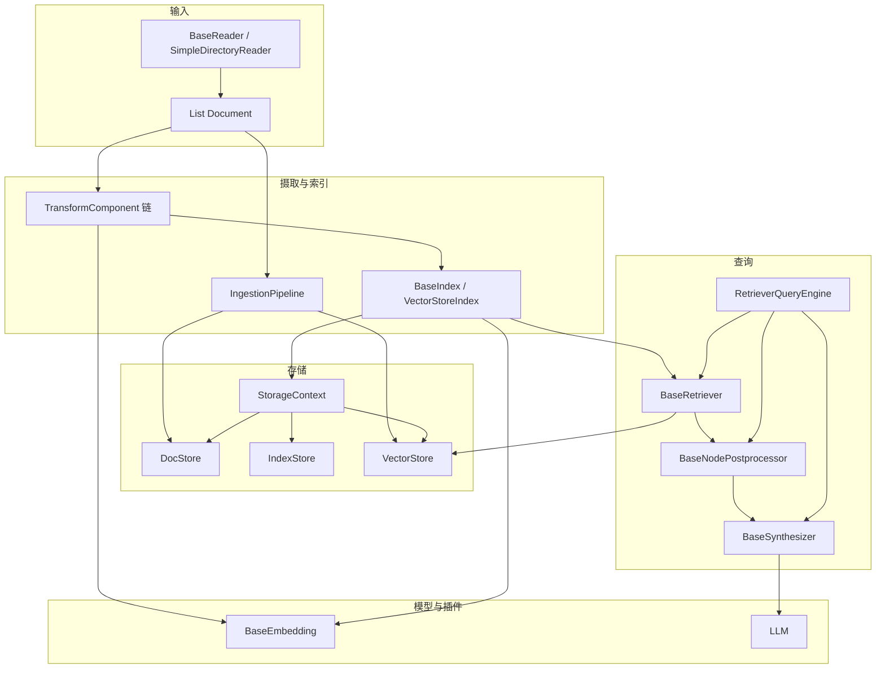
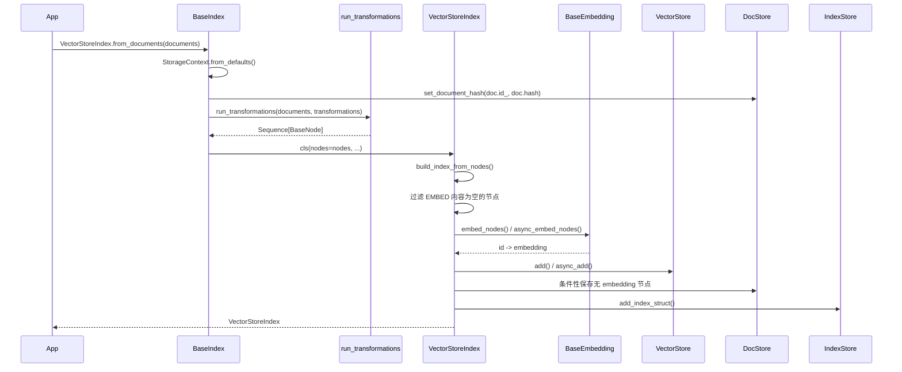
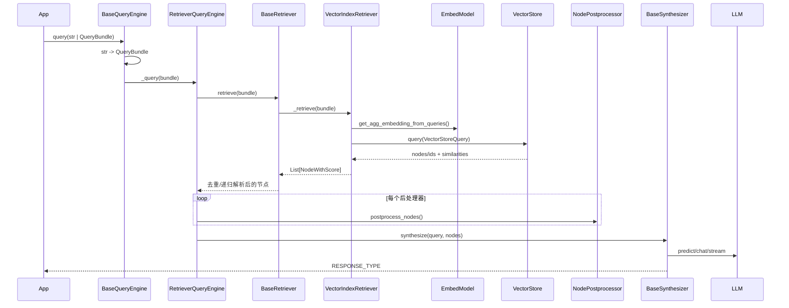

# 02 - LlamaIndex 0.14.23 架构与调用流

> 本文只描述 0.14.23 源码中可验证的调用。路径均相对 `llama-index-core/llama_index/core/`。

## 1. 总体分层



有两条常见摄取路线：

1. `VectorStoreIndex.from_documents()`：简洁索引入口，先运行 transformations，再由索引嵌入并写存储。
2. `IngestionPipeline.run/arun()`：显式流水线，可配置缓存、docstore 去重、并行和直接写 vector store。

不要把两者机械叠加并重复嵌入；需要明确 embedding transform 在哪一层执行。

## 2. `VectorStoreIndex.from_documents()` 精确调用链

入口：`indices/base.py::BaseIndex.from_documents`。



关键细节：

- `BaseIndex.from_documents()` 从 `transformations` 参数或 `Settings.transformations` 取变换链，调用同步 `run_transformations()`。
- 默认 `Settings.transformations == [Settings.node_parser]`；它只切分，不负责 embedding。
- `VectorStoreIndex.__init__()` 从局部 `embed_model` 或 `Settings.embed_model` 解析嵌入模型。
- `VectorStoreIndex.build_index_from_nodes()` 用 `node.get_content(MetadataMode.EMBED)` 过滤无内容节点。
- `_add_nodes_to_index()` 按 `insert_batch_size` 分批调用 `embed_nodes()` 和 `vector_store.add()`。
- 若 `vector_store.stores_text` 为真，普通文本节点通常无需在 docstore/index struct 再存一份；`store_nodes_override=True` 可强制保存。图像和 `IndexNode` 仍需特殊保存。
- 写 docstore 时会复制节点并清空 `embedding`，避免向量重复存储。

### `use_async=True` 的边界

`VectorStoreIndex(use_async=True)` 只使 `_build_index_from_nodes()` 通过 `run_async_tasks()` 调 `_async_add_nodes_to_index()`，其公共构造入口本身仍是同步函数。已有事件循环的服务中，优先考虑显式异步摄取，避免误以为 `from_documents()` 可直接 `await`。

## 3. `IngestionPipeline` 调用流

入口：`ingestion/pipeline.py::IngestionPipeline.run/arun`。

```text
_prepare_inputs(documents, nodes, self.documents, readers)
  -> 根据 docstore_strategy 去重/更新/删除
  -> 逐个 TransformComponent 执行并查写 IngestionCache
  -> 收集 embedding 非空的节点
  -> vector_store.add / async_add
  -> 更新 docstore 的 hash 与原文
  -> 返回变换后的节点
```

默认 transformations 来自 `_get_default_transformations()`：

```python
[SentenceSplitter(), Settings.embed_model]
```

这与 `Settings.transformations` 的默认值不同：后者默认只有 node parser。

### 变换与缓存

`run_transformations()` 顺序调用每个 transform 的 `__call__()`；`arun_transformations()` 顺序 `await transform.acall()`。缓存键由：

```text
所有输入节点的 ALL 模式内容 + transformation.to_dict()
```

经 SHA-256 得到。内存地址一类不稳定字符串会先清理。

### 去重策略

| `DocstoreStrategy` | 行为 |
|---|---|
| `DUPLICATES_ONLY` | 以 hash 去重，仅执行未见过的内容 |
| `UPSERTS` | 以 ref doc id/id + hash 判断新增或变化 |
| `UPSERTS_AND_DELETE` | UPSERTS 基础上删除本轮输入中已不存在的文档 |

`UPSERTS` 与 `UPSERTS_AND_DELETE` 需要 docstore 和 vector store 同时存在；只有 docstore 时，本轮会警告并回退为 `DUPLICATES_ONLY`，但不会修改 pipeline 对象的策略字段。

### 并行与异步

- `run(num_workers>1)` 使用 spawn 模式的 `multiprocessing.Pool`。
- `arun(num_workers>1)` 使用 `ProcessPoolExecutor`，通过当前 loop 的 `run_in_executor()` 分发批次。
- 无多进程时，`arun()` 才直接走各 transform 的 `acall()`。
- transform 与参数必须可被多进程序列化；远程 I/O 型 transform 通常更适合原生 async，而不是进程池。

## 4. 查询构建

入口：`indices/base.py::BaseIndex.as_query_engine`。

```text
index.as_query_engine(**kwargs)
  -> index.as_retriever(**kwargs)
  -> resolve_llm(llm) 或 Settings.llm
  -> RetrieverQueryEngine.from_args(retriever, llm, **kwargs)
  -> get_response_synthesizer(...)
```

`VectorStoreIndex.as_retriever()` 创建 `VectorIndexRetriever`，传入当前 index、index struct 中的 node ids、callback manager 和 object map。

## 5. 同步查询调用链



`VectorIndexRetriever` 只有在向量库要求 embedding 且查询模式不是 `TEXT_SEARCH`/`SPARSE` 时才生成查询 embedding。它构造 `VectorStoreQuery`，携带 `similarity_top_k`、filters、node/doc ids、查询模式、alpha 等。

如果向量库只返回 ids，retriever 会从 docstore 取完整节点；如果返回节点但非文本节点需要补全，也会执行回填。最后把 similarities 按位置包装为 `NodeWithScore.score`。

## 6. 异步查询调用链

```text
BaseQueryEngine.aquery()
  -> RetrieverQueryEngine._aquery()
  -> RetrieverQueryEngine.aretrieve()
  -> BaseRetriever.aretrieve()
  -> VectorIndexRetriever._aretrieve()
  -> embed_model.aget_agg_embedding_from_queries()
  -> vector_store.aquery()
  -> docstore.aget_nodes()（如需回填）
  -> postprocessor.apostprocess_nodes()（依次 await）
  -> response_synthesizer.asynthesize()
```

异步路径仍有两个常见“假异步”风险：

1. `BaseRetriever._aretrieve()` 默认返回同步 `_retrieve()` 的结果；自定义 retriever 应覆盖它。
2. vector store 协议的默认 `aquery()` 会直接调用同步 `query()`；要核对具体集成实现。

后处理器在 0.14.23 中是顺序执行，因为后一个依赖前一个输出；不会自动并发。

## 7. 存储边界

`StorageContext` 聚合而非继承以下存储：

- `docstore`：节点/文档、ref-doc 关系和 document hash。
- `index_store`：`IndexStruct`，记录索引自身结构。
- `vector_stores`：按 namespace 管理一个或多个向量存储。
- `graph_store` / `property_graph_store`：图索引所需后端。

向量库的 `stores_text` 会改变节点落盘位置。排查“向量存在但取不到文本”时，应同时检查 vector store 返回形态、index struct 映射和 docstore。

## 8. 扩展与观测

- 自定义 `TransformComponent`：实现 `__call__`；若有原生异步 I/O，再实现 `acall`。
- 自定义 `BaseRetriever`：至少实现 `_retrieve`，高并发场景同时实现 `_aretrieve`。
- 自定义 vector store：实现 add/query/delete，并准确声明 `stores_text`、`is_embedding_query`。
- 自定义 postprocessor：实现同步/异步后处理方法。
- 自定义 synthesizer：注入 `RetrieverQueryEngine(response_synthesizer=...)`。

`CallbackManager` 提供 trace/event 兼容链路；`instrumentation.get_dispatcher(__name__)` 提供 span 和结构化 start/end event。两套机制在查询、检索等路径中同时存在，接入观测时避免重复计数。

## 9. 常见陷阱

1. `similarity_top_k` 只是候选数量，不保证 score 都是余弦相似度；分值语义由后端决定。
2. `MetadataMode.EMBED` 会改变 embedding 文本，修改 metadata 或排除键可能使 hash、缓存和向量不一致，应重建或刷新。
3. `BaseIndex.from_documents()` 先记 document hash；直接 `insert_nodes()` 不等同于按文档摄取。
4. vector store 已存文本时，docstore 中可能没有普通文本节点，这是设计行为。
5. async API 名称不能证明底层非阻塞，必须查看具体 retriever/vector store/LLM 集成。
6. `IngestionPipeline` 默认已包含 embedding；再交给 `VectorStoreIndex` 可能重新计算 embedding。

## 10. 本篇源码阅读顺序

1. `indices/base.py`：`from_documents`、`insert/ainsert`、`as_query_engine`。
2. `indices/vector_store/base.py`：批嵌入、写入与 `stores_text` 分支。
3. `ingestion/pipeline.py`：`run_transformations`、`IngestionPipeline.run/arun`。
4. `base/base_query_engine.py`：字符串到 `QueryBundle` 的公共外壳。
5. `base/base_retriever.py`：事件、递归解析及 async 回退。
6. `indices/vector_store/retrievers/retriever.py`：向量查询与 docstore 回填。
7. `query_engine/retriever_query_engine.py`：后处理与合成。
8. 最后阅读所选 vector store、embedding 和 LLM 集成的具体实现。

