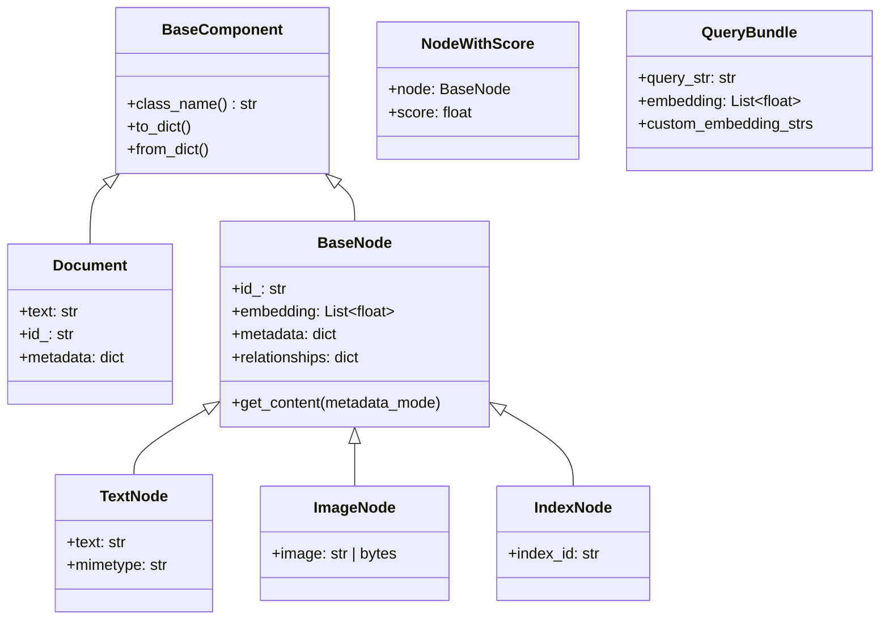

# 03 - 数据模型 (Schema)

源码：`llama-index-core/llama_index/core/schema.py`（约 1493 行）

## 设计目标

LlamaIndex 用 **统一的 Node 抽象** 贯穿索引、检索、合成全流程：

- 支持文本、图像、索引引用等多种节点
- Pydantic 序列化 + `class_name` 字段保证持久化可恢复
- `MetadataMode` 控制嵌入/LLM 时 metadata 是否参与

## 类型层次



## Document

原始文档单元，通常由 Reader 产出：

```python
from llama_index.core import Document

doc = Document(
    text="退货需在 7 天内申请…",
    metadata={"source": "faq.md", "category": "售后"},
)
```

| 字段 | 说明 |
|------|------|
| `text` | 正文 |
| `id_` | 唯一 ID，默认 UUID |
| `metadata` | 任意键值，会传递到 Node |
| `excluded_embed_metadata_keys` | 嵌入时排除的 metadata 键 |
| `excluded_llm_metadata_keys` | LLM 上下文时排除的键 |

## BaseNode / TextNode

切分后的最小索引单元：

```python
from llama_index.core.schema import TextNode

node = TextNode(
    text="段落内容",
    metadata={"source": "faq.md", "page": 1},
)
node.id_  # 用于 vector store 主键
node.get_content(metadata_mode=MetadataMode.LLM)  # 合成 prompt 用
```

**MetadataMode** 枚举：

| 模式 | 行为 |
|------|------|
| `NONE` | 仅 content |
| `LLM` | content + LLM 可见 metadata |
| `EMBED` | content + 嵌入可见 metadata |
| `ALL` | 全部 metadata |

## QueryBundle

检索与合成的查询封装：

```python
from llama_index.core.schema import QueryBundle

bundle = QueryBundle(query_str="如何办理退货？")
# 可选：预计算 query embedding
bundle = QueryBundle(
    query_str="如何办理退货？",
    embedding=embed_model.get_query_embedding("如何办理退货？"),
)
```

Retriever 接口统一接收 `QueryBundle`，便于支持 **HyDE**、**多向量查询** 等扩展。

## NodeWithScore

检索结果标准格式：

```python
# retriever.retrieve() 返回
[
    NodeWithScore(node=TextNode(...), score=0.87),
    NodeWithScore(node=TextNode(...), score=0.72),
]
```

`score` 含义取决于 VectorStore（余弦相似度、距离等），Postprocessor 可再调整。

## TransformComponent

摄取链中的可组合变换（切分、清洗、元数据提取）：

```python
from llama_index.core.node_parser import SentenceSplitter

splitter = SentenceSplitter(chunk_size=512, chunk_overlap=64)
nodes = splitter.get_nodes_from_documents(documents)
```

`IngestionPipeline` 对 `Sequence[TransformComponent]` 顺序执行，并支持 **变换结果缓存**（hash 基于 node 内容 + transform 配置）。

## 序列化

所有核心类型支持：

```python
node.to_dict()
TextNode.from_dict(data)
```

`class_name` 字段用于反序列化时选择正确类型，避免 Python 类名变更导致持久化失效。

## 互操作

`schema.py` 提供与外部格式的转换（TYPE_CHECKING 分支）：

- LangChain `Document`
- Haystack `Document`
- LlamaCloud `CloudDocument`
- Semantic Kernel `MemoryRecord`

便于从现有数据管道迁移。

## 与 kefu-kb 对照

| LlamaIndex | kefu-kb |
|------------|---------|
| `Document` / `TextNode` | 自定义 chunk dict + Qdrant payload |
| `QueryBundle` | 原始 question 字符串 |
| `NodeWithScore` | `(text, score, source)` tuple |

迁移到 LlamaIndex 时，kefu-kb 的 chunk 可映射为 `TextNode(metadata={"source": ...})`。
