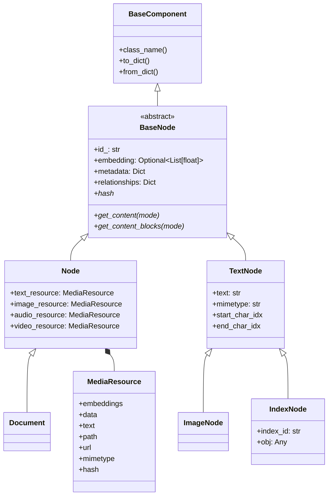

# 03 - LlamaIndex 0.14.23 数据模型源码分析

> 主源码：`llama-index-core/llama_index/core/schema.py`。本版本已经引入 `Node + MediaResource` 多模态模型，同时保留 `TextNode` 等兼容类型。

## 1. 准确类型层次



必须特别纠正：**`Document(Node) -> Node(BaseNode)`**。`Document` 不是直接继承 `BaseNode`，也不是 `TextNode` 的子类。

`Node` 是 `ObjectType.MULTIMODAL`；`Document` 覆盖为 `ObjectType.DOCUMENT`。`TextNode` 的源码注释是 “Provided for backward compatibility”，但它仍广泛用于既有切分器和存储接口，属于活跃兼容层，而非已经不可用的 API。

## 2. `BaseComponent`：序列化协议

`BaseComponent` 基于 Pydantic model：

- `to_dict()` 先调用 `dict()`，再加入 `"class_name": self.class_name()`。
- `from_dict()` 复制传入字典、合并 kwargs、移除 `class_name`，最后调用类构造器。
- 另有 `to_json()` / `from_json()`。

`class_name` 是持久化类型标签，但 `BaseComponent.from_dict()` 本身不会根据标签动态分派；docstore 的 `json_to_doc()` 等工具负责选择具体节点类型。不要把任意不可信 JSON 直接交给动态反序列化路径。

## 3. `BaseNode` 公共字段

| 字段 | 类型/默认 | 含义 |
|---|---|---|
| `id_` | UUID 字符串 | 节点主键；`node_id` 是读写别名 |
| `embedding` | `None` | 节点向量；`get_embedding()` 在为空时抛错 |
| `metadata` | `{}` | 扁平元数据字典，亦用于过滤 |
| `excluded_embed_metadata_keys` | `[]` | EMBED 模式排除键 |
| `excluded_llm_metadata_keys` | `[]` | LLM 模式排除键 |
| `relationships` | `{}` | `NodeRelationship -> RelatedNodeInfo/list` |
| `metadata_template` | `"{key}: {value}"` | 单项格式 |
| `metadata_separator` | 换行 | 元数据连接符 |

`metadata` 的 Pydantic alias 仍是 `extra_info`，`metadata_separator` 还接受历史拼写 `metadata_seperator`；兼容不等于推荐使用。

### 关系模型

`NodeRelationship` 包含 `SOURCE`、`PREVIOUS`、`NEXT`、`PARENT`、`CHILD`。值是轻量 `RelatedNodeInfo`，保存 `node_id`、`node_type`、`metadata` 和 `hash`，避免直接嵌套整棵对象图。

```text
Document
  └─ SOURCE <- chunk A <-> chunk B -> NEXT
                     └─ PARENT/CHILD 可表达层次切分
```

`source_node`、`prev_node`、`next_node`、`parent_node` 要求单个关系；`child_nodes` 要求列表，类型不符会抛 `ValueError`。`ref_doc_id` 从 `SOURCE` 关系推导。

## 4. `MediaResource`

`MediaResource(BaseModel)` 是媒体载体，不继承 `BaseComponent`。它让同一个 `Node` 同时包含多种模态资源。

| 字段 | 类型 | 说明 |
|---|---|---|
| `embeddings` | `dict["sparse"|"dense", list[float]] \| None` | 一个资源的多向量表示 |
| `data` | `bytes \| None` | 保存为 base64 bytes；序列化时 `exclude=True` |
| `text` | `str \| None` | 文本表示 |
| `path` | `Path \| None` | 本地路径 |
| `url` | `AnyUrl \| None` | 远程位置 |
| `mimetype` | `str \| None` | 媒体类型 |

验证行为：

- 传入原始 `data` 时，如果不是合法 base64，则自动 base64 编码。
- 未传 mimetype 时，优先从解码后的 data 猜测，再尝试按 path 扩展名猜测；不会为了探测类型主动读取 path 或 URL。
- path 序列化为字符串。
- `data` 被排除出普通 model dump，不能假设节点 JSON 会携带二进制内容。

`MediaResource.hash` 综合 text、data、path、url：data 与 path/url 先 SHA-256，再对组合结果 SHA-256。`text=""` 使用特殊标记，因而与 `text=None` 不同；资源完全为空时 hash 是空字符串。

## 5. `Node` 与 `Document`

### 5.1 `Node`

`Node` 有四个可选资源：

```python
Node(
    text_resource=MediaResource(text="说明文字"),
    image_resource=MediaResource(path="figure.png"),
    metadata={"source": "manual"},
)
```

- `get_content()` 只返回 `text_resource.text`，并按指定 metadata mode 拼接 metadata；它的源码说明这是兼容接口。
- `get_content_blocks()` 依次产生 metadata `TextBlock`、文本、图片、音频、视频 block，供多模态 LLM 使用。
- `set_content()` 用新的 `MediaResource(text=value)` 替换 text resource。
- `hash` 由 ALL metadata 和四种 resource hash 组合产生。

只调用 `get_content()` 会丢失非文本模态；多模态合成应使用 content blocks，并在 `RetrieverQueryEngine.from_args(multimodal=True)` 配置相应 synthesizer。

### 5.2 `Document`

Reader 通常返回 `Document`。规范构造是：

```python
from llama_index.core import Document
from llama_index.core.schema import MediaResource

doc = Document(
    id_="faq-001",
    text_resource=MediaResource(text="七天内可申请退货"),
    metadata={"source": "faq.md", "category": "售后"},
)
```

为了兼容旧代码，以下仍可工作：

```python
Document(text="...", doc_id="faq-001", extra_info={"source": "faq.md"})
```

构造器映射规则：

- `doc_id -> id_`
- `extra_info -> metadata`
- 非空 `text -> MediaResource(text=text)`

若新旧字段同时存在，新字段优先，并可能记录 warning。注意源码只在 `data.get("text")` 为真时迁移，因此空字符串 `text=""` 不会创建 text resource；需要表达空文本资源时应显式传 `MediaResource(text="")`。

`Document.text` 属性仅为兼容读取，返回 `get_content()`；model serializer 会额外输出 `text` 字段以维持旧格式。`doc_id` 也是 `id_` 的别名；`get_doc_id()` 自 0.12.2 起显式 deprecated。

## 6. `TextNode`、`ImageNode` 与 `IndexNode`

### `TextNode`

`TextNode` 直接继承 `BaseNode`，正文保存在 `text: str`，不是 `MediaResource`。构造器也接受 `text_resource` 并抽出其中的 text，以向新模型前向兼容。

- `hash = sha256(str(text) + str(metadata))`
- `get_content(mode)` 用 `text_template` 拼 metadata 和正文。
- `get_content_blocks()` 返回 metadata block 与 `TextBlock`。
- `node_info` 属性已 deprecated，应调用 `get_node_info()`。

### `ImageNode`

`ImageNode(TextNode)` 在文本字段之外保存 base64 image、path、URL、mimetype 和可选 `text_embedding`。它支持 `image_resource` 构造兼容，但仍是旧式字段布局。新通用多模态代码优先接受 `Node.image_resource`。

### `IndexNode`

`IndexNode(TextNode)` 用 `index_id` 和 `obj` 指向其他节点、retriever、query engine 或任意对象，是递归检索的跳板。序列化优先处理 `BaseNode` 和 Pydantic model，其他对象尝试 `json.dumps()`；失败时抛 `ValueError`。不要把不可序列化的运行时对象假定为可持久化。

## 7. MetadataMode

```python
class MetadataMode(str, Enum):
    ALL = "all"
    EMBED = "embed"
    LLM = "llm"
    NONE = "none"
```

| 模式 | `get_metadata_str()` 行为 | 典型用途 |
|---|---|---|
| `NONE` | 空字符串 | 纯正文、显示 |
| `LLM` | 排除 `excluded_llm_metadata_keys` | 送入生成模型上下文 |
| `EMBED` | 排除 `excluded_embed_metadata_keys` | 生成节点 embedding |
| `ALL` | 不应用上述排除列表 | hash、调试、完整序列化语义 |

排除列表只影响格式化出的文本，不会删除 `node.metadata`，也不影响向量库对 metadata 的结构化过滤。

示例：

```python
node = Document(
    text_resource=MediaResource(text="退货规则"),
    metadata={"source": "internal.md", "tenant_id": "t1"},
    excluded_llm_metadata_keys=["tenant_id"],
    excluded_embed_metadata_keys=["source", "tenant_id"],
)
```

这里 `tenant_id` 仍能作为过滤字段，但不会进入 LLM 或 embedding 文本。敏感数据不应仅依赖 exclusion：metadata 仍可能被持久化、记录或返回给调用方。

## 8. 查询侧数据结构

### `QueryBundle`

`QueryBundle` 是 dataclass-json 类型，不是 `BaseComponent`：

- `query_str: str`
- `image_path: Optional[str]`
- `custom_embedding_strs: Optional[List[str]]`
- `embedding: Optional[List[float]]`

`embedding_strs` 在未提供 custom 列表时返回 `[query_str]`；空 query 返回空列表。预置 embedding 可以跳过 retriever 的 embedding 调用。`custom_embedding_strs` 支持多种改写文本聚合成一个查询向量。

### `NodeWithScore`

`NodeWithScore(BaseComponent)` 包装任意 `BaseNode` 和可空 `score`。`get_score()` 默认将空分数视为 `0.0`，传 `raise_error=True` 才抛错。`text/get_text` 只接受 `TextNode`，而 `get_content()` 可代理到任意节点；面向新 `Node/Document` 的代码应使用后者。

score 语义取决于 vector store，可能是相似度或经转换后的距离，不应跨后端直接比较阈值。

## 9. 序列化、hash 与缓存陷阱

1. `Node.hash` 纳入全部 metadata 与所有资源；`TextNode.hash` 使用 `str(metadata)`。改变 metadata 可能触发刷新和缓存失效。
2. `MediaResource.data` 不进入常规 dump；仅保存 JSON 可能无法恢复二进制。
3. path hash 基于路径字符串而非文件内容；同路径下文件内容变化不会改变 resource hash。
4. URL hash 基于 URL 字符串而非远端内容；远端资源变更也不会自动反映。
5. `BaseNode.embedding` 常在写 docstore 前被清空，向量应以 vector store 为准。
6. `class_name` 是类型标签，不是稳定的安全边界。
7. `extra_info`、`doc_id`、`get_doc_id()`、`node_info` 是兼容/废弃接口，新代码不要继续扩散。

## 10. 扩展建议与阅读顺序

扩展新节点类型时应实现 `get_type()`、`get_content()`、`get_content_blocks()`、`set_content()` 和 `hash`，并验证 docstore 序列化工具是否认识其 `class_name`。多数业务优先组合 `Node + MediaResource`，避免为每种媒体再制造一套平行字段。

推荐阅读：

1. `schema.py::BaseComponent` 与 `TransformComponent`
2. `MetadataMode`、`RelatedNodeInfo`、`BaseNode`
3. `MediaResource`
4. `Node`
5. `TextNode`、`ImageNode`、`IndexNode`
6. `NodeWithScore`
7. `Document`
8. `QueryBundle`
9. `storage/docstore/utils.py`：确认真实序列化/反序列化分派
10. `node_parser/`：观察 Document 如何被切成节点并建立 SOURCE/PREVIOUS/NEXT 关系

