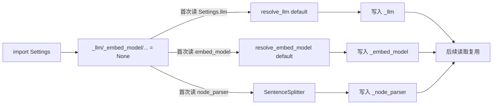
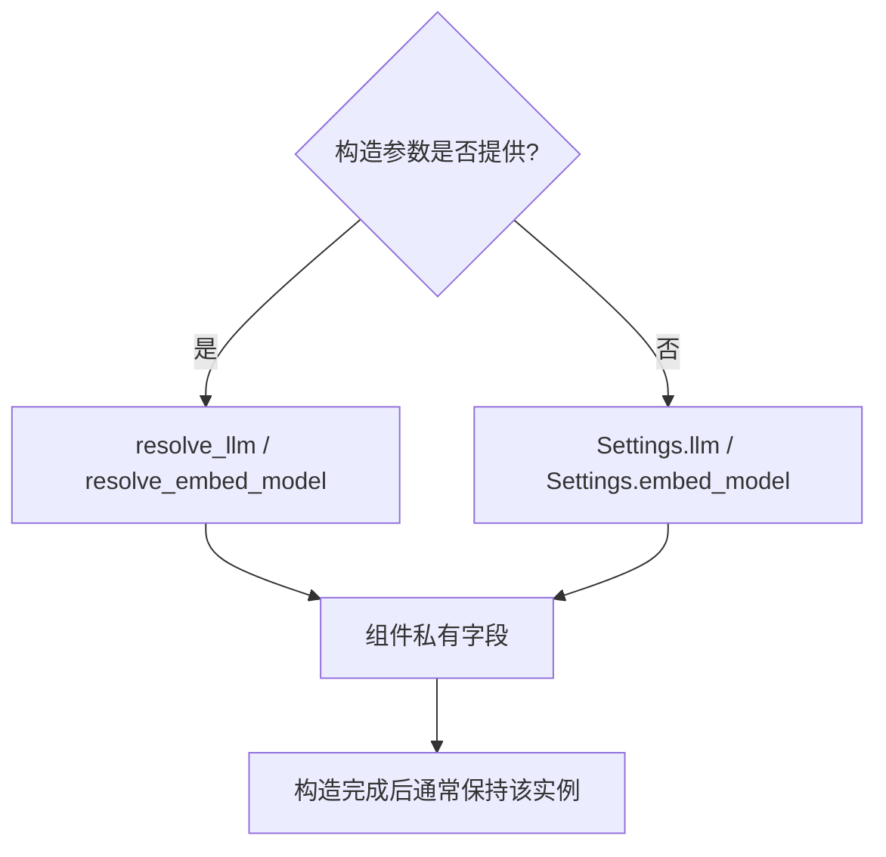

# 04 - LlamaIndex 0.14.23 Settings 配置机制

> 主源码：`llama-index-core/llama_index/core/settings.py`。辅助解析逻辑位于 `core/llms/utils.py` 与 `core/embeddings/utils.py`。

## 1. 本质：惰性模块级单例

源码末尾直接创建：

```python
@dataclass
class _Settings:
    ...

Settings = _Settings()
```

所以 `Settings` 不是类代理，也不是每次访问新建对象，而是模块导入时创建的 `_Settings` **唯一实例**。惰性指内部组件第一次读取时才初始化：



这意味着仅 `from llama_index.core import Settings` 不会立即创建 OpenAI 客户端；首次读取 `Settings.llm` 或某个依赖它的组件时才解析默认模型。

## 2. 内部状态与属性

| 公共属性 | 私有缓存 | 惰性默认行为 |
|---|---|---|
| `llm` | `_llm` | `resolve_llm("default")` |
| `embed_model` | `_embed_model` | `resolve_embed_model("default")` |
| `callback_manager` | `_callback_manager` | `CallbackManager()` |
| `node_parser` | `_node_parser` | `SentenceSplitter()` |
| `prompt_helper` | `_prompt_helper` | 已有 `_llm` 时按其 metadata 创建，否则 `PromptHelper()` |
| `chat_prompt_helper` | `_chat_prompt_helper` | 已有 chat `_llm` 时按 metadata 创建，否则默认实例 |
| `transformations` | `_transformations` | `[self.node_parser]` |

`tokenizer` 的实现是例外：getter 查询 `llama_index.core.global_tokenizer`，没有时调用 `get_tokenizer()`；setter 调 `set_global_tokenizer()`，没有使用声明的 `_tokenizer` 缓存。源码对旧 global tokenizer 路径带有 `TODO: deprecated?`，但没有正式 `@deprecated`，因此应称为“遗留全局桥接”，不能声称已正式废弃。

其他代理属性：

- `pydantic_program_mode` 直接读写 `self.llm.pydantic_program_mode`。
- `chunk_size` / `chunk_overlap` 读写当前 node parser 的同名属性；parser 不支持时抛 `ValueError`。
- `text_splitter` 是 `node_parser` 的别名。
- `num_output` / `context_window` 修改 `prompt_helper`。
- `chat_num_output` / `chat_context_window` 修改 `chat_prompt_helper`。

## 3. 默认模型解析

### `resolve_llm("default")`

`core/llms/utils.py::resolve_llm`：

1. 若环境变量 `IS_TESTING` 存在，返回 `MockLLM`。
2. 否则导入 `llama_index.llms.openai.OpenAI` 并创建默认实例。
3. 缺少集成包时抛 `ImportError`，提示安装 `llama-index-llms-openai`。
4. API key 校验失败时抛 `ValueError`，不会静默切到本地模型。
5. 最终给模型绑定传入或 `Settings.callback_manager`。

传 `None` 给 `resolve_llm()` 表示显式禁用，实际返回 `MockLLM` 并打印提示；这与“不传构造参数，回退 Settings”不是一回事。

### `resolve_embed_model("default")`

`core/embeddings/utils.py::resolve_embed_model` 同理：

1. `IS_TESTING` 下返回维数 8 的 `MockEmbedding`。
2. 默认创建 `llama_index.embeddings.openai.OpenAIEmbedding`。
3. 缺包或 key 无效会明确报错。
4. 传 `None` 给 resolver 会返回维数 1 的 `MockEmbedding`。

因此“默认自动选择任意可用本地模型”是不准确的；0.14.23 元包默认路线是 OpenAI。

## 4. 回退与局部覆盖

典型依赖解析图：



具体源码例子：

- `VectorStoreIndex.__init__()`：`resolve_embed_model(embed_model or Settings.embed_model, ...)`
- `BaseIndex.as_query_engine()`：有 `llm` 时 `resolve_llm(llm, ...)`，否则取 `Settings.llm`
- `RetrieverQueryEngine.from_args()`：`llm = llm or Settings.llm`
- `IngestionPipeline._get_default_transformations()`：`[SentenceSplitter(), Settings.embed_model]`

局部覆盖示例：

```python
index = VectorStoreIndex.from_documents(
    documents,
    embed_model=tenant_embed_model,
    transformations=[tenant_splitter],
)
engine = index.as_query_engine(
    llm=tenant_llm,
    similarity_top_k=8,
)
```

局部参数只影响新建组件，不会写回 `Settings`。组件通常在构造时保存解析后的实例，因此之后修改 `Settings.llm` 不会可靠地替换已创建 engine 内的 synthesizer。

## 5. 推荐配置方式

### 单模型脚本/Notebook：全局默认

```python
from llama_index.core import Settings
from llama_index.llms.openai import OpenAI
from llama_index.embeddings.openai import OpenAIEmbedding

Settings.llm = OpenAI(model="gpt-4o-mini", temperature=0)
Settings.embed_model = OpenAIEmbedding(model="text-embedding-3-small")
Settings.chunk_size = 512
Settings.chunk_overlap = 64
```

### 本地 OpenAI-compatible 服务

```python
from llama_index.core import Settings
from llama_index.llms.openai_like import OpenAILike
from llama_index.embeddings.openai_like import OpenAILikeEmbedding

Settings.llm = OpenAILike(
    model="Qwen2.5-7B-Instruct",
    api_base="http://127.0.0.1:8080/v1",
    api_key="not-needed",
    is_chat_model=True,
    context_window=8192,
)
Settings.embed_model = OpenAILikeEmbedding(
    model_name="bge-m3",
    api_base="http://127.0.0.1:8081/v1",
    api_key="not-needed",
)
```

这些类来自独立集成包，不属于 core。部署前应核对并安装对应 `llama-index-llms-openai-like` 和 embedding 包。

### 服务/多租户：局部注入

不要在请求处理中执行：

```python
Settings.llm = tenant_llm  # 并发请求会互相覆盖
```

应在租户资源初始化阶段构造独立 index/retriever/query engine，或把 `llm`、`embed_model`、transformations 显式传入。`Settings` 没有 `contextvars` 隔离，也没有线程/协程局部语义。

## 6. `node_parser` 与 `transformations`

两者相关但不是始终同步：

```python
Settings.node_parser = my_splitter
```

若 `_transformations` 尚未初始化，首次读取 `Settings.transformations` 会得到 `[my_splitter]`。但一旦 transformations 已经缓存：

```python
old = Settings.transformations
Settings.node_parser = another_splitter
```

`old` 和缓存的 `_transformations` 不会自动更新。反向设置 `Settings.transformations` 也不会更新 `Settings.node_parser`。需要一致时显式同时配置：

```python
Settings.node_parser = splitter
Settings.transformations = [splitter]
```

另外，`IngestionPipeline` 在未传 transformations 时不用 `Settings.transformations`，而是创建：

```python
[SentenceSplitter(), Settings.embed_model]
```

所以修改 `Settings.node_parser` 不会自动改变 `IngestionPipeline()` 的默认 splitter。这是常见误判。

## 7. CallbackManager 的传播

读取 `Settings.llm`、`Settings.embed_model`、`Settings.node_parser` 时，如果 `_callback_manager` 已设置，会把它写入相应组件。

```python
Settings.callback_manager = manager
llm = Settings.llm  # getter 在此绑定 manager
```

顺序差异：

- 先读 `Settings.llm`、后设置 callback manager：模型不会在 setter 时立即更新；再次读取 `Settings.llm` 才更新。
- 某些组件构造时保存自己的 callback manager，后续全局修改不保证传播。

高可靠性场景应在创建模型和索引前设置 manager，或显式传入 `callback_manager=`。

## 8. PromptHelper 缓存陷阱

`Settings.prompt_helper` 只有在 `_prompt_helper is None` 时根据 `_llm.metadata` 创建。于是：

```python
helper = Settings.prompt_helper  # 此时 _llm 仍为 None，创建默认 helper
Settings.llm = large_context_llm
```

现有 helper 不会自动按新 LLM 重建。反过来，先设置 LLM 再首次读取 helper 才会按模型 metadata 创建。

同样，替换 `Settings.llm` 后，已经缓存的 `prompt_helper` / `chat_prompt_helper` 不会自动清空。稳妥做法是配置顺序固定为：

```text
LLM -> callback manager -> prompt helper（如需显式覆盖） -> 创建索引/引擎
```

一般应用无需直接修改 `_prompt_helper` 等私有字段；需要不同上下文窗口时，优先把模型 metadata 和局部组件配置保持一致。

## 9. 同步/异步与生命周期

`Settings` 只保存对象，不管理其异步生命周期：

- 不会为每个 event loop 克隆 client。
- 不会自动关闭 HTTP session。
- 不会把同步 LLM/embedding 变成异步实现。
- 多进程 worker 各有自己的 Python 进程和单例副本。

异步服务需确认具体 LLM/embedding 集成的 `achat/apredict`、异步 embedding 是否原生非阻塞，并按集成要求清理 client。

测试中应避免跨用例污染。可以保存并恢复公共属性，或更好地对待测组件使用局部依赖。直接依赖 `IS_TESTING` 会改变默认解析结果，但它是进程环境级开关。

## 10. 遗留与废弃 API

### 已明确失效

`core/service_context.py` 中：

- `ServiceContext(...)`
- `ServiceContext.from_defaults(...)`
- `set_global_service_context(...)`

都会立即抛 `ValueError`，提示改用 `Settings` 或局部参数。它们虽仍由 `core/__init__.py` 导出，只是为了给旧代码明确迁移错误，不是可继续使用的容器。

### 遗留但未正式标记废弃

- `Settings.global_handler` 转发 `llama_index.core.global_handler/set_global_handler`，源码只有 `TODO: deprecated?`。
- `Settings.tokenizer` 使用 `global_tokenizer/set_global_tokenizer`，同样只有 TODO。
- `text_splitter` 是 `node_parser` 的兼容别名，没有 `@deprecated`。

文档和代码审查中应区分“源码 TODO”“兼容别名”和真正带 decorator/直接抛错的 deprecated API。

## 11. 常见陷阱清单

1. 首次间接访问 `Settings.llm` 就可能触发 OpenAI 包导入和 API key 校验。
2. `Settings` 是共享可变对象，不提供租户、线程或协程隔离。
3. 修改全局值不会改造已创建的 index/query engine。
4. `Settings.node_parser` 与已缓存 `Settings.transformations` 不自动同步。
5. `IngestionPipeline` 默认 transformations 与 `Settings.transformations` 不同。
6. prompt helper 一旦缓存，替换 LLM 不会自动重算。
7. callback manager 的绑定受读取顺序影响。
8. async 组件是否非阻塞取决于具体集成，不由 Settings 保证。
9. `ServiceContext` 在本版本不是“有警告但仍可用”，而是直接报错。
10. 私自修改 `_llm`、`_transformations` 等字段绕过 resolver 和回调绑定，不属于稳定 API。

## 12. 源码阅读顺序

1. `settings.py`：从字段、getter/setter 读到末尾 `Settings = _Settings()`。
2. `llms/utils.py::resolve_llm`：默认、禁用、LangChain 包装与 callback 绑定。
3. `embeddings/utils.py::resolve_embed_model`：默认与 mock 行为。
4. `indices/base.py::from_documents/as_query_engine`：全局回退点。
5. `indices/vector_store/base.py::__init__`：embedding 局部覆盖。
6. `query_engine/retriever_query_engine.py::from_args`：LLM 与 synthesizer 注入。
7. `ingestion/pipeline.py::_get_default_transformations`：理解与 Settings 的差异。
8. `service_context.py`：确认旧 API 已直接失效。

