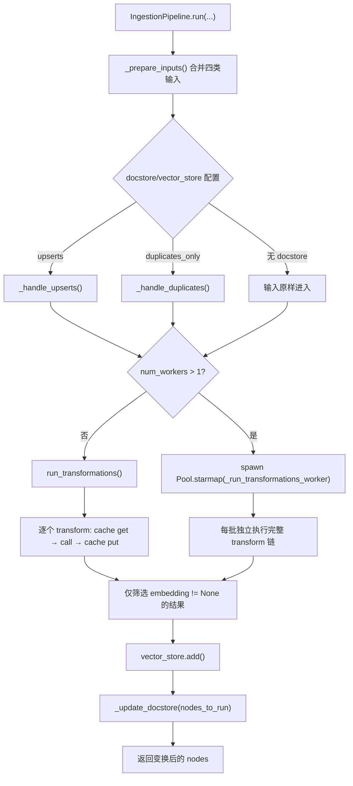
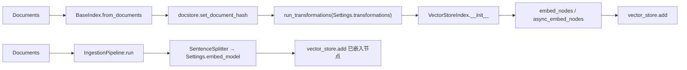

# 05 - IngestionPipeline：摄取、去重、缓存与并行

> 源码基线：LlamaIndex `0.14.23`。本文只描述该版本的实际实现。建议先读 [01-LlamaIndex项目总览.md](./01-LlamaIndex项目总览.md)，再按本文 → [06-索引与向量存储.md](./06-索引与向量存储.md) 阅读。

## 1. 定位与关键结论

`IngestionPipeline` 是“把输入节点依次变换并可选写入存储”的执行器，不是 Index。它能接收 `documents`、`nodes`、构造时固定的 `documents` 和 `ReaderConfig`，执行切分、元数据提取、嵌入等 `TransformComponent`，最后把**已有 embedding 的节点**写入 vector store。

最容易误解的语义：

| 入口 | 默认 transformation | embedding 在哪里发生 | 自动写 vector store |
|---|---|---|---|
| `VectorStoreIndex.from_documents()` | `Settings.transformations`，通常是节点解析器 | `VectorStoreIndex._get_node_with_embedding()` | 是，由 Index 构建阶段写 |
| `IngestionPipeline()` | `SentenceSplitter()` **加 `Settings.embed_model`** | embedding model 本身作为最后一个 transform | 仅配置 `vector_store` 时写 |
| 自定义 `IngestionPipeline(transformations=[SentenceSplitter(...)])` | 只有显式列表 | **不会嵌入** | 没有 embedding 的节点会被跳过 |

因此，下面这种配置不会向向量库写任何节点：

```python
pipeline = IngestionPipeline(
    transformations=[SentenceSplitter(chunk_size=512)],
    vector_store=vector_store,
)
nodes = pipeline.run(documents=documents)  # nodes 有文本，但 embedding=None
```

应显式加入 embedding：

```python
pipeline = IngestionPipeline(
    transformations=[
        SentenceSplitter(chunk_size=512, chunk_overlap=64),
        Settings.embed_model,
    ],
    vector_store=vector_store,
    docstore=SimpleDocumentStore(),
)
nodes = pipeline.run(documents=documents)
```

## 2. 源码地图

| 路径 | 核心符号 | 职责 |
|---|---|---|
| `llama-index-core/llama_index/core/ingestion/pipeline.py` | `IngestionPipeline`, `DocstoreStrategy` | 主流程、去重、进程池、持久化 |
| 同上 | `run_transformations`, `arun_transformations` | 同步/异步顺序执行 transform |
| `llama-index-core/llama_index/core/ingestion/cache.py` | `IngestionCache` | KV 缓存与节点 JSON 序列化 |
| `llama-index-core/llama_index/core/schema.py` | `TransformComponent` | transform 同步/异步协议 |
| `llama-index-core/llama_index/core/indices/base.py` | `BaseIndex.from_documents` | 对照用的 Index 建造入口 |
| `llama-index-core/llama_index/core/indices/vector_store/base.py` | `_get_node_with_embedding` | Index 路径中的嵌入阶段 |

## 3. `run()` 精确调用链



对应方法顺序为：

1. `IngestionPipeline.run()` → `_prepare_inputs(documents, nodes)`。
2. `_prepare_inputs()` 依次拼接本次 `documents`、本次 `nodes`、`self.documents`、每个 `reader.read()` 的结果；它不会自动去重。
3. 根据有效的 `DocstoreStrategy` 调 `_handle_upserts()` 或 `_handle_duplicates()`，得到 `nodes_to_run`。
4. 单进程调 `run_transformations()`；多进程按输入批次调用 `_run_transformations_worker()`。
5. `run_transformations()` 对每个 transform 计算缓存 key，命中则直接替换当前 `nodes`，未命中则执行 `transform(nodes, **kwargs)`。
6. 若有 vector store，只把 `n.embedding is not None` 的结果交给 `vector_store.add()`。
7. 若有 docstore，`_update_docstore()` 存的是**变换前的 `nodes_to_run`**，不是切分/嵌入后的结果。

最后一点很重要：Pipeline 的 docstore 在这里主要承担输入文档 hash 去重，不等于 VectorStoreIndex 用来回填检索节点的 docstore。

## 4. Transformation 与缓存

### 4.1 默认链

`IngestionPipeline._get_default_transformations()` 在 0.14.23 中直接返回：

```python
[SentenceSplitter(), Settings.embed_model]
```

它不是简单复用 `Settings.transformations`。传入任何非 `None` 的 `transformations` 都会完整覆盖默认链。

### 4.2 缓存粒度

`get_transformation_hash(nodes, transformation)` 的 key 为：

```text
sha256(
  concat(node.get_content(metadata_mode=ALL) for node in 当前整批节点)
  + remove_unstable_values(str(transformation.to_dict()))
)
```

缓存是“某一步 transform × 当前整批输入”的快照，不是逐文档、逐节点缓存。一个节点内容或 metadata 改变，整批该阶段都会 miss。`remove_unstable_values()` 只删除类似 `<... at 0x...>` 的不稳定地址文本。

`IngestionCache.get/put()` 把节点通过 `doc_to_json/json_to_doc` 存入 KV collection。注意：

- `arun_transformations()` 仍调用同步的 `cache.get/put()`；`cache.py` 明确没有 async KV 方法。
- `disable_cache=True` 才完全绕过缓存。
- `cache_collection` 可隔离同一 KV 后端上的流水线。
- 默认是内存 `SimpleKVStore`；不 `persist()` 就无法跨进程重启复用。
- 缓存命中会跳过 transform，包括昂贵的 embedding。

## 5. DocstoreStrategy 的真实行为

| 策略 | 比较依据 | 新文档 | 同 ID 内容改变 | 输入集合中消失 | 前提 |
|---|---|---|---|---|---|
| `DUPLICATES_ONLY` | 全局 hash | 执行 | 若新 hash 未出现则执行，但不按 ID 删除旧向量 | 不处理 | 有 docstore 即可 |
| `UPSERTS`（默认） | `ref_doc_id`/`id_` + hash | 执行 | 先 `docstore.delete_ref_doc()` 和 `vector_store.delete(ref_doc_id)`，再执行 | 不处理 | docstore + vector store |
| `UPSERTS_AND_DELETE` | 同 `UPSERTS` | 执行 | 同上 | 从 docstore/vector store 删除 | docstore + vector store，且本次输入须是完整快照 |

`_handle_upserts()` 使用 `node.ref_doc_id or node.id_` 作为文档 ID；同一批中相同 ref_doc_id 最终只保留字典里的最后一个输入。`UPSERTS_AND_DELETE` 会把“本次未出现”的已有文档视作已删除，因此不能拿一小批增量输入调用它。

只有 docstore、没有 vector store 时，`UPSERTS`/`UPSERTS_AND_DELETE` 会发出 warning，并仅在本次执行中降级为 `DUPLICATES_ONLY`；`pipeline.docstore_strategy` 属性本身不变。

`store_doc_text=False` 传给 `docstore.add_documents(..., store_text=False)`，适合只保留 hash/关系的场景；后续若依赖 docstore 取原文则会失败。

## 6. 同步、异步与多进程

| API | 单 worker | `num_workers > 1` |
|---|---|---|
| `run()` | `run_transformations()` → `transform(...)` | `multiprocessing.get_context("spawn").Pool.starmap()` |
| `arun()` | `arun_transformations()` → `await transform.acall(...)` | `ProcessPoolExecutor` + `run_in_executor()`；每个子进程新建 event loop |

多进程不是把每个 transform 并行，而是把输入切成批次，每个子进程执行完整链。`_node_batcher()` 用 `max(1, int(len(nodes)/num_batches))`，实际批次数可能超过 `num_workers`，由池调度。

缓存的多进程处理：

- 对内存 `MutableMappingKVStore`，worker 返回 collection 全量 entries，父进程逐项 merge。
- 外部共享 KV 后端由 worker 直接写，不回传 merge。
- transform、embedding client、cache 和节点都必须可 pickle；`spawn` 下闭包、lambda、打开的连接常失败。
- 多进程中的远程 embedding 可能放大并发并触发限流；I/O 型 embedding 通常优先 `arun()`，CPU 型解析才考虑多进程。
- `BasePydanticVectorStore.async_add/aquery` 的默认实现可能退化为同步方法；“调用 async API”不保证底层非阻塞。

## 7. 与 `VectorStoreIndex.from_documents()` 的两条链



`from_documents()` 没有 ingestion cache、批量文档去重策略或 Pipeline 进程池；它先记录文档 hash，再变换，然后由具体 Index 构建。`VectorStoreIndex` 会复制节点并补 embedding，不要求 transformation 链包含 embedding。

推荐生产组合：

```python
pipeline = IngestionPipeline(
    transformations=[splitter, embed_model],
    vector_store=vector_store,
    docstore=persistent_docstore,
    docstore_strategy=DocstoreStrategy.UPSERTS,
)
await pipeline.arun(documents=changed_documents)

# 要求 vector_store.stores_text=True；不会重新嵌入
index = VectorStoreIndex.from_vector_store(
    vector_store=vector_store,
    embed_model=embed_model,
)
```

## 8. 持久化与扩展点

`pipeline.persist(dir)` 持久化 cache，并在存在 docstore 时持久化 docstore；`load(dir)` 只恢复为 `IngestionCache` 和 `SimpleDocumentStore`。它不持久化 transformations、reader、vector store 客户端或 Pipeline 配置，也不负责外部向量库持久化。

主要扩展点：

1. 继承/实现 `TransformComponent`，同步实现 `__call__`，异步实现 `acall`。
2. 实现 `BaseDocumentStore`，保证 hash、ref_doc 与 async 方法语义一致。
3. 实现 `BasePydanticVectorStore` 的 `add/async_add/delete/adelete`。
4. 替换 `IngestionCache.cache` 为共享 KV 后端。

## 9. 常见陷阱

1. 自定义 transformations 忘加 embed model：返回节点正常，但 vector store 静默不写。
2. 同时在 Pipeline 嵌入后又传给 `VectorStoreIndex(nodes)`：Index 仍按自身逻辑计算 embedding，造成重复成本。
3. 把 `UPSERTS_AND_DELETE` 用于局部增量批次：未出现在批次中的文档会被删除。
4. docstore 未持久化：下次运行无法判断历史 hash。
5. 误以为 async cache 是异步 I/O：当前实现仍是同步 KV 调用。
6. `show_progress` 在多进程 worker 路径没有传入，不能依赖它展示每个 worker 的 transform 进度。
7. Pipeline 只写带 embedding 的节点，但返回值包含全部变换结果；应检查写入数与返回数。

## 10. 阅读顺序

1. `pipeline.py: IngestionPipeline.__init__/_get_default_transformations`
2. `pipeline.py: run/_prepare_inputs/_handle_upserts`
3. `pipeline.py: run_transformations/get_transformation_hash`
4. `cache.py: IngestionCache`
5. `pipeline.py: arun` 与两个 worker
6. `indices/base.py: BaseIndex.from_documents`
7. `indices/vector_store/base.py: _add_nodes_to_index`
