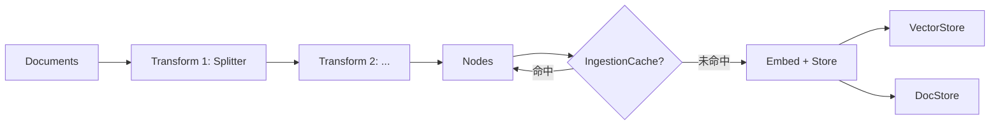

# 05 - Ingestion Pipeline（摄取流水线）

源码：`llama-index-core/llama_index/core/ingestion/pipeline.py`（约 883 行）

## 职责

`IngestionPipeline` 将 **Reader → Transform → VectorStore / DocStore** 封装为可复用、可缓存、可并行的流水线，适合生产环境增量更新知识库。

## 基本用法

```python
from llama_index.core import Document
from llama_index.core.ingestion import IngestionPipeline
from llama_index.core.node_parser import SentenceSplitter
from llama_index.core.storage.docstore import SimpleDocumentStore

pipeline = IngestionPipeline(
    transformations=[
        SentenceSplitter(chunk_size=512, chunk_overlap=64),
    ],
    vector_store=vector_store,  # 可选，直接写入外部向量库
    docstore=SimpleDocumentStore(),
)

nodes = pipeline.run(documents=documents)
```

## 流水线阶段



### run_transformations

核心函数，顺序应用变换：

```python
def run_transformations(
    nodes: Sequence[BaseNode],
    transformations: Sequence[TransformComponent],
    in_place: bool = True,
    cache: Optional[IngestionCache] = None,
    ...
) -> Sequence[BaseNode]:
```

每个 transform 的缓存 key = `sha256(node_content + transform_dict)`。

## 变换链（Transformations）

常见 TransformComponent：

| 组件 | 包/路径 | 作用 |
|------|---------|------|
| `SentenceSplitter` | core | 按句/字切分 |
| `TokenTextSplitter` | core | 按 token 切分 |
| `MarkdownNodeParser` | core | Markdown 结构感知 |
| `MetadataExtractor` | integrations | LLM 提取 metadata |
| `TitleExtractor` | integrations | 自动生成标题 |

默认 `Settings.transformations` 仅含 `SentenceSplitter`；生产可链式追加。

## 缓存（IngestionCache）

```python
from llama_index.core.ingestion.cache import IngestionCache
from llama_index.core.storage.kvstore.simple_kvstore import SimpleKVStore

cache = IngestionCache(
    cache=SimpleKVStore(),
    collection="my_kb_cache",
)
pipeline = IngestionPipeline(..., cache=cache)
```

避免对未变更文档重复 embed，显著降低 API 成本。

## 并行与分布式

`IngestionPipeline` 支持：

- **multiprocessing**：`num_workers` 并行 transform
- **Docstore 去重**：基于 document hash 跳过已 ingest 文档
- **vector_store 直写**：无需先建 Index 再 insert

```python
# 从目录批量摄取（配合 ReaderConfig）
pipeline.run(show_progress=True, num_workers=4)
```

## 与 VectorStoreIndex.from_documents 对比

| 方式 | 适用 |
|------|------|
| `VectorStoreIndex.from_documents` | 快速原型、Notebook |
| `IngestionPipeline` | 生产增量、缓存、自定义 vector_store |
| `index.insert()` | 已有 Index，追加节点 |

```python
# 生产推荐模式
pipeline = IngestionPipeline(transformations=[...], vector_store=qdrant_store)
pipeline.run(documents=new_docs)
index = VectorStoreIndex.from_vector_store(vector_store=qdrant_store)
```

## Readers 集成

```python
from llama_index.core.readers.base import ReaderConfig
from llama_index.core import SimpleDirectoryReader

reader = SimpleDirectoryReader(input_dir="./data/docs", recursive=True)
documents = reader.load_data()

# ReaderConfig 可嵌入 pipeline 配置（LlamaCloud 等场景）
```

Reader 输出 `List[Document]`，metadata 中通常含 `file_path`、`file_name`。

## 持久化 Docstore

Pipeline 可将 docstore 持久化到磁盘：

```python
pipeline.persist("./pipeline_storage")
# 恢复
pipeline.load("./pipeline_storage")
```

与 `StorageContext.persist()` 配合使用见 [12-storage.md](./12-storage.md)。

## 错误处理与日志

- 使用 `logging.getLogger(__name__)` 记录 transform 进度
- `get_tqdm_iterable` 在 `show_progress=True` 时显示进度条
- 不稳定对象（如内存地址）会从 hash 计算中剥离（`remove_unstable_values`）

## kefu-kb 对照

kefu-kb `app/ingest.py` 实现了简化版 pipeline：

```
read files → split chunks → embed via HTTP → upsert Qdrant
```

用 LlamaIndex 重写时可替换为：

```python
pipeline = IngestionPipeline(
    transformations=[SentenceSplitter(chunk_size=config.chunk_size, ...)],
    vector_store=QdrantVectorStore(...),
)
pipeline.run(documents=SimpleDirectoryReader("data/docs").load_data())
```

保留 rerank / chat 逻辑在 QueryEngine 层不变。
