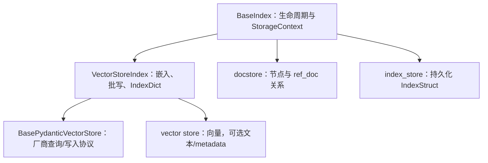
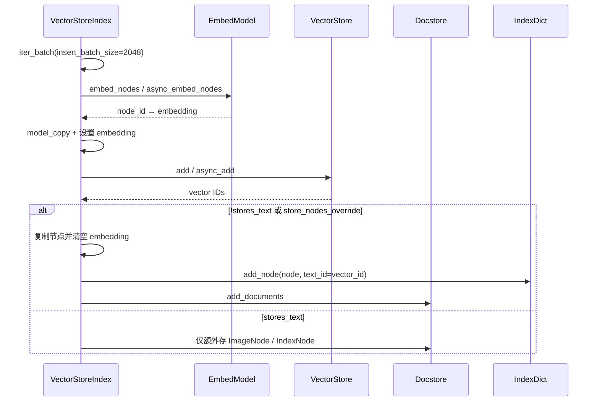

# 06 - BaseIndex、VectorStoreIndex 与向量查询协议

> 源码基线：LlamaIndex `0.14.23`。前置阅读：[05-IngestionPipeline摄取流水线.md](./05-IngestionPipeline摄取流水线.md)；后续阅读：[07-检索器与查询引擎.md](./07-检索器与查询引擎.md)。

## 1. 三层模型



Index 不是向量数据库本身。`BaseIndex` 管生命周期与存储上下文；`VectorStoreIndex` 决定何时嵌入、是否把节点副本放入 docstore/`IndexDict`；vector store 集成负责真正的 add/query/delete。

## 2. 源码地图

| 路径 | 方法/类型 |
|---|---|
| `llama-index-core/llama_index/core/indices/base.py` | `BaseIndex.__init__`, `from_documents`, `insert`, `as_query_engine` |
| `.../indices/vector_store/base.py` | `VectorStoreIndex`, `_add_nodes_to_index`, `from_vector_store` |
| `.../indices/vector_store/retrievers/retriever.py` | `VectorIndexRetriever` |
| `.../vector_stores/types.py` | 查询模式、过滤器、query/result、store 抽象 |
| `.../data_structs/data_structs.py` | `IndexDict` |
| `.../storage/storage_context.py` | `StorageContext` |

## 3. BaseIndex 构造与文档入口

### 3.1 `__init__`

`BaseIndex.__init__` 要求 `nodes`、`objects`、`index_struct` 至少一个；构造器只接受 `BaseNode`，传 `Document` 会明确要求改用 `from_documents()`。

精确链路：

```text
BaseIndex.__init__
  → StorageContext.from_defaults()（未显式传入时）
  → 建立 IndexNode object_map，并清空 obj 以便序列化
  → build_index_from_nodes(nodes + objects)（没有 index_struct 时）
  → 子类 _build_index_from_nodes()
  → index_store.add_index_struct()
  → 保存 transformations（显式值或 Settings.transformations）
```

通常 `BaseIndex.build_index_from_nodes()` 会先把 nodes 写入 docstore；但 `VectorStoreIndex` 覆盖了此方法，是否写 docstore 由 `stores_text` 决定。

### 3.2 `from_documents`

```text
VectorStoreIndex.from_documents(documents)
  → BaseIndex.from_documents
  → docstore.set_document_hash(doc.id_, doc.hash)
  → run_transformations(documents, Settings.transformations)
  → VectorStoreIndex(nodes=...)
  → BaseIndex.__init__
  → VectorStoreIndex.build_index_from_nodes
  → _build_index_from_nodes
  → _add_nodes_to_index / _async_add_nodes_to_index
```

这里 `run_transformations` 通常做切分；embedding 在 `_get_node_with_embedding()` 中通过 `embed_nodes()` 完成。`use_async=True` 只控制初次 `_build_index_from_nodes()` 走 async embedding/add，并通过 `run_async_tasks()` 从同步构造器驱动；日常异步插入应使用 `ainsert/ainsert_nodes`。

## 4. VectorStoreIndex 写入链



节点的 embedding 被放在副本上，原节点不会被就地修改。写 docstore 前再复制并清空 embedding，避免同一向量在 vector store 与 docstore 重复保存。

`build_index_from_nodes()` 还会过滤 `node.get_content(metadata_mode=EMBED) == ""` 的节点，并打印跳过提示。

## 5. `stores_text` 决策矩阵

`BasePydanticVectorStore.stores_text` 是整个存储拓扑的关键能力标志：

| `stores_text` | `store_nodes_override` | 普通文本节点写 docstore/IndexDict | 查询结果来源 | `from_vector_store` |
|---|---:|---|---|---|
| `False` | 任意 | 是 | store 返回 IDs，再按 `IndexDict` 到 docstore 取节点 | 禁止 |
| `True` | `False` | 否（ImageNode/IndexNode 例外） | store 直接返回节点；非文本节点可由 docstore 替换 | 允许 |
| `True` | `True` | 是 | 两边都保存，便于 ref_doc 操作/兼容逻辑 | 允许 |

常见误区：`IndexDict` 并不总有完整 `node_id → vector_id` 映射。store 自己保存文本且未 override 时，普通 `TextNode` 不进入 `IndexDict`。

`VectorStoreIndex.from_vector_store()`：

1. 强制 `vector_store.stores_text=True`，否则抛 `ValueError`；
2. 丢弃传入的 `storage_context`；
3. 用该 store 新建 `StorageContext`；
4. 以空 nodes 构造 Index，不重新嵌入、不扫描已有 collection。

## 6. 插入、删除与 ref_doc

| API | 主要调用 |
|---|---|
| `index.insert(Document)` | transform → `insert_nodes` → embed/add → 记录 document hash |
| `index.ainsert(Document)` | async transform → `ainsert_nodes` → async embed/add |
| `insert_nodes(nodes)` | 直接 embed/add，不再切分 |
| `delete_nodes(ids)` | `vector_store.delete_nodes()`；按 stores_text 条件清理本地存储 |
| `delete_ref_doc(ref_doc_id)` | `vector_store.delete(ref_doc_id)` → 清 IndexDict → 可选清 docstore |
| `update_ref_doc(doc)` | delete_ref_doc → insert |
| `refresh_ref_docs(docs)` | 比较 docstore hash，只插入新增/更新变化项 |

集成必须正确保存 `ref_doc_id` metadata，否则 `delete(ref_doc_id)` 无法删除一个 Document 的全部 chunks。另需注意 `VectorStoreIndex._delete_node()` 是空实现，实际节点删除依赖其覆盖的 `delete_nodes()`。

## 7. VectorStoreQuery：完整字段

`VectorIndexRetriever._build_vector_store_query()` 组装标准查询：

| 字段 | 含义 |
|---|---|
| `query_embedding` | dense query vector，可为空 |
| `query_str` | 原始文本，文本/稀疏/混合查询常需 |
| `similarity_top_k` | dense 或默认查询候选数 |
| `doc_ids`, `node_ids` | 限定文档/节点集合 |
| `filters` | metadata 过滤树 |
| `mode` | 查询模式 |
| `alpha` | hybrid 权重，约定 0 偏 BM25、1 偏向量 |
| `sparse_top_k` | 稀疏候选数，源码注释指出当前主要用于 Postgres hybrid |
| `hybrid_top_k` | 混合融合后的最终数量 |
| `mmr_threshold` | MMR 专用；Retriever 的标准构造路径未填此字段 |
| `output_fields`, `embedding_field` | store 特定输出/字段选择；标准 Retriever 路径未填 |

`VectorStoreQueryResult` 至少应返回 `nodes` 或 `ids`，并可返回与结果顺序对齐的 `similarities`。

## 8. 查询模式

| `VectorStoreQueryMode` | 语义 | 是否通常需要 query embedding |
|---|---|---|
| `DEFAULT` | 默认 dense 相似度 | 是 |
| `SPARSE` | 稀疏检索 | 否 |
| `HYBRID` | dense + sparse | 是 |
| `TEXT_SEARCH` | 文本搜索 | 否 |
| `SEMANTIC_HYBRID` | 后端定义的语义混合 | 是 |
| `SVM` | 用候选向量训练/拟合 SVM 排序 | 是 |
| `LOGISTIC_REGRESSION` | 逻辑回归排序 | 是 |
| `LINEAR_REGRESSION` | 线性回归排序 | 是 |
| `MMR` | 最大边际相关性，平衡相关与多样性 | 是 |

枚举存在不代表某个集成支持。能力由具体 vector store 决定；不支持的 mode/filter/operator 应由集成报错或转换，core 不做统一能力协商。

## 9. MetadataFilters

过滤器可递归嵌套：

```python
filters = MetadataFilters(
    condition=FilterCondition.AND,
    filters=[
        MetadataFilter(key="tenant_id", value="t-01", operator=FilterOperator.EQ),
        MetadataFilters(
            condition=FilterCondition.OR,
            filters=[
                MetadataFilter(key="year", value=2025, operator=FilterOperator.GTE),
                MetadataFilter(key="featured", value=1),
            ],
        ),
    ],
)
```

运算符全集：`EQ`、`GT`、`LT`、`NE`、`GTE`、`LTE`、`IN`、`NIN`、`ANY`、`ALL`、`TEXT_MATCH`、`TEXT_MATCH_INSENSITIVE`、`CONTAINS`、`IS_EMPTY`。组合条件：`AND`、`OR`、`NOT`。

值使用 strict int/float/str 或其列表，避免 Pydantic 把数字意外转字符串。`MetadataFilters.from_dict()` 已 deprecated；`legacy_filters()` 只接受非嵌套的 `EQ`，旧 store 遇到高级过滤会抛错。

## 10. VectorIndexRetriever 的回填链

```text
_retrieve(QueryBundle)
  → _needs_embedding()
  → embed_model.get_agg_embedding_from_queries(embedding_strs)
  → _build_vector_store_query()
  → vector_store.query()
  → _determine_nodes_to_fetch()
  → docstore.get_nodes()（必要时）
  → _insert_fetched_nodes_into_query_result()
  → NodeWithScore(node, similarity)
```

当 result 含 nodes 时，只回填非 `ObjectType.TEXT` 的节点；当只含 ids 时，通过 `index_struct.nodes_dict[vector_id]` 找 docstore node ID。异步链对应 `aget_agg_embedding_from_queries`、`aquery`、`aget_nodes`。

一个 0.14.23 细节：异步 `_aretrieve()` 重建 `QueryBundle(query_str, embedding)`，不会保留原 bundle 的其他扩展字段；自定义检索逻辑依赖这些字段时需验证。

## 11. 其他 Index 与图索引选择

| Index | 适用模型 |
|---|---|
| `SummaryIndex` | 线性节点集合与全量摘要 |
| `TreeIndex` | 层次摘要/树遍历 |
| `PropertyGraphIndex` | 属性图、图抽取、图与向量组合检索，当前推荐 |
| `ComposableGraph` | 多 Index 组合 |

**不要为新项目选择 `KnowledgeGraphIndex`。** 0.14.23 在 `indices/knowledge_graph/base.py` 对该类加了 deprecated 装饰器，并明确要求使用 `PropertyGraphIndex`；`KGTableRetriever` 与 `KnowledgeGraphRAGRetriever` 也已 deprecated。

## 12. 扩展点与陷阱

扩展点：

1. 新 Index：继承 `BaseIndex`，实现 `_build_index_from_nodes`、`_insert`、删除、`ref_doc_info` 与 `as_retriever`。
2. 新 store：实现 `BasePydanticVectorStore.add/delete/query`，最好原生实现 async 方法、filters 与 node 删除。
3. 新检索策略：继承 `BaseRetriever` 或 `VectorIndexRetriever`，覆盖 query 构造/结果融合。

陷阱：

1. `async_add/aquery` 基类默认回退同步实现，可能阻塞 event loop。
2. 连接已有 collection 前必须保证 embedding 模型、维度和距离度量一致。
3. `stores_text=True` 时 `ref_doc_info` 未实现，除非 `store_nodes_override=True`。
4. `insert_batch_size` 是 Index 向 store 的批次，不一定等于 embedding API 自己的 batch size。
5. `from_vector_store()` 不验证 collection 内容、schema 或 embedding 维度。
6. 外部 store 的持久化不由 `StorageContext.persist()` 代管。

## 13. 阅读顺序

1. `indices/base.py: BaseIndex.__init__/from_documents`
2. `indices/vector_store/base.py: _add_nodes_to_index`
3. 同文件 `stores_text` 各分支与 `from_vector_store`
4. `vector_stores/types.py`
5. `indices/vector_store/retrievers/retriever.py`
6. [07-检索器与查询引擎.md](./07-检索器与查询引擎.md)
