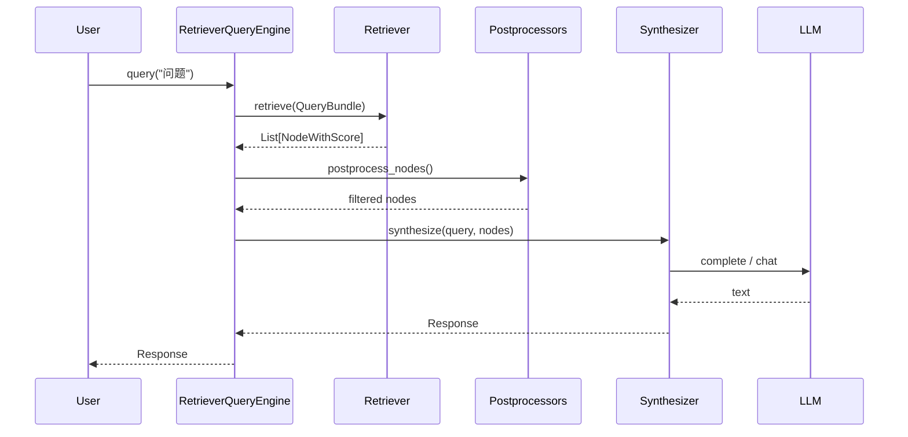

# 07 - Retriever 与 QueryEngine

## Retriever

源码：`llama-index-core/llama_index/core/base/base_retriever.py`

### 接口

```python
class BaseRetriever(ABC):
    def retrieve(self, str_or_query_bundle: QueryType) -> List[NodeWithScore]: ...
    async def aretrieve(self, str_or_query_bundle: QueryType) -> List[NodeWithScore]: ...
```

输入可以是字符串或 `QueryBundle`；输出为带分数的节点列表。

### 从 Index 创建

```python
retriever = index.as_retriever(
    similarity_top_k=5,
    filters=MetadataFilters(filters=[
        MetadataFilter(key="category", value="售后"),
    ]),
)
nodes = retriever.retrieve("退货政策")
```

## RetrieverQueryEngine

源码：`llama-index-core/llama_index/core/query_engine/retriever_query_engine.py`

**标准 RAG 查询引擎** = Retriever + Postprocessors + ResponseSynthesizer。

### 构造

```python
from llama_index.core.query_engine import RetrieverQueryEngine
from llama_index.core.response_synthesizers import get_response_synthesizer

retriever = index.as_retriever(similarity_top_k=5)
synthesizer = get_response_synthesizer(response_mode="compact")

engine = RetrieverQueryEngine(
    retriever=retriever,
    response_synthesizer=synthesizer,
    node_postprocessors=[reranker],  # 可选
)
response = engine.query("7 天内如何退货？")
```

### from_args 快捷方式

```python
engine = RetrieverQueryEngine.from_args(
    retriever=retriever,
    response_mode="compact",
    similarity_top_k=5,
    streaming=False,
)
```

### query 内部流程



### 源码结构

```25:56:llama-index-core/llama_index/core/query_engine/retriever_query_engine.py
class RetrieverQueryEngine(BaseQueryEngine):
    def __init__(
        self,
        retriever: BaseRetriever,
        response_synthesizer: Optional[BaseSynthesizer] = None,
        node_postprocessors: Optional[List[BaseNodePostprocessor]] = None,
        ...
    ) -> None:
        self._retriever = retriever
        self._response_synthesizer = response_synthesizer or get_response_synthesizer(
            llm=Settings.llm,
            ...
        )
        self._node_postprocessors = node_postprocessors or []
```

## Node Postprocessors

源码：`llama-index-core/llama_index/core/postprocessor/`

在检索后、合成前对 nodes 过滤/重排：

| Postprocessor | 说明 |
|---------------|------|
| `SimilarityPostprocessor` | 分数阈值 cutoff |
| `KeywordNodePostprocessor` | 关键词必含 |
| `PrevNextNodePostprocessor` | 扩展前后相邻 chunk |
| `CohereRerank` (integration) | Cohere rerank API |
| `SentenceTransformerRerank` | 本地 cross-encoder |
| `LLMRerank` | LLM 打分 rerank |

```python
from llama_index.postprocessor.cohere_rerank import CohereRerank

rerank = CohereRerank(api_key="...", top_n=3)
engine = index.as_query_engine(
    similarity_top_k=10,
    node_postprocessors=[rerank],
)
```

kefu-kb 的 rerank 步骤等价于在此层接入 llama-server rerank 或自定义 Postprocessor。

## 高级 QueryEngine

### RouterQueryEngine

多索引路由，由 LLM 或 rule 选择子引擎：

```python
from llama_index.core.query_engine import RouterQueryEngine
from llama_index.core.tools import QueryEngineTool

query_engine_tools = [
    QueryEngineTool.from_defaults(query_engine=faq_engine, description="FAQ"),
    QueryEngineTool.from_defaults(query_engine=policy_engine, description="政策"),
]
router = RouterQueryEngine.from_defaults(query_engine_tools=query_engine_tools)
```

### SubQuestionQueryEngine

将复杂问题分解为子问题，分别检索后汇总。

### TransformQueryEngine

查询改写（HyDE、step-back 等 Transform）。

### CitationQueryEngine

在 Response 中标注引用来源 `[1]`, `[2]`。

## Response 对象

```python
response = engine.query("问题")
response.response      # str，最终答案
response.source_nodes  # List[NodeWithScore]，引用来源
response.metadata      # 额外信息
```

流式：

```python
engine = index.as_query_engine(streaming=True)
streaming_response = engine.query("问题")
for token in streaming_response.response_gen:
    print(token, end="")
```

## 异步 API

```python
response = await engine.aquery("问题")
nodes = await retriever.aretrieve("问题")
```

FastAPI 路由中应使用 `aquery` 避免阻塞。

## 自定义 QueryEngine

继承 `BaseQueryEngine`，实现 `_query` / `_aquery`：

```python
from llama_index.core.base.base_query_engine import BaseQueryEngine

class MyQueryEngine(BaseQueryEngine):
    def _query(self, query_bundle: QueryBundle) -> RESPONSE_TYPE:
        ...
```

适用于特殊业务逻辑（权限过滤、多模态等）。

## 与 kefu-kb 映射

| kefu-kb 步骤 | LlamaIndex |
|--------------|------------|
| `retriever.search()` | `index.as_retriever().retrieve()` |
| rerank HTTP 调用 | `node_postprocessors=[RerankPostprocessor]` |
| prompt + llama chat | `RetrieverQueryEngine` + `get_response_synthesizer()` |
| 返回来源 | `response.source_nodes` |
