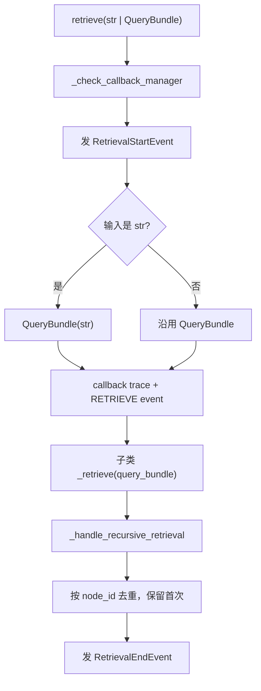
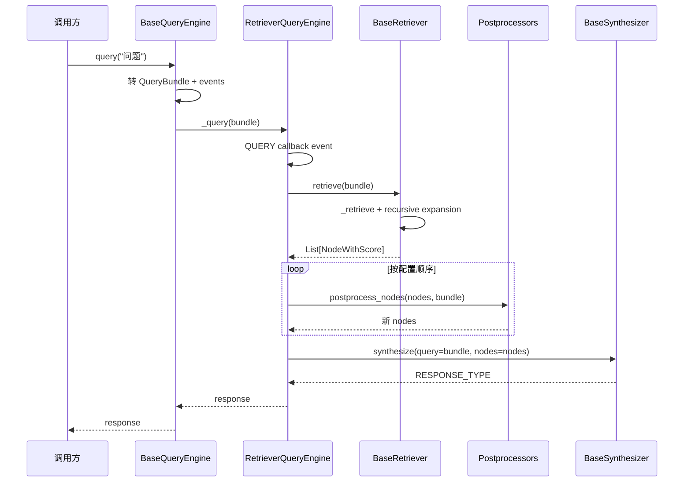

# 07 - BaseRetriever、后处理与 RetrieverQueryEngine

> 源码基线：LlamaIndex `0.14.23`。本文追踪从字符串 query 到响应合成前后的同步/异步模板。先读 [06-索引与向量存储.md](./06-索引与向量存储.md)，合成模式见 [08-响应合成器.md](./08-响应合成器.md)。

## 1. 标准 RAG 的组合边界

```text
RetrieverQueryEngine
  = BaseRetriever（找候选）
  + BaseNodePostprocessor[]（顺序过滤/重排/扩邻）
  + BaseSynthesizer（组织 prompt 与生成）
```

这三层刻意解耦：Retriever 不生成答案，postprocessor 不访问 query engine 控制流，Synthesizer 不负责向量检索。

## 2. 源码地图

| 路径 | 关键符号 |
|---|---|
| `llama-index-core/llama_index/core/base/base_retriever.py` | `BaseRetriever` 模板方法与递归展开 |
| `.../indices/vector_store/retrievers/retriever.py` | `VectorIndexRetriever` |
| `.../base/base_query_engine.py` | `BaseQueryEngine.query/aquery` |
| `.../query_engine/retriever_query_engine.py` | 标准 RAG 编排 |
| `.../postprocessor/types.py` | `BaseNodePostprocessor` |
| `.../base/response/schema.py` | `RESPONSE_TYPE` |

## 3. BaseRetriever 模板方法

子类的最小同步扩展点是 `_retrieve(QueryBundle)`；公开 `retrieve()` 不应被绕过，因为它还处理输入规范化、事件和递归对象。



异步模板完全对应：

```text
aretrieve
  → await _aretrieve
  → await _ahandle_recursive_retrieval
```

但 `BaseRetriever._aretrieve()` 默认只是 `return self._retrieve(query_bundle)`，即同步回退，会阻塞 event loop。高延迟 I/O Retriever 必须原生覆盖 `_aretrieve()`。

## 4. IndexNode 递归展开

`_handle_recursive_retrieval()` 遍历第一层结果；普通 node 原样保留，`IndexNode` 则取 `node.obj` 或 `object_map[node.index_id]`：

| 对象类型 | 展开结果 |
|---|---|
| `NodeWithScore` | 直接返回 |
| `BaseNode` | 包装为 `NodeWithScore`，继承父分数 |
| `BaseQueryEngine` | 调 `query/aquery`，把响应字符串包装为 `TextNode`，metadata 取响应 metadata |
| `BaseRetriever` | 递归调用 `retrieve/aretrieve` |
| 其他 | `ValueError` |

最后按 `node.node_id` 去重。分数表达式为 `n.score or 1.0`，所以合法的 `0.0` 也会被替换为 `1.0`；自定义递归检索若依赖零分边界应特别处理。

## 5. VectorIndexRetriever 调用链

```text
BaseRetriever.retrieve
  → VectorIndexRetriever._retrieve
  → _needs_embedding
  → get_agg_embedding_from_queries(QueryBundle.embedding_strs)
  → _get_nodes_with_embeddings
  → _build_vector_store_query
  → vector_store.query
  → 必要时 docstore.get_nodes 回填
  → _convert_nodes_to_scored_nodes
  → BaseRetriever._handle_recursive_retrieval
```

`TEXT_SEARCH` 与 `SPARSE` 不生成 query embedding；其余模式在 store 的 `is_embedding_query=True` 时生成。参数 `vector_store_kwargs` 原样透传给具体 store，不进入标准 `VectorStoreQuery`。

## 6. BaseQueryEngine 模板

`BaseQueryEngine.query()` 的职责非常薄：

```text
query(str | QueryBundle)
  → QueryStartEvent
  → callback trace("query")
  → str 转 QueryBundle
  → 子类 _query(QueryBundle)
  → QueryEndEvent
```

`aquery()` 对应 `await _aquery()`。自定义 QueryEngine 必须同时实现 `_query` 和 `_aquery`，因为二者都是 abstract method。基类的 `retrieve/synthesize/asynthesize` 默认抛 `NotImplementedError`，只有支持拆阶段调用的引擎才覆盖。

## 7. RetrieverQueryEngine 构造

推荐通过 Index：

```python
engine = index.as_query_engine(
    similarity_top_k=10,
    filters=filters,
    node_postprocessors=[reranker],
    response_mode="compact",
    streaming=False,
)
```

调用链：

```text
BaseIndex.as_query_engine(**kwargs)
  → self.as_retriever(**kwargs)
  → resolve llm
  → RetrieverQueryEngine.from_args(retriever, llm, **kwargs)
  → get_response_synthesizer(...)
  → RetrieverQueryEngine(...)
```

同一组 `kwargs` 同时经过 `as_retriever` 与 `from_args`；各层通过显式参数或 `**kwargs` 消化。直接用 `RetrieverQueryEngine.from_args()` 时，`similarity_top_k` 不会修改一个已经构造好的 Retriever——该方法签名没有此参数，它只会落入未使用的 `**kwargs`。top-k 应在创建 retriever 时设置。

`from_args()` 会把 `response_mode`、prompts、`output_cls`、`use_async`、`streaming`、`verbose`、`multimodal` 交给 synthesizer factory。若显式传 `response_synthesizer`，这些合成参数不再用于创建新实例。

## 8. 同步查询精确链



对应核心方法：

```text
RetrieverQueryEngine._query
  → self.retrieve
      → self._retriever.retrieve
      → _apply_node_postprocessors
  → self._response_synthesizer.synthesize
```

公开 `engine.retrieve(bundle)` 可只执行检索+后处理；`engine.synthesize(bundle, nodes)` 可只执行合成，适合调试分层结果。

## 9. 异步查询精确链

```text
BaseQueryEngine.aquery
  → await RetrieverQueryEngine._aquery
  → await self.aretrieve
      → await retriever.aretrieve
      → 逐个 await postprocessor.apostprocess_nodes
  → await synthesizer.asynthesize
```

后处理器是**顺序 await**，不是 gather，因为每一步输出是下一步输入。`aquery()` 只有在 Retriever、每个 postprocessor、vector store 与 LLM 都有真实异步实现时才是端到端非阻塞；不少基类 async 方法会同步回退。

## 10. Node Postprocessor

`RetrieverQueryEngine` 在构造时把统一 callback manager 注入每个 postprocessor。常见职责：

| 类型 | 作用 | 顺序建议 |
|---|---|---|
| metadata/keyword filter | 业务条件二次过滤 | 尽量改为 vector-store prefilter；否则最先 |
| `SimilarityPostprocessor` | similarity cutoff | rerank 前减少候选 |
| `PrevNextNodePostprocessor` | 从 docstore 扩展相邻节点 | 需 docstore 有关系与文本 |
| reranker | cross-encoder/LLM/远程服务重排 | 初筛后 |
| 自定义权限处理器 | tenant/ACL 强制过滤 | 必须可靠，优先 store 层并在此防御 |

```python
class MyPostprocessor(BaseNodePostprocessor):
    def _postprocess_nodes(self, nodes, query_bundle=None):
        ...
```

具体抽象模板以 `postprocessor/types.py` 为准。不要只在生成 prompt 中要求模型忽略无权限文本；权限必须在检索过滤或 postprocessor 层删除。

## 11. Response 类型与流式消费

| 调用 | `streaming=False` | `streaming=True` |
|---|---|---|
| `query()` | `Response` 或 `PydanticResponse` | `StreamingResponse` |
| `aquery()` | `Response` 或 `PydanticResponse` | `AsyncStreamingResponse` |

```python
response = engine.query("问题")
print(response.response)
print(response.source_nodes)

stream = engine.query("问题")
for token in stream.response_gen:
    print(token, end="")

astream = await engine.aquery("问题")
async for token in astream.async_response_gen():
    print(token, end="")
```

`StreamingResponse.__str__()`、`get_response()` 与 `print_response_stream()` 都会消费 generator 并缓存完整文本；generator 不是可重复流。异步对象应通过 `async_response_gen()` 消费。

## 12. 高级引擎与 Retriever

| 组件 | 编排目的 |
|---|---|
| `QueryFusionRetriever` | 多 query/多 retriever 融合，如 RRF |
| `RecursiveRetriever` | 显式递归节点/对象图 |
| `AutoMergingRetriever` | 基于父子关系合并相邻 chunks |
| `RouterRetriever` | 在多个 Retriever 间选择 |
| `RouterQueryEngine` | 在多个 QueryEngine 工具间路由 |
| `SubQuestionQueryEngine` | 拆问题、并行/分步查询再汇总 |
| `TransformQueryEngine` | 查询改写后委托底层 engine |
| `CitationQueryEngine` | 构造带编号引用的上下文与答案 |

这些组件多数仍复用 `BaseRetriever`/`BaseQueryEngine` 模板，阅读时先定位其 `_retrieve/_aretrieve` 或 `_query/_aquery`。

## 13. 扩展点

1. 自定义 Retriever：继承 `BaseRetriever`，实现 `_retrieve`，I/O 场景同时实现 `_aretrieve`。
2. 自定义后处理：继承 `BaseNodePostprocessor`，保留 query-aware sync/async 路径。
3. 自定义 QueryEngine：继承 `BaseQueryEngine`，实现 `_query/_aquery`。
4. 替换标准组件：`engine.with_retriever(new_retriever)` 会复用原 synthesizer、callback manager 和 postprocessors。
5. 运行时 prompt 更新：QueryEngine 的 prompt module 暴露名为 `response_synthesizer` 的子模块，可用 PromptMixin 接口递归更新。

## 14. 常见陷阱

1. 把 top-k 传给 `RetrieverQueryEngine.from_args()` 而不是 Retriever。
2. 误以为 `aretrieve/aquery` 自动线程化同步实现。
3. postprocessor 顺序错误：先截 top-N 再 rerank 可能丢失正确候选。
4. 使用 vector similarity cutoff 处理不同度量后端，却未校准分数方向/范围。
5. Retriever 的 `source_nodes` 是合成输入，不保证就是 LLM 实际完整使用的 token；Synthesizer 可能 truncate/repack。
6. 直接调用子类 `_retrieve/_query` 会绕过回调、事件、字符串转换和递归展开。
7. 递归 `IndexNode` 指向 QueryEngine 时，响应被转成新的 TextNode，原 source_nodes 不会自动展开进顶层来源。

## 15. 阅读顺序

1. `base/base_retriever.py: retrieve/_handle_recursive_retrieval`
2. `indices/vector_store/retrievers/retriever.py`
3. `base/base_query_engine.py`
4. `query_engine/retriever_query_engine.py: from_args/retrieve/_query`
5. `postprocessor/types.py`
6. [08-响应合成器.md](./08-响应合成器.md)
