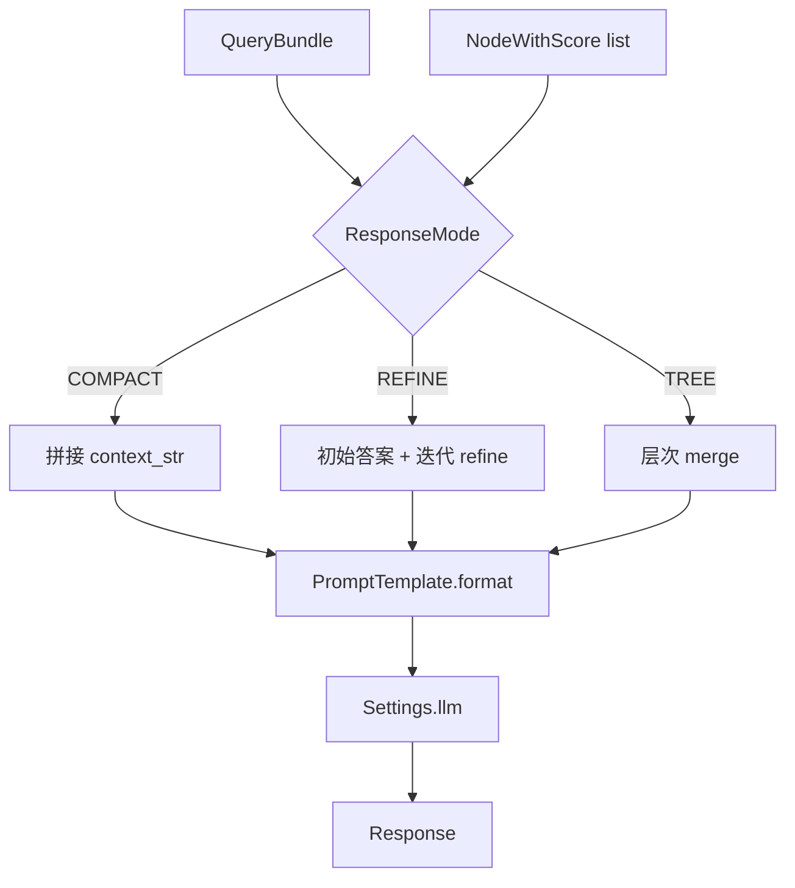

# 08 - Response Synthesizer（响应合成）

源码：`llama-index-core/llama_index/core/response_synthesizers/`

## 职责

将检索到的 `List[NodeWithScore]` 与用户 query 组合成 LLM prompt，生成最终自然语言答案。

## ResponseMode

```python
from llama_index.core.response_synthesizers import ResponseMode

ResponseMode.COMPACT          # 默认：压缩拼接 context
ResponseMode.REFINE           # 逐 chunk refine
ResponseMode.TREE_SUMMARIZE   # 树形汇总
ResponseMode.SIMPLE_SUMMARIZE # 单次 summarize
ResponseMode.ACCUMULATE       # 分别回答再合并
ResponseMode.COMPACT_ACCUMULATE
ResponseMode.GENERATION       # 无检索纯生成
ResponseMode.NO_TEXT          # 仅返回 nodes，不调用 LLM
ResponseMode.CONTEXT_ONLY     # 仅返回 context 字符串
```

## 工厂函数

```python
from llama_index.core.response_synthesizers import get_response_synthesizer

synthesizer = get_response_synthesizer(
    response_mode="compact",
    llm=Settings.llm,
    streaming=False,
)
```

## 各模式详解

### COMPACT（推荐默认）

- 在 token 限制内尽可能多塞入 chunk
- 单次 LLM 调用
- 适合 top_k 较小（3–5）的 RAG

### REFINE

- 先用第一个 chunk 生成初始答案
- 逐个 chunk refine 更新答案
- **多次 LLM 调用**，质量高但慢、贵

### TREE_SUMMARIZE

- 分治树形合并 chunk
- 适合 chunk 很多、需全局摘要

### SIMPLE_SUMMARIZE

- 所有 chunk 一次 stuff prompt
- context 超长时会截断

## Prompt 模板

可自定义 QA / Refine 模板：

```python
from llama_index.core import PromptTemplate

qa_template = PromptTemplate(
    "上下文：\n{context_str}\n\n问题：{query_str}\n\n请用中文简洁回答："
)

synthesizer = get_response_synthesizer(
    text_qa_template=qa_template,
    response_mode="compact",
)
```

默认模板见 `prompts/default_prompts.py`：

- `TEXT_QA_PROMPT`
- `REFINE_PROMPT`
- `SUMMARY_PROMPT`

Chat 模型使用 `chat_text_qa_template` 等变体。

## 结构化输出

```python
from pydantic import BaseModel

class Answer(BaseModel):
    answer: str
    confidence: float

synthesizer = get_response_synthesizer(
    output_cls=Answer,
    response_mode="compact",
)
```

依赖 LLM 的 `pydantic_program_mode`（function calling 或 json mode）。

## 模块结构

| 文件 | 类 |
|------|-----|
| `compact_and_refine.py` | CompactAndRefine |
| `refine.py` | Refine |
| `tree_summarize.py` | TreeSummarize |
| `simple_summarize.py` | SimpleSummarize |
| `accumulate.py` | Accumulate |
| `generation.py` | Generation |
| `factory.py` | `get_response_synthesizer` |

## 合成流程



## Token 管理

`PromptHelper` 根据 `context_window` 计算每个 chunk 可用空间：

```python
from llama_index.core.indices.prompt_helper import PromptHelper

prompt_helper = PromptHelper(context_window=8192, num_output=256)
# synthesizer 内部使用 prompt_helper.repack(...)
```

避免 prompt 超出模型上下文导致截断或 API 错误。

## 流式合成

```python
synthesizer = get_response_synthesizer(streaming=True)
engine = RetrieverQueryEngine.from_args(retriever, streaming=True)
```

`StreamingResponse.response_gen` 为 token 生成器。

## 客服场景建议

| 场景 | 推荐 mode |
|------|-----------|
| FAQ 短答案 | `compact` + 自定义中文 QA 模板 |
| 长政策解读 | `refine` 或增大 top_k + `compact` |
| 仅展示引用 | `no_text`，自行渲染 UI |
| 低延迟 | `compact`, top_k=3, 小 context |

kefu-kb 当前手写 prompt 等价于自定义 `text_qa_template` 的 `compact` 模式。

## 示例：中文客服模板

```python
CUSTOM_QA = PromptTemplate(
    """你是电商客服助手。仅根据以下知识库内容回答，不知道则说「暂无相关信息」。

知识库：
{context_str}

用户问题：{query_str}

回答："""
)

engine = index.as_query_engine(
    text_qa_template=CUSTOM_QA,
    response_mode="compact",
)
```
