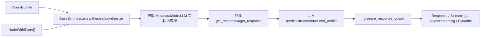
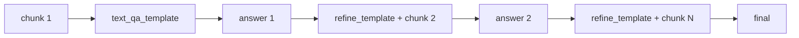

# 08 - ResponseSynthesizer：模式、流式与结构化输出

> 源码基线：LlamaIndex `0.14.23`。前置阅读：[07-检索器与查询引擎.md](./07-检索器与查询引擎.md)。本文中的“调用次数”以 repack 后的 chunk 数为准，并非原始检索节点数。

## 1. 职责边界

`BaseSynthesizer` 把 `QueryBundle + List[NodeWithScore]` 转成四类响应之一：`Response`、`StreamingResponse`、`AsyncStreamingResponse`、`PydanticResponse`。它保留 source nodes 与 metadata，具体子类决定如何打包上下文、调用 LLM 和组合中间答案。



## 2. 源码地图

| 路径 | 类/职责 |
|---|---|
| `response_synthesizers/type.py` | `ResponseMode` |
| `response_synthesizers/factory.py` | `get_response_synthesizer` 映射 |
| `response_synthesizers/base.py` | 公共合成模板和响应包装 |
| `refine.py`, `compact_and_refine.py` | 迭代改写 |
| `tree_summarize.py` | 递归树归并 |
| `simple_summarize.py` | 拼接后截断、单次调用 |
| `accumulate.py`, `compact_and_accumulate.py` | 各块独立回答再串接 |
| `generation.py`, `no_text.py`, `context_only.py` | 特殊模式 |
| `base/response/schema.py` | 四种响应数据类 |

## 3. 工厂完整映射

| ResponseMode 值 | 工厂返回类 | 核心算法 | 流式 |
|---|---|---|---|
| `refine` | `Refine` | 首块 QA，后续块携 existing answer refine | 支持，但只可能流最后一个有效阶段 |
| `compact` | `CompactAndRefine` | 先尽量 repack，再执行 Refine | 支持 |
| `tree_summarize` | `TreeSummarize` | 每层 repack、并行/串行摘要，递归到根 | 支持最终根层 |
| `simple_summarize` | `SimpleSummarize` | 全部拼接，truncate 后单次 QA | 支持 |
| `generation` | `Generation` | 丢弃 context，只按 query 生成 | 支持 |
| `accumulate` | `Accumulate` | 各 chunk 独立 QA，编号串接 | **不支持，运行时抛错** |
| `compact_accumulate` | `CompactAndAccumulate` | 先 repack，再 Accumulate | **不支持，运行时抛错** |
| `no_text` | `NoText` | 返回空字符串，同时保留 sources | 配置可开，但不是 LLM token stream |
| `context_only` | `ContextOnly` | `"\n\n".join(context)` | 配置可开，但返回值仍是普通字符串 |

工厂默认 `COMPACT`。它先解析 templates、callback manager、LLM，并从 `llm.metadata` 建立 `PromptHelper` 与 `ChatPromptHelper`。

## 4. BaseSynthesizer 精确模板

同步：

```text
synthesize(query, nodes)
  → SynthesizeStartEvent
  → 若 nodes 为空：
      streaming=False → Response("Empty Response")
      streaming=True  → StreamingResponse(empty generator)
  → str query 转 QueryBundle
  → callback SYNTHESIZE event
  → multimodal=False:
      node.get_content(MetadataMode.LLM)
      → 子类 get_response(query_str, text_chunks)
    multimodal=True:
      node.get_content_blocks(MetadataMode.LLM)
      → 子类 get_response_from_messages(...)
  → source_nodes = nodes + additional_source_nodes
  → _prepare_response_output
  → SynthesizeEndEvent
```

异步对应 `asynthesize()` → `await aget_response()`，空节点流返回 `AsyncStreamingResponse`。

`multimodal=True` 要求 LLM 是 chat model，否则构造时抛 `ValueError`。

### 空节点例外

`Generation` 覆盖了 `synthesize/asynthesize`，绕过空节点提前返回，因此即使 Retriever 没结果也会调用 LLM。其他模式遇到空 nodes 不调用具体 `get_response()`。

## 5. 各模式运行细节

### 5.1 REFINE



`Refine._run_refine_loop()`：

1. 取 QA/refine 两个模板中 token 最大者。
2. 对每个输入 chunk 单独 `PromptHelper.repack(..., padding=500)`，放入 deque。
3. 首块用 `{query_str, context_str}`；后续模板 partial format `{query_str, existing_answer}`，context 参数名为 `context_msg`。
4. existing answer 变长后再次 repack 当前 chunk；若拆成多块，压回 deque 前端。
5. 每步通过 `DefaultRefineProgram` 调 `predict/structured_predict`。

流式 refine 不是把每一步立即推给用户。进入下一块前，前一步 generator 会被 `get_response_text()` 完整消费，因为后续 prompt 需要完整 existing answer；最终可见流通常来自最后一个有效 refine。

`structured_answer_filtering=True` 时，程序输出内部 `StructuredRefineResponse(query_satisfied, answer)`；无足够上下文的块可不更新答案。自定义 `program_factory` 只有开启该开关才允许。

### 5.2 COMPACT

`CompactAndRefine._make_compact_text_chunks()` 对已填入 query 的 QA/refine 模板取最大 prompt，再用 `PromptHelper.repack()` 把多个小 chunk 尽可能装进上下文窗口，之后完全复用 Refine。

它不保证单次 LLM 调用。若 repack 后仍有 K 块，就是一次初始 QA 加 K-1 次 refine；只有 K=1 才是单次。

### 5.3 TREE_SUMMARIZE

每层执行：

```text
repack(chunks)
  → 只有 1 块：predict/stream/structured_predict，返回根答案
  → 多块：每块 summary → 把 summaries 递归传回 get_response
```

`aget_response()` 对同层 summaries 用 `asyncio.gather()`。同步 `get_response()` 默认串行；`use_async=True` 时用 `run_async_tasks()` 驱动异步预测。`streaming=True` 只在递归收敛到单块时调用 stream，中间层仍完整生成 summaries。

适合全局摘要，不等价于逐证据保真问答；中间层摘要会压缩细节。

### 5.4 SIMPLE_SUMMARIZE

先 `"\n".join(text_chunks)`，再 `PromptHelper.truncate()` 到单个 prompt 可容纳范围，最后只调用一次 `predict/stream`。超长尾部会被截掉，不会像 compact/refine 那样多轮覆盖全部内容。

0.14.23 工厂没有传 `output_cls` 给 `SimpleSummarize`，因此该模式不支持工厂级结构化输出。

### 5.5 ACCUMULATE

对每个原始 chunk 再做一次 repack，每个 repacked chunk 独立执行相同 QA prompt，最后格式化：

```text
Response 1: ...
---------------------
Response 2: ...
```

`aget_response()` 并发 gather 全部任务；同步 `get_response()` 在 `use_async=True` 时也用 `run_async_tasks()`。它不做答案融合，只做编号拼接。`streaming=True` 会在运行时明确抛 `ValueError("Unable to stream in Accumulate response mode")`。

### 5.6 COMPACT_ACCUMULATE

先对全部 chunks 做一次全局 repack，再委托 Accumulate。调用次数少于普通 accumulate，但仍是多个相互独立答案，不是 refine。

### 5.7 GENERATION

`get_response()` 直接 `del text_chunks`，用 `simple_template` 与 `query_str` 调 LLM。它保留传入的 source nodes，但答案没有使用这些上下文；因此 sources 不能被解释为答案依据。

### 5.8 NO_TEXT

返回 `""`，BaseSynthesizer 将其包装为 `Response(response="")` 并附带 source nodes/metadata。它不是“直接返回 nodes”；节点在 `response.source_nodes`。

### 5.9 CONTEXT_ONLY

把按 `MetadataMode.LLM` 提取的文本用两个换行拼接，不调用 LLM。多模态路径只保留 text blocks，图片等非文本 block 不出现在字符串中。

## 6. Prompt 与 token 管理

工厂参数到模式：

| 参数 | 使用模式 |
|---|---|
| `text_qa_template` | refine、compact、simple、accumulate、compact_accumulate |
| `refine_template` | refine、compact |
| `summary_template` | tree_summarize |
| `simple_template` | generation |
| `chat_content_qa_template` | 多模态 refine/compact/simple/accumulate |
| `chat_content_refine_template` | 多模态 refine/compact |
| `chat_summary_template` | 多模态 tree |

`PromptHelper.repack` 尽量重组并填满窗口，可能合并或切分；`truncate` 只裁到可容纳长度。预算来自 LLM metadata 的 context window 与 output token 配置。

```python
qa = PromptTemplate(
    "仅依据上下文回答；无依据则回答不知道。\n"
    "上下文：{context_str}\n问题：{query_str}\n答案："
)
engine = index.as_query_engine(
    response_mode="compact",
    text_qa_template=qa,
)
```

模板变量必须与模式实现一致；refine 模板至少应接受 `query_str`、`existing_answer`、`context_msg`。

## 7. 流式输出

### 7.1 包装规则

`BaseSynthesizer._prepare_response_output()` 按运行时类型包装：

| 子类返回 | 外层响应 |
|---|---|
| `str` | `Response` |
| 同步 `Generator` | `StreamingResponse` |
| `AsyncGenerator` | `AsyncStreamingResponse` |
| `output_cls` 实例 | `PydanticResponse` |

同步：

```python
stream = engine.query("问题")
for token in stream.response_gen:
    print(token, end="")
```

异步：

```python
stream = await engine.aquery("问题")
async for token in stream.async_response_gen():
    print(token, end="")
```

### 7.2 重要限制

1. `streaming=True` 不代表所有前置 LLM 调用都可见；refine/tree 的中间调用必须先完成。
2. Accumulate 两种模式不支持 streaming。
3. `NoText/ContextOnly` 的 `get_response()` 返回 str，所以有非空 nodes 时仍包装为 `Response`，即使构造参数 `streaming=True`；只有空 nodes 的 BaseSynthesizer 分支返回 StreamingResponse。
4. 调用 `str(stream)` 或 `get_response()` 会消费并缓存生成器。

## 8. 结构化输出

### 8.1 `output_cls` 路径

```python
class Answer(BaseModel):
    answer: str
    confidence: float

synthesizer = get_response_synthesizer(
    response_mode=ResponseMode.COMPACT,
    output_cls=Answer,
)
```

支持程度：

| 模式 | `output_cls` |
|---|---|
| refine / compact | 每步走 `structured_predict`，最终尝试从 JSON 解析 model |
| tree_summarize | 每层可 `structured_predict`；中间 model 序列化为 JSON 再递归 |
| accumulate / compact_accumulate | 每块 structured predict，但最终 `_format_response` 期望字符串；需实测/定制，不宜直接假设稳定 |
| simple_summarize / generation / no_text / context_only | 工厂未传入或不使用 |

### 8.2 `StructuredLLM` 路径

若 `self._llm` 本身是 `StructuredLLM`，`_prepare_response_output()` 会把 `str(response_str)` 用 `StructuredLLM.output_cls.model_validate_json()` 解析并返回 `PydanticResponse`。这条路径优先于普通 str/generator 判断。

结构化与流式同时开启取决于底层 LLM 的 `stream_structured_predict/astream_structured_predict` 支持；Refine 为了确认字段完整，可能缓存结构化对象后才吐出 answer，并非逐 token JSON。

`PydanticResponse.response` 是模型实例，且 `__getattr__` 会把模型字段透出：

```python
result.response.answer
result.answer
result.source_nodes
```

## 9. metadata 与来源

响应 metadata 是：

```text
{node.node_id: node.metadata for node in source_nodes}
```

`additional_source_nodes` 只在最终包装时追加，不参与 prompt。source nodes 是输入候选记录，不保证每段都未被 truncate，也不保证 LLM 使用了每段内容。

## 10. 扩展点

1. 新模式：继承 `BaseSynthesizer`，实现 `get_response/aget_response`；多模态还需实现 messages 版本。
2. 新结构化程序：为 Refine 提供 `program_factory`，并启用 `structured_answer_filtering`。
3. 新 prompt 策略：实现 `BasePromptTemplate` 或通过 PromptMixin 的 `update_prompts()` 更新。
4. 新 token 策略：注入 `PromptHelper`/`ChatPromptHelper`。
5. 自定义响应包装：覆盖 `_prepare_response_output`，但要保留 source/metadata 与 sync/async generator 语义。

## 11. 选型

| 目标 | 推荐 | 原因/代价 |
|---|---|---|
| 常规 RAG | `compact` | 尽量减少 refine 次数，同时覆盖全部上下文 |
| 逐证据迭代修正 | `refine` | 调用多、延迟高 |
| 大规模全局摘要 | `tree_summarize` | 分层压缩，可同层异步 |
| 极低延迟且允许截断 | `simple_summarize` | 单次调用，尾部可能丢失 |
| 保留每块独立答案 | `accumulate` | 不融合、不可流式 |
| 只拿检索来源 | `no_text` | 无 LLM，答案字段为空 |
| 调试实际上下文文本 | `context_only` | 无 LLM，可检查 metadata 注入后的文本 |
| 无上下文生成 | `generation` | 不是 RAG |

## 12. 常见陷阱

1. 把 compact 描述成“永远一次 LLM 调用”。
2. 认为 no_text 的 `response` 本身就是 nodes；节点在 `source_nodes`。
3. 在 accumulate 开 streaming，直到运行时才报错。
4. 自定义 prompt 变量名与实现不一致。
5. 把 source_nodes 当成模型确实看到的完整上下文。
6. 在 simple_summarize 中期待覆盖全部超长文本或结构化输出。
7. 认为 async tree 的所有层一次 gather；实际是每层 gather 后递归。
8. `output_cls` 与 streaming 组合未验证底层模型能力。

## 13. 阅读顺序

1. `response_synthesizers/type.py`
2. `response_synthesizers/factory.py`
3. `response_synthesizers/base.py: synthesize/_prepare_response_output`
4. `compact_and_refine.py` → `refine.py`
5. `tree_summarize.py`
6. 其余特殊模式文件
7. `base/response/schema.py`
