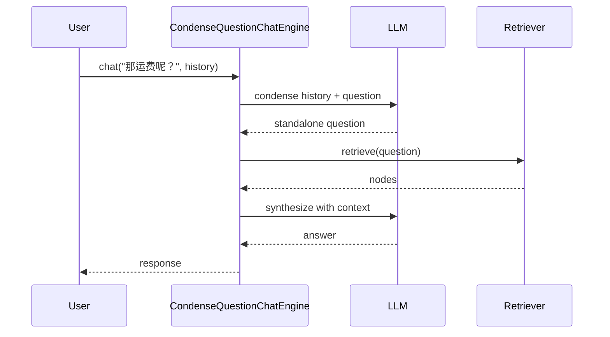

# 09 - ChatEngine（多轮对话）

源码：`llama-index-core/llama_index/core/chat_engine/`

## 与 QueryEngine 的区别

| 维度 | QueryEngine | ChatEngine |
|------|-------------|------------|
| 方法 | `query(str)` | `chat(str, chat_history)` |
| 历史 | 无 | 维护/压缩对话历史 |
| 返回 | `Response` | `AgentChatResponse` / streaming |
| 场景 | 单轮 QA | 客服、助手 |

## ChatMode

`index.as_chat_engine(chat_mode=...)` 支持：

| 模式 | 类 | 行为 |
|------|-----|------|
| `"simple"` | `SimpleChatEngine` | 纯 LLM 对话，无检索 |
| `"condense_question"` | `CondenseQuestionChatEngine` | 历史 + 问题 → 独立 question → 检索 |
| `"context"` | `ContextChatEngine` | 每轮检索，context 注入 |
| `"condense_plus_context"` | `CondensePlusContextChatEngine` | Condense + Context 组合 |
| `"best"` | 自动选择 | 默认 condense_plus_context |

## 基本用法

```python
from llama_index.core.memory import ChatMemoryBuffer

chat_engine = index.as_chat_engine(chat_mode="context")

response = chat_engine.chat("退货要几天？")
response = chat_engine.chat("需要运费吗？")  # 带上下文

# 流式
streaming = chat_engine.stream_chat("会员有什么权益？")
for token in streaming.response_gen:
    print(token, end="")
```

## CondenseQuestion 模式



解决 **指代消解** 问题（"它"、"那个" 等依赖历史的问法）。

## Context 模式

每轮用户消息直接触发检索，将 top_k chunk 作为 context 注入 prompt，适合 **每轮都需要知识库** 的客服。

## Memory

```python
from llama_index.core.memory import ChatMemoryBuffer

memory = ChatMemoryBuffer.from_defaults(token_limit=3000)
chat_engine = index.as_chat_engine(
    chat_mode="condense_plus_context",
    memory=memory,
)
```

Memory 实现：

- `ChatMemoryBuffer`：token 限制缓冲
- `SimpleComposableMemory`：多 memory 组合
- 集成：`llama-index-storage-chat-store-*` 持久化

## 多模态 ChatEngine

- `MultiModalContextChatEngine`
- `MultiModalCondensePlusContextChatEngine`

支持 `ImageNode` 与文本混合对话。

## AgentChatResponse

```python
response = chat_engine.chat("问题")
response.response          # 文本
response.sources           # 引用 nodes
response.metadata
```

Streaming 版本：`StreamingAgentChatResponse`。

## 重置会话

```python
chat_engine.reset()  # 清空 memory / history
```

Web 客服每个新会话应调用 `reset()` 或新建 chat_engine 实例。

## FastAPI 集成模式

```python
from fastapi import FastAPI
from llama_index.core.memory import ChatMemoryBuffer

app = FastAPI()
sessions: dict[str, ChatMemoryBuffer] = {}

@app.post("/chat")
async def chat(session_id: str, message: str):
    if session_id not in sessions:
        sessions[session_id] = ChatMemoryBuffer.from_defaults(token_limit=3000)
    engine = index.as_chat_engine(memory=sessions[session_id])
    return {"answer": str(await engine.achat(message))}
```

生产环境建议 session 存储到 Redis（chat_store 集成）。

## kefu-kb 迁移建议

当前 kefu-kb 为 **无状态单轮** `/api/ask`。若需多轮：

1. 使用 `CondensePlusContextChatEngine`
2. 前端维护 `session_id`
3. 服务端 `ChatMemoryBuffer` 或 SQL chat store
4. 保留 `source_nodes` 返回来源引用

```python
chat_engine = index.as_chat_engine(
    chat_mode="condense_plus_context",
    similarity_top_k=5,
    system_prompt="你是电商客服，仅根据知识库回答。",
)
```
