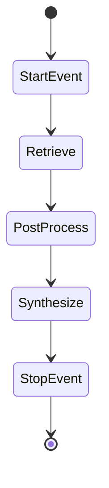

# 10 - Agent 与 Workflow

## Agent 体系

LlamaIndex 的 Agent 基于 **Workflow** 事件驱动框架（依赖 `workflows` 库），核心路径：

```
llama-index-core/llama_index/core/agent/
llama-index-core/llama_index/core/workflow/
```

## ReActAgent

源码：`agent/workflow/react_agent.py`

```python
from llama_index.core.agent.workflow import ReActAgent
from llama_index.core.tools import FunctionTool

def search_kb(query: str) -> str:
    """搜索知识库"""
    return str(query_engine.query(query))

tools = [
    FunctionTool.from_defaults(search_kb),
]

agent = ReActAgent.from_tools(tools, llm=Settings.llm, verbose=True)
response = await agent.run("用户想退货，帮我查政策和流程")
```

ReAct 循环：**Reason → Act (tool call) → Observe → …** 直到生成最终答案。

## Agent 相关类

| 类 | 说明 |
|----|------|
| `ReActAgent` | 经典 ReAct 工具调用 |
| `BaseWorkflowAgent` | Workflow 基类 |
| `AgentRunner` | 旧版 runner（逐步迁移到 Workflow） |
| `FunctionAgent` | 函数式 agent |

## Workflow

源码：`workflow/workflow.py`  re-export `workflows.workflow.Workflow`

Workflow 是 **有状态的多步编排**，用 Event 连接步骤：

```python
from llama_index.core.workflow import Workflow, StartEvent, StopEvent, step

class RAGWorkflow(Workflow):
    @step
    async def retrieve(self, ev: StartEvent) -> RetrieveEvent:
        nodes = await retriever.aretrieve(ev.query)
        return RetrieveEvent(nodes=nodes)

    @step
    async def synthesize(self, ev: RetrieveEvent) -> StopEvent:
        response = await synthesizer.asynthesize(ev.query, ev.nodes)
        return StopEvent(result=response)
```

### 特性

- `@step` 装饰器定义步骤
- 类型化 Event 传递数据
- 支持 retry、checkpoint、可视化（`drawing.py`）
- 与 Agent 深度集成



## Tools

源码：`llama-index-core/llama_index/core/tools/`

| Tool 类型 | 说明 |
|-----------|------|
| `FunctionTool` | 包装 Python 函数 |
| `QueryEngineTool` | 包装 QueryEngine |
| `RetrieverTool` | 包装 Retriever |
| `OnDemandLoaderTool` | 按需加载文档 |

```python
from llama_index.core.tools import QueryEngineTool

tool = QueryEngineTool.from_defaults(
    query_engine=index.as_query_engine(),
    name="knowledge_base",
    description="查询公司内部 FAQ 和政策",
)
```

Agent 根据 `description` 选择工具（依赖 LLM function calling）。

## 与 RAG 的组合模式

### 模式 1：RAG 作为单一 Tool

Agent 决定是否查知识库 vs 直接回答。

### 模式 2：Router Agent

多个 `QueryEngineTool` 对应不同知识域（售后 / 商品 / 会员）。

### 模式 3：Workflow 显式编排

固定流程：鉴权 → 检索 → rerank → 合成 → 格式化，每步可观测。

## Voice Agents

`voice_agents/` 提供语音对话抽象：

- `BaseVoiceAgent`
- `BaseVoiceAgentWebsocket`
- 集成包：`llama-index-voice-agents-openai` 等

## Instrumentation

Agent 运行触发 instrumentation 事件（`instrumentation/events/agent.py`）：

- `AgentRunStepStartEvent` / `AgentRunStepEndEvent`
- `AgentToolCallEvent`

便于对接 Langfuse、OpenTelemetry。

## 选择指南

| 需求 | 推荐 |
|------|------|
| 固定 RAG 问答 | QueryEngine / ChatEngine |
| 需查多个数据源 | RouterQueryEngine 或 Agent + 多 Tool |
| 复杂业务编排 | Workflow |
| 自主工具选择 | ReActAgent |
| 语音客服 | Voice Agent 集成 |

## kefu-kb 扩展

当前 kefu-kb 为纯 RAG。若需：

- **查订单 API + 知识库**：ReActAgent + `FunctionTool(order_lookup)` + `QueryEngineTool(kb)`
- **工单创建**：Workflow 步骤在 synthesize 后调用 HTTP API

```python
agent = ReActAgent.from_tools(
    [
        QueryEngineTool.from_defaults(query_engine=kb_engine, description="FAQ与政策"),
        FunctionTool.from_defaults(get_order_status),
    ],
    llm=Settings.llm,
)
```

## 版本说明

Agent/Workflow API 在 0.10+ 大幅重构，旧 `AgentRunner` API 仍部分保留但建议用 `ReActAgent` + Workflow 新路径。本仓库版本 **0.14.23** 以 Workflow Agent 为准。
