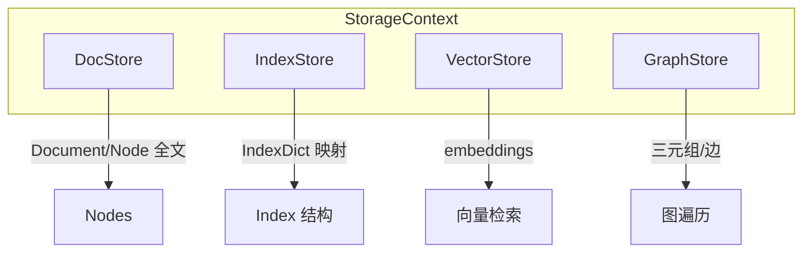

# 12 - Storage（存储与持久化）

## StorageContext

源码：`llama-index-core/llama_index/core/storage/storage_context.py`

**统一存储容器**，聚合索引所需的全部后端：

```python
@dataclass
class StorageContext:
    docstore: BaseDocumentStore      # 原始 Document / Node 全文
    index_store: BaseIndexStore      # IndexStruct 元数据
    vector_stores: Dict[str, BasePydanticVectorStore]  # 向量
    graph_store: GraphStore          # 知识图谱（可选）
    property_graph_store: PropertyGraphStore  # 属性图（可选）
```

### 默认构造

```python
from llama_index.core.storage.storage_context import StorageContext

storage_context = StorageContext.from_defaults(
    persist_dir="./storage",           # 可选：从磁盘加载
    vector_store=my_qdrant_store,      # 可选：外部向量库
)
```

未指定时使用内存实现：`SimpleDocumentStore` + `SimpleIndexStore` + `SimpleVectorStore`。

## 各 Store 职责



| Store | 默认实现 | 持久化文件 |
|-------|----------|------------|
| DocStore | `SimpleDocumentStore` | `docstore.json` |
| IndexStore | `SimpleIndexStore` | `index_store.json` |
| VectorStore | `SimpleVectorStore` | `default__vector_store.json` |
| GraphStore | `SimpleGraphStore` | `graph_store.json` |

常量定义于 `core/constants.py`：`DOC_STORE_KEY`, `VECTOR_STORE_KEY` 等。

## DocStore

```python
from llama_index.core.storage.docstore import SimpleDocumentStore

docstore = SimpleDocumentStore()
docstore.add_documents(documents)
docstore.get_document(doc_id)
docstore.get_node(node_id)
```

**RefDocInfo**：通过 `index.ref_doc_info` 查看某文档对应哪些 node。

删除文档：

```python
index.delete_ref_doc(ref_doc_id, delete_from_docstore=True)
```

## IndexStore

存储 `IndexStruct`（如 `IndexDict`：node_id 列表、vector_id 映射）。

```python
index_store.add_index_struct(index_struct)
index_store.get_index_struct(index_id)
```

`load_index_from_storage` 依赖 index_store 恢复 Index 对象。

## VectorStore 命名空间

`StorageContext.vector_stores` 是 dict，默认 key 为 `DEFAULT_VECTOR_STORE`。

多模态场景可有 `image` 命名空间（`IMAGE_VECTOR_STORE_NAMESPACE`）。

## 持久化 API

```python
# 保存到本地目录
index.storage_context.persist(persist_dir="./storage")

# 加载
from llama_index.core import load_index_from_storage

storage_context = StorageContext.from_defaults(persist_dir="./storage")
index = load_index_from_storage(storage_context)
```

### 远程 / 云存储

`persist` 支持 `fsspec` 协议：

```python
storage_context.persist(persist_dir="s3://bucket/llama-index/storage")
```

## Chat Store

多轮对话历史持久化（独立于 StorageContext）：

```python
from llama_index.core.storage.chat_store import SimpleChatStore

chat_store = SimpleChatStore()
chat_store.add_message(key="session_1", message=chat_message)
```

SQL 变体：`llama-index-storage-chat-store-sqlite` 等。

## KVStore

底层键值存储，用于 IngestionCache、SimpleDocStore 等：

- `SimpleKVStore`：JSON 文件
- 集成：Redis、DynamoDB、Firestore

## 生产部署建议

| 组件 | 开发 | 生产 |
|------|------|------|
| VectorStore | SimpleVectorStore | Qdrant / Milvus / PGVector |
| DocStore | SimpleDocumentStore | 同 Qdrant payload 或 PostgreSQL |
| IndexStore | 本地 JSON | 随 persist_dir 或云存储 |
| Chat | ChatMemoryBuffer | Redis / SQL chat store |

### 外部 VectorStore 注意事项

使用 Qdrant 等时：

- **向量与 metadata** 在 Qdrant collection
- **IndexStruct** 仍在 index_store（需 persist 或重建）
- `VectorStoreIndex.from_vector_store()` 可跳过 re-embed 连接已有 collection

```python
# 仅 vector store 在 Qdrant，index_store 本地
storage_context = StorageContext.from_defaults(
    vector_store=qdrant_store,
    persist_dir="./index_meta",
)
index = VectorStoreIndex.from_vector_store(
    vector_store=qdrant_store,
    storage_context=storage_context,
)
```

## kefu-kb 对照

kefu-kb 将 chunk text + metadata 存在 **Qdrant payload**，无独立 docstore/index_store。

LlamaIndex 完整方案会多一层 IndexStruct 管理；若只需向量检索，`from_vector_store` + 全 metadata 在 Qdrant 即可简化。

## 默认路径

```python
DEFAULT_PERSIST_DIR = "./storage"
```

可通过环境或显式 `persist_dir` 覆盖。
